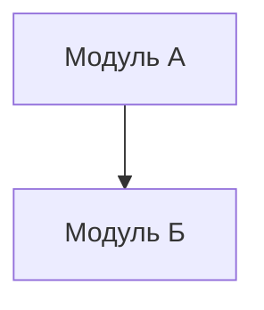

# Отчет о системном контексте

**Дата генерации**: {{DATE}}
**Область анализа**: {{SCOPE}}

---

## Резюме для руководства
> [Краткий итог, например: «Стабильный Python-бэкенд с выраженным техническим долгом в модуле авторизации».]

---

## 1. Реестр компонентов

### 1.1 Существующие компоненты
| Компонент | Тип | Путь | Описание |
|---|---|---|---|
| [Имя] | [Service/UI/DB] | [Путь] | [Краткое описание] |

### 1.2 Отсутствующие компоненты («Темная материя»)
> [!WARNING]
> Следующие компоненты отсутствуют, но критически важны для стабильной работы.

| Компонент | Категория | Зачем нужен | Последствия отсутствия |
|---|---|---|---|
| Обработка ошибок | Инфраструктура | Нет единого слоя обработки | Сложность отладки |
| Логирование | Наблюдаемость | Нет структурированных логов | «Слепота» в продакшене |
| Настройки | Оперирование | Замечены хардкод-секреты | Риск безопасности |

---

## 2. Топология зависимостей

### 2.1 Границы сборки (Build Inspector)
> [Вставьте находки: корни сборки, топология, предупреждения]

### 2.2 Логическая связность (Git Forensics)
> [Вставьте матрицу тепловых карт или таблицу связности]

| Файл А | Файл Б | Степень связи | Риск |
|---|---|---|---|
| auth.py | user_db.py | 85% | HIGH |

---

## 3. Риски и предупреждения

### 3.1 Риски контрактов IPC (Runtime Inspector)
> [!CAUTION]
> [Список слабых или отсутствующих контрактов в интерфейсах IPC]

### 3.2 «Божественные» модули
> [Список модулей с аномально высокой входящей связностью]

### 3.3 Горячие точки техдолга
> [Список файлов с высокой частотой изменений и высокой сложностью]

---

## 4. Константные правила (Invariant Hunter)

### 4.1 Бизнес-инварианты
> [Правила, которые никогда не должны нарушаться]
- Сумма заказа всегда >= 0
- Пользователь должен подтвердить Email перед оплатой

### 4.2 Предположения
> [Неявные допущения в коде]
- «Сеть всегда надежна» (отсутствие логики повторов)
- «ID всегда является целым числом»

---

## 5. Концептуальная модель

### 5.1 Глоссарий
| Термин | Определение |
|---|---|
| Пользователь | Зарегистрированный клиент (не админ) |
| Заказ | Запрос на разовую покупку |

---

## 6. Контрольные точки

> [!IMPORTANT]
> Перед переходом к этапу Blueprint подтвердите:
- [ ] Реестр компонентов полон?
- [ ] Описанные риски приемлемы?
- [ ] Все инварианты зафиксированы?
