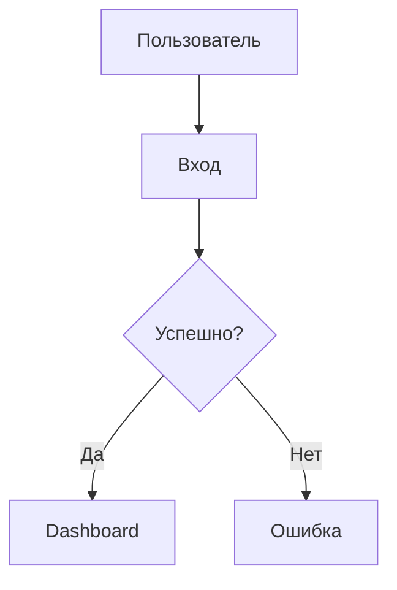

# Документ требований к продукту (PRD) v2.0

**Проект**: [Название проекта]
**Функционал**: [Название функционала/требования]
**Статус**: Draft (Черновик) | Review (На проверке) | Approved (Утверждено)
**Версия**: 1.0
**Ответственный**: [Имя автора или Агент]
**Дата создания**: [ГГГГ-ММ-ДД]

---

## 1. Резюме (Executive Summary)
<!-- Лаконичное описание: зачем это делается и что именно будет сделано (до 50 слов). -->

[Краткое описание проблемы и предлагаемого решения с фокусом на ключевую ценность.]

---

## 2. Контекст и обоснование (Background & Context)

### 2.1 Описание проблемы
- **Болевые точки**: [Конкретные проблемы, с которыми сталкивается пользователь]
- **Охват**: [Затронутые сегменты пользователей или бизнес-процессы]
- **Влияние**: [Убытки, отток пользователей, низкая эффективность]

### 2.2 Возможности
[Какую выгоду принесет решение проблемы? Желательно в цифрах.]

---

## 3. Цели и границы (Goals & Non-Goals)

### 3.1 Цели (Goals)
<!-- Использование принципа SMART (Конкретность, Измеримость, Достижимость, Релевантность, Ограниченность во времени) -->
- **[G1]**: [Бизнес-цель, например: Увеличение конверсии в логин до 95%+]
- **[G2]**: [Техническая цель, например: Время загрузки списка P95 < 1.5 сек]

### 3.2 Non-Goals (Что НЕ входит в задачу)
<!-- Четкое определение границ для предотвращения раздувания рамок (Scope Creep). -->
- **[NG1]**: [Функционал, который сознательно исключен, например: Вход через OAuth]

---

## 4. Пользовательские истории (User Stories)
<!-- Формат: Как [роль], я хочу [действие], чтобы [ценность]. -->
<!-- ⚠️ CRITICAL: Каждая US должна иметь уникальный ID [REQ-XXX] для прослеживаемости. -->

### US-001: [Заголовок] [REQ-001] (Приоритет: P0)

*   **Описание**: Как [роль], я хочу [действие], чтобы [ценность].
*   **Ценность**: [Одним предложением — зачем это нужно пользователю]
*   **Тестируемость**: [Как проверить выполнение этой задачи независимо от остальных?]
*   **Затронутые системы**: [ID систем из 02_ARCHITECTURE, например: frontend-system]
*   **Критерии приемки (Acceptance Criteria)**:
    - [ ] **Given** [контекст], **When** [действие], **Then** [результат].
    - [ ] **Обработка ошибок**: Если [произошел сбой], система должна [совершить откат/показать уведомление].
*   **Граничные случаи**:
    - [Условие 1 — например: обрыв связи, огромный объем данных и т.д.]

---

## 5. Дизайн и UX (User Experience)

### 5.1 Путь пользователя (User Flow)

---

## 6. Ограничения (Constraints)

### 6.1 Технические ограничения
- [Например: Совместимость с MySQL 5.7]
- [Минимальный порог производительности]

### 6.2 Безопасность и соответствие
- [Запрет на хранение PII-данных в логах]
- [Обязательный HTTPS]

---

## 7. Критерии успеха (Success Metrics)

| Метрика | Цель | Метод измерения |
|---|---|---|
| Конверсия в регистрацию | > 45% | Аналитика/Воронка |

---

## 8. Критерии готовности (Definition of Done)

- [ ] Все критерии приемки (AC) выполнены.
- [ ] Охват модульными тестами > 80%, CI горит зеленым.
- [ ] Интеграционные тесты пройдены.
- [ ] Техническая документация обновлена (OpenAPI/Wiki).
- [ ] Продукт принят заказчиком (UAT).
