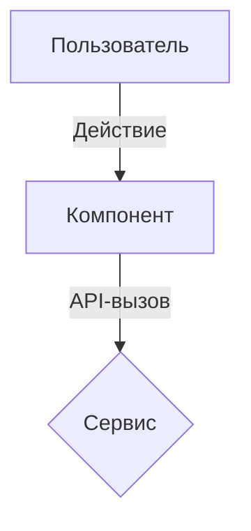

# Техническая спецификация (RFC / Technical Spec)

**Ссылка на PRD**: [Ссылка]
**Функционал**: [Название функционала]
**Статус**: Черновик

## 1. Высокоуровневое проектирование
### Архитектурная схема (Mermaid)
<!-- Визуализация потоков данных через Mermaid -->


### Иерархия компонентов
*   `Родительский компонент`
    *   `Дочерний компонент A` (Props: x, y)
    *   `Дочерний компонент B` (State: z)

## 2. API Контракты (Интерфейсы)
<!-- Критично: определение точных сигнатур. Избегайте галлюцинаций. -->

### Эндпоинты
*   `POST /api/v1/resource`
    *   **Тело запроса**:
        ```typescript
        interface CreateRequest {
          field: string; // Обязательно
        }
        ```
    *   **Ответ**: `200 OK`

### Функциональные интерфейсы
<!-- Сигнатуры ключевых внутренних функций -->
```typescript
function calculateSomething(input: InputType): ResultType
```

## 3. Стратегия моделирования данных
### Изменения в БД (Schema)
```sql
-- DDL изменения заносить сюда
CREATE TABLE ...
```

### Управление состоянием (State)
*   Глобальное: [Например, Redux / Zustand]
*   Локальное: [Например, React.useState]

## 4. Этапы реализации
<!-- Атомарные, последовательные шаги -->
1.  [Шаг 1: Миграция базы данных]
2.  [Шаг 2: Реализация Backend API]
3.  [Шаг 3: Разработка Frontend интерфейса]

## 5. Безопасность и риски
*   **Авторизация**: [Как обеспечивается безопасность доступа?]
*   **Валидация**: [Какая схема проверки входных данных используется?]
