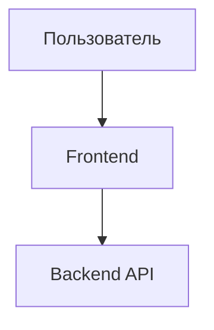

# {Название системы} — Дизайн-документ (L0 — Навигация)

| Поле | Значение |
| :--- | :--- |
| **System ID** | `{system-id}` |
| **Проект** | {Project Name} |
| **Версия** | 1.0 |
| **Статус** | `Draft` / `Review` / `Approved` |
| **Автор** | {Имя автора или Агент} |
| **Дата** | {ГГГГ-ММ-ДД} |
| **L1 Детализация** | [{system-id}.detail.md](./{system-id}.detail.md) — только для `/forge` |

> [!IMPORTANT]
> **Уровни документации**
> - **L0 (Навигация)**: Схемы, контракты операций, ключевые решения. Для быстрого понимания. Запрещено размещать длинный псевдокод и конфиги.
> - **L1 (Реализация)**: Полный псевдокод, константы, разбор крайних случаев. Для этапа написания кода.
> - **Связи ⚠️**: Каждый раздел в L1 должен иметь ссылку из L0.

---

## 📋 Содержание

1. [Обзор](#1-обзор-overview) — назначение, границы, ответственность.
2. [Цели и не-цели](#2-цели-и-не-цели-goals--non-goals) — требования из PRD.
3. [Контекст](#3-контекст-background--context) — почему это нужно, ограничения.
4. [Архитектура](#4-архитектура-architecture) — диаграммы Mermaid, компоненты, потоки данных.
5. [Дизайн интерфейсов](#5-дизайн-интерфейсов-interface-design) — контракты операций.
6. [Модель данных](#6-модель-данных-data-model) — поля сущностей, ER-диаграммы.
7. [Технологический стек](#7-технологический-стек-technology-stack) — выбор инструментов.
8. [Trade-offs](#8-trade-offs--alternatives-выбор-и-альтернативы) — обоснование решений.
9. [Безопасность](#9-безопасность-security-considerations).
10. [Производительность](#10-производительность-performance-considerations).
11. [Тестирование](#11-стратегия-тестирования-testing-strategy).

---

## 1. Обзор (Overview)

### 1.1 Назначение системы
[Какую задачу решает этот компонент?]

### 1.2 Границы системы
- **Вход (Input)**: [Что получает?]
- **Выход (Output)**: [Что отдает?]
- **Зависимости (Dependencies)**: [От кого зависит?]

---

## 4. Архитектура (Architecture)

### 4.1 Схема архитектуры

---

## 5. Дизайн интерфейсов (Interface Design)

### 5.1 Таблица контрактов операций (Operation Contracts)

| Операция | [REQ-XXX] | Предусловия | Вход | Побочные эффекты | Детали в L1 |
| :--- | :---: | :--- | :---: | :--- | :---: |
| `operation_a()` | [REQ-001] | Условие 1 | param | Описание изменений | [§3.1](./detail.md) |

---

## 8. Trade-offs & Alternatives (Выбор и альтернативы)

### 8.1 [Системное решение] — Ссылка на ADR
> **Источник решения**: [ADR-XXX: Заголовок](../03_ADR/ADR_XXX.md)

### 8.2 [Локальное решение] — Обоснование
**Вариант А: [Название] (✅ Выбран)**
- ✅ Плюсы
- ❌ Минусы

**Вариант Б: [Альтернатива]**
- ✅ Плюсы
- ❌ Минусы

**Решение**: Выбран [Вариант А], так как [Главная причина].
