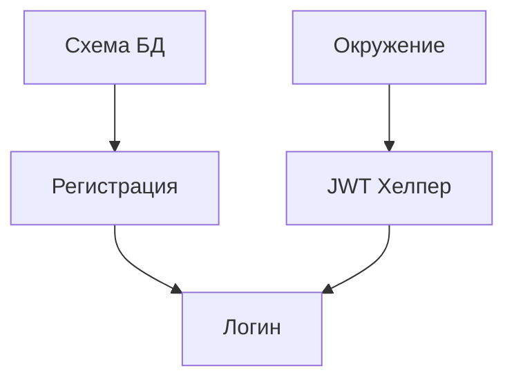

# Шаблон декомпозиции задач (WBS)

**Проект**: [Название проекта]  
**Стадия**: Blueprint (Утверждено)  
**Ссылка на архитектуру**: `.anws/v{N}/02_ARCHITECTURE_OVERVIEW.md`

---

## 📋 Список задач

### Легенда
- **ID**: Уникальный идентификатор (T{Система}.{Фаза}.{Порядковый номер})
- **[P]**: Параллельная задача (можно выполнять независимо)
- **[MILESTONE]**: Веха / Контрольная точка Спринта (например, `INT-S{N}`)
- **User Story**: Связь с PRD (US01, US02...)
- **Критерии приемки**: Условия завершения в формате Given / When / Then или Done When
- **Тип верификации**: Unit / Интеграция / E2E / Smoke / Регрессия / Мануально / Lint
- **Инструкция по проверке**: Как подтвердить выполнение и какие улики предоставить
- **📎 ADR**: Связанная запись об архитектурном решении
- **📎 System**: Связанный документ системного дизайна

---

### Фаза 1: Фундамент

#### T3.1.1 — Инициализация схемы БД
- **User Story**: US01
- **Описание**: Создание таблицы `users` с полями `id`, `email`, `password_hash`, `created_at`.
- **Вход**: `04_SYSTEM_DESIGN/database.md` §Проектирование таблицы пользователей
- **Выход**: `migrations/001_create_users.sql`
- **Критерии приемки**:
  - Given База данных запущена
  - When Выполнена миграция и проверена структура таблицы `users`
  - Then Поля таблицы соответствуют системному дизайну
- **Тип верификации**: Интеграционный тест
- **Инструкция по проверке**: Запустить миграцию и выполнить `psql -c "\d users"`, приложить вывод терминала
- **📎 ADR**: ADR-003 (Схема хранения паролей)

---

### Фаза 2: Ядро (Core)

#### T2.1.1 — Интерфейс регистрации пользователя
- **User Story**: US01
- **Описание**: Реализация `POST /api/register`, хеширование пароля и сохранение.
- **Вход**: `04_SYSTEM_DESIGN/auth.md` §Процесс регистрации, таблица `users` из T3.1.1
- **Выход**: `src/routes/auth.js`, `src/services/user.service.js`
- **Критерии приемки**:
  - Given Эндпоинт реализован
  - When Отправлен валидный запрос на регистрацию
  - Then Возвращен статус 201 и пользователь записан в БД
- **Тип верификации**: Интеграционный тест
- **📎 ADR**: ADR-003

---

## 📊 Дорожная карта итераций

| Итерация | Код | Ключевые задачи | Критерий выхода | Оценка |
|:---:|---|---|---|:---:|
| S1 | Foundation | T1.1.1, T3.1.1 | БД доступна + переменные окружения настроены | 1d |
| S2 | Core Logic | T2.1.1-T2.2.1 | Полный цикл авторизации работает | 2d |

---

## 🔗 Диаграмма зависимостей



---

## 🚫 Антипаттерны (Как НЕ надо делать)

❌ **Плохая задача**:
```
T001 - Создать систему аутентификации
- Сделать всё, что касается авторизации
- Сделать это быстро и надежно
```

✅ **Хорошая задача**:
```
T3.1.1 - Инициализация схемы БД
- Вход: `04_SYSTEM_DESIGN/database.md` §Дизайн таблиц
- Описание: Создание таблицы users (id, email, pass).
- Критерии: Given миграция прошла, When смотрим таблицу, Then поля как в дизайне.
```
