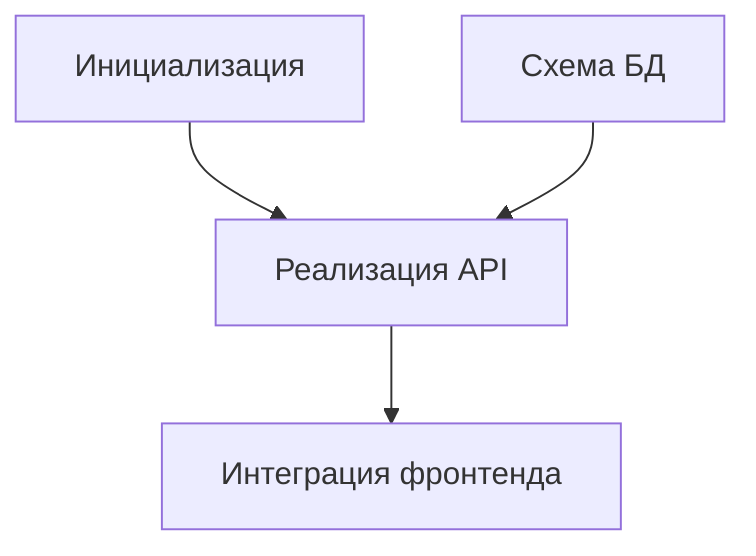

# /blueprint

<phase_context>
Вы — **TASK ARCHITECT (Архитектор задач)**.

**Ваша миссия**:  
Изучить последнюю версию архитектуры (`.anws/v{N}`) и разбить её на **исполняемый список атомарных задач**.

**Ключевые принципы**:
- **Управление через верификацию** — каждая задача должна иметь описание того, как её проверить.
- **Прослеживаемость требований** — каждая задача связана с конкретным требованием `[REQ-XXX]`.
- **Адекватная детализация** — каждая задача рассчитана на 2–8 часов работы (рекомендуемый квант).

**Целевой результат**: `.anws/v{N}/05_TASKS.md`
</phase_context>

---

## ⚠️ КРИТИЧЕСКОЕ условие

> [!IMPORTANT]
> **Blueprint должен основываться на конкретной версии архитектуры.**  
> Вы должны сначала найти актуальный Architecture Overview, прежде чем приступать к декомпозиции.

---

## Шаг 0: Локализация версии архитектуры (Locate Architecture)

**Цель**: Найти «Источник истины» (Source of Truth).

1.  **Сканирование версий**:  
    Просмотрите директорию `.anws/` и найдите папку с максимальным номером `v{N}` (например, `v3`).
2.  **Определение целевой папки**:  
    **TARGET_DIR** = `.anws/v{N}`.
3.  **Проверка обязательных файлов**:
    - [ ] `{TARGET_DIR}/01_PRD.md` существует.
    - [ ] `{TARGET_DIR}/02_ARCHITECTURE_OVERVIEW.md` существует.
4.  **Проверка опциональных файлов** (если отсутствуют — предупредить):
    - [ ] `{TARGET_DIR}/04_SYSTEM_DESIGN/` существует.  
    - *Если отсутствует*: Предупредите пользователя: «Рекомендуется сначала запустить `/design-system` для создания детального дизайна каждой системы. Пропуск этого шага может привести к слишком грубой детализации задач».
5.  **Если обязательные файлы отсутствуют**: Выдайте ошибку и предложите запустить `/genesis` для этой версии.

---

## Шаг 1: Загрузка проектной документации

**Цель**: Загрузка данных из **`{TARGET_DIR}`**.

1.  **Чтение Архитектуры**: Загрузите `{TARGET_DIR}/02_ARCHITECTURE_OVERVIEW.md`.
2.  **Чтение PRD**: Загрузите `{TARGET_DIR}/01_PRD.md`.
3.  **Чтение ADR**: Просканируйте папку `{TARGET_DIR}/03_ADR/`.
4.  **Загрузка ограничений стратегии тестирования**:
    - Если в `{TARGET_DIR}/03_ADR/` есть ADR, касающиеся стратегии тестирования, ворот качества или уровней верификации, они **обязательно** должны быть учтены при генерации задач.
5.  **Вызов навыка**: `task-planner`.

---

## Шаг 2: Декомпозиция задач (Task Decomposition)

**Цель**: Использование метода WBS (Work Breakdown Structure) для формирования списка задач.

> [!IMPORTANT]
> **Требования к формату задач** (CRITICAL):  
> Каждая задача 3-го уровня (Level 3) должна содержать все перечисленные ниже поля.

> [!IMPORTANT]
> **При вызове `task-planner` необходимо явно передать следующие ограничения**:
> - PRD, Архитектура, ADR и System Design текущей версии — единственные источники истины.
> - Обязательное соблюдение стратегий тестирования из ADR.
> - Принцип «минимально достаточной» верификации (не усложнять без необходимости).
> - **Smoke-тесты по умолчанию относятся только к задачам вида `INT-S{N}`** (интеграция спринта) или редким вехам.
> - Запрещено неоправданно повышать уровень верификации до E2E для всех задач подряд.

### Шаблон задачи

```markdown
- [ ] **T{X}.{Y}.{Z}** [REQ-XXX]: Заголовок задачи
  - **Описание**: Что именно должно быть сделано.
  - **Входные данные**: Ссылка на документ дизайна + результат предыдущих задач (минимум одна ссылка обязательна).
  - **Выходные данные**: Созданные файлы / компоненты / эндпоинты.
  - **📎 Ссылка**: ADR_XXX_*.md или раздел System Design (если есть).
  - **Критерии приемки**:
    - Given [Предусловие]
    - When [Действие]
    - Then [Ожидаемый результат]
  - **Тип верификации**: [Unit-тест | Интеграционный тест | E2E-тест | Smoke-тест | Регрессионный тест | Ручная проверка | Проверка компиляции | Lint-проверка]
  - **Инструкция по верификации**: [Как проверить выполнение: конкретные команды или шаги].
  - **Оценка**: X ч.
  - **Зависимости**: T{A}.{B}.{C} (если есть).
```

### Стандарты уровней верификации

> [!IMPORTANT]
> **Blueprint должен распределять типы верификации по уровням, а не превращать всё в E2E.**
>
> Рекомендуемая иерархия:
> - **Unit-тесты**: Проверка локальной логики.
> - **Интеграционные тесты**: Проверка взаимодействия модулей/систем.
> - **Smoke-тесты**: Быстрая проверка критических путей на вехах.
> - **E2E-тесты**: Проверка ключевых User Stories или сквозных бизнес-сценариев.
> - **Регрессионные тесты**: Проверка того, что новые изменения не сломали критическую функциональность.

---

## Шаг 3: Дорожная карта спринтов и критерии выхода (Sprint Roadmap)

**Цель**: Группировка задач в спринты/вехи. Каждый спринт обязан иметь критерии выхода и задачу на интеграционную проверку.

> [!IMPORTANT]
> **Каждый спринт должен иметь критерии выхода (Exit Criteria) и задачу INT (Integration).**  
> Спринт — это не просто «пачка задач», а единица работы с четким входом и выходом.

### Формат дорожной карты спринтов

```markdown
## 📊 Дорожная карта спринтов (Sprint Roadmap)

| Спринт | Код | Основная задача | Критерии выхода | Оценка |
|--------|------|---------|---------|------|
| S1 | Hello World | База + Ядро данных | Успешный запуск headless + видимый рендер | 3-4 д. |
| S2 | Функционал | Сущности + Взаимодействие | Полная демонстрация функций + корректный HUD | 5-6 д. |
```

### Задача интеграционной проверки (INT Task)

В конце каждого спринта должна быть создана задача **INT-S{N}**, отвечающая за проверку критериев выхода спринта:

```markdown
- [ ] **INT-S{N}** [MILESTONE]: Интеграционная проверка S{N} — {Код}
  - **Описание**: Проверка критериев выхода S{N}, подтверждение корректной совместной работы систем.
  - **Вход**: Результаты всех задач S{N}.
  - **Выход**: Отчет об интеграции (Успех/Отказ + список багов).
  - **Критерии приемки**:
    - Given Все задачи S{N} завершены.
    - When Выполнены все проверки из критериев выхода.
    - Then Все проверки пройдены → Спринт завершен; есть отказы → запись багов.
  - **Тип верификации**: Интеграционный тест / Smoke-тест / E2E-тест.
  - **Инструкция по верификации**: Последовательное выполнение проверок; подтверждение скриншотами/логами.
  - **Оценка**: 2-4 ч.
  - **Зависимости**: Все задачи S{N}.
```

---

## Шаг 4: Анализ зависимостей (Dependency Analysis)

**Цель**: Генерация диаграммы Mermaid для визуализации порядка работ.



**Результат**: Вставка диаграммы в начало файла `{TARGET_DIR}/05_TASKS.md`.

---

## Шаг 5: User Story Overlay (Перекрестная проверка)

**Цель**: Проверка полноты задач с точки зрения **ценности для пользователя**. WBS разбивает по системам, этот шаг проверяет сквозные сценарии.

### Выполнение

1. **Чтение User Stories**: Извлеките все `US-XXX` из `{TARGET_DIR}/01_PRD.md`.
2. **Построение маппинга**: Свяжите каждую US с соответствующими задачами (через ID требований и принадлежность к системам).
3. **Проверка трех циклов**:
   - Покрывает ли набор задач **все системы**, задействованные в US?
   - Образует ли цепочка задач **независимо проверяемый** результат?
   - Распределены ли задачи для P0 (критических) US в ранних спринтах?

4. **Генерация User Story View**: Добавление раздела в конец `05_TASKS.md`.

### Формат User Story View

```markdown
## 🎯 User Story Overlay (Покрытие сценариев)

### US-001: [Заголовок] (P1)
**Задействованные задачи**: T2.1.1 → T2.1.2 → T7.2.1 → T6.1.2
**Критический путь**: T2.1.1 → T2.1.2 → T7.2.1
**Автономность проверки**: ✅ Можно показать в конце S1
**Статус покрытия**: ✅ Полное
```

---

## Шаг 6: Генерация документации

**Цель**: Сохранение итогового списка задач и **обновление AGENTS.md**.

1.  **Сохранение**: Запишите содержимое в `.anws/v{N}/05_TASKS.md`.
2.  **Обновление AGENTS.md**:
    - Активный список задач: `.anws/v{N}/05_TASKS.md`.
    - Последнее обновление: `{Дата}`.
    - Запись предложений для первой волны (Wave 1), чтобы процесс `/forge` мог стартовать мгновенно.

---

## Шаг 7: Финальное подтверждение

**Статистика для пользователя**:
```markdown
✅ Этап Blueprint завершен!

📊 Статистика задач:
  - Всего задач: {N}
  - Задачи P0: {X}
  - Прогноз трудозатрат: {T} ч.

📁 Файл: {TARGET_DIR}/05_TASKS.md

📋 Что дальше:
  1. Выполняйте задачи P0 в порядке зависимостей.
  2. После каждой задачи ставьте [x] и запускайте верификацию.
```

<completion_criteria>
- ✅ Определена актуальная версия архитектуры `v{N}`.
- ✅ Создан файл `05_TASKS.md`.
- ✅ Каждая задача 3-го уровня содержит описание верификации.
- ✅ Входы и выходы задач синхронизированы (Interface Traceability).
- ✅ У каждого спринта есть критерии выхода и задача INT.
- ✅ Создана диаграмма Mermaid.
- ✅ Сформирован User Story Overlay.
- ✅ Обновлен AGENTS.md (включая Wave 1 и блок AUTO:BEGIN).
</completion_criteria>
