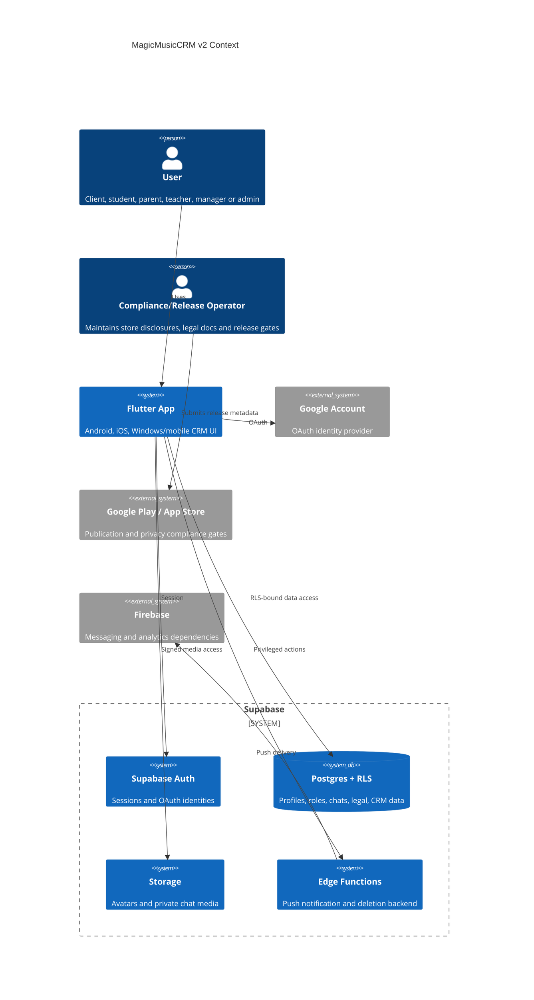
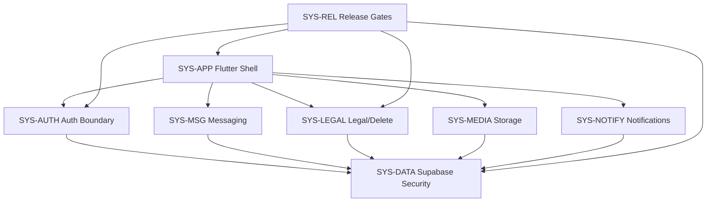

# 02_ARCHITECTURE_OVERVIEW — MagicMusicCRM v2 Publication Readiness

**Status**: Draft / Accepted after PRD checkpoint  
**Date**: 2026-05-30  
**Source**: `.anws/v2/01_PRD.md`, `.nexus-map/`, security scan `2a38b85_20260530_120237`

---

## 1. Context

MagicMusicCRM is a Flutter CRM for a music school with Supabase Auth, Postgres, Realtime, Storage and Edge Functions. v2 turns the existing app into a release-ready product for Google Play and App Store by adding auth-first onboarding, legal consent, account deletion, a corrected communication model and security hardening.

The main architectural correction is trust placement: Flutter UI may guide the user, but all authorization, role assignment, profile privacy, chat visibility, deletion and notification dispatch must be enforced by Supabase RLS, functions, storage policies and Edge Function guards.

## 2. System Inventory

| ID | System | Responsibility | In Scope Paths | Out of Scope |
|---|---|---|---|---|
| SYS-APP | Flutter Application Shell | Auth UI, onboarding UI, legal UI, messenger UI, role routing and release-safe logging. | `lib/main.dart`, `lib/core/router/`, `lib/features/auth/`, `lib/features/profile/`, `lib/features/messenger/`, `lib/core/widgets/` | Authorization decisions that must live in Supabase. |
| SYS-AUTH | Auth & Identity Boundary | Google OAuth, email/password fallback, session restore, onboarding gate, server-owned role contract. | Supabase Auth config, profile trigger/function, `lib/features/auth/`, `lib/core/router/` | Client-side role assignment. |
| SYS-DATA | Supabase Data Security | RLS, views, functions, role grants, profile PII isolation, advisors. | Supabase SQL migrations, live DB policies/functions/views | UI-only access control. |
| SYS-MEDIA | Storage & Attachment Security | Private media, signed URLs, owner/thread path isolation, safe client download/open. | Supabase Storage policies, `lib/core/services/chat_attachment_service.dart`, attachment widgets | Arbitrary public file hosting. |
| SYS-MSG | Messaging & Announcements | Personal `Администрация` chat and read-only `Объявления` channel with RLS-backed visibility. | `messages`, future chat/thread tables, `channels/channel_posts`, messenger UI/providers | Shared room where all clients see each other. |
| SYS-LEGAL | Legal, Consent & Deletion | Privacy Policy, Terms, consent versioning, in-app deletion and public web deletion path. | New legal screens/services, Supabase legal/deletion tables/functions | Legal advice; final policy approval remains owner/legal responsibility. |
| SYS-NOTIFY | Notification Backend | Authorized FCM token access and push dispatch. | `notification_service.dart`, Supabase Edge Function `send-notification` | Client-side access to service-role credentials. |
| SYS-REL | Release & Store Compliance | Android/iOS signing, permissions, privacy strings, analyzer/tests and store checklists. | `android/`, `ios/`, `pubspec.yaml`, test/release scripts | Desktop installer hardening unless it blocks mobile publication. |

## 3. Boundaries Matrix

| Boundary | Input | Owner | Output | Required Control |
|---|---|---|---|---|
| OAuth callback | Provider redirect URI | SYS-AUTH + SYS-APP | Supabase session | Validate scheme/host/path/state; no full URI logging. |
| Profile onboarding | Full name, phone, consent acceptance | SYS-AUTH + SYS-LEGAL | Completed client profile | Role immutable by client; legal version stored append-only. |
| Role authorization | `auth.uid()` | SYS-DATA | `client/admin/manager/teacher` decision | Server-owned role table or guarded role column. |
| Personal admin chat | User/staff message | SYS-MSG + SYS-DATA | Private thread messages | Participant-bound RLS, no cross-client visibility. |
| Announcements | Staff post + audience | SYS-MSG | Read-only client posts | Staff write, target audience read, client write denied. |
| Media access | Object path / message attachment | SYS-MEDIA | Signed URL or safe local file | Private bucket, owner/thread path, MIME allowlist. |
| Push sending | Notification request | SYS-NOTIFY | Firebase send result | Staff-only backend validation, no bundled private key. |
| Account deletion | User request | SYS-LEGAL | Deletion state or completed deletion | Owner-only request, privileged backend action. |
| Release artifact | Build config and metadata | SYS-REL | Store-ready AAB/IPA | Production signing, minimum permissions, privacy disclosures. |

## 4. Dependency Graph

## 5. Data Model Additions

| Entity | Purpose | Minimal Fields |
|---|---|---|
| `legal_documents` | Published Privacy Policy / Terms versions. | `id`, `type`, `version`, `title`, `content_url`, `published_at`, `is_current` |
| `legal_consents` | Immutable user acceptance records. | `id`, `user_id`, `document_id`, `accepted_at`, `ip_hash`, `user_agent_hash` |
| `account_deletion_requests` | Deletion workflow state. | `id`, `user_id`, `status`, `requested_at`, `completed_at`, `retention_reason` |
| `user_roles` or guarded role field | Server-owned role assignment. | `user_id`, `role`, `assigned_by`, `assigned_at` |
| `admin_chat_threads` | Personal staff-user chat threads. | `id`, `client_id`, `status`, `created_at` |
| `admin_chat_participants` | Staff membership in personal admin chat. | `thread_id`, `user_id`, `participant_role` |
| `announcement_channels/posts` | Read-only staff broadcasts. | `id`, `audience`, `author_id`, `content`, `published_at` |
| private `push_tokens` | FCM token storage outside broad profile reads. | `user_id`, `fcm_token`, `platform`, `updated_at` |

Existing `messages` and `channels` can be reused only if RLS can model the separation cleanly. If not, v2 should introduce explicit thread tables rather than continue overloading `receiver_id = null`.

## 6. Security Architecture

- Default new account role is always `client`.
- Client requests cannot update `role`, `fcm_token`, staff-only fields or deletion completion state.
- Staff privileges are derived from server-owned state, not user metadata.
- SECURITY DEFINER functions must set `search_path`, revoke public execute by default and validate `auth.uid()` internally.
- Security-definer views must become `security_invoker` or be replaced by RLS-safe RPC/views.
- Chat attachments are private by default; clients receive signed URLs only after RLS verifies thread access.
- Edge Functions that use service-role credentials require staff authorization and server-side recipient validation.
- Production logs must not include OAuth callback URLs, tokens, notification payload dumps or private media URLs.

## 7. Quality Gates

| Gate | Command / Evidence | Blocking Condition |
|---|---|---|
| Static analysis | `flutter analyze` | Any error-level issue. |
| Unit/widget tests | `flutter test` | Auth/onboarding/legal/chat/security regressions fail. |
| Supabase RLS tests | SQL/CLI test matrix | Client can self-escalate, read foreign PII/media, or call privileged RPC. |
| Android release | Gradle config and AAB build | Debug signing, unjustified sensitive permission, missing Data Safety mapping. |
| iOS release | Xcode config/Info.plist | Missing OAuth URL scheme, missing privacy usage strings, missing account deletion route. |
| Security scan closure | Security report / follow-up scan | Any unresolved critical/high finding without explicit signed exception. |

## 8. Decomposition Rationale

The system is not split into new services because the fastest safe path is hardening the existing Flutter + Supabase architecture. The split above is a responsibility model, not a deployment microservice plan. Supabase remains the enforcement layer; Flutter remains a client. This keeps release scope practical while removing the current root risks: UI-trusted roles, public media, broad profile reads, public privileged functions and mixed chat semantics.

## 9. Implementation Order

1. P0 Supabase security contracts: role immutability, RPC/view/storage/function hardening.
2. P0 release blockers: Android signing/permissions, iOS OAuth/privacy strings.
3. P0 auth-first onboarding and legal consent gate.
4. P0 personal `Администрация` chat.
5. P0 account deletion backend and UI entrypoints.
6. P1 announcements, tests, analyzer cleanup and store disclosure artifacts.
