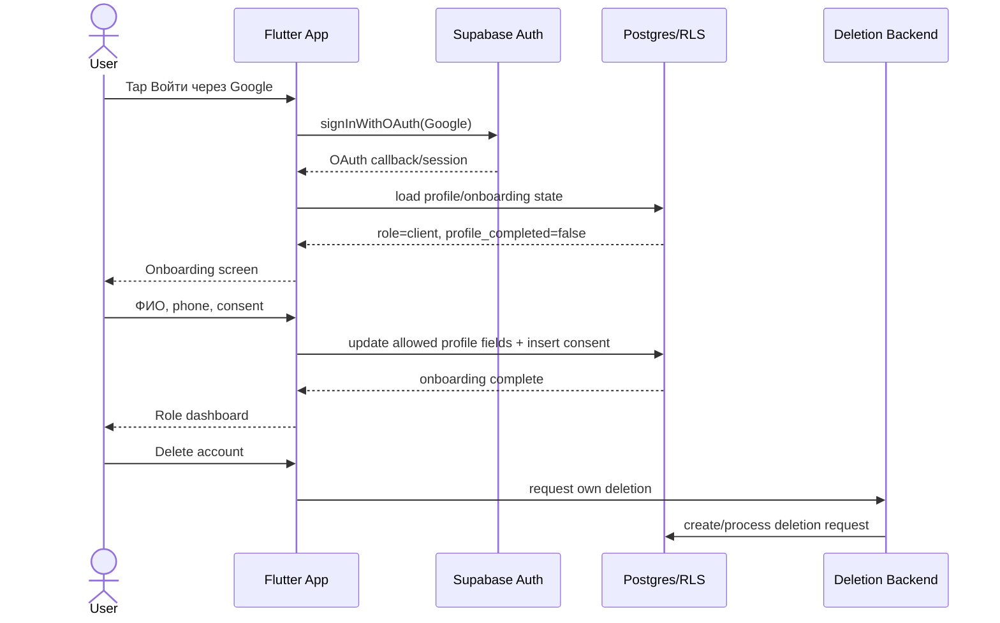

# System Design — Auth, Onboarding, Legal Consent and Account Deletion

**System IDs**: SYS-AUTH, SYS-LEGAL  
**Status**: Draft / Implementation-ready  
**Related ADR**: ADR-002, ADR-004, ADR-006  
**Related PRD**: REQ-AUTH-001, REQ-AUTH-002, REQ-LEGAL-001, REQ-LEGAL-002

## 1. Overview

This system controls the user's path from unauthenticated state to CRM access. A user authenticates first, completes required profile data, accepts current legal documents and then enters the role-specific dashboard. Account deletion is exposed from settings and handled by a privileged backend request.

## 2. Goals

- Google OAuth sign-in/sign-up through Supabase Auth.
- Default new user role is `client`.
- Onboarding requires ФИО, phone and current legal consent.
- Account deletion is available in app and through a public web path.
- No service-role/admin credential is present in Flutter.

## 3. Non-Goals

- Enterprise SSO.
- SMS OTP.
- Final legal advice or policy approval.

## 4. Architecture

## 5. Data Model

| Table | Purpose | Access |
|---|---|---|
| `profiles` | App profile and onboarding state. | Self can update allowed fields only; staff can read/manage within role. |
| `legal_documents` | Current published legal documents. | Public/auth read; staff write. |
| `legal_consents` | Immutable acceptance records. | Self insert for current docs; self/staff read; no client update/delete. |
| `account_deletion_requests` | Deletion workflow. | Self insert/read own; privileged backend update/process. |

Recommended profile fields:

- `first_name`, `last_name`, `phone`
- `role` or `user_roles` reference, server-owned
- `profile_completed_at`
- `deletion_requested_at` or separate deletion request status

## 6. Operation Contracts

| Operation | Preconditions | Input | Output | Enforcement |
|---|---|---|---|---|
| Start Google OAuth | No active session | Provider Google | OAuth browser flow | Supabase Auth config |
| Complete onboarding | Authenticated, incomplete profile | Name, phone, consent ids | Completed profile | RLS allowed fields + consent insert |
| Read legal docs | Any user | Document type/version | Current content/link | Public/auth read policy |
| Request deletion | Authenticated user | Confirmation | Request id/status | Owner-only Edge/RPC |
| Process deletion | Privileged backend | Request id | Deleted/scheduled state | Service role inside backend only |

## 7. Router Contract

Routing priority:

1. No session -> `/login`.
2. Session exists and profile missing/incomplete -> `/onboarding`.
3. Current legal version missing consent -> `/legal-consent`.
4. Deletion pending -> `/account-deletion-status`.
5. Completed profile -> role route.

## 8. Security

- Do not trust `raw_user_meta_data.role`.
- Do not update `profiles.role` from client profile save.
- Callback handler must validate URI shape and must not log full callback URI.
- Consent records are append-only.
- Deletion request owner is derived from `auth.uid()`.

## 9. Edge Cases

- OAuth succeeds but trigger does not create profile: app creates/repairs profile through safe RPC.
- User closes app during onboarding: router resumes onboarding.
- Legal version changes: re-consent before CRM access.
- User has active payment/subscription: request accepted, retention exception shown.

## 10. Trade-Offs

| Decision | Alternative | Why chosen |
|---|---|---|
| Auth-first onboarding | Collect all data before account creation | Reduces unauthenticated PII collection and matches OAuth flow. |
| Backend deletion request | Client-side direct delete | Avoids service-role credential exposure. |

## 11. Verification

- Widget tests for onboarding and legal gate.
- RLS tests for role immutability and consent insert.
- Edge/RPC tests for deletion owner-only behavior.
