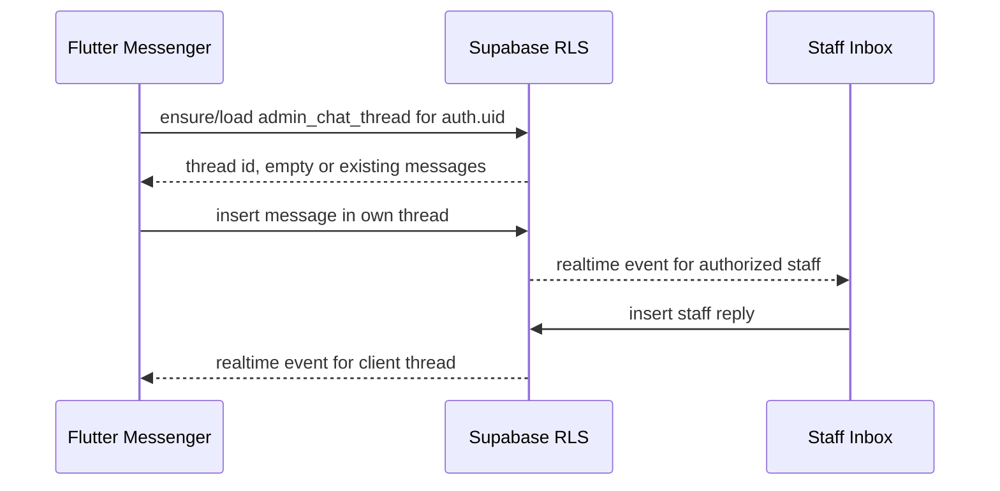

# System Design — Administration Chat and Announcements

**System ID**: SYS-MSG  
**Status**: Draft / Implementation-ready  
**Related ADR**: ADR-003  
**Related PRD**: REQ-CHAT-001, REQ-CHAT-002

## 1. Overview

Messaging in v2 separates private support from public broadcasts:

- `Администрация`: personal client-staff chat, created or ensured for every completed client profile.
- `Объявления`: read-only announcement channel for staff broadcasts.

## 2. Goals

- New users always see `Администрация`.
- Client messages are private to that client and staff.
- Announcements are readable by intended users and not replyable by clients.
- Existing messenger UI remains the main surface.

## 3. Non-Goals

- A shared all-clients chat room.
- End-to-end encryption.
- Rewriting the whole messenger UI in one pass.

## 4. Architecture

## 5. Data Model Options

Preferred explicit model:

| Table | Purpose |
|---|---|
| `admin_chat_threads` | One row per client private administration thread. |
| `admin_chat_messages` or typed `messages` | Thread-bound messages with sender and attachment metadata. |
| `announcement_channels` | Broadcast channel metadata/audience. |
| `announcement_posts` | Read-only posts. |

Compatibility model:

- Use existing `messages` only if a `thread_type/thread_id` or explicit `admin_thread_id` can be added and protected by RLS.
- Avoid `receiver_id is null` as a broadcast/admin-chat marker.

## 6. Operation Contracts

| Operation | Preconditions | Input | Output | RLS |
|---|---|---|---|---|
| Ensure admin thread | Authenticated client with completed onboarding | none | thread id | Client can ensure/read own thread only. |
| Send client admin message | Own admin thread | content/attachment | message row | `sender_id=auth.uid()` and thread owner is auth.uid. |
| Staff reply | Staff role | thread id/content | message row | Staff role server-owned; staff can access permitted threads. |
| Publish announcement | Staff role | audience/content | post row | Client writes denied. |
| Read announcements | Authenticated target user | channel/audience | posts | Audience policy. |

## 7. UI Contract

- Client chat list always includes `Администрация`.
- Client chat list includes `Объявления` if announcements exist or channel is enabled.
- `Объявления` header clearly looks read-only; message input is hidden/disabled.
- Empty admin chat state is Russian and action-oriented, without implying messages are missing due to error.

## 8. Security

- Client A cannot select or infer Client B thread id.
- Message insert policy must validate recipient/thread, not only sender.
- Realtime subscriptions must still rely on RLS; channel names are not security controls.

## 9. Trade-Offs

| Decision | Alternative | Why chosen |
|---|---|---|
| Explicit thread semantics | Null receiver convention | Prevents ambiguity and supports RLS tests. |
| Read-only announcements | Replyable global channel | Avoids accidental all-client disclosure. |

## 10. Verification

- SQL tests for cross-client denial.
- Widget/integration test: new client sees `Администрация`.
- UI test: client cannot type in `Объявления`.
