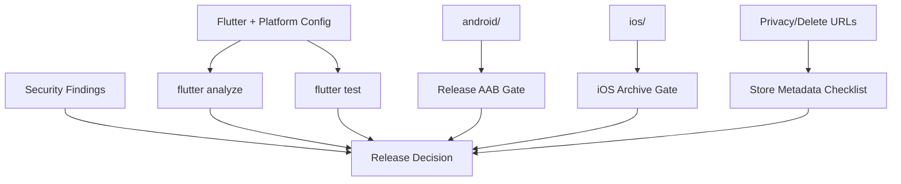

# System Design — Android/iOS Release Compliance

**System ID**: SYS-REL  
**Status**: Draft / Implementation-ready  
**Related ADR**: ADR-001, ADR-006  
**Related PRD**: REQ-REL-001, REQ-QA-001

## 1. Overview

SYS-REL turns release readiness into a repeatable gate. The app must not be submitted while debug signing, missing privacy strings, incomplete OAuth callback configuration, analyzer errors, placeholder-only tests or unresolved P0/P1 findings remain.

## 2. Goals

- Android release signing configured through secure local/CI inputs.
- Store-sensitive permissions removed or justified.
- iOS Info.plist has required OAuth/privacy keys.
- Data Safety/App Privacy checklist exists.
- Analyzer/tests/security checks are release blockers.

## 3. Architecture

## 4. Release Gate Contract

| Gate | Evidence | Pass Condition |
|---|---|---|
| Analyzer | `flutter analyze` output | No errors. |
| Tests | `flutter test` output | All tests pass; not placeholder-only. |
| Android signing | Gradle config/build output | Release uses production signing, not debug. |
| Android permissions | Manifest review | No unjustified `REQUEST_INSTALL_PACKAGES`/legacy storage. |
| iOS OAuth | Info.plist/URL schemes | Google/Supabase callback configured. |
| iOS privacy | Info.plist | Usage strings for media/microphone/photos/files as used. |
| Legal URLs | App + store metadata | Privacy Policy and deletion URL available. |
| Security | Follow-up scan or closure notes | No unresolved critical/high findings. |

## 5. Store Disclosure Inputs

Data likely collected/processed:

- Email, name, phone, avatar.
- Messages, files, voice messages and media attachments.
- Firebase Cloud Messaging token and notification payload metadata.
- App activity/analytics if Firebase Analytics remains enabled.
- Lesson, subscription/payment, progress/homework CRM data.

## 6. Trade-Offs

| Decision | Alternative | Why chosen |
|---|---|---|
| Hard release gate | Manual checklist after build | Prevents repeat unsafe release artifacts. |
| Permission minimization before feature expansion | Keep permissions and explain later | Reduces store rejection and attachment risk. |

## 7. Verification

- Static scripts/checks for signing and permissions.
- `flutter analyze` and `flutter test`.
- Manual final store checklist review by owner.
