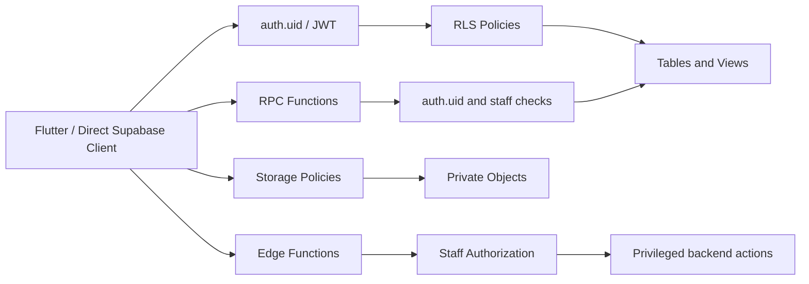

# System Design — Supabase Security Hardening

**System IDs**: SYS-DATA, SYS-MEDIA, SYS-NOTIFY  
**Status**: Draft / Implementation-ready  
**Related ADR**: ADR-002, ADR-005  
**Related PRD**: REQ-SEC-001

## 1. Overview

Supabase is the security boundary for MagicMusicCRM. The Flutter client is untrusted and can call any table/RPC/storage endpoint allowed by Supabase policies. This design turns the security scan findings into concrete backend contracts.

## 2. Goals

- Remove client role escalation paths.
- Close public privileged RPCs and security-definer view bypasses.
- Restrict profile PII and FCM tokens.
- Make private media private.
- Restrict push notification dispatch.

## 3. Architecture

## 4. Root Controls

| Control | Current Risk | Required State |
|---|---|---|
| `create_profile_for_new_user()` | Reads user metadata role. | Always assigns `client`; sets fixed search_path. |
| `profiles` UPDATE | Own row update can change role. | Self update only safe fields; role server-owned. |
| `profiles` SELECT | All auth users see all PII and FCM tokens. | Self/staff access; public minimal projection only if needed. |
| `get_recent_chats_v3` | Public RPC trusts `p_user_id`, `p_is_staff`. | Revoke public execute or derive identity and staff state internally. |
| `update_last_seen` | Public arbitrary user id. | Derive user id from `auth.uid()`. |
| Security-definer views | RLS bypass. | `security_invoker=true` or guarded replacement. |
| Storage buckets | Public and broad policies. | Private buckets, signed URLs, owner/thread path checks. |
| `send-notification` | Service-role relay and bundled key. | Staff-only, secrets in environment, key rotated. |

## 5. Migration Strategy

1. Add guards and revoke risky grants in a reversible SQL migration.
2. Add compatibility views/RPCs for app queries that need limited profile data.
3. Move FCM token writes to a private table or guarded RPC.
4. Switch storage buckets/policies after app signed URL support is ready.
5. Redeploy Edge Function without service account JSON and with authorization checks.

## 6. Operation Contracts

| Operation | Allowed Caller | Denied Caller | Verification |
|---|---|---|---|
| Update own profile name/phone/avatar | Authenticated owner | Other users; owner changing role | SQL/RLS tests |
| Assign staff role | Admin/staff-only backend path | Client | SQL/RLS tests |
| Read profile PII | Self or authorized staff | Ordinary other client | SQL/RLS tests |
| Read admin chat | Thread participant/staff | Other client/anon | SQL/RLS tests |
| Generate media signed URL | Authorized participant/owner | Non-participant/anon | Integration test |
| Send push | Authorized staff/backend | Client/anon | Edge Function test |

## 7. Testing Matrix

| Actor | Must Be Denied |
|---|---|
| anon | profile PII, private messages, privileged RPCs, media, push function |
| client A | client B PII, client B admin chat, role update, staff RPCs, non-owned media |
| teacher | admin-only profile/finance data unless explicitly assigned |
| manager | admin-only security settings unless allowed |
| admin | allowed staff operations with audit |

## 8. Trade-Offs

| Decision | Alternative | Why chosen |
|---|---|---|
| Harden Supabase in place | Build custom backend | Faster and fixes actual public boundary. |
| Private storage + signed URLs | Keep public URLs with obscurity | Signed URLs preserve privacy and are testable. |

## 9. Verification

- Run Supabase advisors after migration.
- Run SQL tests for the actor matrix.
- Run a follow-up Codex Security scan for P0/P1 closure.
