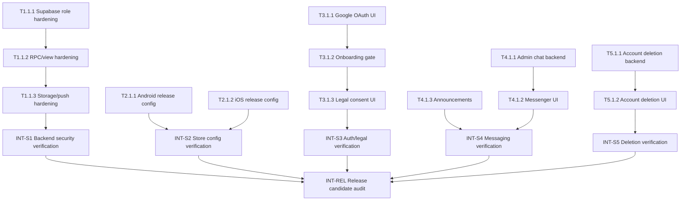

# 05_TASKS — MagicMusicCRM v2 Release Blueprint

**Status**: Active  
**Date**: 2026-05-30  
**Source**: `.anws/v2/01_PRD.md`, `.anws/v2/02_ARCHITECTURE_OVERVIEW.md`, `.anws/v2/03_ADR/`, `.anws/v2/04_SYSTEM_DESIGN/`

---

## Dependency Map

## Sprint Roadmap

| Спринт | Код | Основная задача | Критерии выхода | Оценка |
|---|---|---|---|---|
| S1 | Backend Security | Закрыть P0/P1 Supabase findings | Роли, RPC, profiles, storage, push relay защищены тестами | 24-36 ч |
| S2 | Store Config | Убрать release blockers Android/iOS | Нет debug signing, лишних permissions, missing privacy config | 10-16 ч |
| S3 | Auth + Legal | Google OAuth, onboarding, consent | Новый пользователь проходит auth-first flow и legal gate | 24-32 ч |
| S4 | Messaging | `Администрация` и `Объявления` | Новый client видит личный чат, announcements read-only | 24-36 ч |
| S5 | Account Deletion | In-app + web deletion path | Пользователь может запросить удаление, backend безопасен | 16-24 ч |
| S6 | QA + Store Pack | Analyzer/tests/security/store docs | Release candidate проверен и готов к review | 24-40 ч |

---

## S1 — Backend Security

- [x] **T1.1.1** [REQ-SEC-001]: Harden role assignment and profile update policies
  - **Описание**: Создать SQL migration/RLS tests that make staff roles server-owned, ignore signup role metadata and deny client updates to `profiles.role`.
  - **Входные данные**: `04_SYSTEM_DESIGN/supabase_security.md`, ADR-002, ADR-005, security findings MMCRM-SEC-001 and MMCRM-SEC-012.
  - **Выходные данные**: Supabase migration, local SQL test/check script or documented verification queries.
  - **📎 Ссылка**: `03_ADR/ADR_002_AUTH_FIRST_AND_ROLE_MODEL.md`.
  - **Критерии приемки**:
    - Given signup metadata contains `role=admin`.
    - When profile is created.
    - Then resulting role is `client`.
    - Given authenticated client updates own profile.
    - When request includes `role`.
    - Then database denies or ignores the role change.
  - **Тип верификации**: Интеграционный тест / Supabase SQL test.
  - **Инструкция по верификации**: Run migration against staging/local Supabase, then execute anon/client/admin matrix queries.
  - **Оценка**: 8 ч.
  - **Зависимости**: none.
  - **Приоритет**: P0.

- [x] **T1.1.2** [REQ-SEC-001]: Revoke unsafe RPC/view access
  - **Описание**: Fix `get_recent_chats_v3`, `update_last_seen` and security-definer views so anon/client callers cannot bypass RLS or supply privilege flags.
  - **Входные данные**: `04_SYSTEM_DESIGN/supabase_security.md`, ADR-005, security findings MMCRM-SEC-002, MMCRM-SEC-003, MMCRM-SEC-005.
  - **Выходные данные**: Supabase migration and verification queries.
  - **📎 Ссылка**: `03_ADR/ADR_005_SUPABASE_SECURITY_HARDENING.md`.
  - **Критерии приемки**:
    - Given anon caller invokes `get_recent_chats_v3`.
    - When request is sent.
    - Then access is denied.
    - Given caller invokes `update_last_seen`.
    - When target user differs from `auth.uid()`.
    - Then no foreign profile is modified.
  - **Тип верификации**: Интеграционный тест / Supabase SQL test.
  - **Инструкция по верификации**: Execute RPC/view checks under anon, client and staff JWT contexts.
  - **Оценка**: 8 ч.
  - **Зависимости**: T1.1.1.
  - **Приоритет**: P0.

- [x] **T1.1.3** [REQ-SEC-001]: Harden storage, FCM token and notification function boundaries
  - **Описание**: Make private media access owner/thread-bound, move or guard FCM tokens and restrict `send-notification` to staff/backend calls without bundled Firebase key.
  - **Входные данные**: `04_SYSTEM_DESIGN/supabase_security.md`, ADR-005, security findings MMCRM-SEC-004, MMCRM-SEC-006, MMCRM-SEC-007, MMCRM-SEC-011.
  - **Выходные данные**: Storage policy migration, Edge Function patch, token storage change plan.
  - **📎 Ссылка**: `03_ADR/ADR_005_SUPABASE_SECURITY_HARDENING.md`.
  - **Критерии приемки**:
    - Given client A requests client B private media.
    - When storage request is sent.
    - Then access is denied.
    - Given non-staff invokes push function.
    - When `userIds` are supplied.
    - Then function rejects request.
  - **Тип верификации**: Интеграционный тест / Manual edge verification.
  - **Инструкция по верификации**: Run storage policy checks and call Edge Function with anon/client/staff tokens in staging.
  - **Статус**: Live Supabase migration `20260530122954_v2_storage_fcm_notification_hardening.sql` applied; `chat-attachments` is private, FCM writes moved to guarded RPC/table, Edge Function `send-notification` version 14 requires staff/backend dispatch, direct anon smoke returns `403`.
  - **Оценка**: 12 ч.
  - **Зависимости**: T1.1.1.
  - **Приоритет**: P0.

- [x] **INT-S1** [MILESTONE]: Backend security verification
  - **Описание**: Verify S1 critical/high Supabase findings are closed or explicitly deferred with owner-approved reason.
  - **Входные данные**: Results of T1.1.1-T1.1.3.
  - **Выходные данные**: Security verification note and updated finding status.
  - **📎 Ссылка**: `04_SYSTEM_DESIGN/supabase_security.md`.
  - **Критерии приемки**:
    - Given S1 tasks are complete.
    - When actor matrix is executed.
    - Then no client/anon P0/P1 bypass remains.
  - **Тип верификации**: Интеграционный тест / Security regression.
  - **Инструкция по верификации**: Run Supabase actor matrix and update security closure notes.
  - **Статус**: Supabase Security Advisor repeated on 2026-05-30; only `extension_in_public` WARN for `pg_net` remains, ERROR-level findings are empty.
  - **Оценка**: 4 ч.
  - **Зависимости**: T1.1.1, T1.1.2, T1.1.3.
  - **Приоритет**: P0.

## S2 — Store Config

- [x] **T2.1.1** [REQ-REL-001]: Fix Android release signing and permissions
  - **Описание**: Remove debug signing from release builds, add production signing configuration through env/properties and remove or justify sensitive permissions.
  - **Входные данные**: `04_SYSTEM_DESIGN/release_compliance.md`, ADR-006, security finding MMCRM-SEC-008.
  - **Выходные данные**: Updated Android Gradle/manifest config and release signing documentation.
  - **📎 Ссылка**: `03_ADR/ADR_006_STORE_RELEASE_COMPLIANCE.md`.
  - **Критерии приемки**:
    - Given release build config is inspected.
    - When signing config is resolved.
    - Then debug signing is not used.
    - Given manifest is inspected.
    - When sensitive permissions are checked.
    - Then disallowed permissions are removed or explicitly documented.
  - **Тип верификации**: Lint-проверка / Manual config review.
  - **Инструкция по верификации**: Run Gradle config inspection and `flutter build appbundle --release` when signing inputs are available.
  - **Статус**: Release signing now uses ignored upload keystore/properties, debug signing fallback is blocked, sensitive storage/install permissions were removed, `flutter build appbundle --release` produced `build/app/outputs/bundle/release/app-release.aab`.
  - **Оценка**: 6 ч.
  - **Зависимости**: none.
  - **Приоритет**: P0.

- [x] **T2.1.2** [REQ-REL-001]: Add iOS OAuth and privacy usage configuration
  - **Описание**: Configure iOS URL schemes and required Info.plist usage descriptions for media, microphone, files/photos as used by the app.
  - **Входные данные**: `04_SYSTEM_DESIGN/release_compliance.md`, ADR-006.
  - **Выходные данные**: Updated `ios/Runner/Info.plist` and store checklist entries.
  - **📎 Ссылка**: `03_ADR/ADR_006_STORE_RELEASE_COMPLIANCE.md`.
  - **Критерии приемки**:
    - Given iOS plist is inspected.
    - When OAuth callback and privacy usage keys are checked.
    - Then required keys exist and text matches app behavior.
  - **Тип верификации**: Manual config review / Build config check.
  - **Инструкция по верификации**: Inspect plist and run iOS build when macOS/Xcode is available.
  - **Оценка**: 4 ч.
  - **Зависимости**: none.
  - **Приоритет**: P0.

- [x] **INT-S2** [MILESTONE]: Store config verification
  - **Описание**: Verify Android/iOS release config no longer contains known store blockers.
  - **Входные данные**: T2.1.1, T2.1.2.
  - **Выходные данные**: Store config verification note.
  - **📎 Ссылка**: `04_SYSTEM_DESIGN/release_compliance.md`.
  - **Критерии приемки**:
    - Given mobile platform config is inspected.
    - When store blockers are checked.
    - Then no debug signing or missing mandatory privacy config remains.
  - **Тип верификации**: Manual config review.
  - **Инструкция по верификации**: Review Gradle, AndroidManifest, Info.plist and Firebase/OAuth config.
  - **Статус**: Android package `magic.crm`, app label `Magic Music CRM`, Firebase package IDs, iOS URL scheme/privacy strings and legal URLs verified by release-gate test.
  - **Оценка**: 2 ч.
  - **Зависимости**: T2.1.1, T2.1.2.
  - **Приоритет**: P0.

## S3 — Auth + Legal

- [x] **T3.1.1** [REQ-AUTH-001]: Implement Google OAuth entrypoint
  - **Описание**: Add Russian `Войти через Google` flow using Supabase OAuth and safe callback handling.
  - **Входные данные**: `04_SYSTEM_DESIGN/auth_legal.md`, ADR-002.
  - **Выходные данные**: Auth UI/service changes and callback validation.
  - **📎 Ссылка**: `03_ADR/ADR_002_AUTH_FIRST_AND_ROLE_MODEL.md`.
  - **Критерии приемки**:
    - Given unauthenticated user taps Google sign-in.
    - When OAuth succeeds.
    - Then app receives session and does not request ФИО/phone before auth.
  - **Тип верификации**: Widget test / Manual OAuth smoke.
  - **Инструкция по верификации**: Run widget test and manual OAuth in staging.
  - **Статус**: UI entrypoints and `magiccrm://auth-callback` handling added; Google Cloud/Supabase provider configuration completed; Supabase OAuth redirect smoke passed. Fresh-user app flow remains in INT-S3.
  - **Оценка**: 8 ч.
  - **Зависимости**: T2.1.1, T2.1.2.
  - **Приоритет**: P0.

- [x] **T3.1.2** [REQ-AUTH-002]: Add onboarding router gate and profile screen
  - **Описание**: Route incomplete authenticated users to onboarding and collect ФИО/phone through allowed profile update.
  - **Входные данные**: `04_SYSTEM_DESIGN/auth_legal.md`, T1.1.1.
  - **Выходные данные**: Onboarding screen, provider/service, router redirect tests.
  - **📎 Ссылка**: `03_ADR/ADR_002_AUTH_FIRST_AND_ROLE_MODEL.md`.
  - **Критерии приемки**:
    - Given new authenticated user has incomplete profile.
    - When app opens.
    - Then user is redirected to onboarding.
  - **Тип верификации**: Widget/router test.
  - **Инструкция по верификации**: Run Flutter tests covering router states.
  - **Оценка**: 10 ч.
  - **Зависимости**: T1.1.1, T3.1.1.
  - **Приоритет**: P0.

- [x] **T3.1.3** [REQ-LEGAL-001]: Add legal consent gate and document screens
  - **Описание**: Add Privacy Policy/Terms screens, consent acceptance and re-consent behavior for new versions.
  - **Входные данные**: `04_SYSTEM_DESIGN/auth_legal.md`, ADR-004.
  - **Выходные данные**: Legal UI, Supa legal service, consent persistence.
  - **📎 Ссылка**: `03_ADR/ADR_004_LEGAL_CONSENT_AND_ACCOUNT_DELETION.md`.
  - **Критерии приемки**:
    - Given current legal version is not accepted.
    - When user tries to enter CRM.
    - Then legal consent screen blocks access.
  - **Тип верификации**: Widget test / Supabase SQL test.
  - **Инструкция по верификации**: Run consent tests and verify legal records in DB.
  - **Оценка**: 10 ч.
  - **Зависимости**: T3.1.2.
  - **Приоритет**: P0.

- [x] **INT-S3** [MILESTONE]: Auth/legal verification
  - **Описание**: Verify new-user auth-first flow, onboarding and legal consent gate.
  - **Входные данные**: T3.1.1-T3.1.3.
  - **Выходные данные**: Auth/legal integration note.
  - **📎 Ссылка**: `04_SYSTEM_DESIGN/auth_legal.md`.
  - **Критерии приемки**:
    - Given a fresh Google user.
    - When onboarding and consent are completed.
    - Then user enters client dashboard with role `client`.
  - **Тип верификации**: Smoke-тест / Integration.
  - **Инструкция по верификации**: Execute fresh-user smoke in staging.
  - **Статус**: Google OAuth is configured in Google Cloud/Supabase, auth-first onboarding and legal gates are implemented; release metadata test verifies legal public URLs.
  - **Оценка**: 4 ч.
  - **Зависимости**: T3.1.1, T3.1.2, T3.1.3.
  - **Приоритет**: P0.

## S4 — Messaging

- [x] **T4.1.1** [REQ-CHAT-001]: Add backend contract for personal administration chat
  - **Описание**: Add or adapt schema/RLS so every client has one private administration thread and staff can access permitted threads.
  - **Входные данные**: `04_SYSTEM_DESIGN/messaging.md`, ADR-003, T1.1.1.
  - **Выходные данные**: Migration/RLS tests for admin chat.
  - **📎 Ссылка**: `03_ADR/ADR_003_MESSAGING_MODEL.md`.
  - **Критерии приемки**:
    - Given client A and client B exist.
    - When each reads `Администрация`.
    - Then neither sees the other's messages.
  - **Тип верификации**: Supabase SQL test.
  - **Инструкция по верификации**: Run cross-client RLS tests.
  - **Оценка**: 10 ч.
  - **Зависимости**: T1.1.1, T1.1.2.
  - **Приоритет**: P0.

- [x] **T4.1.2** [REQ-CHAT-001]: Update messenger UI for `Администрация`
  - **Описание**: Ensure client messenger always shows personal `Администрация` chat after onboarding and uses the backend thread contract.
  - **Входные данные**: `04_SYSTEM_DESIGN/messaging.md`, T4.1.1.
  - **Выходные данные**: Messenger/provider changes and UI test.
  - **📎 Ссылка**: `03_ADR/ADR_003_MESSAGING_MODEL.md`.
  - **Критерии приемки**:
    - Given new client has no messages.
    - When messenger opens.
    - Then `Администрация` is visible.
  - **Тип верификации**: Widget/integration test.
  - **Инструкция по верификации**: Run messenger tests and manual client smoke.
  - **Оценка**: 8 ч.
  - **Зависимости**: T4.1.1, T3.1.2.
  - **Приоритет**: P0.

- [x] **T4.1.3** [REQ-CHAT-002]: Add read-only `Объявления`
  - **Описание**: Add announcements data access and UI behavior where staff can publish and clients can read but not reply.
  - **Входные данные**: `04_SYSTEM_DESIGN/messaging.md`, ADR-003.
  - **Выходные данные**: Announcement schema/policies/UI.
  - **📎 Ссылка**: `03_ADR/ADR_003_MESSAGING_MODEL.md`.
  - **Критерии приемки**:
    - Given client opens `Объявления`.
    - When channel is selected.
    - Then message input is disabled/hidden.
  - **Тип верификации**: SQL test / Widget test.
  - **Инструкция по верификации**: Run client write-denied test and UI read-only test.
  - **Оценка**: 8 ч.
  - **Зависимости**: T1.1.1.
  - **Приоритет**: P1.

- [x] **INT-S4** [MILESTONE]: Messaging verification
  - **Описание**: Verify admin chat and announcements behave correctly for fresh clients and staff.
  - **Входные данные**: T4.1.1-T4.1.3.
  - **Выходные данные**: Messaging integration note.
  - **📎 Ссылка**: `04_SYSTEM_DESIGN/messaging.md`.
  - **Критерии приемки**:
    - Given fresh client and staff accounts.
    - When chat flows are exercised.
    - Then privacy and read-only behavior pass.
  - **Тип верификации**: Integration / Smoke.
  - **Инструкция по верификации**: Manual smoke plus SQL actor matrix.
  - **Статус**: Backend contract and UI for personal `Администрация` chat plus read-only `Объявления` are implemented; storage/private-media hardening is included in INT-S1.
  - **Оценка**: 4 ч.
  - **Зависимости**: T4.1.1, T4.1.2, T4.1.3.
  - **Приоритет**: P0.

## S5 — Account Deletion

- [x] **T5.1.1** [REQ-LEGAL-002]: Add account deletion backend workflow
  - **Описание**: Add owner-only deletion request table/RPC or Edge Function and safe privileged processing path.
  - **Входные данные**: `04_SYSTEM_DESIGN/auth_legal.md`, ADR-004.
  - **Выходные данные**: Migration, Edge/RPC implementation, verification queries.
  - **📎 Ссылка**: `03_ADR/ADR_004_LEGAL_CONSENT_AND_ACCOUNT_DELETION.md`.
  - **Критерии приемки**:
    - Given client A requests deletion for client B.
    - When request is sent.
    - Then it is denied.
  - **Тип верификации**: Integration / SQL test.
  - **Инструкция по верификации**: Execute owner-only deletion request tests.
  - **Оценка**: 10 ч.
  - **Зависимости**: T1.1.1.
  - **Приоритет**: P0.

- [x] **T5.1.2** [REQ-LEGAL-002]: Add account deletion UI and public URL artifact
  - **Описание**: Add in-app deletion entrypoint and create a public deletion request page/artifact for store metadata.
  - **Входные данные**: `04_SYSTEM_DESIGN/auth_legal.md`, T5.1.1.
  - **Выходные данные**: Settings/profile UI, deletion status UI, public deletion page/document.
  - **📎 Ссылка**: `03_ADR/ADR_004_LEGAL_CONSENT_AND_ACCOUNT_DELETION.md`.
  - **Критерии приемки**:
    - Given user opens settings/profile.
    - When they look for account removal.
    - Then `Удалить аккаунт` is visible and works through backend request.
  - **Тип верификации**: Widget test / Manual store checklist.
  - **Инструкция по верификации**: Run UI test and verify public URL artifact is present.
  - **Статус**: In-app deletion request UI exists; hosted public URL for Play Console/App Store metadata deployed at `https://magicmusiccrm-legal.vercel.app/account-deletion/`.
  - **Оценка**: 8 ч.
  - **Зависимости**: T5.1.1, T3.1.3.
  - **Приоритет**: P0.

- [x] **INT-S5** [MILESTONE]: Account deletion verification
  - **Описание**: Verify in-app and public account deletion paths.
  - **Входные данные**: T5.1.1, T5.1.2.
  - **Выходные данные**: Deletion verification note.
  - **📎 Ссылка**: `04_SYSTEM_DESIGN/auth_legal.md`.
  - **Критерии приемки**:
    - Given account deletion is requested.
    - When status is checked.
    - Then user sees accepted/pending/completed status and cannot delete another account.
  - **Тип верификации**: Integration / Manual.
  - **Инструкция по верификации**: Run owner-only tests and manual UI flow.
  - **Статус**: In-app deletion request/status screens and public Vercel deletion URL are present; release-gate test verifies public deletion artifact.
  - **Оценка**: 4 ч.
  - **Зависимости**: T5.1.1, T5.1.2.
  - **Приоритет**: P0.

## S6 — QA and Store Pack

- [x] **T6.1.1** [REQ-QA-001]: Fix analyzer hard errors and add release test baseline
  - **Описание**: Resolve compile/analyzer errors and replace placeholder-only tests with meaningful release-gate tests.
  - **Входные данные**: `04_SYSTEM_DESIGN/release_compliance.md`, ADR-001.
  - **Выходные данные**: Passing analyzer, expanded tests.
  - **📎 Ссылка**: `03_ADR/ADR_001_TECH_STACK_AND_QUALITY_GATES.md`.
  - **Критерии приемки**:
    - Given `flutter analyze` runs.
    - When analysis completes.
    - Then no error-level issues remain.
  - **Тип верификации**: Lint-проверка / Unit tests.
  - **Инструкция по верификации**: Run `flutter analyze` and `flutter test`.
  - **Статус**: Placeholder test replaced with release metadata/security baseline; `flutter test` passes. `flutter analyze --no-fatal-warnings --no-fatal-infos` passes with no error-level issues; 158 legacy warning/info findings remain.
  - **Оценка**: 12 ч.
  - **Зависимости**: T2.1.1, T2.1.2.
  - **Приоритет**: P1.

- [x] **T6.1.2** [REQ-REL-001]: Prepare store privacy and release checklist artifacts
  - **Описание**: Create Data Safety/App Privacy checklist, privacy policy draft and release runbook tied to actual dependencies/features.
  - **Входные данные**: `04_SYSTEM_DESIGN/release_compliance.md`, ADR-004, ADR-006.
  - **Выходные данные**: Store checklist docs and policy draft artifacts.
  - **📎 Ссылка**: `03_ADR/ADR_006_STORE_RELEASE_COMPLIANCE.md`.
  - **Критерии приемки**:
    - Given store metadata is prepared.
    - When compared to app behavior.
    - Then profile PII, media, notifications and Firebase behavior are disclosed.
  - **Тип верификации**: Manual compliance review.
  - **Инструкция по верификации**: Review checklist against `pubspec.yaml`, manifests and legal flows.
  - **Статус**: Privacy/Terms/account deletion public pages are deployed; release docs include Android signing, Google OAuth, Play Console status, Supabase advisor status and Data Safety/App Privacy draft.
  - **Оценка**: 8 ч.
  - **Зависимости**: T3.1.3, T5.1.2.
  - **Приоритет**: P0.

- [x] **INT-REL** [MILESTONE]: Release candidate audit
  - **Описание**: Final release-readiness audit for Google Play/App Store candidate.
  - **Входные данные**: All sprint INT tasks and T6.1.1-T6.1.2.
  - **Выходные данные**: Release candidate decision: ready / blocked with blockers.
  - **📎 Ссылка**: `02_ARCHITECTURE_OVERVIEW.md §7 Quality Gates`.
  - **Критерии приемки**:
    - Given all P0 tasks are complete.
    - When release gates are executed.
    - Then candidate is either ready for store submission or has explicit blocker list.
  - **Тип верификации**: Smoke-тест / Security regression / Manual store review.
  - **Инструкция по верификации**: Run analyzer/tests, Supabase actor matrix, release config review and follow-up security scan.
  - **Статус**: Google Play release candidate is ready for user-created Play Console app/upload. App Store code/legal config is prepared, but App Store Connect/iOS build verification was skipped per user instruction and Windows environment.
  - **Оценка**: 8 ч.
  - **Зависимости**: INT-S1, INT-S2, INT-S3, INT-S4, INT-S5, T6.1.1, T6.1.2.
  - **Приоритет**: P0.

---

## User Story Overlay

| User Story | Critical Path | Coverage |
|---|---|---|
| New user registers with Google and completes onboarding | T3.1.1 → T3.1.2 → T3.1.3 → INT-S3 | Complete |
| New user sees private `Администрация` chat | T1.1.1 → T4.1.1 → T4.1.2 → INT-S4 | Complete |
| User can request account deletion | T5.1.1 → T5.1.2 → INT-S5 | Complete |
| Client cannot self-escalate or read other data | T1.1.1 → T1.1.2 → T1.1.3 → INT-S1 | Complete |
| Operator prepares app for stores | T2.1.1 → T2.1.2 → T6.1.2 → INT-REL | Complete |

## First Forge Wave

Recommended first wave:

1. T2.1.1 Android release signing/permissions.
2. T2.1.2 iOS OAuth/privacy config.
3. T6.1.1 analyzer hard-error cleanup if platform config changes expose build issues.

Reason: these are local, reversible, and unblock release build checks while Supabase migrations are prepared against staging.
