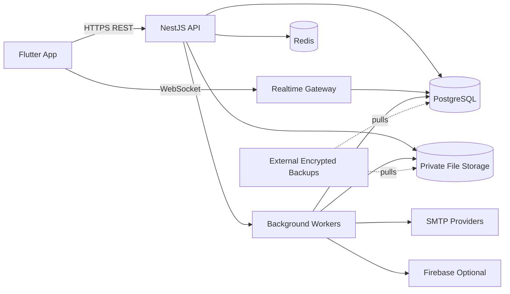

# 02_ARCHITECTURE_OVERVIEW - MagicMusicCRM v3 Backend Independence

**Status**: Draft / Accepted for implementation planning
**Date**: 2026-06-10
**Source**: `.anws/v3/01_PRD.md`

## 1. Context

v3 replaces Supabase Cloud runtime with a Magic Music owned backend. Flutter becomes an API client; all authorization, role, file, messaging and legal decisions move to server-side services.



## 2. System Inventory

| ID | System | Responsibility | Initial location |
|---|---|---|---|
| SYS-APP | Flutter client | Russian UI, local session handling, API calls, realtime subscriptions. | `lib/` |
| SYS-API | Backend API | REST contract, validation, auth guards, RBAC, business workflows. | `server/apps/api` |
| SYS-AUTH | Identity and sessions | Password auth, OTP, refresh rotation, Google identity linking. | `server/modules/auth` |
| SYS-DATA | PostgreSQL data layer | Schema, migrations, scoped repositories, constraints. | `server/modules/*`, `server/db` |
| SYS-MSG | Messenger realtime | Chats, announcements, presence, typing, WebSocket auth. | `server/modules/messenger` |
| SYS-FILES | Private storage | Upload validation, metadata, signed downloads, file backups. | `server/modules/files`, `/srv/magiccrm/files` |
| SYS-LEGAL | Legal/deletion | Consent versions, deletion requests, retention status. | `server/modules/legal` |
| SYS-NOTIFY | Notifications | Email and push dispatch with provider fallback. | `server/modules/notifications`, workers |
| SYS-OPS | Operations | Docker runtime, TLS, backups, monitoring, logs, runbooks. | `infra/`, `docs/runbooks/` |
| SYS-SEC | Security gates | Scans, actor matrix, checklist, audit logging. | `server/test/security`, CI |

## 3. Trust Boundaries

| Boundary | Input | Required control |
|---|---|---|
| Public API | HTTP request, JWT/refresh token, file upload | DTO validation, auth guard, rate limit, audit log. |
| WebSocket | Connection token, room subscription | Token validation, per-room authorization, reconnect limits. |
| Database | Repository query | No raw user-controlled SQL; scoped repositories; least-privilege DB user. |
| Files | Filename, MIME, bytes, file ID | MIME/size allowlist, random storage path, no public web root, signed download. |
| OAuth | Provider callback | State validation, redirect allowlist, identity linking rules. |
| SMTP/Push | Notification payload | Provider fallback, recipient authorization, no secret in client. |
| Ops | Deploy, backup, restore | Runbook, health checks, rollback, external encrypted backup. |

## 4. Deployment Topology

First production target:

```text
Dedicated MSK primary:
  reverse proxy + TLS
  NestJS API
  WebSocket gateway
  worker
  PostgreSQL
  Redis
  private file storage
  monitoring/logging agent

External location:
  encrypted database backups
  encrypted file backups
  restore verification target when needed
```

No automatic HA is required for first launch. Reliability is enforced by monitoring, backups, tested restore and rollback runbooks.

## 5. Runtime Contracts

- Flutter calls only `api.magic-music.org`.
- API responses use stable typed DTOs; frontend never receives DB credentials or privileged provider secrets.
- Access token is short-lived; refresh token rotates and can be revoked per device/session family.
- Files are referenced by backend file IDs, not absolute local paths or public bucket URLs.
- Realtime subscriptions are server-authorized on connect and on every room join.

## 6. Migration Strategy

Big-bang cutover with rehearsals:

1. Build v3 backend and Flutter client against staging v3.
2. Export Supabase data and Storage.
3. Run dry-run migration twice and record integrity report.
4. Freeze Supabase writes for 2-4 hours.
5. Run final export, transform, import and file sync.
6. Run smoke/security checks.
7. Switch `api.magic-music.org` to v3.
8. Keep Supabase read-only as rollback/reference during stabilization.

## 7. Quality Gates

| Gate | Blocking condition |
|---|---|
| Backend tests | Unit/integration/security actor matrix failures. |
| Flutter tests | Critical auth/messenger/file/legal flows fail. |
| Security scans | Critical/High secrets/dependency/container findings. |
| Migration dry-run | Integrity mismatch or missing file references. |
| Backup restore | Restore drill does not produce working service. |
| Production smoke | Auth, profile, messenger, files, admin or legal checks fail. |

## 8. Implementation Order

1. v3 docs, blueprint and challenge.
2. Infrastructure foundation and backup/restore.
3. Backend core and auth boundary.
4. Data/API feature modules.
5. Migration scripts and dry runs.
6. Flutter API cutover.
7. Security closure and production cutover.
