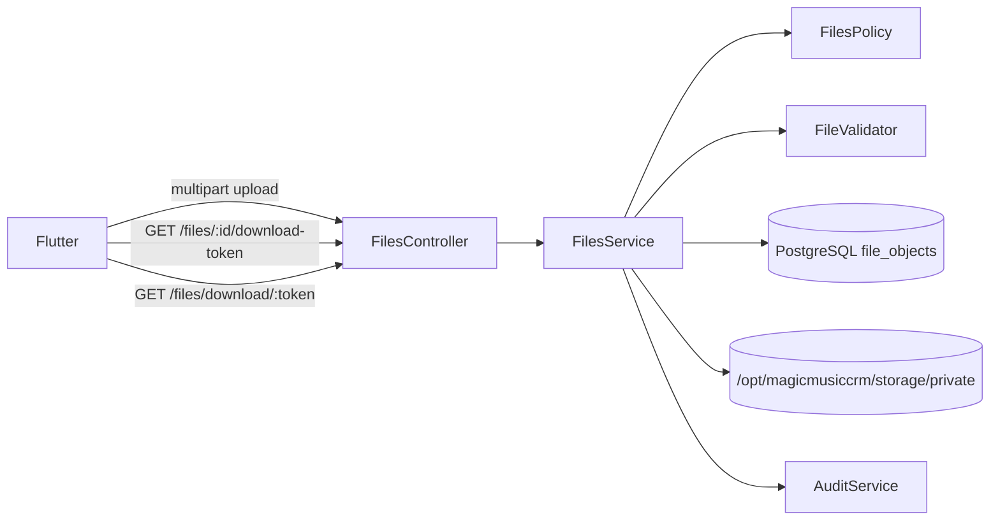

# System Design - Private File Storage

**System IDs**: SYS-FILES, SYS-API, SYS-OPS, SYS-SEC
**Status**: Implementation-ready for S4/T4.3
**Related requirements**: REQ-V3-FILES-001
**Related ADRs**: ADR-003, ADR-005, ADR-006

## 1. Overview

Files API replaces Supabase Storage and public bucket URLs. Files are stored outside web root on NVMe; access is always mediated by backend authorization and short-lived signed download tokens.

## 2. Goals and Non-Goals

| Goals | Non-Goals |
|---|---|
| Private avatar and attachment storage. | Public static bucket URLs. |
| Secure upload validation and metadata. | Full antivirus cluster in first staging build. |
| Signed download tokens with expiry. | Direct Caddy file serving. |
| Backup compatibility with encrypted storage snapshots. | Permanent signed URLs. |

## 3. Architecture



## 4. Components

| Component | Responsibility |
|---|---|
| `FilesController` | Upload, metadata, download token and download endpoints. |
| `FilesService` | Validation, storage path allocation, metadata transaction, token issue/verify. |
| `FilesPolicy` | Actor can upload/read/attach/delete file. |
| `FileValidator` | Size, extension, MIME and filename normalization. |
| `StorageDriver` | Local disk read/write/delete abstraction. |
| `DownloadTokenService` | HMAC or DB-backed short-lived token issuance. |

## 5. Interface Design

| Operation | Method | Path | Actors | Input | Output |
|---|---|---|---|---|---|
| Upload | POST | `/files` | authenticated | multipart file + `purpose` + optional `ownerType/ownerId` | `FileObjectDto` |
| Get metadata | GET | `/files/:id` | authorized reader | file id | `FileObjectDto` |
| Issue download token | POST | `/files/:id/download-token` | authorized reader | none | `{ token, expiresAt }` |
| Download | GET | `/files/download/:token` | token bearer | token | bytes |
| Delete | DELETE | `/files/:id` | owner/admin or owning module | none | tombstone |

Purposes:

- `profile_avatar`
- `chat_attachment`
- `chat_voice`
- `legal_document`
- `crm_document`

## 6. Data Model

| Table | Key fields | Notes |
|---|---|---|
| `app.file_objects` | `id`, `owner_user_id`, `owner_type`, `owner_id`, `purpose`, `original_name`, `mime_type`, `size_bytes`, `storage_key`, `sha256`, `created_by`, `deleted_at` | Metadata only; no absolute public URLs. |
| `app.file_download_tokens` | `token_hash`, `file_id`, `actor_user_id`, `expires_at`, `used_at` | DB-backed token option. |

Storage key format:

```text
private/YYYY/MM/<file_id>/<random_32_bytes>.<safe_ext>
```

Limits:

| Purpose | Max size | MIME allowlist |
|---|---:|---|
| `profile_avatar` | 1 MB | `image/png`, `image/jpeg`, `image/webp` |
| `chat_attachment` | 25 MB | images, PDF, common docs, audio/video allowlist |
| `chat_voice` | 25 MB | `audio/mpeg`, `audio/mp4`, `audio/ogg`, `audio/webm`, `audio/wav` |
| `legal_document` | 10 MB | `application/pdf` |

## 7. Authorization Rules

- Upload actor becomes `created_by`; client-provided creator is ignored.
- A file can be attached to chat only if actor can write that chat.
- A profile avatar can be updated by self or admin.
- Foreign file metadata and download token requests return `404` unless the actor has staff permission.
- Legal documents are public metadata but file bytes still served by backend to allow auditing and future access rules.

## 8. Security Controls

- Store outside web root.
- Generate random storage names; never trust original names for paths.
- Normalize filename for display only.
- Reject double-extension tricks by using MIME allowlist plus safe server extension.
- Compute SHA256 for integrity and dedupe diagnostics.
- Do not log download tokens.
- Download token TTL: 5 minutes for normal files, 1 minute for sensitive CRM documents.
- Optional later: ClamAV or external scanner before release if file abuse risk increases.

## 9. Tests

- Upload rejects over-size file.
- Upload rejects disallowed MIME.
- Path traversal filename stores safely.
- Client cannot download another client's file.
- Expired token fails.
- Deleted file metadata remains but download fails.
- Backup restore includes storage content and metadata.

## 10. Trade-offs and Alternatives

| Option | Decision | Reason |
|---|---|---|
| Local NVMe storage | Accepted for first v3 | Meets independence goal and simple deployment. |
| S3/MinIO as primary now | Deferred | More moving parts; keep API abstraction for future migration. |
| Stateless HMAC download tokens | Possible later | Fast but harder immediate revocation. |
| DB-backed download tokens | Accepted initially | Easier audit and revocation. |
