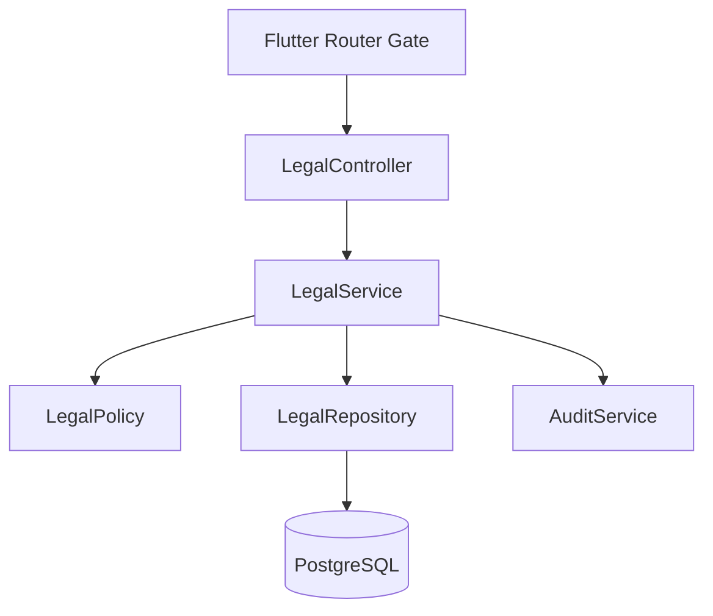
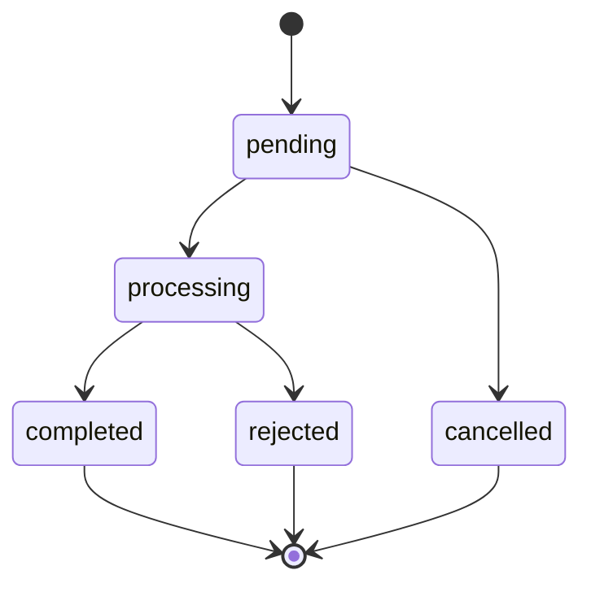

# System Design - Legal Consent and Account Deletion

**System IDs**: SYS-LEGAL, SYS-API, SYS-SEC
**Status**: Implementation-ready for S4/T4.4
**Related requirements**: REQ-V3-DATA-001, REQ-V3-SEC-001
**Related ADRs**: ADR-002, ADR-006

## 1. Overview

Legal APIs replace Supabase RPC/table access for legal documents, consent gate and account deletion requests. The API must support the current Flutter gates: legal consent before app access and deletion status before CRM access.

## 2. Goals and Non-Goals

| Goals | Non-Goals |
|---|---|
| Serve current legal documents and consent status. | Legal text authoring UI in first S4. |
| Record immutable consent evidence. | Immediate hard-delete of all historical records. |
| Allow user deletion request and admin lifecycle. | Legal advice automation. |
| Block normal CRM access for pending deletion users. | Replace external legal website content immediately. |

## 3. Architecture

## 4. Components

| Component | Responsibility |
|---|---|
| `LegalController` | `/legal/*` and `/profile/deletion-request` endpoints. |
| `LegalService` | Current document selection, consent transaction, deletion lifecycle. |
| `LegalPolicy` | Self/admin rules for deletion status and admin processing. |
| `LegalRepository` | SQL for documents, consents and deletion requests. |
| `ReleaseGateService` | Combines legal accepted + deletion pending for Flutter router. |

## 5. Interface Design

| Operation | Method | Path | Actors | Input | Output |
|---|---|---|---|---|---|
| Release gate | GET | `/legal/gate` | authenticated | none | `{ legalAccepted, deletionPending }` |
| Current documents | GET | `/legal/documents/current` | authenticated | none | `LegalDocumentDto[]` |
| Accept current documents | POST | `/legal/consents/current` | authenticated | accepted document IDs | `{ accepted: true }` |
| Deletion request | POST | `/profile/deletion-request` | authenticated | reason optional, acknowledgement | `DeletionRequestDto` |
| Deletion status | GET | `/profile/deletion-request` | authenticated | none | `DeletionRequestDto | null` |
| Admin list deletion requests | GET | `/admin/deletion-requests?status=` | manager, admin | filters | `Page<DeletionRequestDto>` |
| Admin update deletion request | PATCH | `/admin/deletion-requests/:id` | admin | status, resolution note | `DeletionRequestDto` |

## 6. Data Model

| Table | Key fields | Notes |
|---|---|---|
| `app.legal_documents` | `type`, `version`, `title`, `url`, `file_id`, `published_at`, `is_current` | Types: `privacy_policy`, `terms_of_use`, `account_deletion`. |
| `app.legal_consents` | `user_id`, `document_id`, `version`, `accepted_at`, `ip_hash`, `user_agent_hash` | Immutable evidence. |
| `app.account_deletion_requests` | `user_id`, `status`, `reason`, `requested_at`, `resolved_at`, `resolved_by`, `resolution_note` | One active request per user. |

Constraints and indexes:

- Unique current document per `type` with partial unique index where `is_current = true`.
- Unique consent per `(user_id, document_id)`.
- Unique active deletion request per `user_id` where status in `pending`, `processing`.

## 7. Lifecycle

Rules:

- `pending` and `processing` block normal CRM access.
- User can create request only for self.
- User cannot approve or complete deletion.
- Admin actions are audited.
- Completion soft-deletes user-facing access first; hard deletion/anonymization is handled by a separate launch runbook or worker after retention review.

## 8. Security and Privacy

- Consent evidence stores hashed IP/user-agent only if captured.
- Deletion request status is visible only to owner, manager or admin.
- Legal document URLs are allowlisted if external.
- All deletion lifecycle transitions create audit events.

## 9. Tests

- User without consent gets `legalAccepted=false`.
- Accepting all current docs returns `legalAccepted=true`.
- Partial consent does not pass gate.
- Foreign deletion status returns 404/403.
- Pending deletion blocks CRM gate.
- Admin transition writes audit event.

## 10. Trade-offs and Alternatives

| Option | Decision | Reason |
|---|---|---|
| Hard-delete immediately on request | Rejected | Risks legal/accounting data loss and abuse. |
| Soft-delete plus admin lifecycle | Accepted | Matches current app status screen and retention needs. |
| External legal docs only | Accepted initially | Current app already uses published legal URLs; file-backed docs can be added. |
| Store raw IP/user agent | Rejected | Unnecessary PII; use hashes if needed for evidence. |
