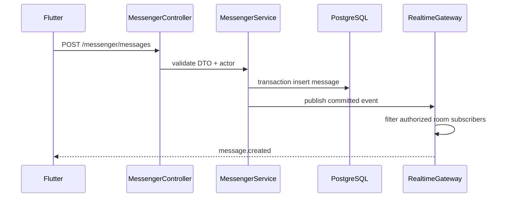

# System Design - Messenger and Realtime

**System IDs**: SYS-MSG, SYS-API, SYS-SEC
**Status**: Implementation-ready for S4/T4.2
**Related requirements**: REQ-V3-MSG-001, REQ-V3-DATA-001
**Related ADRs**: ADR-001, ADR-004, ADR-006

## 1. Overview

Messenger replaces Supabase Realtime and direct `messages`, `group_chats`, `channels` access with REST writes plus backend-authorized WebSocket events under `/realtime`.

Main job: persist chat state through REST, authorize every room, then publish only committed events to authorized subscribers.

## 2. Goals and Non-Goals

| Goals | Non-Goals |
|---|---|
| Preserve `Администрация`, direct teacher/client, group chats and announcements. | Peer-to-peer encrypted messaging in first v3. |
| Ensure client A never sees client B messages. | Public channels without auth. |
| Support read state, reactions, forwarding, pinning, typing and presence. | Using WebSocket as write authority. |

## 3. Architecture

## 4. Components

| Component | Responsibility |
|---|---|
| `MessengerController` | REST endpoints for chats, messages, reactions, read state, pins. |
| `MessengerService` | Business rules, transactions and audit. |
| `MessengerPolicy` | Actor can list/join/read/write chat. |
| `MessengerRepository` | SQL for chats/messages/read models. |
| `RealtimeGateway` | `/realtime` connection auth, room join authorization, presence, typing, broadcasts. |
| `RealtimeSessionRegistry` | In-memory socket to actor/room mapping; Redis later if multi-node. |

## 5. Interface Design

### REST

| Operation | Method | Path | Actors | Input | Output |
|---|---|---|---|---|---|
| List chats | GET | `/messenger/chats?cursor=` | authenticated | cursor | `Page<ChatSummaryDto>` |
| Get messages | GET | `/messenger/chats/:chatId/messages?before=&limit=` | chat member | cursor | `MessageDto[]` |
| Send message | POST | `/messenger/chats/:chatId/messages` | chat member with write permission | text/file/voice DTO | `MessageDto` |
| Create direct/admin chat | POST | `/messenger/chats/direct` | authenticated | target profile or `administration` | `ChatDto` |
| Create group | POST | `/messenger/groups` | manager, admin | name, member IDs | `ChatDto` |
| Update group members | PATCH | `/messenger/groups/:id/members` | group admin, manager, admin | add/remove IDs | `ChatDto` |
| Channels | GET/POST/PATCH | `/messenger/channels` | read scoped; write manager/admin | channel DTO | `ChannelDto` |
| Channel posts | GET/POST | `/messenger/channels/:id/posts` | scoped | post DTO | `ChannelPostDto` |
| Mark read | POST | `/messenger/chats/:chatId/read` | chat member | `lastReadMessageId` | success |
| React | PUT/DELETE | `/messenger/messages/:id/reactions/:emoji` | visible message | emoji | reactions summary |
| Pin | POST/DELETE | `/messenger/messages/:id/pin` | permitted staff/group admin | none | message |
| Delete own message | DELETE | `/messenger/messages/:id` | sender or admin | mode | tombstone DTO |

### WebSocket `/realtime`

Connection auth: access token in `Authorization` header or `auth.token` payload.

| Event | Direction | Payload | Rule |
|---|---|---|---|
| `room.join` | client -> server | `{ roomType, roomId }` | server calls `MessengerPolicy.canJoinRoom`. |
| `room.leave` | client -> server | `{ roomId }` | remove subscription. |
| `typing.start` / `typing.stop` | client -> server | `{ chatId }` | only chat members. |
| `presence.update` | client -> server | `{ status }` | authenticated. |
| `message.created` | server -> client | `MessageDto` | only authorized room subscribers. |
| `message.updated` | server -> client | `MessageDto` | only authorized room subscribers. |
| `chat.updated` | server -> client | `ChatSummaryDto` | only chat members. |
| `notification.created` | server -> client | `NotificationDto` | target recipient only. |

## 6. Data Model

| Table | Key fields | Notes |
|---|---|---|
| `app.chats` | `type`, `title`, `created_by`, `avatar_file_id`, `last_message_id` | Types: `administration`, `direct`, `group`. |
| `app.chat_members` | `chat_id`, `user_id`, `role`, `muted_until`, `last_read_message_id` | Unique active member. |
| `app.messages` | `chat_id`, `sender_id`, `content`, `message_type`, `attachment_file_id`, `reply_to_id`, `forwarded_from_id`, `deleted_at` | Direct/group/admin messages. |
| `app.message_reactions` | `message_id`, `user_id`, `emoji` | Unique reaction per emoji/user/message. |
| `app.channels` | `title`, `description`, `avatar_file_id`, `created_by` | Announcement surfaces. |
| `app.channel_permissions` | `channel_id`, `user_id` or `role` | Read/write targeting. |
| `app.channel_posts` | `channel_id`, `author_id`, `content`, `attachment_file_id`, `published_at` | Read-only for most users. |
| `app.typing_presence` | Redis/in-memory | Ephemeral, not durable. |

Indexes:

- `messages(chat_id, created_at desc) where deleted_at is null`.
- `chat_members(user_id, chat_id) where left_at is null`.
- `messages(sender_id, created_at desc)`.
- `channel_posts(channel_id, published_at desc)`.

## 7. Authorization Rules

- Clients can only join chats where they are members.
- Administration chat membership is represented as client plus staff group; staff see all administration chats.
- Teachers can message assigned students/parents only when a teaching relationship exists.
- Channel read/write is controlled by role and explicit permission rows.
- WebSocket room names are opaque, e.g. `chat:<uuid>`, and never accepted as authorization proof.
- Message delete: sender can soft-delete own message; admin can moderate with audit.

## 8. Security and Abuse Controls

- Rate-limit message sends, typing events and room joins.
- Validate message length and attachment IDs.
- Attachment IDs must pass `FilesPolicy.canAttachFile`.
- No raw HTML; Flutter renders plain text.
- All admin moderation and membership changes are audited.

## 9. Tests

- Client A cannot list/join/read client B chat.
- Teacher cannot message unrelated student.
- Manager/admin can access administration queues.
- Expired token closes WebSocket connection.
- WebSocket reconnect reauthorizes each room.
- REST send publishes one event only after DB commit.

## 10. Trade-offs and Alternatives

| Option | Decision | Reason |
|---|---|---|
| WebSocket writes for messages | Rejected | Harder validation/audit and retry semantics. |
| REST writes + WS broadcasts | Accepted | Durable writes first; realtime is delivery layer. |
| One `messages` table for all surfaces | Accepted with `channels` separate | Keeps direct/group simple while channels stay announcement-oriented. |
| Redis pub/sub now | Deferred | Single-node deployment does not require it yet; add when scaling beyond one API instance. |
