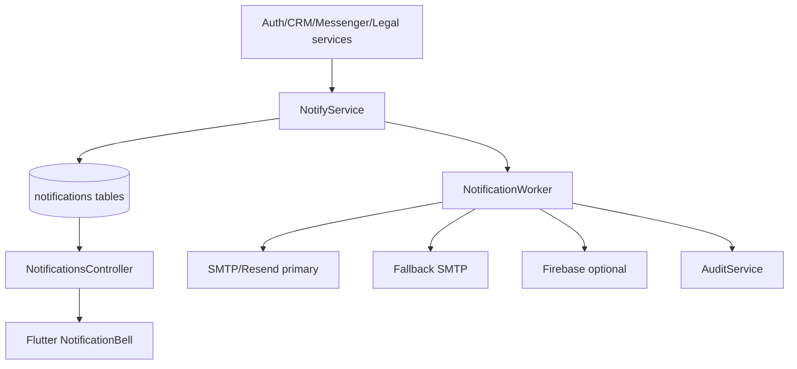

# System Design - Notifications and Provider Fallback

**System IDs**: SYS-NOTIFY, SYS-API, SYS-MSG, SYS-SEC
**Status**: Implementation-ready for S4/T4.5
**Related requirements**: REQ-V3-DATA-001, REQ-V3-SEC-001
**Related ADRs**: ADR-001, ADR-002, ADR-006

## 1. Overview

Notifications replace direct Supabase `notification_recipients` realtime and provide a backend-owned dispatch layer for in-app notifications, email and optional Firebase push.

Main job: persist notification records, expose recipient-scoped REST/realtime reads, and dispatch external messages through fallback providers without making Resend/Firebase critical path dependencies.

## 2. Goals and Non-Goals

| Goals | Non-Goals |
|---|---|
| In-app notification list and unread count. | Guaranteed push delivery on every platform. |
| Email dispatch with primary/fallback SMTP provider. | Sending secrets or provider tokens to Flutter. |
| Optional Firebase push. | Blocking core workflows when Firebase is down. |
| Auditable notification attempts. | Marketing campaign automation. |

## 3. Architecture

## 4. Components

| Component | Responsibility |
|---|---|
| `NotificationsController` | Recipient list, mark read, device token registration. |
| `NotificationsService` | Create notification, recipient targeting, enqueue dispatch. |
| `NotificationWorker` | Email/push delivery attempts and fallback. |
| `NotificationRepository` | SQL for notifications and delivery attempts. |
| `EmailProvider` | Resend SMTP/API or configured SMTP. |
| `PushProvider` | Optional Firebase Cloud Messaging. |

## 5. Interface Design

| Operation | Method | Path | Actors | Input | Output |
|---|---|---|---|---|---|
| List notifications | GET | `/notifications?unread=&cursor=` | authenticated | filters | `Page<NotificationDto>` |
| Mark all read | POST | `/notifications/read-all` | authenticated | none | `{ success: true }` |
| Mark one read | POST | `/notifications/:id/read` | recipient | none | `NotificationDto` |
| Register device | POST | `/notifications/devices` | authenticated | platform, token | `DeviceDto` |
| Delete device | DELETE | `/notifications/devices/:id` | owner | none | success |
| Admin send notification | POST | `/admin/notifications` | manager, admin | target + title/body/data | dispatch summary |

Internal service contract:

| Method | Input | Output |
|---|---|---|
| `notifyUser` | `userId`, title, body, data, channels | `notificationId` |
| `notifyRole` | role, title, body, data, channels | count |
| `notifyChatMembers` | chatId, excluding userId, message summary | count |
| `sendEmail` | recipient user/email, template, variables | delivery attempt |

## 6. Data Model

| Table | Key fields | Notes |
|---|---|---|
| `app.notifications` | `type`, `title`, `body`, `data`, `created_by`, `created_at` | Immutable notification content. |
| `app.notification_recipients` | `notification_id`, `user_id`, `is_read`, `read_at`, `delivered_at` | Recipient state. |
| `app.notification_devices` | `user_id`, `platform`, `token_hash`, `encrypted_token`, `enabled`, `last_seen_at` | No raw push token in logs. |
| `app.notification_deliveries` | `notification_id`, `user_id`, `channel`, `provider`, `status`, `attempt_count`, `last_error` | Email/push audit trail. |
| `app.email_outbox` | `to_email_hash`, `template`, `payload`, `status`, `next_attempt_at` | Worker queue if no external queue yet. |

Indexes:

- `notification_recipients(user_id, is_read, created_at desc)`.
- `notification_devices(user_id) where enabled = true`.
- `email_outbox(status, next_attempt_at)`.

## 7. Provider Fallback

Order:

1. Persist notification and recipients.
2. Try primary channel provider.
3. If primary email provider fails, retry fallback SMTP.
4. If push provider fails, keep in-app notification and record failed delivery.
5. Never fail the originating auth/CRM/messenger transaction only because external notification dispatch failed.

## 8. Security

- Device token is accepted only for current actor.
- Device token stored encrypted or tokenized; logs use hash only.
- Admin broadcast requires manager/admin and audit.
- Notification `data` must use allowlisted keys per type to avoid leaking PII.
- Webhook endpoints, if provider callbacks are added later, must verify signatures.

## 9. Tests

- User cannot read another user's notification.
- Mark read changes only current recipient row.
- Primary provider failure falls back to secondary SMTP.
- Firebase unavailable records failed push but REST action succeeds.
- Admin broadcast writes audit event.
- Logs redact recipient tokens and provider errors with secrets.

## 10. Trade-offs and Alternatives

| Option | Decision | Reason |
|---|---|---|
| Synchronous provider sends in request path | Rejected | External provider outage would break core workflows. |
| Persist then async/fallback dispatch | Accepted | App remains usable when Resend/Firebase fail. |
| Firebase as required channel | Rejected | PRD says Firebase is optional. |
| In-app notification as baseline | Accepted | Always available through owned backend. |
