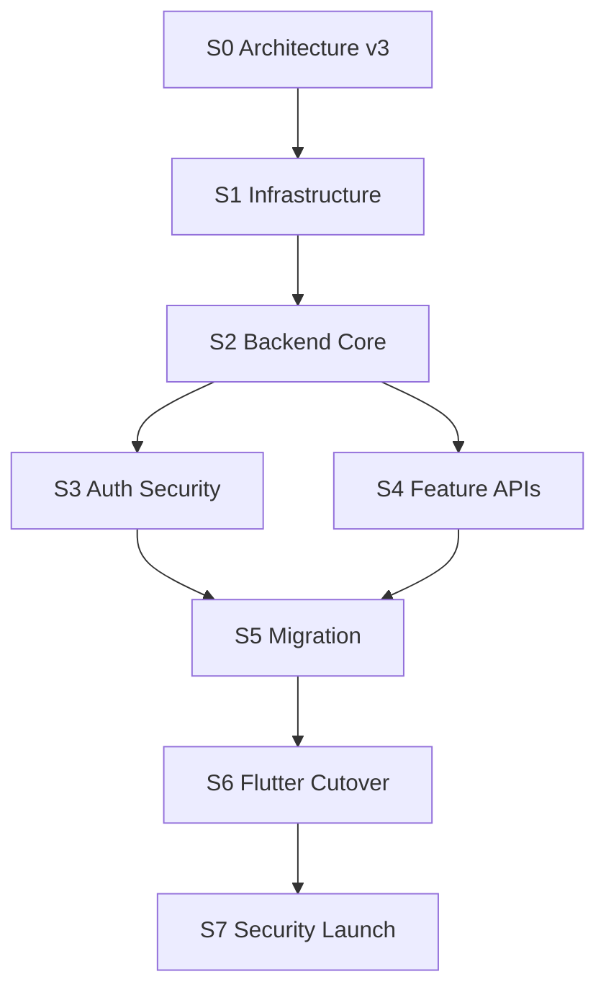

# 05_TASKS - MagicMusicCRM v3 Backend Independence Blueprint

**Status**: Active
**Date**: 2026-06-10
**Source**: `.anws/v3/01_PRD.md`, `.anws/v3/02_ARCHITECTURE_OVERVIEW.md`, `.anws/v3/03_ADR/`

## Dependency Map

## Sprint Roadmap

| Sprint | Code | Main goal | Exit criteria | Estimate |
|---|---|---|---|---|
| S0 | Architecture v3 | Finalize `.anws/v3`, Linear backlog and challenge report | Docs accepted; High/Critical design risks tracked | 12-20 h |
| S1 | Infrastructure | Dedicated primary server, runtime, backups, monitoring | Restore drill and health checks pass | 32-56 h |
| S2 | Backend Core | NestJS, DB migrations, validation, audit, RBAC skeleton | API skeleton and tests pass | 40-72 h |
| S3 | Auth Boundary | Own auth/session/password/OTP/Google fallback | Auth security tests pass | 40-72 h |
| S4 | Feature APIs | CRM, messenger, files, legal, notifications | Feature integration tests pass | 80-140 h |
| S5 | Migration | Supabase export/transform/import and file migration | Two dry-run reports pass | 40-80 h |
| S6 | Flutter Cutover | Replace Supabase runtime flows with v3 API client | Android/Windows smoke passes | 80-160 h |
| S7 | Security Launch | Security checklist, cutover rehearsal, production switch | 0 High/Critical blockers; production smoke passes | 32-64 h |

## Tasks

### S0 - Architecture v3

- [x] **T0.1** [REQ-V3-SEC-001]: Create v3 architecture baseline
  - **Description**: Create `.anws/v3` PRD, Architecture Overview, ADRs, security design and task blueprint.
  - **Verification**: Manual review of created docs.
  - **Estimate**: 6 h.

- [x] **T0.2** [REQ-V3-SEC-001]: Create Linear project and milestones
  - **Description**: Create Linear project `MagicMusicCRM v3 Backend Independence` and milestone issues from this blueprint.
  - **Verification**: Linear project contains S0-S7 issue groups.
  - **Status**: Created Linear project and issues `KVA-78` through `KVA-85`.
  - **Estimate**: 2 h.

- [x] **INT-S0** [MILESTONE]: Architecture checkpoint
  - **Description**: Confirm v3 scope, topology, security gates and cutover assumptions before coding.
  - **Verification**: User acceptance plus no untracked Critical design risks.
  - **Status**: Accepted by user on 2026-06-10; Linear `KVA-78` moved to Done.
  - **Estimate**: 2 h.

### S1 - Infrastructure

- [x] **T1.1** [REQ-V3-OPS-001]: Provision dedicated MSK primary
  - **Description**: Prepare Ubuntu server, firewall, SSH key access, non-root deploy user and base packages.
  - **Verification**: SSH key login works; ports 22/80/443 only exposed as intended.
  - **Status**: Completed on Selectel staging server `161.104.50.105`: Ubuntu 24.04, SSH key access, `magicdeploy` user, Docker, UFW and Fail2ban. Host listeners are limited to `22/80/443` plus local DNS resolver.
  - **Estimate**: 6 h.

- [x] **T1.2** [REQ-V3-OPS-001]: Add Docker runtime and reverse proxy
  - **Description**: Configure Docker Compose, pinned images, reverse proxy TLS and `/health`.
  - **Verification**: `curl https://api.magic-music.org/health` passes in staging DNS.
  - **Status**: Completed for staging domain `api.phantom-net.ru`: Docker Compose stack is running, Caddy obtained a Let's Encrypt certificate, and `https://api.phantom-net.ru/api/health` returns `200 OK`.
  - **Estimate**: 8 h.

- [x] **T1.3** [REQ-V3-OPS-001]: Add PostgreSQL, Redis and private volumes
  - **Description**: Configure DB, least-privilege users, Redis and persistent volumes.
  - **Verification**: DB is not public; app user lacks owner/superuser privileges.
  - **Status**: PostgreSQL and Redis run in private Docker network with persistent volumes and no public host listeners. Verified role split: `magiccrm_owner` is migration/admin role; runtime `magiccrm_app` has `rolsuper=false`, `rolcreatedb=false`, `rolcreaterole=false`.
  - **Estimate**: 8 h.

- [x] **T1.4** [REQ-V3-OPS-001]: Implement encrypted external backups
  - **Description**: Backup PostgreSQL and file storage to external location.
  - **Verification**: Restore drill to clean target passes.
  - **Status**: Completed for staging on Selectel. Added encrypted backup/restore scripts, generated `magicmusiccrm-staging-20260611T165451Z.tgz.enc`, copied the encrypted artifact off-server to local evidence storage, verified SHA256 `62ceffa8b0d0e23d88932fcc297de20ea00fd785c85d200c4d65ed3b3e91ee25`, restored to a clean PostgreSQL volume, repaired runtime grants during restore, and passed public health plus auth smoke after restore.
  - **Estimate**: 12 h.

- [x] **INT-S1** [MILESTONE]: Infrastructure verification
  - **Description**: Verify health, firewall, backups, restore, monitoring and rollback runbook.
  - **Verification**: Restore evidence and monitoring alert test attached.
  - **Status**: Completed for Selectel staging on 2026-06-11. Verified public health, UFW/listeners limited to `22/80/443`, encrypted backup/off-server copy, destructive restore drill, `magiccrm_app` grants after restore, systemd monitoring timer, healthy monitor run, forced alert drill with `monitor_rc=2` and alert log evidence, and rollback restart smoke with health recovery on attempt 2.
  - **Estimate**: 4 h.

### S2 - Backend Core

- [x] **T2.1** [REQ-V3-DATA-001]: Scaffold NestJS backend
  - **Description**: Create API, config validation, request IDs, structured logging and redaction.
  - **Verification**: Unit tests pass; no secrets logged.
  - **Status**: Added local NestJS scaffold in `server/`; `npm run typecheck`, `npm test` and `npm run build` pass.
  - **Estimate**: 8 h.

- [x] **T2.2** [REQ-V3-DATA-001]: Add PostgreSQL migrations and repositories
  - **Description**: Add migration tooling, schema ownership, scoped repositories and DB constraints.
  - **Verification**: Migration up/down against test DB passes.
  - **Status**: Migration runner, initial SQL migration, DatabaseService, scoped repository base and tests added. Verified against real staging PostgreSQL on Selectel: `down` reverted `0001_core_identity`, `up` applied it again, and API restarted healthy.
  - **Estimate**: 16 h.

- [x] **T2.3** [REQ-V3-SEC-001]: Add RBAC and authorization guards
  - **Description**: Implement roles, scopes, ownership guards and audit events.
  - **Verification**: Actor matrix unit/integration tests pass.
  - **Status**: Added actor context, `Roles` decorator, `RolesGuard`, `CurrentActor`, scoped ownership checks and `AuditService`; `npm run typecheck`, `npm test` and `npm run build` pass.
  - **Estimate**: 16 h.

- [x] **INT-S2** [MILESTONE]: Backend core verification
  - **Description**: Verify API skeleton, DB access, validation, logs, RBAC and audit.
  - **Verification**: Test report and sample denied cross-user request.
  - **Status**: Completed on 2026-06-11. Local backend gates passed: `npm run typecheck`, `npm test` (`11` suites, `40` tests), `npm run build`, `npm audit --audit-level=moderate` (`0` vulnerabilities). Staging checks passed: public health, runtime `magiccrm_app` DB access, audit table access, validation error returns `400` with request ID, protected `/auth/logout-all` without token returns `401`, scoped repository unit test denies foreign client access, RBAC unit test denies insufficient role, and recent API log grep found only benign route names for password reset, no token/password/secret values.
  - **Estimate**: 4 h.

### S3 - Auth Boundary

- [x] **T3.1** [REQ-V3-AUTH-001]: Implement email/password auth
  - **Description**: Signup, login, password hashing, email verification and safe errors.
  - **Verification**: Auth unit/integration tests pass.
  - **Status**: Added password hashing, signup/login credential checks, email verification token flow and safe auth errors. SMTP delivery remains in notification fallback tasks. `npm run typecheck`, `npm test` and `npm run build` pass.
  - **Estimate**: 16 h.

- [x] **T3.2** [REQ-V3-AUTH-001]: Implement refresh rotation and logout
  - **Description**: Device sessions, refresh token rotation, reuse detection and logout-all.
  - **Verification**: Token lifecycle tests pass.
  - **Status**: Added refresh session persistence, hashed refresh tokens, rotation with reuse detection, family revocation, JWT access tokens, JWT auth guard and protected `/auth/logout-all`. `npm run typecheck`, `npm test` and `npm run build` pass.
  - **Estimate**: 16 h.

- [x] **T3.3** [REQ-V3-AUTH-001]: Implement OTP and password reset
  - **Description**: OTP challenge, expiry, rate limits and one-time reset tokens.
  - **Verification**: Abuse and rate-limit tests pass.
  - **Status**: Added OTP request/verify endpoints, OTP challenge table, expiry/rate-limit checks, safe password reset request, one-time reset tokens, session revocation after password reset and abuse lifecycle tests. SMTP delivery remains in T4.5 notification fallback.
  - **Estimate**: 16 h.

- [x] **T3.4** [REQ-V3-AUTH-002]: Implement optional Google OAuth
  - **Description**: OAuth state, callback validation and identity linking.
  - **Verification**: Invalid state/redirect tests fail closed.
  - **Status**: Added Google OAuth state generation, one-time callback validation, server-side code exchange, ID token audience verification, `user_identities` linking and v3 session issuance. `npm run typecheck`, `npm test` and `npm run build` pass.
  - **Estimate**: 12 h.

- [x] **INT-S3** [MILESTONE]: Auth verification
  - **Description**: Verify auth flows, session revocation, fallback login and audit events.
  - **Verification**: Auth smoke and security report.
  - **Status**: Completed on staging on 2026-06-11. Verified signup/login, refresh rotation, old refresh reuse fail-closed with `401`, logout-all revokes refresh sessions, refresh after logout returns `401`, OTP request and password reset request return accepted responses, invalid Google OAuth callback fails closed with `400`, password login remains the fallback path, and audit events were recorded for `auth.signup`, `auth.login_password`, `auth.session_issued`, `auth.session_rotated`, `auth.refresh_reuse_detected`, `auth.logout_all`, `auth.otp_requested`, and `auth.password_reset_requested`.
  - **Estimate**: 4 h.

### S4 - Feature APIs

- [x] **T4.1** [REQ-V3-DATA-001]: Implement profile and CRM APIs
  - **Description**: Profiles, roles, students, teachers, lessons, payments, tasks and manager/admin views.
  - **Verification**: Role-scoped integration tests pass.
  - **Status**: Completed on 2026-06-11. Added `0002_profile_crm` migration, Profile and CRM NestJS modules, role/ownership policies, scoped REST endpoints, audit on privileged writes and profile updates, signup/OAuth profile backfill, and policy tests. Local gates passed: `npm run typecheck`, `npm test` (`13` suites, `49` tests), `npm run build`, `npm audit --audit-level=moderate` (`0` vulnerabilities). Staging passed on `api.phantom-net.ru`: migration `0002_profile_crm`, public health, profile read/update, client denial for admin/students/leads, admin profile list, lead create, task create, audit evidence and log secret grep.
  - **Estimate**: 32 h.

- [x] **T4.2** [REQ-V3-MSG-001]: Implement messenger REST and WebSocket
  - **Description**: Admin chat, announcements, presence, typing and realtime delivery.
  - **Verification**: Client A/B/staff isolation tests pass.
  - **Status**: Completed on 2026-06-11. Added `0003_messenger` migration, Messenger REST API, Socket.IO realtime gateway at `/realtime`, JWT handshake auth, per-room authorization on `room.join`, typing/presence events, admin/direct/group chats, channel announcements, read state, reactions, pin/delete flows, policy tests and service publish-after-transaction test. Local gates passed: `npm run typecheck`, `npm test` (`15` suites, `55` tests), `npm run build`, `npm audit --audit-level=moderate` (`0` vulnerabilities). Staging passed on `api.phantom-net.ru`: migration `0003_messenger`, public health, client A administration chat, client B isolation with `404`, staff queue visibility, `/realtime` join and `message.created` delivery after REST send, durable chat/message checks and log secret grep.
  - **Estimate**: 32 h.

- [x] **T4.3** [REQ-V3-FILES-001]: Implement file API
  - **Description**: Upload, metadata, private storage, signed downloads and validation.
  - **Verification**: Foreign file access and upload abuse tests pass.
  - **Status**: Completed on 2026-06-11. Added `0004_files` migration, private local storage driver, file validator, FilesPolicy, DB-backed one-time download tokens, upload/metadata/download-token/download/delete endpoints, storage root env, Docker writable storage path and staging bind mount under `/opt/magicmusiccrm/storage`. Local gates passed: `npm run typecheck`, `npm test` (`18` suites, `62` tests), `npm run build`, `npm audit --audit-level=moderate` (`0` vulnerabilities). Staging passed on `api.phantom-net.ru`: migration `0004_files`, public health, upload/download byte match, one-time token reuse denied with `404`, foreign metadata denied with `404`, bad MIME denied with `400`, deleted file token denied with `404`, storage key persisted under `private/YYYY/MM/...`, and log secret grep found no token/password/secret values.
  - **Estimate**: 24 h.

- [x] **T4.4** [REQ-V3-DATA-001]: Implement legal and account deletion APIs
  - **Description**: Legal versions, consents, deletion requests and retention state.
  - **Verification**: Owner-only deletion tests pass.
  - **Status**: Completed on 2026-06-11. Added `0005_legal` migration, current legal document seed, `LegalModule`, release gate, current document API, exact-set consent acceptance with hashed IP/user-agent evidence, profile deletion request API, admin deletion lifecycle API, policy tests and service tests. Local gates passed: `npm run typecheck`, `npm test` (`20` suites, `72` tests), `npm run build`, `npm audit --audit-level=moderate` (`0` vulnerabilities). Staging passed on `api.phantom-net.ru`: migration `0005_legal`, public health, three current legal docs, gate false before consent, partial consent denied with `400`, full consent accepted, gate true after consent, missing deletion acknowledgement denied with `400`, deletion request created, client admin patch denied with `403`, invalid admin transition denied with `403`, admin `pending -> processing -> completed` lifecycle, user/profile soft-delete, refresh session revocation, consent evidence stored as hashes, legal audit events recorded and log secret grep found no token/password/raw IP/user-agent values.
  - **Estimate**: 16 h.

- [x] **T4.5** [REQ-V3-DATA-001]: Implement notification provider fallback
  - **Description**: Email dispatch, SMTP fallback and optional Firebase push.
  - **Verification**: Primary provider failure degrades safely.
  - **Status**: Completed on 2026-06-11. Added `0006_notifications` migration, in-app notifications, recipient-scoped list/read/read-all, device registration/deletion with token hashing, admin notification send, email outbox, Resend primary provider path, native SMTP fallback provider path, optional Firebase push delivery record and auth email queue wiring for signup, OTP and password reset. Local gates passed: `npm run typecheck`, `npm test` (`23` suites, `77` tests), `npm run build`, `npm audit --audit-level=moderate` (`0` vulnerabilities). Staging passed on `api.phantom-net.ru`: migration `0006_notifications`, public health, routes mapped, signup email outbox did not block auth, client admin send denied with `403`, admin broadcast delivered in-app notification, unread list returned recipient notification, mark-read/read-all passed, device token stored hashed with `raw_device_hits=0`, email providers degraded to `failed/skipped` without real secrets, Firebase push recorded `skipped`, admin audit event recorded and log secret grep found no token/password/device token/provider secret values.
  - **Estimate**: 16 h.

- [x] **INT-S4** [MILESTONE]: Feature API verification
  - **Description**: Run integration tests for CRM, messenger, files, legal and notifications.
  - **Verification**: API smoke report.
  - **Status**: Completed on 2026-06-11. Full staging smoke on `api.phantom-net.ru` passed after migrations `0002`-`0006`: signup/login, profile read/update, admin profile list, CRM lead create with client denial, messenger administration chat and foreign access denial, private file upload/foreign denial/signed download byte match, legal current docs/consent/gate, admin notification broadcast, unread list, device registration and audit/table evidence. Final health returned `200 OK`; final log grep found no token/password/device token/provider secret values.
  - **Estimate**: 6 h.

### S5 - Migration

- [x] **T5.1** [REQ-V3-MIG-001]: Build Supabase export pipeline
  - **Description**: Export schema/data and Storage manifest from Supabase.
  - **Verification**: Export report includes counts and checksums.
  - **Status**: Completed on 2026-06-11 as a reusable export pipeline. Added `server/src/migration/supabase-export.ts`, deterministic NDJSON export, schema metadata snapshot, table counts, SHA-256 checksums, storage manifest support via `storage.objects`, credential redaction in `export-report.json`, npm scripts `supabase:export` / `supabase:export:prod`, utility tests and `docs/runbooks/supabase-export.md`. Local gates passed: `npm run typecheck`, `npm test` (`24` suites, `83` tests), `npm run build`, `npm audit --audit-level=moderate` (`0` vulnerabilities). Staging smoke passed by running the same exporter inside the API container against staging Postgres schema `app`: report generated for `44` tables, `211` rows, per-table checksums and safe storage warning because staging is not Supabase and has no `storage.objects`. Real Supabase export passed on 2026-06-12 via session pooler `aws-1-eu-central-2.pooler.supabase.com:6543`: generated `exports/supabase/20260612-000929/export-report.json` for `69` tables, `23,188` rows and `36` storage objects (`avatars=13`, `chat-attachments=23`), with `0` warnings and no DB password/service role key in export metadata.
  - **Estimate**: 12 h.

- [x] **T5.2** [REQ-V3-MIG-001]: Build transform/import scripts
  - **Description**: Transform Supabase records to v3 schema and import into PostgreSQL.
  - **Verification**: Dry-run import passes integrity checks.
  - **Status**: Completed on 2026-06-12 after real dry-run against Selectel staging v3 PostgreSQL. Added `server/src/migration/v3-import.ts`, `server/src/migration/v3-import-utils.ts`, npm scripts `migration:import` / `migration:import:prod`, unit tests and `docs/runbooks/v3-import.md`. Current importer reads the T5.1 NDJSON package, maps `auth.users`, `auth.identities`, `public.profiles`, CRM, legal, messenger, channels, notifications and FCM tokens into the v3 `app` schema, hashes legacy FCM tokens, optionally consumes `SUPABASE_FILE_MAP` / `file-import-report.json` to set `avatar_file_id` and attachment file IDs, writes `import-report.json`, and defaults to `MIGRATION_DRY_RUN=true` with transaction rollback. Local gates passed: `npm run typecheck`, `npm test` (`26` suites, `91` tests), `npm run build`, `npm audit --audit-level=moderate` (`0` vulnerabilities). Real dry-run used `exports/supabase/20260612-000929` and generated `/tmp/mmcrm-exports/supabase/20260612-000929/import-report.json`: `22,709` source rows, `25,002` planned rows, `25,002` inserted-or-skipped rows inside rolled-back transaction, `38` skipped rows, `8` non-blocking warnings. Messenger coverage fixed during dry-run: `1,105/1,105` messages and `4/4` reactions planned. Post-dry-run staging counts confirmed rollback: `users=18`, `files=2`, `messages=2`.
  - **Estimate**: 24 h.

- [x] **T5.3** [REQ-V3-MIG-001]: Build file migration
  - **Description**: Download Storage objects, store locally and rewrite references to file IDs.
  - **Verification**: Sample files open through v3 signed download API.
  - **Status**: Completed on 2026-06-12. Added `server/src/migration/storage-import.ts`, `server/src/migration/storage-import-utils.ts`, npm scripts `storage:import` / `storage:import:prod`, unit tests and `docs/runbooks/storage-import.md`. The CLI reads `storage/objects.ndjson`, downloads private Supabase Storage objects with `SUPABASE_SERVICE_ROLE_KEY`, writes files under private `FILE_STORAGE_ROOT`, computes SHA-256 checksums, generates `file-import-report.json`, can insert `app.file_objects` in dry-run/live mode, and provides legacy lookup keys for T5.2 reference rewrite. Local gates passed: `npm run typecheck`, `npm test` (`26` suites, `91` tests), `npm run build`, `npm audit --audit-level=moderate` (`0` vulnerabilities). Real Supabase Storage smoke passed on 2026-06-12 using `exports/supabase/20260612-000929`: `36` objects (`avatars=13`, `chat-attachments=23`), downloaded all `36` objects to private local storage, wrote `8,081,527` bytes, `0` skipped, generated `file-import-report.json`, and grep confirmed no service role key in the report. Real staging `app.file_objects` dry-run also passed in rolled-back transaction: `36/36` downloaded, `0` skipped, `0` warnings. Signed download API smoke passed through the real staging API using a temporary file fixture: issued `POST /api/files/:id/download-token`, downloaded via `GET /api/files/download/:token`, verified `text/plain`, `Content-Disposition` filename, byte count `73` and SHA-256 match, then removed the fixture row/file. Cleanup evidence: `files=2` unchanged, `smoke_files=0`.
  - **Estimate**: 16 h.

- [x] **INT-S5** [MILESTONE]: Migration dry-run verification
  - **Description**: Run two full dry runs and produce cutover readiness report.
  - **Verification**: Two passing reports with no blocking mismatches.
  - **Status**: Completed on 2026-06-12. Two full dry-runs passed against Selectel staging v3 PostgreSQL using export packages `exports/supabase/20260612-000929` and `exports/supabase/20260612-003310`. Both exported `69` tables, `23,188` rows and `36` storage objects with `0` export warnings. Storage dry-runs downloaded `36/36` objects, skipped `0`, wrote `8,081,527` bytes and completed `app.file_objects` insert paths with `0` warnings in rolled-back transactions. Data import dry-runs planned `25,002` rows from `22,709` source rows, had `38` skipped rows and `8` non-blocking warnings, and passed DB constraints. Rollback evidence after dry-runs: `users=18`, `files=2`, `messages=2`. Produced `.anws/v3/08_CUTOVER_READINESS_REPORT.md` with S5 readiness decision and non-blocking follow-ups.
  - **Estimate**: 8 h.

### S6 - Flutter Cutover

- [x] **T6.1** [REQ-V3-AUTH-001]: Add MagicApiClient
  - **Description**: Add API client, auth token storage and typed error handling.
  - **Verification**: Client unit tests pass.
  - **Estimate**: 16 h.
  - **Status**: Completed on 2026-06-12. Added `MagicApiClient`, secure platform token storage via `flutter_secure_storage`, typed `MagicApiException`, Riverpod providers, `MAGIC_API_BASE_URL` env override, automatic bearer injection and single refresh retry on `401`. Verification passed: `flutter test` (`12` tests), `dart analyze lib/core/api test/core/api lib/core/constants/env.dart`. Full `flutter analyze` reports `20` pre-existing info-level lints outside the new API layer.

- [x] **T6.2** [REQ-V3-AUTH-001]: Replace Supabase auth flows
  - **Description**: Login, signup, OTP, password reset, Google link and logout use v3 API.
  - **Verification**: Auth widget/smoke tests pass.
  - **Estimate**: 24 h.
  - **Status**: Completed on 2026-06-12. Added `MagicAuthService`, v3 auth state provider, v3 release gate service, router session redirects over v3 tokens, v3 login/signup/email OTP/google callback/logout-all integration and secure local session handling. Supabase Auth is no longer used by production auth/router/profile-auth flows. Verification passed: `flutter test` (`15` tests), targeted `dart analyze` clean, staging smoke on `https://api.phantom-net.ru/api` confirmed signup, login, `/profile/me`, `/legal/gate`, refresh rotation and logout-all. Password reset endpoints are exposed in `MagicAuthService`; visible reset UI remains a follow-up because no reset screen exists in current Flutter routes.

- [x] **T6.3** [REQ-V3-DATA-001]: Replace Supabase data flows
  - **Description**: CRM/profile/legal/admin screens use feature services over v3 API.
  - **Verification**: No production flow uses `.from(...)`.
  - **Estimate**: 48 h.
  - **Status**: In progress as `KVA-108`. Completed first v3 data slice on 2026-06-12: `MagicCrmService`, client upcoming/past lessons over `/crm/lessons`, client homework and task status update over `/crm/tasks`, profile load/save over `/profile/me`. Completed second data slice on 2026-06-12: backend CRM contract now exposes `/crm/branches`, `/crm/rooms`, `/crm/groups`, `/crm/lead-statuses`, lesson DTOs include `branchId`/`roomId`, `MagicCrmService` can list teachers/students/reference data and create/update lessons, `CreateLessonDialog` and `ScheduleWidget` no longer use direct Supabase reads/writes for schedule creation. Completed third data slice on 2026-06-12: backend `GET /crm/subscriptions` added with actor-scoped access, `MagicCrmService.listSubscriptions` added, and `SubscriptionStatusCard` moved from direct Supabase/realtime subscription reads to v3 API. Completed fourth data slice on 2026-06-12: backend `GET /crm/comments` added with student ownership checks and `progressOnly`, `MagicCrmService.listProgressNotes` added, and `ProgressNotesWidget` moved from direct Supabase Auth/DB reads to v3 API. Completed fifth data slice on 2026-06-12: `TeacherScheduleWidget` and `TeacherStudentsWidget` moved to v3 CRM APIs; backend lesson update now allows assigned teachers to update only `status`/`notes` on their own lessons; student DTO includes `customData`. Completed sixth data slice on 2026-06-12: backend `GET /crm/overview` added with `manager/admin` authorization and Moscow-day/month aggregate windows; `MagicCrmService.getOverviewStats` maps v3 stats to legacy dashboard keys; `AdminOverviewWidget` and `ManagerOverviewWidget` moved from direct Supabase reads to v3 API. Completed seventh data slice on 2026-06-12: backend `/crm/students` now returns `leadId`, `/crm/lessons` accepts `isTrial`; `MagicCrmService.listLeads` added and `ConversionTrackingWidget` moved from direct Supabase reads to v3 API. Completed eighth data slice on 2026-06-12: `MagicProfileAdminService` added for `/admin/profiles`; `UserRolesWidget` moved from direct Supabase profile reads/role writes to v3 API and only enables role changes for current admin actors. Completed ninth data slice on 2026-06-12: `LessonsKanbanWidget` moved from Supabase metadata/day lesson reads and lesson status/reschedule writes to `MagicCrmService` over `/crm`; direct Supabase/realtime dependencies were removed from the widget. Completed tenth data slice on 2026-06-12: backend `GET /crm/payments` now supports `from/to/studentId/limit` and returns student summary; `MagicCrmService.listPayments/createPayment` added; `FinanceWidget` and `TopUpDialog` moved from direct Supabase payment/student reads and payment insert to v3 API with client-side validation for selected student and positive amount. Completed eleventh data slice on 2026-06-12: backend `GET /crm/tasks` now supports `status/studentId` filters and returns assigned/entity display names; `MagicCrmService.listTasks/createTask/updateTaskStatus` maps v3 task DTOs to legacy widget keys; `TasksWidget` moved from direct Supabase task/reference reads, task insert/update/delete to v3 API. Delete is intentionally represented as `cancelled` status because `/crm/tasks` design exposes `GET/POST/PATCH`, not `DELETE`. Completed twelfth data slice on 2026-06-12: backend `GET /crm/student-balances` added with server-computed `totalPaid/totalCost/balance`, `debtOnly`, `studentId` and `limit`; group lesson cost uses `groups.price_per_lesson`, individual lesson cost uses numeric `students.custom_data.individualPrice` / `individual_price`; `MagicCrmService.listStudentBalances` maps to legacy debtor keys; `DebtorsWidget` moved from direct Supabase `student_balances` reads to v3 API. Completed thirteenth data slice on 2026-06-12: migration `0007_expenses_reports` added `app.expenses`, `public.expenses` is now included in the v3 import pipeline, backend `GET /crm/reports/finance` added with manager/admin authorization and server-computed monthly lessons/revenue/expenses/new students, teacher revenue and room load; `MagicCrmService.getFinanceReport` maps report DTOs to legacy widget keys; `ReportsWidget` and `FinancialDashboardWidget` moved from direct Supabase reads to v3 API. Completed fourteenth data slice on 2026-06-12: backend `POST/PATCH/DELETE /crm/rooms` added with manager/admin authorization, validation, soft-delete and audit events; `MagicCrmService.createRoom/updateRoom/deleteRoom` added; `CreateRoomDialog` moved from direct Supabase branch/room reads and writes to v3 API. Completed fifteenth data slice on 2026-06-12: migration `0008_system_settings` added `app.system_settings`, v3 import now includes `public.system_settings`, backend `GET /settings/admin-chat-avatar` and `PATCH /admin/settings/admin-chat-avatar` added with authenticated read, admin-only write, URL scheme validation and audit; `SupaSettingsService` kept its compatibility API but now uses `MagicApiClient` instead of direct Supabase `system_settings` reads/writes. Completed sixteenth data slice on 2026-06-12: `ManageEntitiesWidget` moved its entity provider from direct Supabase reads to `MagicCrmService` and `MagicProfileAdminService` for students, teachers, lessons, groups, rooms and registered admin/manager staff; lesson cancel/reschedule now uses `PATCH /crm/lessons/:id` through `MagicCrmService.updateLesson`, and the widget has no remaining direct Supabase runtime calls. Completed seventeenth data slice on 2026-06-12: backend `PATCH /crm/students/:id` and `POST /crm/comments` added with manager/admin write authorization and audit; `MagicCrmService.getStudent/updateStudent/createComment` added; `StudentDetailDialog` now loads current student details, saves profile/custom-data fields, lists comments and creates comments through v3 APIs instead of Supabase DB/Auth/realtime. Completed eighteenth data slice on 2026-06-12: backend `GET /crm/students/:id/groups` and `GET /crm/expected-payments` added with student read authorization; `MagicCrmService.listStudentGroups/listExpectedPayments` added; `StudentDetailScreen` now loads student, payments, lessons, tasks, active groups, balance, comments and expected payments through v3 APIs and saves comments, progress notes, tasks, individual price and contract URL through backend writes instead of Supabase DB/Auth. Verification passed: backend `npm run typecheck`, `npm test` (`28` suites, `115` tests), `npm run build`; Flutter `flutter test` (`31` tests) and targeted `dart analyze` clean for new profile admin, lessons kanban, finance, tasks, debtors, reports, top-up, room, settings, entity management, student detail dialog and student detail screen slices. Full `flutter analyze` still reports `20` pre-existing info-level lints outside this slice. Staging deploy/smoke passed on `api.phantom-net.ru` after encrypted backups `magicmusiccrm-staging-20260612T124439Z.tgz.enc`, `magicmusiccrm-staging-20260612T131927Z.tgz.enc`, `magicmusiccrm-staging-20260612T132852Z.tgz.enc`, `magicmusiccrm-staging-20260612T134803Z.tgz.enc`, `magicmusiccrm-staging-20260612T141045Z.tgz.enc`, `magicmusiccrm-staging-20260612T142529Z.tgz.enc`, `magicmusiccrm-staging-20260612T144917Z.tgz.enc` and `magicmusiccrm-staging-20260612T151811Z.tgz.enc`: Docker Compose rebuild healthy, public health returned `200`, `/admin/profiles` list and admin role update passed with cleanup `0`, `/crm/payments` list/create/filter passed, unauthenticated payment list returned `401`, client payment write returned `403`, `/crm/tasks` create/list `open`/patch `in_progress`/list `in_progress` passed, unauthenticated task list returned `401`, client task write returned `403`, `/crm/student-balances?debtOnly=true` returned computed debt `-3000` from `totalPaid=2000` and `totalCost=5000`, unauthenticated balance list returned `401`, client balance list returned `403`, migration `0007_expenses_reports` applied, `/crm/reports/finance` returned admin `200` with monthly/teacher/room aggregates, unauthenticated report returned `401`, client report returned `403`, report cleanup returned `1/1/1/1/1/1/2/2`, `/crm/rooms` create/list/update/delete passed with temp room `bf2f0173-5c85-4707-a2e1-2d67cfde503e`, unauthenticated room write returned `401`, client room write returned `403`, room cleanup completed, `0008_system_settings` applied, settings smoke passed with unauth read `401`, client read, admin write, manager write `403`, invalid URL `400`, setting cleanup/restore, `PATCH /crm/students/:id` + `POST/GET /crm/comments` smoke with audit events `crm.student_updated`/`crm.comment_created`, `/crm/students/:id/groups` + `/crm/expected-payments` smoke returned `1/1`, temporary smoke cleanup `users=0/groups=0`, and strict API log secret grep found only benign route names. Remaining blockers: lesson attendance, leads management, teacher chat, messenger realtime and avatar/attachment storage still have Supabase internals.

  - **Latest T6.3 slice**: Completed twentieth data slice on 2026-06-12. Added migration `0010_lead_management` with `app.leads.custom_data`, `app.lead_statuses.color`, `app.lessons.lead_id` and lead-compatible lesson constraint; backend lead contract now supports `POST/DELETE /crm/lead-statuses`, `DELETE /crm/leads/:id`, lead custom data patches and lead-only trial lessons through `/crm/lessons`; `MagicCrmService` gained lead CRUD/status CRUD/trial helpers; `LeadsWidget`, `LeadDetailDialog`, `ManageStatusesDialog` and `leads_providers` moved from `SupaLeadService`/Supabase Auth/DB streams to v3 API. Local verification passed: backend `npm run typecheck`, `npm test` (`28` suites, `119` tests), `npm run build`; targeted Dart analyze clean; Flutter `flutter test` (`34` tests). Staging verification passed after encrypted backup `magicmusiccrm-staging-20260612T160253Z.tgz.enc`: migration `0010_lead_management` applied (`1/1/1/1`), public health `200`, lead status create/delete, lead create/list/update/soft-delete, lead comment, lead task and lead trial lesson smoke passed on `api.phantom-net.ru/api`, audit count for lead/status/lesson events was `6`, cleanup returned `users=0/leads=0/lessons=0`, and strict API log secret grep found only benign route/module names. Remaining T6.3 blocker: teacher chat before T6.4/T6.5.

  - **Final T6.3 slice**: Completed twenty-first data slice on 2026-06-12. Added `MagicMessengerService` for v3 `/messenger` REST endpoints and moved `TeacherChatWidget` from Supabase Auth/DB/realtime/message writes to v3 `/profile/me`, `/crm/students`, `/messenger/chats/direct`, `/messenger/chats/:id/messages` and `/messenger/chats/:id/read`. Local verification passed: targeted `dart analyze` clean, `flutter test test/core/services/magic_messenger_service_test.dart` (`3` tests), full `flutter test` (`37` tests). Full `dart analyze` has `17` pre-existing info-level lints in `_archive/migrations/export_hollihop.dart` and legacy `lib/features/messenger/presentation/screens/messenger_screen.dart`, with no new issues in this slice. Staging verification passed on `api.phantom-net.ru/api`: temporary teacher/client/lesson seed was visible through `/crm/students`, direct chat create/list/send/read succeeded, and cleanup removed the temporary records. `T6.3` is complete; remaining Supabase runtime calls are scoped to `T6.4` messenger realtime flows and `T6.5` file/storage flows.

- [x] **T6.4** [REQ-V3-MSG-001]: Replace Supabase realtime and messenger flows
  - **Description**: Messenger uses REST and `/realtime` WebSocket.
  - **Verification**: Messenger smoke passes.
  - **Estimate**: 32 h.
  - **Status**: In progress. First T6.4 foundation slice completed on 2026-06-12: added direct Flutter dependency `socket_io_client 3.1.5`, introduced `MagicRealtimeService` with authenticated Socket.IO transport for backend `/realtime`, room join/leave, typing and presence emitters, and message/chat/presence event handlers. `TeacherChatWidget` now joins the v3 direct chat room after REST bootstrap and consumes `message.created` / `message.updated` events from backend realtime. Local verification passed: targeted `dart analyze` clean, `flutter test test/core/services/magic_realtime_service_test.dart test/core/services/magic_messenger_service_test.dart` (`8` tests), full `flutter test` (`42` tests). Full `dart analyze` remains limited to `17` pre-existing info-level lints in `_archive/migrations/export_hollihop.dart` and legacy `messenger_screen.dart`. Network realtime smoke is still pending because Node `socket.io-client` is not installed in local/server Node runtimes; next slice should migrate `messenger_screen.dart` onto `MagicMessengerService` + `MagicRealtimeService` and add an app-level realtime smoke harness.
  - **Latest T6.4 slice**: Completed shared provider migration slice on 2026-06-12. Expanded `MagicMessengerService` with group chat membership and channel/post REST contracts, then replaced `lib/core/providers/chat_providers.dart` Supabase Auth/DB/realtime access with v3-backed providers over `MagicAuthService`, `MagicProfileAdminService` and `MagicMessengerService`. Local verification passed: `rg` found no Supabase runtime references in `chat_providers.dart` or `magic_messenger_service.dart`, targeted `dart analyze` clean, `flutter test test/core/services/magic_messenger_service_test.dart test/core/services/magic_realtime_service_test.dart` (`11` tests), full `flutter test` (`45` tests). Full `dart analyze` is still limited to `17` pre-existing info-level lints in `_archive/migrations/export_hollihop.dart` and legacy `messenger_screen.dart`. Known remaining T6.4 gaps: group member read/presence/channel permission provider semantics are temporarily conservative until `messenger_screen.dart` owns v3 realtime state, and legacy `messenger_screen.dart` / `chat_info_dialog.dart` still need direct Supabase replacement.
  - **Latest T6.4 screen slice**: Completed legacy messenger screen API/realtime migration slice on 2026-06-12. `MagicApiClient` now supports `PUT`; `MagicMessengerService` covers forwarded sends, delete, pin/unpin and reaction endpoints; `MagicRealtimeService` handles `channel.post_created`; `messenger_screen.dart` now bootstraps from v3 auth/profile, loads chats/messages/channels through v3 services, uses `/realtime` for message/chat/channel/typing/presence events, sends text/channel/forwarded/read/delete/pin/reaction actions through v3 API, and no longer imports Supabase or `SupaMessageService`/`SupaMessengerService`. `CreateGroupChatDialog` now loads users through `/admin/profiles` and creates groups through `/messenger/groups`. Local verification passed: targeted `dart analyze` clean, `flutter test test/core/api/magic_api_client_test.dart test/core/services/magic_messenger_service_test.dart test/core/services/magic_realtime_service_test.dart` (`18` tests), full `flutter test` (`47` tests), and `rg` found no `supabase_flutter`, `Supabase.instance`, `_supabase` or direct `.from('...')` in `messenger_screen.dart`, `create_group_dialog.dart` or `chat_providers.dart`. Full `dart analyze` is down to `9` pre-existing archive-only info lints in `_archive/migrations/export_hollihop.dart`. Known remaining T6.4/T6.5 gaps: `chat_info_dialog.dart` still uses direct Supabase and needs a v3 detail/members/media/notes contract; file and voice attachments still rely on legacy upload and are temporarily sent as v3 text links until `T6.5` private file API integration; message edit remains fail-closed until a v3 edit endpoint is added.
  - **Latest T6.4 detail slice**: Completed `chat_info_dialog.dart` migration on 2026-06-12. Chat details, history/media/files and channel edits now use `MagicMessengerService`; direct Supabase imports, `_supabase`, `SupaMessageService` and `SupaMessengerService` are removed from the messenger/telegram zone. Group/direct chat editing and notes remain fail-closed until dedicated v3 endpoints are added. Local verification passed: targeted `dart analyze` clean, `flutter test test/core/api/magic_api_client_test.dart test/core/services/magic_messenger_service_test.dart test/core/services/magic_realtime_service_test.dart` (`18` tests), full `flutter test` (`47` tests), and grep found no Supabase runtime references in `lib/features/messenger`, `lib/core/widgets/telegram`, `lib/core/providers/chat_providers.dart` or `lib/core/services/magic_messenger_service.dart`.
  - **Final T6.4 smoke slice**: Completed on 2026-06-12. Added reusable `npm run smoke:realtime` harness in `server/src/smoke/realtime-smoke.ts`: public API health, signup/login, administration chat creation, authenticated Socket.IO connection to `/realtime`, `room.join`, REST message send and `message.created` event match. Staging smoke passed against `https://api.phantom-net.ru/api` with user `b51deb51-60c2-4013-8ef9-5dd18488d755`, chat `3dfdd20a-00cc-4156-a7d3-95d88ff79071`, message/event `8c3324d2-b8f6-4f07-97ca-fd370d2aa698`; temporary realtime smoke users were soft-deleted. Local verification passed: backend `npm run typecheck`, `npm test` (`28` suites, `120` tests), `npm run build`; realtime smoke script analyze clean; staging log secret grep found only benign password-reset route names. Known remaining product gaps are intentionally fail-closed and outside T6.4: message edit and group/direct detail editing need dedicated v3 endpoints before enabling.

- [x] **T6.5** [REQ-V3-FILES-001]: Replace Storage flows
  - **Description**: Avatars and attachments use v3 file API.
  - **Verification**: Upload/download smoke passes.
  - **Estimate**: 20 h.
  - **Status**: Completed on 2026-06-12. `ChatAttachmentService` now uploads avatars, chat files and voice messages to v3 `/files` multipart API and resolves backend file IDs through one-time `/files/:id/download-token` URLs; Supabase Storage SDK calls were removed from the service. `messenger_screen.dart`, `MessageBubble`, `chat_info_dialog.dart` and `profile_screen.dart` now pass/render `attachment_file_id` / `avatarFileId` instead of public bucket URLs in migrated flows. Backend profile update accepts `avatarFileId` only when the file is the actor's own `profile_avatar`, and FilesPolicy now allows authorized chat members to read `chat_attachment` / `chat_voice` files bound to their chat. Legacy widgets without v3 `chatId` compile but fail closed with a clear v3 chatId error if they try private upload before migration. Local verification passed: backend `npm run typecheck`, `npm test` (`28` suites, `120` tests), `npm run build`; Flutter targeted analyze clean, `flutter test` (`52` tests), full `dart analyze` has only `9` pre-existing archive info-lints. Staging deploy passed after encrypted backup `magicmusiccrm-staging-20260612T172231Z.tgz.enc`; public health returned `ok`; file smoke on `api.phantom-net.ru/api` passed with temporary manager/client direct chat, private upload `b5b12df7-b9fa-4306-8c95-e7b1a4427726`, attachment message `8c7890ec-e04e-4e4e-9a68-972f852979b3`, client download byte match, token reuse denied with `404`, temporary users/file soft-deleted, and strict API log grep found only benign `JwtModule` / route names.

- [x] **INT-S6** [MILESTONE]: Flutter v3 smoke
  - **Description**: Run Android/Windows smoke against staging v3 backend.
  - **Verification**: Auth, dashboard, messenger, files and deletion pass.
  - **Estimate**: 8 h.
  - **Status**: Completed on 2026-06-17 by user acceptance of the staged Android/Windows v3 smoke evidence. Verification was partially gathered on 2026-06-12 against `https://api.phantom-net.ru/api`: `flutter doctor -v` is clean, Android licenses are accepted, `flutter build apk --debug --dart-define=MAGIC_API_BASE_URL=https://api.phantom-net.ru/api` passed and produced `build/app/outputs/flutter-apk/app-debug.apk`; `flutter build windows --debug --dart-define=MAGIC_API_BASE_URL=https://api.phantom-net.ru/api` passed and produced `build/windows/x64/runner/Debug/magic_music_crm.exe`; Windows runtime smoke kept the app alive for 20 seconds from the debug exe. Real Android device `I2405` on Android 15 was connected over USB and passed UI smoke through signup-created staging account login, onboarding profile form, legal consent gate, dashboard chat list, Administration chat open and message send. The sent Android UI message `AndroidSmokeMessage` was visible in-app and confirmed through v3 API in chat `247e9015-d125-41c3-86c9-a8ba9aa580e8` as message `f73a5583-14f5-42b5-901e-a9c472e3dd8e`. Device logcat had no Flutter/Dart/Fatal app errors; earlier Android frame samples for login/onboarding/dashboard had jank around `1-2%` with p95 UI frame time `14-15ms`.
    Local refresh on 2026-06-15: `flutter doctor -v` again returned no issues; debug Windows and APK builds passed against `https://api.phantom-net.ru/api`; Windows runtime smoke kept the fresh EXE alive for 20 seconds; debug hashes were `7777F7B6F76F032D0E63A9A4F9F0B0BE9561160A1CD1AF6824332E4629BEFD3A` for the EXE and `3710A4BA79C251990C867DAD13D4A6E718C35D9539AAC3D0FF767C0EADB2929E` for the APK. No real Android device was connected on 2026-06-15; `Medium_Phone` AVD default 2 GB showed the branded native launch surface but hit lowmemorykiller, and a 4 GB headless AVD installed/launched the APK with process alive after 30 seconds and no `FATAL`/Flutter/Dart log markers, but System UI ANR prevented accepting it as visual/workflow smoke.
    Added `integration_test/app_launch_smoke_test.dart` automation and `docs/runbooks/flutter-integration-smoke.md`: the no-secret smoke starts the app with an in-memory token store/no-op notifications, reaches the Russian login gate, validates empty login errors, starts an authenticated fake account-deletion route, verifies `Отправить запрос` is disabled until acknowledgement, submits the fake request and reaches `Запрос принят`. Added `docs/runbooks/android-real-device-smoke.md` and `scripts/android_real_device_smoke.ps1` for stable-device private file, real-backend deletion, Phase 04-10 workflow, log evidence and cleanup checklist; `-CheckOnly` passed locally. The Windows runner passed the integration smoke with `2` tests. Remaining stable-device Android file/deletion evidence is carried forward as S7 launch hardening follow-up and no longer blocks S6 closure.

### S7 - Security and Launch

- [x] **T7.1** [REQ-V3-SEC-001]: Complete security checklist
  - **Description**: Execute 50-point checklist and create release evidence.
  - **Verification**: 0 Critical/High unresolved findings.
  - **Estimate**: 12 h.
  - **Status**: Completed as a pre-release gate on 2026-06-12. Codex Security repository pass produced `C:\tmp\codex-security-scans\MagicMusicCRM\c683807_20260612T204722\report.md` and `report.html`; official report validator passed. High findings found during the pass were remediated in working tree: `server/exports` and `server/storage` are now excluded from Git and Docker context, chat attachment reads now require chat membership, and login/OTP verify now have audit-backed failed-attempt lockouts. Release evidence is recorded in `.anws/v3/09_S7_RELEASE_EVIDENCE.md`. Production-only follow-ups remain: run history-aware secret scan, complete external SAST/container scans, capture final host hardening evidence, and complete final Android UI smoke for files/account deletion when a stable device is available.

- [x] **T7.2** [REQ-V3-SEC-001]: Run scans and actor matrix
  - **Description**: Secrets, dependency, container, SAST and authorization tests.
  - **Verification**: Scan report attached.
  - **Estimate**: 12 h.
  - **Status**: Completed as a local pre-release scan gate on 2026-06-12. Verification passed: backend `npm run typecheck`, `npm test` (`28` suites, `123` tests), `npm run build`, `npm audit --audit-level=moderate` (`0` vulnerabilities); Flutter `flutter analyze` (`No issues found`) and `flutter test` (`52` tests); staging health `200`; staging realtime smoke `npm run smoke:realtime` passed with REST/WebSocket message-event match. Repeatable `server` command `npm run security:gate` returned `7` pass, `4` warning, `0` fail. Warnings are environment/tooling gaps: missing `gitleaks`, `semgrep`, `trivy` and unreachable Docker daemon. `flutter pub outdated` captured dependency backlog including discontinued transitive `js`. External SAST/history-aware secrets/container scans remain production gates.

- [x] **T7.3** [REQ-V3-MIG-001]: Execute production cutover rehearsal
  - **Description**: Practice freeze/export/import/smoke/rollback steps on staging.
  - **Verification**: Rehearsal report accepted.
  - **Estimate**: 12 h.
  - **Status**: Completed on 2026-06-17 after `INT-S6` acceptance and S7 scope clarification. HolliHop was confirmed as a one-time bulk extraction source and is not a runtime dependency or launch blocker; credential rotation and API domain migration are not planned at this stage. Current accepted API endpoint remains `api.phantom-net.ru`. Verification passed: `npm run security:gate` returns `7` pass, `4` warning, `0` fail; `npm run typecheck` passes; HTTPS health passes with `curl.exe --http1.1 --tlsv1.2 https://api.phantom-net.ru/api/health` and from the staging host/container; realtime/auth smoke passed on `api.phantom-net.ru` with chat `411b9850-b023-4f11-914a-92b3eb0b1146` and message/event `3747cdde-1f90-4299-90a1-b35716cafdf9`; private file smoke passed with file `f81225b4-d543-4ff5-b2c9-37cedf8bd431`, byte match and one-time token reuse `404`; email-provider smoke sent notification `8fcf4bd9-0376-447d-8a8b-3a5be368beab` through `resend/sent`; API restart rollback smoke recovered internal health on attempt `2` and public HTTPS health returned `ok`. Disposable smoke users were soft-deleted. Remaining external-tool warnings (`gitleaks`, `semgrep`, `trivy`, Docker daemon) are accepted as non-blocking local workstation gaps already tracked by T7.2.

- [x] **T7.4** [REQ-V3-MIG-001]: Execute production cutover
  - **Description**: Confirm Supabase writes remain frozen/retired, keep `api.phantom-net.ru` as the public v3 API endpoint, run final smoke and monitor.
  - **Verification**: Production smoke passes and alerts remain clean.
  - **Estimate**: 8 h.
  - **Status**: Completed on 2026-06-17 under current endpoint acceptance scope. Public API address remains `api.phantom-net.ru`; no DNS switch to `api.magic-music.org` is planned. Final health, auth/realtime, private file, email-provider and restart rollback smokes passed on the current v3 endpoint; Supabase/HolliHop are not runtime dependencies for launch closure.

- [x] **INT-S7** [MILESTONE]: Launch acceptance
  - **Description**: Confirm v3 production readiness and close launch blockers.
  - **Verification**: Launch report with rollback decision window closed.
  - **Estimate**: 4 h.
  - **Status**: Completed on 2026-06-17. Pre-release acceptance completed on 2026-06-12 for Google Play AAB `v1.1.6+116`; S6 was closed by user acceptance; S7 launch closure passed on `api.phantom-net.ru` with security gate, typecheck, HTTPS health, realtime/auth smoke, private file smoke, email-provider smoke and restart rollback evidence. HolliHop live sync, credential rotation and API domain migration are explicitly out of current S7 scope.

### S8 - Desktop UX/UI Stabilization

- [ ] **T8.1** [REQ-V3-UX-001]: Restore schedule state transparency
  - **Description**: Remove silent failure states from the manager schedule and render explicit loading, empty, error and retry states with visible period/header controls.
  - **Verification**: Windows desktop schedule always shows a labeled state; failed data loads surface actionable retry UI instead of anonymous blocks.
  - **Estimate**: 8 h.
  - **Status**: Added on 2026-06-16 from `docs/audits/windows-ux-ui-2026-06-16/report.md` after a manager-role Windows desktop audit found a persistent blank/skeleton grid in Schedule (`P0`).

- [ ] **T8.2** [REQ-V3-UX-001]: Make task creation flow trustworthy
  - **Description**: Ensure the tasks FAB opens an immediate create flow or explicit pending state, surfaces async prefetch errors and gives desktop users clear CTA feedback.
  - **Verification**: Clicking the tasks FAB produces visible progress or opens the dialog within one interaction; prefetch failures show retryable feedback.
  - **Estimate**: 8 h.
  - **Status**: Added on 2026-06-16 from `docs/audits/windows-ux-ui-2026-06-16/report.md` after the task creation CTA failed silently in repeated desktop attempts (`P0`).

- [ ] **T8.3** [REQ-V3-UX-002]: Fix lead board and pipeline configuration surfaces
  - **Description**: Replace the blank lead-columns modal with real loading/empty/list states, keep the surface aligned with Flat Magic, and improve lead board scroll affordance and action hierarchy.
  - **Verification**: The columns modal never renders as a blank body, current statuses are inspectable/editable, and the desktop lead board exposes horizontal navigation clearly.
  - **Estimate**: 12 h.
  - **Status**: Added on 2026-06-16 from `docs/audits/windows-ux-ui-2026-06-16/report.md` after `P1` findings in the lead columns modal, clipped pipeline layout and overloaded overflow actions.

- [ ] **T8.4** [REQ-V3-UX-003]: Add safeguards for high-risk manager actions and reporting clarity
  - **Description**: Make role/status mutations explicit and confirmable, humanize manager-facing activity/reporting copy, and add missing form guidance and design-token cleanup called out by the audit.
  - **Verification**: Permission/status changes require explicit intent with success/error feedback; reports default to human-readable activity labels; desktop forms explain blocked submit states.
  - **Estimate**: 12 h.
  - **Status**: Added on 2026-06-16 from `docs/audits/windows-ux-ui-2026-06-16/report.md` after `P1/P2` findings in role editing, reporting language, finance guidance and token/theme consistency.

- [ ] **INT-S8** [MILESTONE]: Windows manager UX acceptance
  - **Description**: Re-run the manager Windows desktop audit after S8 fixes and confirm no `P0` or `P1` trust failures remain in overview, schedule, leads, users, finance, tasks and reports.
  - **Verification**: Audit evidence is refreshed under `docs/audits/` and the Windows manager shell has no silent failures, blank modals or ambiguous mutation controls.
  - **Estimate**: 4 h.
  - **Status**: Added on 2026-06-16 as the acceptance gate for the desktop UX/UI remediation backlog derived from the latest local audit.

## User Story Overlay

| Story | Critical path | Coverage |
|---|---|---|
| User logs in without Supabase | T3.1 -> T3.2 -> T6.2 -> INT-S6 | Planned |
| User sees only own data | T2.3 -> T4.1 -> T7.2 | Planned |
| User chats with administration | T4.2 -> T6.4 -> INT-S6 | Planned |
| User uploads private attachment | T4.3 -> T6.5 -> INT-S6 | Planned |
| Operator restores service after failure | T1.4 -> INT-S1 -> T7.3 | Planned |
| Team cuts over from Supabase | T5.1 -> T5.2 -> T5.3 -> T7.4 | Planned |

## First Implementation Wave

1. T0.2 Linear project and milestones.
2. INT-S0 architecture checkpoint.
3. T1.1 server provisioning checklist.
4. T1.2 Docker/reverse proxy foundation.
