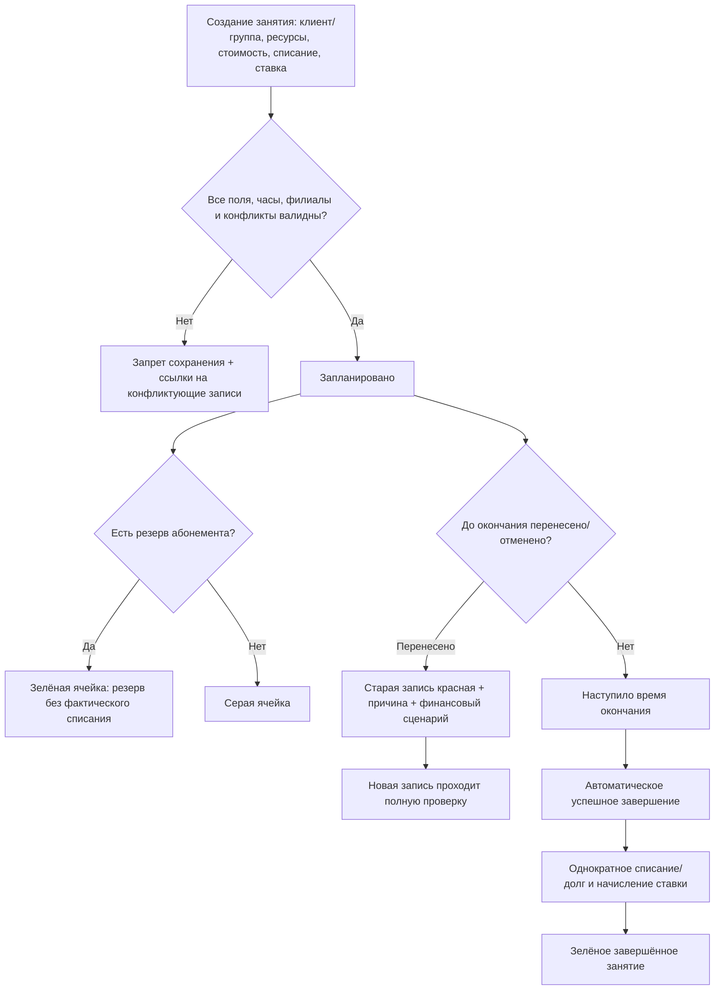
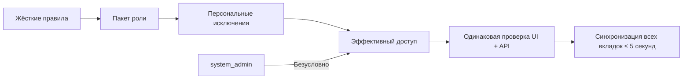
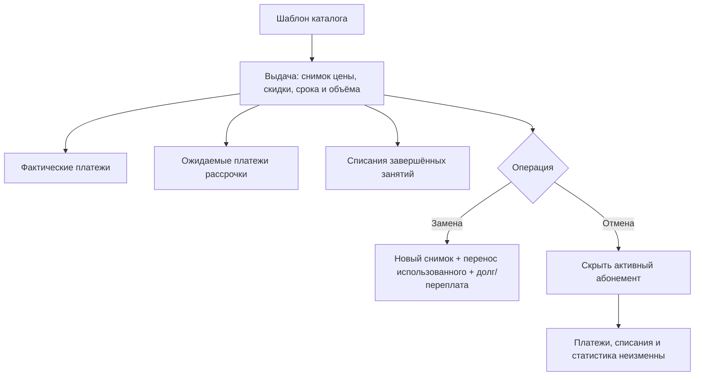
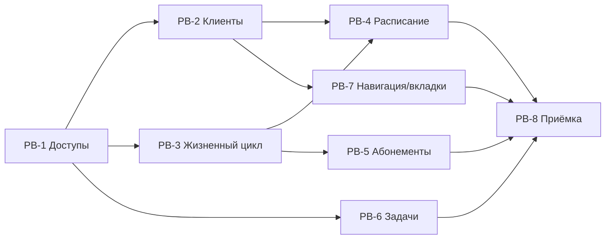

# MagicMusicCRM v4 — Product Requirements Document

| Поле | Значение |
|---|---|
| Статус | **Approved — утверждено владельцем продукта** |
| Версия документа | 4.0 |
| Дата | 2026-07-25 |
| Основание | ТЗ заказчика, 22 вложенных изображения, ответы владельца продукта, аудит Flutter/NestJS/production PostgreSQL |
| Назначение | Источник истины продуктовых требований `.anws/v4` для архитектуры, системного дизайна и технического checklist |
| Подтверждение | Явный апрув владельца продукта в текущей сессии от 2026-07-25 |

> Этот файл создан из утверждённой `docs/PRE-V4-PRODUCT-SPEC.md`. Требования и их смысл заморожены для v4; архитектура и задачи обязаны трассироваться к REQ этого документа.

---

## 1. Резюме

MagicMusicCRM должна получить непротиворечивую ролевую модель, автоматический жизненный цикл занятий без ручной посещаемости, безопасную работу с абонементами и финансами, строгую валидацию расписания, связанную навигацию между сущностями и многовкладочный desktop-интерфейс. Мобильная версия получает те же бизнес-правила, но остаётся одновкладочной.

## 2. Источники и приоритет решений

Если формулировки разных источников расходятся, применяется следующий порядок:

1. Последние ответы владельца продукта от 2026-07-25.
2. Дополнительные комментарии владельца продукта в текущем обсуждении.
3. Исходное ТЗ и приложенные изображения.
4. Уже утверждённые бизнес-правила проекта.
5. Текущее поведение кода — только исходное состояние, но не требование.

Зафиксированные итоговые решения:

- `system_admin` может делать всё без исключений, но скрыт из бизнес-интерфейса.
- Директор — старшая видимая бизнес-роль.
- Только Директор и `system_admin` меняют роли и персональные разрешения.
- Посещаемость полностью удаляется как редактируемая сущность.
- Занятия завершаются автоматически по времени.
- Преподаватель только просматривает своё расписание и не меняет занятия.
- Каталог абонементов управляется Директором и `system_admin`.
- Выданные клиенту абонементы обслуживают Администратор, Управляющий, Директор и `system_admin`.
- Клиент видит только собственные абонементы и финансовое движение.
- Преподаватель не получает контакты и финансовую информацию клиентов.
- Общая задача для нескольких сотрудников закрывается одним сотрудником для всех и не блокирует интерфейс.
- Внутренние вкладки реализуются только на ПК и восстанавливаются отдельно для каждого аккаунта.

## 3. Терминология

| Термин | Однозначное значение |
|---|---|
| Клиент | Общее значение в выборе занятия: существующий Ученик или Лид |
| Ученик | Клиент, переведённый в учебный процесс и имеющий карточку ученика |
| Лид | Потенциальный клиент до перевода в ученика |
| Шаблон абонемента | Запись каталога: название, объём, срок, базовая цена и применимость |
| Выданный абонемент | Снимок коммерческих условий шаблона, назначенный конкретному клиенту |
| Отмена абонемента | Скрытие/деактивация выданного абонемента без удаления платежей и без корректировки финансовой статистики |
| Личный счёт | Финансовый баланс конкретного клиента |
| Успешно завершённое занятие | Занятие, которое автоматически достигло времени окончания и до этого не было перенесено или отменено |
| Перенесённое занятие | Исходная завершённая запись с причиной переноса и ссылкой на новую запись занятия |
| Пробное занятие | Обычное занятие с независимым признаком `Пробное`; тип клиента не определяет этот признак |
| Пакет роли | Готовый системный набор доступов для роли |
| Персональное исключение | Явно включённый или выключенный Директором доступ конкретного пользователя поверх пакета роли |
| Разрешённый преподавателю комментарий | Конкретный комментарий, явно отмеченный сотрудником как видимый преподавателю; это не право менять роль или системные разрешения |
| Архивирование клиента | Скрытие записи из активной работы с сохранением связей, аудита и финансовой истории |

## 4. Проверенное текущее состояние

Аудит выполнен по Flutter-клиенту, NestJS API, фоновым процессам, WebSocket-событиям и production PostgreSQL без изменения production-данных.

| Область | Текущее состояние | Подтверждённый разрыв |
|---|---|---|
| Роли | Set-based проверки; Управляющий и Директор могут менять роли | Управляющий должен полностью потерять управление ролями и разрешениями |
| `system_admin` | Серверный bypass в основном существует | Полный доступ не гарантирован всеми frontend-маршрутами; роль видна в обычных списках |
| Персональные разрешения | Общей capability-модели нет | Нужны пакеты ролей и индивидуальные разрешения |
| Преподаватель | Может видеть форму посещаемости; может завершать пробные занятия | Любая ручная посещаемость и завершение должны исчезнуть |
| Посещаемость | Пять редактируемых статусов влияют на списание и зарплату | Посещаемость должна стать вычисляемой абстракцией из успешно завершённых занятий |
| Создание занятия | Отдельные поля `Ученик` и `Лид`; лид принудительно делает урок пробным | Нужен единый `Клиент`, независимый тумблер `Пробное` |
| Обязательность занятия | Преподаватель и филиал обязательны только на части UI; аудитория/API допускают пустые значения | Нужна одинаковая серверная обязательность для всех способов создания |
| Конфликты | Основная проверка охватывает преподавателя и аудиторию; есть `force`-обход | Нет полной проверки клиента, филиала, рабочих часов и назначений преподавателя |
| Филиалы преподавателей | В production 25 активных преподавателей и только одна заполненная связь преподаватель–филиал | Строгое ограничение нельзя включать до заполнения и проверки данных |
| Уроки | В истории 33 840 активных/неудалённых занятий; 4 376 без преподавателя и 2 без аудитории; будущие запланированные занятия заполнены | Исторические пропуски сохраняются, новые и будущие записи должны пройти строгую валидацию |
| Серии расписания | Базовые серии и кнопка создания расписания уже есть | Нужна единая логика конфликтов, переходов и отображения |
| Карточка клиента | Горизонтальный скролл и секция расписания частично реализованы | Нужна сквозная проверка мобильного UX и устранение дублирующего меню будущих занятий |
| Каталог абонементов | CRUD пакетов существует | Нужно закрепить доступ только Директору/`system_admin` |
| Выданные абонементы | Есть выдача и списание; нет полноценной замены/отмены | Нет скидки, рассрочки, контролируемой замены и требуемой отмены |
| Платежи | Метод оплаты — свободная строка | Нужны однозначные `Наличные`/`Безналичные` |
| Задачи | Один получатель, один срок, `dueAllDay` | Нет интервала, нескольких сотрудников, филиала/всех филиалов и общего закрытия |
| Навигация | Есть отдельные deep link-маршруты, переходы сделаны локально и несогласованно | Нет единого контекстного возврата и полного графа связанных сущностей |
| Desktop-вкладки | Отсутствуют | Нужны до 10 внутренних вкладок, восстановление и защита конкурентных изменений |
| Excel | Маршрут `.xlsx` возвращает SpreadsheetML/XLS | Excel показывает несоответствие формата и расширения |
| Проверки | Flutter analyze чистый, 400 Flutter-тестов прошли | Две server integration-suite не стартуют из-за отсутствующей локальной dev-зависимости; baseline нужно восстановить до v4 |

## 5. Цели, метрики и границы

### 5.1 Цели

- **G1:** У каждой роли есть один проверяемый пакет доступов, а персональные исключения применяются сервером и интерфейсом одинаково.
- **G2:** Преподаватель не получает ни через UI, ни через API финансовые или контактные данные клиентов.
- **G3:** 100% новых и изменяемых занятий проходят единую проверку обязательных полей, рабочих часов, филиалов и конфликтов.
- **G4:** Каждое занятие имеет детерминированное автоматическое завершение и не может породить двойное списание или двойное начисление.
- **G5:** Любая операция с выданным абонементом сохраняет фактические платежи и финансовую статистику.
- **G6:** С любой основной сущности можно перейти к связанным сущностям и вернуться с сохранением контекста.
- **G7:** На ПК один аккаунт безопасно работает максимум с 10 внутренними вкладками без потери или молчаливого перезаписывания данных.
- **G8:** Все заявленные мобильные исправления проверяются на реальном мобильном размере, а не только на desktop-layout.

### 5.2 Измеримые критерии успеха

| Метрика | Цель |
|---|---|
| Проверки ролевой матрицы | 100% разрешённых сценариев успешны; 100% запрещённых дают серверный отказ |
| Утечка контактов/финансов преподавателю | 0 чувствительных полей в UI и API-ответах |
| Ручные элементы посещаемости/завершения | 0 доступных элементов и 0 доступных mutation-endpoint для бизнес-ролей |
| Двойные финансовые операции | 0 дублей при повторном запросе, двойном клике или одновременных вкладках |
| Применение изменения доступа | Не позднее 5 секунд во всех активных вкладках аккаунта |
| Синхронный выход | Не позднее 2 секунд во всех вкладках/окнах данного аккаунта |
| Синхронизация изменённой записи между вкладками | Не позднее 2 секунд после подтверждённого сохранения |
| Desktop-вкладки | Стабильная работа с 10 вкладками |
| Мобильный свёрнутый фильтр задач | Не выше 56 px без открытой панели |
| Excel-выгрузка | 100% файлов `.xlsx` открываются без предупреждения о формате |

### 5.3 Что не входит

- **NG1:** Создание `.anws/v4`, ADR, системного дизайна и технических эпиков до продуктового апрува.
- **NG2:** Ручная посещаемость, статусы присутствия, причины пропуска или их отдельный интерфейс.
- **NG3:** Возможность преподавателя завершать, переносить, отменять или редактировать занятие.
- **NG4:** Внутренние вкладки на мобильных устройствах.
- **NG5:** Физическое удаление клиентов, платежей, списаний и финансового аудита.
- **NG6:** Автоматическое изменение старых выданных абонементов при изменении шаблона каталога.
- **NG7:** Возврат денег или автоматическая финансовая корректировка при отмене выданного абонемента.
- **NG8:** Отображение `system_admin` как обычной бизнес-роли.
- **NG9:** Полный rewrite приложения; существующие рабочие функции сохраняются и дорабатываются.

## 6. Ролевая модель

Иерархия:

`Клиент < Преподаватель < Администратор < Управляющий < Директор < system_admin`

`system_admin` — аварийная системная роль с безусловным доступом. В обычной работе старшей видимой ролью остаётся Директор.

### 6.1 Пакеты ролей

| Возможность | Клиент | Преподаватель | Администратор | Управляющий | Директор | `system_admin` |
|---|---:|---:|---:|---:|---:|---:|
| Собственный профиль, расписание, ДЗ | Свои | Свои рабочие данные | Да | Да | Да | Да |
| ФИО клиента | Своё | Только назначенные клиенты | Да | Да | Да | Да |
| Телефон и контакты клиента | Только свои | **Нет** | Да | Да | Да | Да |
| История занятий и ДЗ клиента | Свои | Только назначенные клиенты | Да | Да | Да | Да |
| Внутренние комментарии | Нет | Только явно расшаренные | Да | Да | Да | Да |
| Просмотр расписания | Своё | Своё, read-only | Да | Да | Да | Да |
| Создание/перенос/отмена занятий | Нет | **Нет** | Да | Да | Да | Да |
| Ручная посещаемость/завершение | **Функции нет ни у одной роли** |
| Просмотр собственных абонементов и движений | Да | Нет | Да, в карточках клиентов | Да, в карточках клиентов | Да | Да |
| Финансы и абонементы других клиентов | Нет | **Нет** | В карточке клиента | В карточке клиента | Да | Да |
| Выдать/заменить/отменить абонемент клиента | Нет | Нет | Да | Да | Да | Да |
| Управлять каталогом абонементов | Нет | Нет | Нет | Нет | Да | Да |
| Общешкольные финансы и аналитика | Нет | Нет | Нет | Нет | Да | Да |
| Операционные задачи | Нет | Назначенные | Да | Да | Да | Да |
| Статусы и списки клиентов | Нет | Нет | По рабочему пакету | Да | Да | Да |
| Настраивать источники и поля | Нет | Нет | Нет | Нет | Да | Да |
| Архивировать Лида/Ученика | Нет | Нет | Нет | Нет | Да | Да |
| Менять роли и разрешения | Нет | Нет | Нет | Нет | Только роли ниже Директора | Всё |

### 6.2 Правила разрешений

- Пакеты ролей являются готовыми системными наборами, а не произвольными ролями.
- Директор может назначать роли строго ниже Директора: Клиент, Преподаватель, Администратор, Управляющий.
- Директор не создаёт, не назначает и не изменяет Директора или `system_admin`.
- `system_admin` может назначать и изменять любую роль.
- Управляющий полностью лишается изменения ролей и разрешений.
- Директор и `system_admin` могут для отдельного пользователя включить или выключить совместимые разрешения.
- При смене роли все персональные исключения сбрасываются на пакет новой роли после явного предупреждения.
- Жёсткие запреты нельзя обойти персональной галочкой: преподавателю нельзя выдать управление занятием, контакты или финансы; `system_admin` нельзя лишить доступа.
- Разрешение проверяется сервером на каждом чтении и изменении; скрытая кнопка не считается защитой.
- Изменения роли и разрешений применяются во всех активных вкладках не позднее 5 секунд.
- Каждое изменение роли/доступа содержит автора, цель, старое и новое значение, дату и причину в журнале действий.

### 6.3 Комментарии для преподавателя

- Комментарии скрыты от преподавателя по умолчанию.
- Администратор, Управляющий, Директор или `system_admin` может отметить конкретный комментарий как видимый преподавателю.
- Преподаватель видит такой комментарий только для назначенного ему ученика/группы.
- Разрешение конкретного комментария — контентное действие, а не право менять роль или capability.
- Изменение видимости комментария фиксируется в аудите.

## 7. Продуктовые требования

В каждом требовании указаны приоритет, пользовательская ценность, затронутые системы, автономная проверка и критерии приёмки.

### 7.1 Доступы, безопасность и аудит

#### [REQ-RBAC-001] Пакеты ролей и персональные исключения — P0

- **История:** Как Директор, я хочу назначать готовую роль и корректировать доступы конкретного сотрудника, чтобы управлять полномочиями без разработки новых ролей.
- **Ценность:** Единая контролируемая модель заменяет разрозненные frontend/backend-проверки.
- **Системы:** Flutter desktop/mobile, NestJS API, PostgreSQL, realtime-синхронизация.
- **Автономная проверка:** Матрица API и UI для шести ролей, включая разрешение/запрет одного capability.
- **Критерии:**
  - **Given** Управляющий, **When** он открывает пользователя или вызывает API смены роли, **Then** элементы управления отсутствуют, а API возвращает отказ.
  - **Given** Директор и пользователь более низкой роли, **When** Директор меняет пакет и персональные галочки, **Then** итоговый доступ применяется во всех сессиях и пишется в аудит.
  - Редактор показывает одну понятную галочку на capability, значение пакета роли и наличие персонального исключения.
  - **Given** смена роли, **When** Директор подтверждает предупреждение, **Then** старые персональные исключения удаляются.
  - При сетевой ошибке пакет и исключения не должны расходиться частичным сохранением.

#### [REQ-RBAC-002] Скрытый аварийный `system_admin` — P0

- **История:** Как владелец системы, я хочу иметь аварийный аккаунт с полным доступом, не смешивая его с бизнес-ролями.
- **Ценность:** Восстановление управления системой без расширения прав обычных сотрудников.
- **Системы:** Auth, Flutter router/navigation, все NestJS policies, пользовательские справочники, аудит.
- **Автономная проверка:** Полный маршрутный и API-smoke под `system_admin`, затем сравнение бизнес-списков под Директором.
- **Критерии:**
  - **Given** `system_admin`, **When** он открывает любой экран или выполняет любую системную/бизнес-операцию, **Then** действие разрешено.
  - **Given** любая другая роль, **When** открывается список пользователей или выбор роли, **Then** аккаунты и вариант роли `system_admin` не показываются.
  - Действия `system_admin` остаются различимыми в журнале аудита.
  - Нельзя деактивировать или понизить последнего активного `system_admin`.

#### [REQ-PRIV-001] Минимальные данные клиента для преподавателя — P0

- **История:** Как руководитель школы, я хочу скрыть от преподавателя контакты и финансы клиентов, оставив учебный контекст.
- **Ценность:** Защита клиентской базы и финансовой информации.
- **Системы:** Все клиентские API, Flutter-карточки, поиск, расписание, чат, экспорт.
- **Автономная проверка:** Перехват всех ответов teacher-сессии и поиск запрещённых полей/значений.
- **Критерии:**
  - **Given** назначенный преподаватель, **When** он открывает ученика, **Then** доступны ФИО, история занятий и ДЗ.
  - Телефон, email, мессенджеры, адреса, представители, платежи, баланс, абонементы, стоимость уроков и задолженность отсутствуют и в UI, и в payload.
  - Неназначенный преподаватель не получает карточку и историю ученика.
  - Видны только комментарии, явно разрешённые сотрудником.

#### [REQ-AUDIT-001] Единый журнал чувствительных действий — P0

- **История:** Как Директор, я хочу понимать, кто изменил доступ, клиента, занятие или абонемент.
- **Ценность:** Разбор спорных финансовых и операционных ситуаций без изменения статистики.
- **Системы:** API, PostgreSQL audit, интерфейс действий пользователя.
- **Автономная проверка:** Выполнение каждого чувствительного действия и сравнение до/после с журналом.
- **Критерии:**
  - **Given** уполномоченный сотрудник изменяет чувствительную сущность, **When** операция подтверждена, **Then** в журнале появляется одна связанная запись с полным контекстом изменения.
  - Аудируются роли/разрешения, источники/поля, архивирование клиентов, создание/перенос/отмена занятия, финансовые параметры, выдача/замена/отмена абонемента и закрытие общей задачи.
  - Запись содержит автора, время, сущность, действие, старое/новое значение и причину, если причина обязательна.
  - Отмена абонемента отражается только как действие над абонементом и не создаёт платёж, возврат или дублирующую финансовую запись.

### 7.2 Лиды, ученики и карточка клиента

#### [REQ-LEAD-001] Обязательные поля Лида и справочник источников — P0

- **История:** Как сотрудник, я хочу создавать Лида только с достаточными данными, чтобы воронка не содержала анонимные записи.
- **Ценность:** Корректная связь заявки, источника и последующей коммуникации.
- **Системы:** Flutter lead form, NestJS DTO/service, PostgreSQL.
- **Автономная проверка:** Создание Лида с каждым отсутствующим полем через UI и прямой API.
- **Критерии:**
  - **Given** форма нового Лида, **When** обязательное поле пусто или источник введён не из справочника, **Then** Лид не создаётся и пользователь видит ошибку соответствующего поля.
  - Обязательны имя, фамилия, телефон и источник.
  - Пробелы не считаются значением; телефон проходит нормализацию и валидацию.
  - Источник выбирается только из активного справочника; свободный ввод запрещён.
  - Сервер отклоняет неполную запись независимо от клиента.
  - Ошибка показывается у конкретного поля и не очищает введённые данные.

#### [REQ-LEAD-002] Уведомление именно о входящей заявке — P0

- **История:** Как ответственный сотрудник, я хочу получать уведомление о новой внешней заявке, а не о каждом ручном создании Лида.
- **Ценность:** Уведомления отражают новые обращения, а не внутреннюю работу CRM.
- **Системы:** Intake/webhook, Leads API, notifications, realtime.
- **Автономная проверка:** Одна внешняя заявка, повторная доставка того же события и ручное создание Лида.
- **Критерии:**
  - **Given** новая внешняя заявка, **When** событие принято впервые, **Then** ответственные сотрудники получают ровно одно уведомление.
  - Внешняя заявка создаёт ровно одно уведомление.
  - Повторная доставка той же заявки не создаёт дубль.
  - Ручное создание, импорт или конвертация не создают уведомление `Новая заявка`.
  - Создание Лида из уже уведомлённой заявки не отправляет второе уведомление.

#### [REQ-CFG-001] Источники и настраиваемые поля — P1

- **История:** Как Директор, я хочу управлять источниками и дополнительными полями без участия разработчика.
- **Ценность:** CRM соответствует текущим процессам школы и не накапливает устаревшие значения.
- **Системы:** Settings UI, API, PostgreSQL, формы Лида/Ученика.
- **Автономная проверка:** Создать, изменить, архивировать источник и дополнительное поле; проверить исторические записи.
- **Критерии:**
  - **Given** Директор и используемое справочное значение, **When** Директор архивирует его, **Then** старые записи сохраняют значение, а новые формы больше его не предлагают.
  - CRUD доступен только Директору и `system_admin`.
  - Используемый источник или поле архивируется, а не физически удаляется.
  - Архивное значение остаётся на старых записях, но отсутствует при новом выборе.
  - Системные обязательные поля нельзя удалить или сделать необязательными.
  - Дополнительное поле может быть обязательным, необязательным или архивным.

#### [REQ-CLIENT-001] Обязательный минимум Ученика — P0

- **История:** Как сотрудник, я хочу создавать Ученика с единым обязательным минимумом.
- **Ценность:** Расписание, связь и отчёты не зависят от неполных карточек.
- **Системы:** Flutter student forms, API, PostgreSQL.
- **Автономная проверка:** UI/API negative-тест для каждого поля.
- **Критерии:**
  - **Given** создание или конвертация Ученика, **When** отсутствует любое поле обязательного минимума, **Then** сервер отклоняет операцию без частично созданной карточки.
  - Обязательны имя, фамилия, телефон, филиал и статус клиента.
  - Требование действует для ручного создания и преобразования Лида.
  - Настраиваемые обязательные поля проверяются дополнительно.
  - Сохранение атомарно: частично созданный Ученик не появляется.

#### [REQ-CLIENT-002] Безопасное архивирование Лида и Ученика — P0

- **История:** Как Директор, я хочу убирать ошибочные или неактуальные записи без потери финансовой истории.
- **Ценность:** Чистая CRM без повреждения статистики и связанных данных.
- **Системы:** Client/Lead UI, API, PostgreSQL, аудит, отчёты.
- **Автономная проверка:** Архивирование несвязанного Лида, Лида с Учеником, Лида с платежом и Ученика с финансовой историей.
- **Критерии:**
  - **Given** Директор открывает архивирование клиента, **When** подтверждение допустимо по правилам связей, **Then** архивируется только выбранная запись, а финансовая и связанная история сохраняется.
  - Операция доступна только Директору и `system_admin`.
  - Перед подтверждением показываются связи: Ученик, занятия, абонементы, платежи и задачи.
  - Лид с платежами не архивируется.
  - Архивирование Лида не архивирует связанного Ученика.
  - Ученика с финансовой историей можно архивировать после расширенного предупреждения; история и статистика сохраняются.
  - Физическое удаление финансовых и связанных записей не выполняется.

#### [REQ-CLIENT-003] Карточка клиента и операционные показатели — P1

- **История:** Как Управляющий или Директор, я хочу быстро видеть состояние клиента и переходить к нужному действию.
- **Ценность:** Меньше поиска и ошибочных действий между несвязанными экранами.
- **Системы:** Flutter mobile/desktop, Clients API, navigation.
- **Автономная проверка:** Карточка с длинным набором вкладок, активным абонементом, будущими занятиями и разными статусами.
- **Критерии:**
  - **Given** карточка клиента на мобильном экране, **When** пользователь прокручивает вкладки и выбирает показатель, **Then** нужная секция или отфильтрованный связанный экран открывается без потери контекста.
  - Вкладки карточки прокручиваются горизонтально и не обрезаются на мобильном.
  - Активный абонемент показывает остаток, списания, пополнения и срок.
  - Кнопка `Создать расписание` доступна из карточки уполномоченному сотруднику.
  - Отдельное запутывающее подменю будущих занятий удалено; один список и расписание ведут к одной сущности занятия.
  - Управляющий и Директор видят количество клиентов по статусам и открывают отфильтрованный список.
  - Директор может персональным разрешением убрать доступ Управляющего к этому обзору.

### 7.3 Расписание и жизненный цикл занятия

#### [REQ-LESSON-001] Единая форма занятия — P0

- **История:** Как сотрудник, я хочу выбирать любого клиента в одном поле и задавать все условия занятия до сохранения.
- **Ценность:** Одинаковая логика для Лида и Ученика без скрытых автоматических допущений.
- **Системы:** Flutter lesson form, Schedule API, PostgreSQL.
- **Автономная проверка:** Создание обычного/пробного занятия для Лида и Ученика, а также группового занятия.
- **Критерии:**
  - **Given** форма занятия, **When** сотрудник выбирает Лида или Ученика в поле `Клиент` и задаёт тумблер `Пробное`, **Then** сохраняется одна однозначная ссылка на клиента и независимый признак пробного занятия.
  - Для индивидуального занятия используется одно поле `Клиент`, ищущее Учеников и Лидов; результат помечает тип записи.
  - Группа остаётся отдельным режимом, потому что не является Клиентом.
  - Тумблер `Пробное занятие` доступен независимо от типа Клиента.
  - Признак `Пробное` отображается в расписании, карточке клиента, деталях занятия, истории, задачах и связанных отчётах.
  - Обязательны Клиент/Группа, филиал, аудитория, преподаватель, дата, начало, длительность, тип/предмет занятия, стоимость, способ списания с клиента, ставка и способ оплаты преподавателю.
  - Один урок не может одновременно ссылаться на Лида, Ученика и Группу.
  - UI и прямой API применяют одинаковую валидацию.

#### [REQ-LESSON-002] Автоматическое завершение без посещаемости — P0

- **История:** Как школа, я хочу автоматически завершать прошедшие занятия и применять заранее заданные финансовые условия.
- **Ценность:** Списания и начисления не зависят от ручного действия преподавателя.
- **Системы:** Schedule lifecycle, finance, subscriptions, payroll, notifications, analytics.
- **Автономная проверка:** Прохождение времени окончания, повторный worker/event, обрыв во время операции и повторный запуск.
- **Критерии:**
  - **Given** неперенесённое и неотменённое занятие с наступившим временем окончания, **When** выполняется автоматическое завершение, **Then** занятие, списание и начисление фиксируются ровно один раз без ручной посещаемости.
  - Если запланированное занятие не перенесено и не отменено, после времени окончания оно автоматически становится успешно завершённым.
  - Завершение применяет снимок стоимости, способ списания, ставку и способ оплаты преподавателю, сохранённые на занятии.
  - Списание и начисление выполняются ровно один раз даже при повторном событии или конкурентном запуске.
  - Отсутствие статуса посещаемости не препятствует списанию и начислению.
  - Управляемой посещаемости, причин пропуска и кнопки завершения нет ни у преподавателя, ни у других сотрудников.
  - API не предоставляет бизнес-ролям операций чтения или изменения посещаемости.
  - Клиентская «посещаемость» отображается только как вычисляемое количество успешно завершённых занятий.
  - Существующие отчёты и подписи, использующие ручную посещаемость, переименовываются и считают только успешно автоматически завершённые занятия.
  - Исторические данные посещаемости сохраняются для совместимости, но не редактируются и не становятся источником новой логики.

#### [REQ-LESSON-003] Перенос, отмена и цветовые состояния — P0

- **История:** Как сотрудник, я хочу сразу понимать финансовый и операционный результат каждого занятия.
- **Ценность:** Цвет и статус отражают фактический жизненный цикл, а не ручную отметку посещаемости.
- **Системы:** Schedule UI, client lesson history, lesson lifecycle, finance.
- **Автономная проверка:** Запланированное занятие с/без остатка, успешное завершение, перенос и отмена.
- **Критерии:**
  - **Given** запланированное занятие, **When** меняется его покрытие или жизненный статус, **Then** цвет, подпись, резерв и финансовое поведение согласованно отражают новое состояние.
  - Будущие занятия резервируют доступные единицы активного абонемента в хронологическом порядке; резерв визуальный, фактическое списание происходит при завершении.
  - Занятие с достаточным резервом абонемента отображается зелёным.
  - Занятие без покрытия отображается нейтральным/серым.
  - Успешно завершённое занятие остаётся зелёным и дополнительно имеет текстовый/иконографический статус, чтобы значение не зависело только от цвета.
  - При переносе старая запись становится красной в общем расписании и разделе занятий карточки Клиента, содержит тип и обязательную причину переноса; создаётся ссылка на новое занятие.
  - При переносе сотрудник задаёт, списывается ли оплата с клиента и начисляется ли ставка преподавателю для исходного занятия.
  - Новое занятие проходит все проверки заново; старое не может повторно завершиться или списаться.
  - Остальные типы завершения используют существующую утверждённую палитру как единый справочник, но больше не называются посещаемостью.
  - Пополнение, замена или отмена абонемента пересчитывает только визуальный резерв будущих занятий и не переписывает уже завершённые.

#### [REQ-SCHED-001] Строгие конфликты расписания — P0

- **История:** Как сотрудник, я хочу получать запрет до создания конфликтующего занятия.
- **Ценность:** Исключаются двойные бронирования и физически невозможное расписание.
- **Системы:** Lesson form, drag-and-drop, series, Schedule API, PostgreSQL.
- **Автономная проверка:** Отдельный integration-test каждого конфликта на create/update/series.
- **Критерии:**
  - **Given** новое или изменяемое занятие пересекается по клиенту, преподавателю, аудитории либо филиалу, **When** сотрудник сохраняет его, **Then** сервер запрещает сохранение и возвращает контекст конфликтующих записей.
  - Запрещены пересечения одного Клиента у разных преподавателей.
  - Запрещены разные занятия одного преподавателя; несколько учеников допустимы только внутри одной групповой записи.
  - Запрещено пересечение занятий в одной аудитории.
  - Запрещено пересечение одного Клиента или преподавателя в разных филиалах.
  - Проверка применяется при создании, редактировании, переносе, drag-and-drop и создании серии.
  - Ошибка показывает тип конфликта, время и связанные записи с доступными контекстными переходами.
  - Бизнес-роли не обходят конфликт кнопкой `Создать всё равно`.
  - `system_admin` может выполнить аварийный override только с обязательной причиной и записью аудита.

#### [REQ-SCHED-002] Рабочие часы, недоступность и филиалы преподавателя — P0

- **История:** Как планировщик, я хочу видеть только реально доступное время и место работы преподавателя.
- **Ценность:** Расписание соответствует режиму школы и сотрудника.
- **Системы:** Teacher profile, branches, availability, Schedule API/UI.
- **Автономная проверка:** Урок внутри/вне часов, одноразовая/повторяющаяся недоступность, неверный филиал.
- **Критерии:**
  - **Given** преподаватель недоступен, филиал закрыт или преподаватель не назначен в филиал, **When** создаётся или переносится занятие, **Then** операция запрещается с указанием конкретного ограничения.
  - У каждого филиала есть рабочие интервалы по дням недели.
  - У преподавателя есть рабочие интервалы и одноразовые либо повторяющиеся периоды недоступности.
  - Повторяющаяся недоступность поддерживает конечную дату или режим без даты окончания.
  - Преподаватель назначается на один или несколько филиалов.
  - Создание занятия вне часов филиала, вне доступности преподавателя или в неназначенном филиале запрещается.
  - Перед включением запрета для существующих данных все активные преподаватели должны иметь подтверждённые филиалы; неполные записи попадают в отдельный список исправления.
  - Исторические занятия с неполными ссылками не удаляются и не переписываются.

#### [REQ-SCHED-003] Постоянное расписание и вход из карточки — P1

- **История:** Как сотрудник, я хочу создать повторяющееся расписание из карточки клиента и управлять всей серией.
- **Ценность:** Регулярные занятия создаются без повторного ввода и остаются связанными с клиентом.
- **Системы:** Client card, schedule series, Schedule API, navigation.
- **Автономная проверка:** Создание серии с конфликтом в середине, редактирование одного занятия и будущего хвоста.
- **Критерии:**
  - **Given** сотрудник запускает создание регулярного расписания из карточки, **When** вся серия проходит проверку, **Then** занятия создаются как связанная серия и открываются из карточки и расписания.
  - `Создать расписание` открывает форму с уже выбранным Клиентом.
  - Серия показывает период, дни, время, филиал, аудиторию, преподавателя и финансовые условия.
  - Перед созданием показываются все конфликтные даты; частично созданная серия не допускается без явного выбора допустимого сценария.
  - Из карточки можно открыть расписание на дате занятия и вернуться в ту же карточку/вкладку.
  - Поиск в расписании открывает карточку найденного Клиента, а не отдельную несвязанную копию.

#### [REQ-TEACHER-001] Расписание преподавателя — P0

- **История:** Как Преподаватель, я хочу удобную сетку своих уроков с окнами, чтобы планировать рабочий день.
- **Ценность:** Преподаватель получает ту же читаемость расписания без управленческих полномочий.
- **Системы:** Teacher Flutter UI, Schedule read API.
- **Автономная проверка:** Teacher-персона с разрывами между занятиями на мобильном и desktop.
- **Критерии:**
  - **Given** Преподаватель открывает своё расписание, **When** переключает `День`/`Неделя` и открывает занятие, **Then** он видит удобную read-only сетку и только разрешённый учебный контекст.
  - Доступны представления `День` и `Неделя`; `Месяц` и `Год` для преподавателя отсутствуют.
  - Видны свободные промежутки, время, филиал, аудитория, ФИО Клиента/название Группы и признак `Пробное`.
  - Сетка визуально и по управлению масштабом соответствует общему расписанию.
  - Drag-and-drop, создание, редактирование, перенос, отмена, посещаемость и завершение отсутствуют.
  - Открытие Клиента ведёт в ограниченную teacher-карточку согласно [REQ-PRIV-001].

### 7.4 Абонементы и финансовая логика

#### [REQ-SUB-001] Каталог шаблонов абонементов — P0

- **История:** Как Директор, я хочу управлять единым каталогом коммерческих пакетов.
- **Ценность:** Цены и условия контролируются старшей бизнес-ролью.
- **Системы:** Settings/catalog UI, Subscription API, PostgreSQL.
- **Автономная проверка:** CRUD под каждой ролью и проверка старого выданного абонемента после изменения шаблона.
- **Критерии:**
  - **Given** Директор изменяет шаблон каталога, **When** изменение сохранено, **Then** новые выдачи используют обновлённый шаблон, а старые выданные снимки не меняются.
  - Добавление, изменение, архивирование и восстановление шаблонов доступны только Директору и `system_admin`.
  - Администратор и Управляющий видят активные шаблоны при выдаче, но не изменяют каталог.
  - Изменение шаблона не меняет уже выданные абонементы.
  - Используемый шаблон архивируется с сохранением исторических ссылок.

#### [REQ-SUB-002] Выдача и замена абонемента клиента — P0

- **История:** Как операционный сотрудник, я хочу выдать или заменить абонемент прямо из карточки клиента.
- **Ценность:** Ошибки назначения исправляются без переписывания фактических платежей.
- **Системы:** Client card, Subscription API, finance, audit.
- **Автономная проверка:** Выдача, замена до/после использования, новая цена меньше/больше оплаченного.
- **Критерии:**
  - **Given** допустимая замена выданного абонемента, **When** сотрудник подтверждает предупреждение, **Then** условия и остаток пересчитываются, платежи сохраняются, а разница становится долгом или переплатой.
  - Операции доступны Администратору, Управляющему, Директору и `system_admin`.
  - Выдача создаёт снимок названия, объёма, срока, базовой цены, скидки и итоговой стоимости.
  - Замена после использованных занятий разрешена только после предупреждения с количеством использованных и будущих занятий.
  - Фактические платежи при замене не редактируются и не дублируются.
  - Использованные единицы переносятся в новый объём; если новый пакет меньше уже использованного, замена запрещается.
  - Разница между новой итоговой стоимостью и фактически оплаченным становится задолженностью или переплатой.
  - Операция атомарна и фиксируется в аудите.

#### [REQ-SUB-003] Скидка, рассрочка и способ оплаты — P0

- **История:** Как сотрудник, я хочу точно зафиксировать коммерческие условия клиента.
- **Ценность:** Выручка, долг и ожидаемые платежи не смешиваются.
- **Системы:** Subscription issue UI, payments, expected payments, reports.
- **Автономная проверка:** Процентная/фиксированная скидка, график рассрочки, частичная оплата наличными и безналично.
- **Критерии:**
  - **Given** сотрудник выдаёт абонемент со скидкой и рассрочкой, **When** суммы и даты валидны, **Then** фиксируется итоговая стоимость, график долга и отдельные фактические платежи с методом оплаты.
  - У одной выдачи применяется либо процентная, либо фиксированная скидка.
  - Для скидки обязательна причина.
  - Итоговая стоимость не может быть отрицательной.
  - Рассрочка содержит две или более части с суммой и датой; сумма частей равна итоговой стоимости.
  - В выручку входят только фактические платежи.
  - Неоплаченные части отображаются как ожидаемые платежи/задолженность.
  - Каждый фактический платёж имеет значение `Наличные` или `Безналичные`; свободный ввод не используется.
  - Повторная отправка запроса не создаёт второй платёж.

#### [REQ-SUB-004] Отмена выданного абонемента — P0

- **История:** Как сотрудник, я хочу убрать ошибочно выданный абонемент без нарушения финансовой статистики.
- **Ценность:** Карточка клиента очищается, но бухгалтерские факты остаются неизменными.
- **Системы:** Client card, Subscription API, finance, audit, schedule reservation.
- **Автономная проверка:** Отмена абонемента с платежами, списаниями и будущими занятиями.
- **Критерии:**
  - **Given** выданный абонемент с финансовой историей, **When** уполномоченный сотрудник подтверждает отмену, **Then** абонемент деактивируется, а платежи, списания и статистика остаются неизменными.
  - Операция доступна Администратору, Управляющему, Директору и `system_admin`.
  - Перед подтверждением показываются платежи, списания, остаток и будущие занятия.
  - Абонемент исчезает из активных и становится недоступен для новых списаний.
  - Платежи, списания, выручка, долг и исторические отчёты не меняются.
  - Не создаются возврат, корректирующий платёж или дублирующая запись.
  - Будущие занятия сохраняются, их визуальный резерв пересчитывается; при отсутствии покрытия применяется сохранённый на занятии способ списания.
  - Единственное новое отражение отмены — запись в действиях пользователя/аудите.

#### [REQ-SUB-005] Представление абонемента по ролям — P0

- **История:** Как Клиент, я хочу понимать собственный остаток, не раскрывая данные другим ролям.
- **Ценность:** Прозрачность личного счёта при соблюдении приватности.
- **Системы:** Client app/card, Subscription/Finance API.
- **Автономная проверка:** Один абонемент под Клиентом, Преподавателем и всеми staff-ролями.
- **Критерии:**
  - **Given** одна карточка клиента, **When** её открывают разные роли, **Then** каждая роль получает только разрешённый ей объём финансовой информации и действий.
  - Клиент видит собственный активный/исторический абонемент, пополнения, списания, остаток, долг и график рассрочки.
  - Клиент не изменяет финансовые записи.
  - Преподаватель не видит наличие абонемента, цену, остаток, списания, платежи или долг.
  - Администратор и Управляющий видят клиентский финансовый блок только внутри операционной карточки.
  - Общешкольные финансовые агрегаты доступны только Директору и `system_admin`.

### 7.5 Задачи

#### [REQ-TASK-001] Время и получатели задачи — P1

- **История:** Как сотрудник, я хочу назначать задачу на человека, несколько сотрудников, филиал или все филиалы.
- **Ценность:** Одна задача описывает общее операционное действие без ручного дублирования.
- **Системы:** Tasks UI/API, branch/staff directory, notifications, realtime.
- **Автономная проверка:** Задача на одного, нескольких, филиал и все филиалы; закрытие разными получателями.
- **Критерии:**
  - **Given** общая задача назначена нескольким получателям, **When** первый уполномоченный сотрудник закрывает её, **Then** одна общая задача становится завершённой для всех.
  - Задача имеет либо дату `Весь день`, либо дату, время начала и время окончания.
  - Окончание строго позже начала.
  - Поддерживаются один/несколько сотрудников, филиал и все филиалы.
  - Для филиала задача видна текущим уполномоченным сотрудникам этого филиала.
  - Задача имеет одно общее состояние: первый уполномоченный получатель, нажавший `Закрыть задачу`, завершает её для всех.
  - Конкурентное закрытие создаёт один результат и одну запись аудита.
  - На карточке есть явная кнопка `Закрыть задачу`.

#### [REQ-TASK-002] Неблокирующие напоминания и мобильные фильтры — P1

- **История:** Как сотрудник, я хочу не пропускать задачу, но продолжать работу в CRM.
- **Ценность:** Напоминание не превращается в блокировку рабочих процессов.
- **Системы:** Flutter mobile/desktop, notifications, tasks realtime.
- **Автономная проверка:** Просроченная общая задача, закрытие другим сотрудником и мобильный экран малой высоты.
- **Критерии:**
  - **Given** открытая или просроченная задача, **When** сотрудник продолжает работу в CRM, **Then** напоминание остаётся заметным, но не блокирует интерфейс.
  - Напоминание и счётчик остаются заметными до общего закрытия задачи.
  - Модальное окно не блокирует остальной интерфейс.
  - После закрытия одним получателем напоминание исчезает у остальных через realtime.
  - Свёрнутый мобильный фильтр занимает не более 56 px; расширенные фильтры открываются отдельной прокручиваемой панелью.
  - Ошибка закрытия сохраняет задачу открытой и показывает повтор действия.

### 7.6 Связанные переходы и внутренние вкладки

#### [REQ-NAV-001] Единые контекстные переходы — P0

- **История:** Как пользователь любой роли, я хочу проваливаться в связанную запись и возвращаться в исходный контекст.
- **Ценность:** Работа строится вокруг сущностей, а не изолированных экранов.
- **Системы:** Flutter router, все основные feature-модули, permission checks.
- **Автономная проверка:** Каждый переход из матрицы раздела 8 под всеми применимыми ролями.
- **Критерии:**
  - **Given** пользователь открывает связанную сущность из рабочего экрана, **When** затем возвращается назад, **Then** исходный экран восстанавливает вкладку, фильтры, дату и позицию.
  - Связанная сущность открывается кликом по её имени/карточке либо через контекстное действие.
  - Возврат сохраняет дату расписания, фильтры, выбранную колонку, прокрутку и исходную вкладку.
  - Если доступа к цели нет, ссылка скрыта либо показывает понятное ограничение без утечки данных.
  - Один и тот же тип сущности открывается одинаковым экраном из всех источников.
  - Удалённая/архивная цель показывает безопасное состояние, а не пустое окно или бесконечную загрузку.

#### [REQ-NAV-002] Внутренние вкладки на ПК — P0

- **История:** Как сотрудник на ПК, я хочу одновременно держать открытыми несколько рабочих контекстов.
- **Ценность:** Можно сравнивать и обрабатывать записи без потери места работы.
- **Системы:** Flutter desktop shell/router/state, session sync, realtime.
- **Автономная проверка:** 10 вкладок разных типов, перезапуск, смена аккаунта, изменение одной записи в двух вкладках.
- **Критерии:**
  - **Given** один аккаунт работает с несколькими внутренними вкладками, **When** запись, сессия или порядок вкладок меняются, **Then** состояние синхронизируется без смешивания аккаунтов и молчаливой потери данных.
  - Вкладки располагаются у верхней грани приложения; одновременно открывается не более 10.
  - Вкладки перетаскиваются для изменения порядка.
  - При наведении появляется `⋯` с командами `Открыть в новой вкладке`, `Закрыть`, `Закрыть другие`; связанные элементы также имеют `Открыть в новой вкладке`.
  - Если сущность уже открыта, обычная команда фокусирует существующую вкладку; явная команда новой вкладки может открыть второй контекст.
  - При закрытии вкладки с несохранённой формой показывается предупреждение.
  - После перезапуска восстанавливаются вкладки, сущности, фильтры и выбранные даты, но не несохранённые формы.
  - Состояние хранится отдельно по аккаунту и не показывается следующему вошедшему пользователю.
  - Выход в одной вкладке/окне завершает сессию во всех вкладках и окнах этого аккаунта не позднее 2 секунд.
  - Обновление записи инвалидирует её копии в других вкладках; устаревшее сохранение не перезаписывает новую версию молча.
  - Повтор запроса или двойной клик не дублирует занятие, задачу, платёж или абонемент.

#### [REQ-NAV-003] Мобильный контекст без вкладок — P1

- **История:** Как мобильный пользователь, я хочу проходить те же связи через понятную историю экранов.
- **Ценность:** Мобильная версия сохраняет бизнес-полноту без desktop-паттернов.
- **Системы:** Flutter mobile router/navigation.
- **Автономная проверка:** Цепочка из четырёх связанных экранов и последовательный возврат.
- **Критерии:**
  - **Given** мобильный пользователь проходит цепочку связанных записей, **When** последовательно нажимает `Назад`, **Then** каждый предыдущий контекст восстанавливается в правильном порядке.
  - Внутренние вкладки и hover-меню отсутствуют.
  - Связанная запись открывается в текущем navigation stack.
  - `Назад` возвращает на исходный экран с фильтром, датой и прокруткой.
  - Deep link после входа открывает разрешённую цель и формирует корректный путь возврата.

### 7.7 Отчёты и выгрузки

#### [REQ-REPORT-001] Корректный Excel — P1

- **История:** Как Директор, я хочу открывать выгрузку без предупреждений Excel.
- **Ценность:** Отчёт можно использовать и передавать без ручного восстановления файла.
- **Системы:** Analytics export API, Flutter download, Excel compatibility tests.
- **Автономная проверка:** Открытие выгрузки в Microsoft Excel и проверка структуры OOXML.
- **Критерии:**
  - **Given** пользователь запрашивает Excel-выгрузку, **When** файл скачан и открыт в Microsoft Excel, **Then** формат, расширение и содержимое совпадают без предупреждений.
  - Файл с расширением `.xlsx` является настоящим Excel Open XML workbook.
  - MIME, расширение и содержимое совпадают.
  - Кириллица, даты, денежные значения и формулы открываются корректно.
  - CSV-выгрузки получают `.csv`, старый XML/XLS — только `.xls`, если такой формат сознательно сохраняется.

#### [REQ-REPORT-002] Статусы клиентов и финансовые границы — P1

- **История:** Как руководитель, я хочу перейти от показателя к списку записей, не раскрывая общие финансы лишним ролям.
- **Ценность:** Метрики становятся проверяемыми и операционно полезными.
- **Системы:** Dashboard/reports UI, analytics API, navigation, RBAC.
- **Автономная проверка:** Один набор данных под Управляющим, Директором и `system_admin`.
- **Критерии:**
  - **Given** показатель клиентов или финансов, **When** его открывает роль с соответствующим доступом, **Then** открывается связанный отфильтрованный список без раскрытия запрещённых агрегатов.
  - Управляющий, Директор и `system_admin` видят количество клиентов по статусам и открывают соответствующий список.
  - Директор может персонально отключить такой доступ Управляющему.
  - Управляющий и Администратор не получают общешкольную выручку, расходы, прогноз и финансовую аналитику.
  - Финансовая строка отчёта открывает связанную запись только для Директора/`system_admin`.

## 8. Матрица связанных переходов

| Исходный контекст | Связанные цели | Сохраняемый контекст | Ограничения |
|---|---|---|---|
| Общее расписание | Занятие, Клиент, Преподаватель, Группа, Аудитория, Филиал | Дата, вид, фильтры, прокрутка | По ролевому доступу |
| Расписание преподавателя | Занятие, ограниченная карточка Клиента, ДЗ | День/неделя, позиция времени | Только свои занятия и назначенные клиенты |
| Карточка Ученика | Расписание на дате, занятие, серия, ДЗ, задача, абонемент, платёж, связанный Лид | Открытая секция и прокрутка | Финансы скрыты от преподавателя |
| Карточка Лида | Пробное занятие, задача, комментарий, источник, статус, связанный Ученик | Колонка воронки, фильтр | Архивирование только Директор/`system_admin` |
| Детали занятия | Клиент/Группа, Преподаватель, Аудитория, Филиал, исходное/новое занятие переноса | Исходный экран и дата | Преподавателю read-only |
| Серия расписания | Все занятия серии, Клиент/Группа, конфликты | Период серии | Изменение только уполномоченным |
| Абонемент клиента | Шаблон, платежи, списания, будущие занятия | Карточка клиента | Шаблон редактирует только Директор/`system_admin` |
| Платёж/ожидаемый платёж | Клиент, выданный абонемент | Финансовый фильтр | Преподавателю недоступно |
| Задача | Связанный Клиент, Лид, занятие, получатель, филиал | Фильтры и статус доски | Только доступные сущности |
| Статусный показатель | Отфильтрованный список клиентов, карточка | Период, филиал, статус | Управляющий+ с персональными исключениями |
| Пользователь | Профиль, роль, разрешения, действия | Поиск/фильтр пользователей | Управление только Директор/`system_admin` |
| Запись аудита | Изменённая сущность | Фильтр, дата, автор | С учётом доступа к целевой сущности |

Для desktop каждая цель может открываться в текущей либо новой внутренней вкладке. Для mobile используется текущий navigation stack.

## 9. Ключевые сквозные сценарии

### 9.1 Занятие

### 9.2 Доступ пользователя

### 9.3 Абонемент

## 10. Продуктовые блоки работ

Это укрупнённые продуктовые блоки для согласования объёма. Они не являются техническими эпиками или оценёнными задачами.

| Блок | Результат | Требования | Зависимости |
|---|---|---|---|
| PB-1 Доступы и приватность | Пакеты ролей, персональные исключения, скрытый `system_admin`, teacher privacy | RBAC-001/002, PRIV-001, AUDIT-001 | Первый обязательный блок |
| PB-2 Клиенты и справочники | Валидные Лиды/Ученики, источники, поля, архивирование, карточка | LEAD-001/002, CFG-001, CLIENT-001/002/003 | После PB-1 |
| PB-3 Жизненный цикл занятия | Автозавершение, финансовые снимки, переносы, цвета, удаление посещаемости | LESSON-001/002/003 | После PB-1; до финансовых отчётов |
| PB-4 Расписание | Конфликты, часы, недоступность, филиалы, серии, teacher-grid | SCHED-001/002/003, TEACHER-001 | Требует исправленных связей преподаватель–филиал |
| PB-5 Абонементы и платежи | Каталог, выдача, замена, скидка, рассрочка, отмена | SUB-001…005 | После PB-1 и согласованного lifecycle урока |
| PB-6 Задачи | Интервалы, массовые адресаты, общее закрытие, mobile UX | TASK-001/002 | После PB-1 и справочника филиалов |
| PB-7 Навигация и desktop workspace | Контекстный граф, вкладки, восстановление, конкурентность | NAV-001/002/003 | После стабилизации идентификаторов сущностей |
| PB-8 Отчёты и приёмка | Валидный XLSX, статусные drilldown, role/UAT regression | REPORT-001/002 + все | Финальный сквозной gate |

Критический путь:

## 11. Совместимость и обязательная подготовка данных

- До строгой проверки филиала должны быть заполнены и подтверждены филиалы всех активных преподавателей.
- Для каждого будущего занятия должны быть определены преподаватель, аудитория, филиал, стоимость/способ списания и ставка/способ оплаты.
- Автоматическое завершение нельзя включать для legacy-занятия, пока его финансовые параметры нельзя однозначно определить.
- Исторические занятия без преподавателя или аудитории сохраняются и маркируются как legacy; они не блокируют просмотр истории.
- Старые записи посещаемости сохраняются на период миграции для сверки финансов, но новый интерфейс и новые операции их не используют.
- Платежи и списания сверяются до и после миграции: количество, сумма и связь с клиентом должны совпасть.
- Изменение шаблона абонемента не должно каскадно менять выданные снимки.
- Существующие источники и поля с данными архивируются безопасно.
- Перед созданием v4 восстанавливается воспроизводимый server baseline: typecheck и все test-suite должны стартовать в чистом окружении.
- Несогласованность текущего реестра v3, где `INT-S8` одновременно отмечен завершённым и оставшимся, должна быть устранена до генерации нового backlog.

## 12. Матрица трассировки исходных правок

| Исходная правка | Покрытие |
|---|---|
| 2–10 окон/вкладок на ПК | REQ-NAV-002 |
| Обязательные ФИО, телефон, источник Лида | REQ-LEAD-001 |
| Источник только из списка | REQ-LEAD-001, REQ-CFG-001 |
| Уведомление о заявке, не о ручном Лиде | REQ-LEAD-002 |
| CRUD источников/полей Директором | REQ-CFG-001 |
| Обрезанные вкладки карточки | REQ-CLIENT-003 |
| Каталог шаблонов абонементов | REQ-SUB-001 |
| Изменение/отмена выданного абонемента | REQ-SUB-002/004 |
| Скидка | REQ-SUB-003 |
| Рассрочка и наличные/безналичные | REQ-SUB-003 |
| Обязательные поля Ученика | REQ-CLIENT-001 |
| Создать расписание из карточки | REQ-SCHED-003 |
| Одно поле Клиент вместо Ученик/Лид | REQ-LESSON-001 |
| Пробное как независимый тумблер и маркер | REQ-LESSON-001 |
| Переход расписание ↔ карточка | REQ-NAV-001, REQ-SCHED-003 |
| Обязательные ресурсы занятия | REQ-LESSON-001 |
| Рабочие часы школы/преподавателя | REQ-SCHED-002 |
| Разовая/бессрочная недоступность | REQ-SCHED-002 |
| Один/несколько филиалов преподавателя | REQ-SCHED-002 |
| Все типы конфликтов | REQ-SCHED-001 |
| Ошибка формата Excel | REQ-REPORT-001 |
| Количество/списки клиентов по статусам | REQ-CLIENT-003, REQ-REPORT-002 |
| Остаток активного абонемента | REQ-CLIENT-003, REQ-SUB-005 |
| Удаление дублирующего будущего меню | REQ-CLIENT-003 |
| Дата/интервал/получатели задач | REQ-TASK-001 |
| Закрыть задачу и mobile-фильтр | REQ-TASK-001/002 |
| Teacher-grid День/Неделя | REQ-TEACHER-001 |
| Удаление Лида/Ученика | REQ-CLIENT-002 |
| Завершение только после времени | REQ-LESSON-002 |
| Удаление контроля посещаемости/завершения у преподавателя | REQ-LESSON-002, REQ-TEACHER-001 |
| Пакеты ролей и персональные галочки | REQ-RBAC-001 |
| Только Директор меняет роли/доступы | REQ-RBAC-001 |
| Полный скрытый `system_admin` | REQ-RBAC-002 |
| Отмена абонемента не меняет статистику | REQ-SUB-004, REQ-AUDIT-001 |
| Цвета, перенос и финансовый сценарий занятия | REQ-LESSON-002/003 |
| Общая задача без блокировки | REQ-TASK-001/002 |
| Сквозные проваливания по всем экранам | REQ-NAV-001/003, раздел 8 |
| Logout и защита race condition между вкладками | REQ-NAV-002 |
| Приватность преподавателя | REQ-PRIV-001, REQ-SUB-005 |

## 13. Финальная проверка качества

### 13.1 Десять измерений неопределённости

| Измерение | Статус | Основание |
|---|---|---|
| Границы функций | Clear | Goals, Non-Goals и продуктовые блоки определены |
| Модель данных | Clear | Разведены шаблон/выданный абонемент, Клиент/Лид/Ученик, жизненный цикл занятия |
| UX и интерфейс | Clear | Формы, цвета, вкладки, mobile и ошибки описаны |
| Нефункциональные требования | Clear | Приватность, синхронизация, лимиты и идемпотентность измеримы |
| Зависимости | Clear | Роли, филиалы, legacy-данные и финансовые связи перечислены |
| Граничные случаи | Clear | Конфликты, повторные события, замена/отмена, архивные записи покрыты |
| Компромиссы | Clear | Mobile без вкладок; отмена без возврата; historic attendance сохраняется только для совместимости |
| Терминология | Clear | Раздел 3 является словарём документа |
| Сигналы готовности | Clear | У каждого REQ есть автономная проверка и Given/When/Then |
| Заглушки | Clear | Служебные заглушки и метки незакрытых вопросов отсутствуют |

### 13.2 Шесть контрольных проходов

| Pass | Результат | Исправление/вывод |
|---|---|---|
| A — дубликаты | 0 нерешённых | Повторяющиеся требования по посещаемости, завершению и teacher-доступу объединены |
| B — неопределённости | 0 нерешённых | Разведены каталог и выданный абонемент; задача определена как общая и неблокирующая |
| C — детализация | Пройдено | Все REQ имеют приоритет, ценность, системы, тест и критерии |
| D — согласованность | Пройдено | Ролевая матрица, privacy и финансовые границы едины |
| E — покрытие | 100% исходных правок | Матрица раздела 12 не содержит сирот |
| F — гранулярность | Пройдено для продуктового уровня | Техническое дробление сознательно отложено до апрува |

Критических, высоких, средних или низких нерешённых находок в текущей продуктовой постановке нет.

## 14. Definition of Done будущей реализации

- Все REQ и их критерии приёмки реализованы.
- Серверная и клиентская матрицы доступа для шести ролей зелёные.
- Teacher privacy проверена по UI, API payload, deep links, поиску и экспорту.
- Ни одного доступного элемента ручной посещаемости или завершения занятия не осталось.
- Финансовая сверка до/после миграции не показывает изменения исторических платежей и списаний.
- Автоматическое завершение и общая задача устойчивы к повтору и конкурентным запросам.
- Все новые/изменяемые занятия проходят строгую валидацию.
- Desktop проходит сценарий с 10 вкладками, восстановлением, logout-sync и конфликтом редактирования.
- Мобильные сценарии проверены на реальном устройстве.
- `.xlsx` открывается в Microsoft Excel без предупреждений.
- Flutter analyze/test и полный server typecheck/test проходят в чистом окружении.
- Выполнена UAT-приёмка владельцем продукта.

## 15. Статус утверждения и delivery gate

На момент создания v4:

- Открытые продуктовые вопросы: **нет**.
- Продуктовый апрув: **получен 2026-07-25**.
- Архитектура v4: **создаётся через `/genesis`**.
- Технический checklist: **создаётся через `/blueprint` после архитектуры и System Design**.

Обязательная последовательность:

1. Разработать архитектуру, модели данных и ADR без изменения смысла REQ.
2. Создать детальный System Design по каждой v4-системе.
3. Разбить продуктовые блоки на технические задачи и подпункты.
4. Провести отдельный review checklist по трассировке к этому документу.
5. Начинать реализацию только после прохождения v4 documentation gates.
