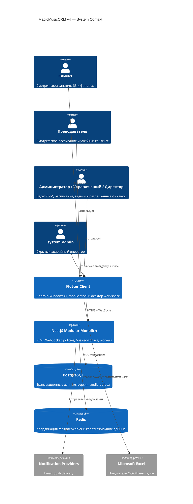
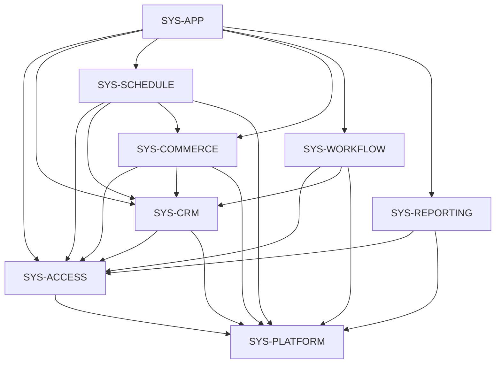

# MagicMusicCRM v4 — Architecture Overview

**Версия:** 4.0  
**Статус:** Accepted  
**Дата:** 2026-07-25  
**PRD:** [`01_PRD.md`](01_PRD.md)  
**Предыдущая архитектура:** `.anws/v3` (owned backend runtime)

## 1. Архитектурная цель

v4 не меняет production-стек и не создаёт микросервисы. Она разделяет существующий Flutter-клиент и NestJS modular monolith на проверяемые bounded contexts, чтобы сервер оставался источником истины для доступа, жизненного цикла занятий, финансов и конкурентных изменений.

Главный принцип:

> UI отображает и инициирует действия; сервер авторизует и применяет бизнес-инварианты; PostgreSQL фиксирует атомарный результат; realtime только инвалидирует уже подтверждённое состояние.

## 2. Контекст системы



## 3. Архитектурные системы

v4 содержит восемь систем. Backend-системы являются модулями одного NestJS deployment, а не отдельными сервисами.

### SYS-APP — Flutter Client & Workspace

- **Ответственность:** Android/Windows UI, ролевое представление, mobile navigation stack, desktop workspace до 10 вкладок, локальное состояние форм и отображение realtime-инвалидаций.
- **Не отвечает за:** окончательное разрешение доступа, финансовые расчёты, завершение занятия, проверку конфликтов.
- **Корни кода:** `lib/core/workspace/`, `lib/core/navigation/`, `lib/features/`, `lib/core/services/`.
- **Стек:** Flutter, Dart, Riverpod, GoRouter, Socket.IO client.
- **Входы:** пользовательские действия, REST-ответы, realtime invalidation.
- **Выходы:** типизированные команды API с idempotency/version metadata.

### SYS-ACCESS — Identity, Capabilities & Privacy

- **Ответственность:** пакеты ролей, capability registry, персональные overrides, hard invariants, `system_admin`, actor-aware projections, session/permission invalidation, аудит доступа.
- **Не отвечает за:** бизнес-расчёты CRM и финансов.
- **Корни кода:** `server/src/common/security/`, `server/src/profile/`, целевой `server/src/access-control/`.
- **Стек:** NestJS guards/policies, PostgreSQL, JWT/refresh sessions, realtime invalidation.
- **Входы:** actor, role, capability, target resource.
- **Выходы:** allow/deny, безопасная проекция данных, access-version events.

### SYS-CRM — Clients, Leads & Configurable Fields

- **Ответственность:** Lead, Student, конвертация, источники, custom fields, статусы, архивирование, client comments и связи.
- **Не отвечает за:** расписание, списания, агрегированную аналитику.
- **Корни кода:** текущий `server/src/crm/` с целевым срезом `server/src/crm/clients/`; Flutter `lib/features/manager/` и клиентские карточки `lib/features/admin/`.
- **Входы:** валидированные client commands и actor scope.
- **Выходы:** ClientRef, client projections, domain events об архивировании/изменении.

### SYS-SCHEDULE — Schedule, Constraints & Lesson Lifecycle

- **Ответственность:** Lesson/LessonSeries, единый ClientRef, required fields, рабочие часы, teacher availability/branches, conflict engine, перенос/отмена, subscription reservation, автоматическое завершение.
- **Не отвечает за:** хранение шаблонов абонементов и расчёт общешкольных отчётов.
- **Корни кода:** текущие `server/src/crm/schedule*.ts`, `server/src/crm/attendance*.ts`, целевой `server/src/crm/schedule/`; Flutter schedule widgets.
- **Входы:** create/update/reschedule commands, clock ticks, client/resource references.
- **Выходы:** lesson state, constraint violations, atomic completion request к SYS-COMMERCE, post-commit domain events.

### SYS-COMMERCE — Subscriptions, Payments & Compensation

- **Ответственность:** SubscriptionPackage, IssuedSubscription snapshots, скидка, рассрочка, ActualPayment, долг/переплата, замена/отмена, client write-off и teacher compensation.
- **Не отвечает за:** выбор времени и ресурса занятия, UI workspace.
- **Корни кода:** текущие finance/subscription/payroll части `server/src/crm/`, целевой `server/src/crm/commerce/`; Flutter finance/subscription surfaces.
- **Входы:** staff commands, lesson financial snapshot, payment command.
- **Выходы:** неизменяемые финансовые факты, balances, reservation availability, auditable result.

### SYS-WORKFLOW — Tasks, Reminders & Operational Realtime

- **Ответственность:** SharedTask, audience resolution, единое закрытие, напоминания, task realtime.
- **Не отвечает за:** глобальную авторизацию и client entity ownership.
- **Корни кода:** текущие task/notification части `server/src/crm/` и `server/src/notifications/`, целевой `server/src/crm/tasks/`; Flutter task widgets.
- **Входы:** task commands, branch/staff memberships, scheduler time.
- **Выходы:** task projections, reminder events, shared-close invalidation.

### SYS-REPORTING — Analytics, Status Views & Exports

- **Ответственность:** actor-scoped read models, client status drilldown, lesson-success metrics, school finance boundary, валидный OOXML.
- **Не отвечает за:** изменение источников данных.
- **Корни кода:** `server/src/analytics/`, report/dashboard slices `server/src/crm/`, Flutter report widgets.
- **Входы:** read-only query parameters, actor scope, transactional source data.
- **Выходы:** scoped JSON reports, navigation references, `.xlsx`.

### SYS-PLATFORM — Data, Events, Workers & Operations

- **Ответственность:** PostgreSQL migrations/constraints, transaction boundaries, record versions, idempotency keys, audit, outbox, worker claims, Redis coordination, deploy/rollback/monitoring.
- **Не отвечает за:** определение продуктовых ролей и форм.
- **Корни кода:** `server/src/database/`, `server/src/audit/`, `server/src/realtime/`, `server/migrations/`, `infra/`, `scripts/`.
- **Входы:** transactional writes и committed outbox events.
- **Выходы:** durable state, post-commit events, worker execution evidence.

## 4. Матрица границ

| Система | Основные входы | Основные выходы | Разрешённые зависимости | Запрещённое пересечение |
|---|---|---|---|---|
| SYS-APP | User input, API DTO, realtime invalidation | API commands, rendered states | ACCESS contracts, all read APIs | Локальное решение финансов/доступа |
| SYS-ACCESS | Actor/session/resource | Decision, safe projection, access event | PLATFORM | Business mutation без domain policy |
| SYS-CRM | Client commands | ClientRef, client events | ACCESS, PLATFORM | Прямые финансовые изменения |
| SYS-SCHEDULE | Lesson commands, clock | Lesson state/events, constraint errors | ACCESS, CRM, COMMERCE, PLATFORM | Списание вне общей transaction boundary |
| SYS-COMMERCE | Subscription/payment/lesson charge commands | Ledger facts, balance, availability | ACCESS, CRM, PLATFORM | Перезапись ActualPayment |
| SYS-WORKFLOW | Task commands, audience, clock | Shared task/reminders/events | ACCESS, CRM references, PLATFORM | Копирование task state каждому recipient |
| SYS-REPORTING | Scoped query | JSON/XLSX/read links | ACCESS, read models PLATFORM | Мутация source tables |
| SYS-PLATFORM | Domain transaction/outbox | Durable data, events, worker claim | Infra runtime | Знание UI или продуктовых ролей |

## 5. Граф зависимостей



Правила графа:

- Цикл SCHEDULE ↔ COMMERCE разрешён только как одна явная application transaction: SCHEDULE владеет lifecycle, COMMERCE применяет финансовый снимок.
- REPORTING читает подтверждённые данные и не вызывается из write-path.
- Realtime не является источником истины: событие отправляется только после commit.
- SYS-APP не может считать capability по имени роли без серверно-согласованного capability snapshot.

## 6. Критические transaction boundaries

### 6.1 Автоматическое завершение занятия

Одна transaction boundary:

1. Claim Lesson по id/version, если оно ещё `scheduled` и end time наступил.
2. Зафиксировать terminal success.
3. Применить ровно одно клиентское списание/долг.
4. Применить ровно одно начисление преподавателю.
5. Погасить reservation.
6. Записать audit/outbox.
7. После commit разослать invalidation.

Повторный worker или API retry возвращает ранее подтверждённый результат.

### 6.2 Перенос занятия

Одна transaction boundary содержит terminal state исходной записи, причину/финансовое решение, создание successor после полной constraint-проверки, обновление reservation и audit. Частичный перенос запрещён.

### 6.3 Замена/отмена абонемента

Замена создаёт новую версию коммерческого снимка и долг/переплату, не меняя ActualPayment. Отмена меняет только lifecycle IssuedSubscription и reservation; исторические факты неизменны.

### 6.4 Общая задача

Первый valid close атомарно переводит SharedTask в `closed`. Повторное или конкурентное закрытие возвращает тот же результат без второго audit/reminder event.

## 7. Physical project structure

Структура показывает целевые корни. Перенос существующих файлов выполняется инкрементально через facade-контракты, без big-bang rewrite.

```text
MagicMusicCRM/
├── lib/
│   ├── core/
│   │   ├── navigation/               # typed context links
│   │   ├── workspace/                # desktop tabs, restore, session sync
│   │   ├── security/                 # capability snapshot/display guards
│   │   └── services/                 # REST/WebSocket clients
│   └── features/
│       ├── auth/
│       ├── admin/
│       ├── manager/
│       ├── teacher/
│       ├── client/
│       └── messenger/
├── server/
│   ├── src/
│   │   ├── access-control/           # target v4 capability module
│   │   ├── crm/
│   │   │   ├── clients/              # leads, students, fields, comments
│   │   │   ├── schedule/             # lessons, constraints, lifecycle
│   │   │   ├── commerce/             # subscriptions, ledger, payroll
│   │   │   └── tasks/                # shared tasks
│   │   ├── analytics/                # scoped reports and OOXML
│   │   ├── realtime/                 # committed invalidations
│   │   ├── audit/
│   │   └── database/
│   └── migrations/
├── infra/                             # runtime, backup, monitoring
├── scripts/                           # migration/smoke helpers
└── .anws/v4/                          # v4 source of truth
```

## 8. Data ownership

| Данные | Владелец | Другие системы |
|---|---|---|
| RolePackage, override, access version | SYS-ACCESS | Читают effective snapshot |
| Lead, Student, Source, CustomField, Comment | SYS-CRM | Ссылаются по ID |
| Lesson, Series, Availability, Reservation | SYS-SCHEDULE | COMMERCE получает immutable snapshot |
| Package, IssuedSubscription, Payment, ledger, installment | SYS-COMMERCE | REPORTING читает projections |
| SharedTask, audience, close state | SYS-WORKFLOW | CRM предоставляет references |
| Read models/export jobs | SYS-REPORTING | Не владеют source facts |
| Audit, outbox, idempotency, versions | SYS-PLATFORM | Используются всеми write-системами |
| WorkspaceTab state | SYS-APP локально account-scoped | Сервер хранит только auth/domain state |

## 9. Требования к интерфейсам

- Все write-команды принимают idempotency key для пользовательских create/close/payment/lifecycle операций.
- Изменяемые агрегаты возвращают record version; stale write завершается conflict response с актуальной версией.
- API не возвращает Teacher запрещённые поля даже как `null`.
- Context links используют `{entityType, entityId, optionalFocus}` вместо передачи полной записи.
- Realtime event содержит entity reference, version и event type, но не чувствительные финансовые данные.
- Worker использует durable claim; процессный restart не теряет задачу.
- Export response обязан согласовывать MIME, расширение и фактический формат.

## 10. Трассировка требований к системам

| Requirement group | Primary | Supporting |
|---|---|---|
| REQ-RBAC / REQ-PRIV / REQ-AUDIT | SYS-ACCESS | APP, PLATFORM |
| REQ-LEAD / REQ-CFG / REQ-CLIENT | SYS-CRM | APP, ACCESS, PLATFORM |
| REQ-LESSON / REQ-SCHED / REQ-TEACHER | SYS-SCHEDULE | APP, ACCESS, CRM, COMMERCE, PLATFORM |
| REQ-SUB | SYS-COMMERCE | APP, ACCESS, SCHEDULE, PLATFORM |
| REQ-TASK | SYS-WORKFLOW | APP, ACCESS, CRM, PLATFORM |
| REQ-NAV | SYS-APP | ACCESS, all domain systems |
| REQ-REPORT | SYS-REPORTING | APP, ACCESS, PLATFORM |

## 11. Эволюция от v3

Сохраняется:

- Owned NestJS/PostgreSQL/Redis runtime.
- HTTPS/WebSocket/File/Auth инфраструктура.
- Flutter/Riverpod клиент.
- PostgreSQL migrations, audit и security gates.
- Текущие публичные API как compatibility façade на период миграции.

Изменяется:

- Ролевые set-проверки становятся capability-based.
- Attendance write-model выводится из active domain.
- Schedule conflict logic превращается в единый серверный constraint engine.
- Финансовые факты отделяются от lifecycle абонемента.
- Flutter navigation получает typed context graph и desktop workspace.
- Realtime становится единым механизмом invalidation для доступов, задач и вкладок.

## 12. Обоснование декомпозиции

- Восемь систем отражают разные владельцы инвариантов, но не создают восемь deployment units.
- SYS-SCHEDULE и SYS-COMMERCE разделены, потому что время/ресурсы и деньги имеют разные правила; их атомарное пересечение явно описано.
- SYS-ACCESS выделена из CRM, потому что privacy и capability применяются ко всем доменам.
- SYS-APP отделена от API, чтобы tab-local UX не становился серверной бизнес-логикой.
- SYS-REPORTING read-only, поэтому тяжёлые агрегации не проникают в transaction paths.
- SYS-PLATFORM удерживает сквозные механизмы и не дублирует доменные решения.

При росте объёма в 10 раз модули могут масштабироваться worker-пулами и read projections внутри существующего runtime. Выделение микросервисов рассматривается только при доказанной независимой нагрузке или deployment pressure и не входит в v4.

