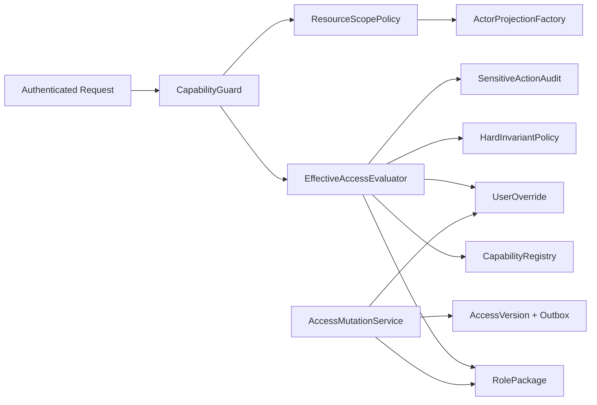
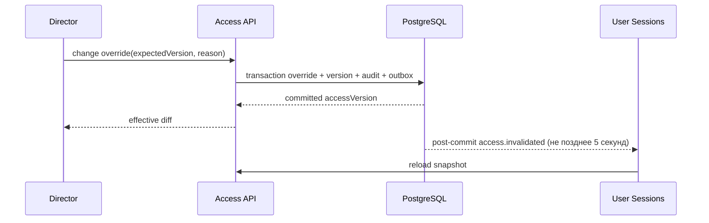

# SYS-ACCESS — Roles, Capabilities, Privacy & Audit

**Status:** Accepted  
**Requirements:** REQ-RBAC-001, REQ-RBAC-002, REQ-PRIV-001, REQ-AUDIT-001, REQ-SUB-005, REQ-TEACHER-001  
**ADR:** ADR-007, ADR-011, ADR-012

## 1. Назначение и границы

Система вычисляет effective access, защищает endpoints и формирует минимальные actor-aware projections. Она не реализует расписание или финансы, а предоставляет единый policy contract их модулям.

## 2. Иерархия и hard invariants

Бизнес-иерархия: `client < teacher < admin < manager < director`; отдельно скрытый root `system_admin`.

| Инвариант | Следствие |
|---|---|
| `system_admin` аварийно делает всё | Любая domain capability разрешена, действие аудируется |
| Role/override mutation только Director/sysadmin | Admin/Manager получают 403 и не видят controls |
| Director назначает только роль ниже себя | `director` и `system_admin` не назначаются им через business UI |
| `system_admin` управляет всеми ролями | Может назначить/изменить любую роль в emergency surface, но не деактивирует/понижает последнего active `system_admin` |
| Teacher schedule read-only | Ни override, ни роль не выдаёт schedule write/attendance/complete |
| Teacher client privacy | Нет contacts, finance, subscriptions; comments только shared |
| Client self-scope | Доступ только к собственным данным |

## 3. Компоненты

## 4. Capability namespace

Capabilities именуются `{domain}.{resource}.{action}`, например:

- `access.user.role.assign`, `access.user.override.manage`;
- `crm.client.read.basic`, `crm.client.read.contacts`, `crm.comment.read.shared`;
- `schedule.lesson.read.assigned`, `schedule.lesson.write`;
- `commerce.client_finance.read`, `commerce.school_finance.read`;
- `commerce.package.manage`, `commerce.subscription.issue`;
- `report.export.xlsx`.

Registry содержит `key`, description, domain, risk level, override mode (`allow_deny`, `deny_only`, `locked`) и version.

## 5. Модель данных

| Таблица | Ключевые поля | Правила |
|---|---|---|
| `capability_definitions` | key, version, override_mode, active | Append/versioned registry |
| `role_packages` | role, package_version, active | Один active package на role |
| `role_package_capabilities` | package_id, capability_key, effect | Unique pair |
| `user_capability_overrides` | user_id, capability_key, effect, reason, actor_id | Только Director/sysadmin |
| `user_access_versions` | user_id, version, changed_at | Monotonic |
| `audit_events` | actor, target, before, after, reason, request_id | Append-only |

Hard invariants находятся в code policy и тестовой матрице; они не редактируются из UI.

## 6. Контракты операций

| Операция | Capability/actor | Вход | Выход | Ошибки |
|---|---|---|---|---|
| Получить мой snapshot | authenticated | accessVersion | capability keys + scopes | 401 |
| Получить role package | Director/sysadmin | role | versioned package | 403/404 |
| Изменить role package | Director/sysadmin | expected version, changes, reason | new version | 403/409/422 |
| Назначить роль | Director/sysadmin + hierarchy invariant | user, role, reason, reset-overrides confirmation | user access version | 403/409/422 |
| Изменить override | Director/sysadmin + override mode | user, capability, effect, reason | effective diff | 403/409/422 |
| Проецировать Client | domain read allowed | actor + resource | safe DTO | 403/404 |
| Share comment with Teacher | staff with client/comment write | comment, boolean | versioned comment | 403/409 |

## 7. Effective access algorithm

1. Проверить authenticated actor и active user.
2. `system_admin` → hard allow, кроме технически невозможных операций; перейти к resource validation/audit.
3. Применить hard deny/allow invariant.
4. Найти effect role package.
5. Применить персональный override, только если registry разрешает. При смене роли прежние overrides атомарно сбрасываются после явного подтверждения.
6. Проверить self/assigned/branch/resource scope.
7. Выбрать projection profile и записать sensitive-action audit при необходимости.

Отсутствующий capability definition трактуется как deny (fail closed).

## 8. Privacy projections

| Actor | Client projection |
|---|---|
| Client | Собственные ФИО, занятия, ДЗ, абонемент/движения/остаток |
| Teacher | ФИО, его/разрешённая история занятий, ДЗ, shared comments |
| Admin/Manager | Операционные данные и финансы карточки клиента по scope |
| Director | Все бизнес-данные и school finance |
| system_admin | Полный аварийный projection |

Запрещённое поле отсутствует в JSON, OpenAPI actor contract и realtime payload — значение `null` не считается защитой.

## 9. Runtime и инвалидирование

При offline session новый запрет начинает действовать на следующем API request независимо от snapshot UI.

## 10. Ошибки, безопасность и наблюдаемость

- Fail closed при unknown capability/package version.
- Mutations rate-limited и требуют reason.
- Self-role mutation запрещена Director, разрешена `system_admin` только через emergency audited flow.
- Последнего active `system_admin` нельзя деактивировать или понизить.
- Метрики: deny count by capability/role, projection violations in tests, access invalidation lag, stale version conflicts.
- Alert: появление `system_admin` в обычном user list/nav или Teacher DTO с forbidden field.

## 11. Тестирование

- Table-driven unit matrix для 6 ролей × capabilities × scopes.
- Integration tests role/package/override version conflicts и audit.
- Schema/contract snapshots безопасных DTO.
- Negative direct HTTP tests, не только widget visibility.
- E2E: Director changes override, Manager cannot, открытая сессия теряет control.

## 12. Миграция и rollout

1. Снять inventory всех `@Roles`, nav guards и DTO.
2. Создать registry/packages с equivalent-or-stricter mapping.
3. Dual-evaluate старую и новую policy в shadow logs.
4. Исправить расхождения без расширения доступа.
5. Включить capability guards модуль за модулем.
6. Включить персональные overrides и access invalidation.
7. Удалить legacy set-based paths после actor-matrix parity.

## 13. Trade-offs и DoD

| Решение | Выигрыш | Цена |
|---|---|---|
| Code hard invariants | Нельзя снять запрет ошибочной галочкой | Изменение требует release |
| Projection per actor class | Минимальная утечка | Больше contract tests |
| Snapshot + server recheck | Быстрый UX и реальная защита | Нужна invalidation/version |

Готово, когда Actor Matrix зелёная, запрещённые поля отсутствуют, role/override UI доступен только Director/sysadmin, а все sensitive changes имеют before/after audit.
