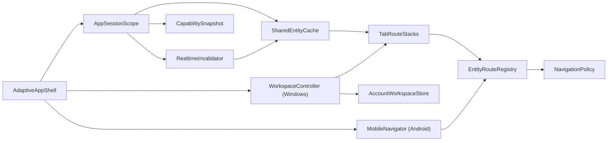
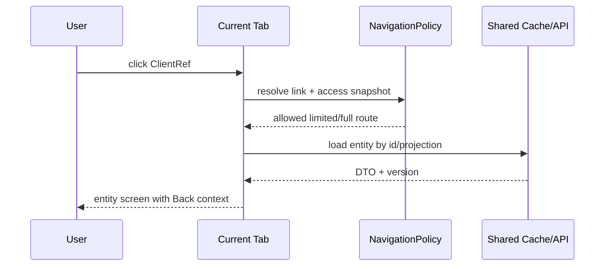

# SYS-APP — Flutter Client, Context Navigation & Desktop Workspace

**Status:** Accepted  
**Requirements:** REQ-NAV-001, REQ-NAV-002, REQ-NAV-003, REQ-RBAC-001, REQ-RBAC-002  
**ADR:** ADR-007, ADR-010, ADR-011, ADR-012

## 1. Назначение и границы

Система предоставляет единый Flutter UX на Android и Windows: типизированные связанные переходы, mobile navigation stack и desktop workspace с максимум 10 внутренними вкладками.

В границе: route registry, tab-local stack/form state, общий session/cache/realtime scope, восстановление workspace, conflict/dirty states. Вне границы: серверное решение доступа, проверка расписания, деньги и lifecycle domain entities.

## 2. Инварианты

- Entity route содержит ссылку `{entityType, entityId, focus?}`, а не копию доменной записи.
- Auth session, access snapshot, API cache и Socket.IO connection едины для workspace.
- Route stack и незавершённая форма принадлежат конкретной вкладке.
- Logout/access revoke сильнее persisted или dirty UI state.
- Windows: 1–10 вкладок; Android: tab strip отсутствует.
- Новое окно/переход открывается только если capability snapshot разрешает route, но API всё равно авторизует запрос.

## 3. Компоненты

| Компонент | Ответственность |
|---|---|
| `AppSessionScope` | token lifecycle, account id, accessVersion, общий API/realtime lifecycle |
| `WorkspaceController` | add/select/reorder/close/restore вкладки и лимит 10 |
| `TabRouteStack` | история маршрутов, display title, dirty form registry |
| `EntityRouteRegistry` | преобразование entity reference в route builder |
| `NavigationPolicy` | проверка snapshot и выбор full/limited projection route |
| `SharedEntityCache` | entity/version cache и stale markers |
| `RealtimeInvalidator` | дедупликация event id и invalidation cache |
| `AccountWorkspaceStore` | versioned persistence без domain DTO |

## 4. Контракты операций

| Действие | Предусловие | Вход | Выход | Ошибки/UX |
|---|---|---|---|---|
| Открыть связанную запись | Route зарегистрирован, snapshot допускает | `EntityLink`, target=current/new tab | Route push или новая вкладка | forbidden/unknown/deleted state |
| Открыть новую вкладку | Windows, count < 10 | EntityLink | Active tab | limit dialog при 10 |
| Перетащить вкладку | Windows | from/to index | Новый порядок persisted | Без domain write |
| Закрыть вкладку | Tab существует | tab id | Tab removed | dirty: Save/Discard/Cancel |
| Восстановить workspace | Auth account определён | account id + schema version | Валидные route refs | corrupt/old schema → safe default |
| Обработать invalidation | event committed и не seen | entity ref/version/event id | cache stale/refetch | dirty form → conflict banner |
| Logout | Любая вкладка | session event | Все tabs/cache/store очищены, login ≤2 s | Нельзя отменить dirty guard |

## 5. Модель состояния

`WorkspaceState` хранит `accountId`, `schemaVersion`, `activeTabId`, ordered `tabs`. `TabState` хранит `tabId`, `titleHint`, `routeStack<EntityLink>`, `dirtyFormKeys`. Sensitive DTO, tokens и финансовые payload в persistence не попадают.

`EntityCacheEntry` хранит server version, projection scope и fetched value только в памяти. Projection scope входит в cache key, чтобы teacher-safe DTO не смешивался с director DTO.

## 6. Runtime-потоки

### 6.1 Контекстный переход

### 6.2 Две вкладки редактируют одну запись

Первая вкладка сохраняет `expectedVersion=5`, сервер возвращает 6 и realtime invalidation. Вторая вкладка с dirty form остаётся на локальном вводе и показывает server-changed banner. Её save с version 5 получает typed `409`; пользователь reload/merge/cancel. Last-write-wins запрещён.

## 7. Ошибки и конкурентность

| Ситуация | Поведение |
|---|---|
| Entity архивирована | Tab остаётся с tombstone и ссылкой назад; write controls выключены |
| Capability отозвана | Cache projection удаляется, tab заменяется Forbidden и не восстанавливается |
| Realtime недоступен | Poll-on-focus/refetch; mutations остаются versioned |
| App crash | Восстанавливаются route refs, dirty field values не обещаются |
| Дублирован event | Ignored по event id/version |
| Session истекла | Один refresh pipeline; при fail — global logout |

## 8. Безопасность и приватность

- Route guard не считается security boundary.
- Запрещённые поля не сериализуются в local persistence/logs.
- Teacher route registry ведёт в limited client screen.
- `system_admin` emergency surfaces доступны по фактической роли, но отсутствуют в бизнес-nav остальных ролей.
- Screen capture/OS storage threat управляется общими v3 security gates.

## 9. Производительность и наблюдаемость

- Переключение уже загруженной вкладки: target p95 < 100 ms.
- Route open с API: skeleton ≤ 100 ms, timeout/retry state обязателен.
- Committed entity invalidation отражается в других вкладках не позднее 2 секунд; access invalidation — не позднее 5 секунд.
- Метрики: open tabs histogram, restore failures, stale conflicts, invalidation lag, duplicate events.
- Логи содержат account hash/tab id/route type/request id без domain payload.

## 10. Стратегия тестирования

- Unit: registry, serialization schema, limit, logout reducer, event dedupe.
- Widget: hover ellipsis, D&D, dirty close, forbidden/deleted/conflict states.
- Contract: каждая EntityLink из матрицы PRD разрешается в существующий route.
- Windows E2E: restore, two-tab conflict, logout propagation.
- Logout propagation между вкладками/окнами одного аккаунта завершается не позднее 2 секунд.
- Android E2E: connected drilldown/back stack без tab strip.

## 11. Миграция и rollout

1. Ввести EntityLink/registry поверх существующих routes.
2. Подключить shared cache/version semantics.
3. Включить desktop shell feature flag.
4. Перевести матрицу переходов по одному source screen.
5. Включить persistence после schema-version tests.
6. Удалить legacy ad-hoc dialog navigation после parity.

## 12. Trade-offs

| Решение | Выигрыш | Цена |
|---|---|---|
| Shared cache + tab-local forms | Единая истина без потери независимого ввода | Нужен conflict UX |
| Локальное account-scoped restore | Быстро, без нового backend sync | Нет переноса workspace между устройствами |
| Entity references вместо DTO | Нет stale/sensitive persistence | Нужен refetch при restore |

## 13. Definition of Done

- Все источники из PRD §8 имеют типизированный target и обратный путь.
- 10-tab limit, D&D, ellipsis, restore, dirty-close и logout покрыты тестами.
- Mobile не содержит desktop tab UI.
- Конкурентная запись никогда молча не перетирается.
