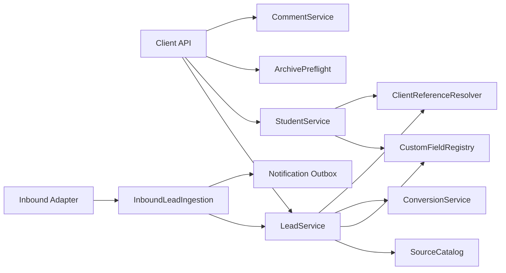
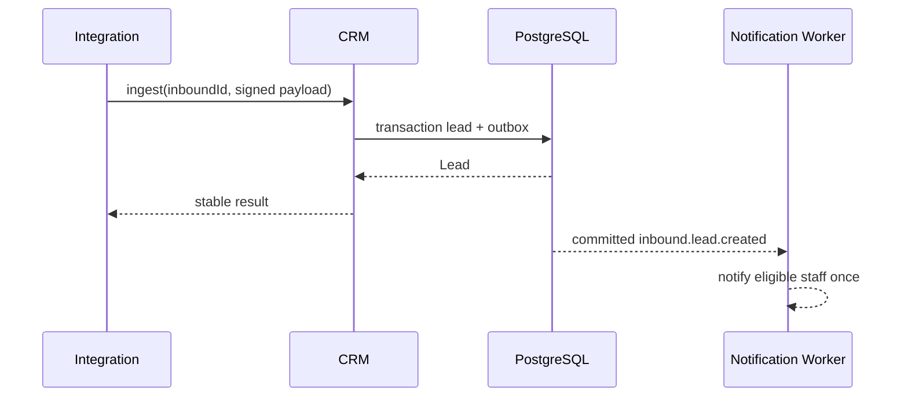

# SYS-CRM — Leads, Students, Configurable Fields & Client Card

**Status:** Accepted  
**Requirements:** REQ-LEAD-001, REQ-LEAD-002, REQ-CFG-001, REQ-CLIENT-001, REQ-CLIENT-002, REQ-CLIENT-003, REQ-PRIV-001, REQ-NAV-001  
**ADR:** ADR-007, ADR-011, ADR-012

## 1. Назначение и границы

Система владеет Lead/Student, источниками, custom fields, конвертацией, архивом, комментариями и операционной карточкой клиента. Она предоставляет `ClientRef` расписанию и задачам, но не владеет Lesson, Subscription или Payment.

## 2. Доменные инварианты

- Lead создаётся только с ФИО, телефоном и source id из active справочника.
- Student имеет обязательные идентификационные поля, определённые PRD; переход из Lead сохраняет связи.
- Единый `ClientRef = {type: lead|student, id}` не стирает различие жизненных циклов.
- Ручное создание Lead не считается входящей заявкой.
- Inbound lead notification создаётся один раз по ingestion id.
- Архивирование — soft archive с impact preview; связанные факты не удаляются cascade.
- После конвертации Student сохраняется, исходный Lead закрывается/удаляется только разрешённым Director flow.
- Комментарий teacher-visible только при явном флаге staff.

## 3. Компоненты

## 4. Модель данных

| Aggregate | Ключевые поля | Ограничения |
|---|---|---|
| Lead | id, fullName, normalizedPhone, sourceId, status, inboundId?, archivedAt, version | source active; inboundId unique when present |
| Student | id, fullName, phone, branchId, status, convertedFromLeadId?, archivedAt, version | required PRD minimum |
| LeadSource | id, name, active, version | name unique among active |
| CustomFieldDefinition | id, entityTypes, valueType, required, active, version | type immutable after values without migration |
| CustomFieldValue | definitionId, entityType/id, typed value | unique per definition/entity |
| ClientComment | client ref, body, sharedWithTeacher, author, version | audit share toggles |
| ConversionLink | leadId, studentId, convertedAt, actor | unique lead |

## 5. Контракты операций

| Операция | Actor | Вход | Выход | Ошибки |
|---|---|---|---|---|
| Create manual Lead | staff capability | required fields + source | Lead | 409 phone policy/422 |
| Ingest inbound Lead | signed integration | ingestion id + payload | Lead + notification event | duplicate returns same result |
| Manage Source/custom field | Director/sysadmin | versioned definition | new version | 403/409/422 |
| Create/Update Student | permitted staff | required fields/version | Student | 409/422 |
| Convert Lead | permitted business flow | lead/version + student data | Student + conversion link | 409 invalid state |
| Archive preview | Director/sysadmin | ClientRef | links/warnings/blockers | 403/404 |
| Archive | Director/sysadmin + confirm | ClientRef/version/reason | tombstone | 403/409/422 |
| Delete/close source Lead after conversion | Director/sysadmin | conversion link/reason | lead tombstone, Student unchanged | 403/409 |
| Toggle teacher comment share | staff | comment/version/boolean | comment projection | 403/409 |
| Load client card | actor scoped | ClientRef | projection + linked counts | 403/404 |

## 6. Карточка и read composition

Client card header содержит status, type, branch и context actions. Внутренние секции: overview, lessons, tasks, homework, comments, finance/subscription только при capability. Показатели «остаток активного абонемента», «следующее занятие», «количество по статусу» получаются batched read model, без N+1.

Teacher получает отдельный projection: ФИО, доступная история занятий, ДЗ, shared comments. Contacts и finance sections не запрашиваются.

## 7. Runtime-потоки

### 7.1 Входящая заявка

### 7.2 Архивирование

UI сначала запрашивает impact preview. Активные будущие занятия/задачи/абонементы показываются Директору/`system_admin` как предупреждения и требуют явного подтверждения или предварительного закрытия согласно типу связи; сервер не удаляет связанные финансовые/учебные факты. Повтор archive идемпотентен.

## 8. Ошибки и конкурентность

- Source деактивирован между form load/save → 422 с актуальным каталогом.
- Две конвертации одного Lead → unique constraint; вторая получает существующий Student reference.
- Изменение custom field type при существующих values → blocked migration-required error.
- Archived client сохраняет context links как tombstone.
- Phone normalization policy не должна молча объединять записи; совпадение даёт warning/explicit resolution.

## 9. Безопасность и аудит

- Resource scopes применяются до composition linked sections.
- Source/custom-field CRUD только Director/sysadmin.
- Contact fields не входят в teacher projection.
- Audit: conversion, archive/restore, source/field change, comment share, merge resolution.
- Inbound integration проверяет signature/replay window.

## 10. Производительность и наблюдаемость

- Client card: фиксированное число batched queries, target p95 < 500 ms на staging dataset.
- Метрики: inbound duplicates/failures, archive warnings, conversion conflicts, card query count/latency.
- Alert на notification outbox backlog и projection contract regression.

## 11. Тестирование

- Unit: required fields, phone normalization, ClientRef, archive rules.
- Integration: inbound idempotency, conversion uniqueness, soft archive links, custom typed values.
- Actor matrix: teacher/admin/manager/director/sysadmin/client projections.
- Widget/E2E: card tabs, warnings, linked navigation, source/field CRUD.

## 12. Миграция, trade-offs и DoD

Миграция backfill-ит source references, normalizes phones без автоматического merge, создаёт conversion links из существующей истории и сохраняет archived records. Сначала compatibility reads, затем strict required writes.

| Решение | Выигрыш | Цена |
|---|---|---|
| Polymorphic ClientRef | Единая форма занятия | Нужна строгая resolver validation |
| Soft archive + preview | Сохраняет историю | Больше lifecycle states |
| Typed custom fields | Валидация/отчёты | Изменение типа требует миграции |

Готово, когда все required поля валидируются сервером, inbound/manual семантика разделена, archive не удаляет связи, Teacher DTO безопасен, а переходы карточки соответствуют PRD §8.
