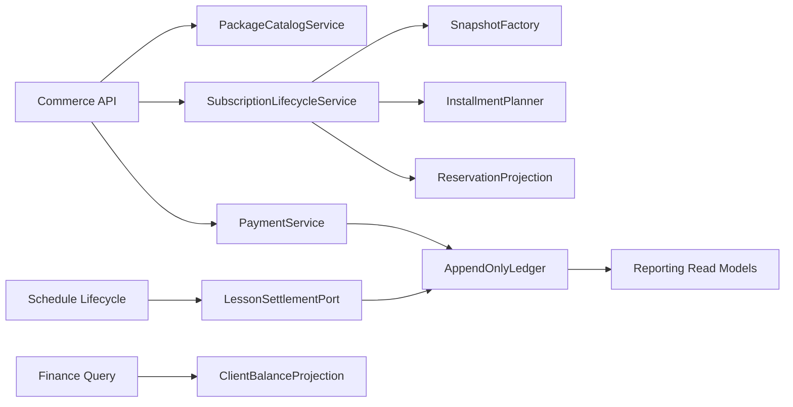
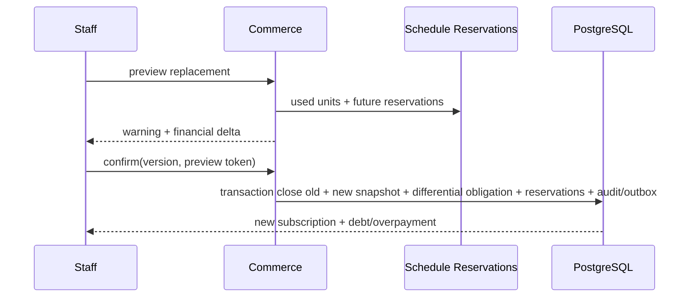

# SYS-COMMERCE — Subscription Catalog, Issuance, Ledger & Compensation

**Status:** Accepted  
**Requirements:** REQ-SUB-001, REQ-SUB-002, REQ-SUB-003, REQ-SUB-004, REQ-SUB-005, REQ-LESSON-002, REQ-LESSON-003, REQ-CLIENT-003, REQ-REPORT-002  
**ADR:** ADR-007, ADR-008, ADR-009, ADR-011, ADR-012

## 1. Назначение и границы

Система хранит каталог пакетов, immutable snapshot выданного абонемента, рассрочку, фактические платежи, обязательства, списания и начисления преподавателю. Она не выбирает время занятия и не меняет общие отчёты напрямую.

## 2. Финансовые инварианты

- ActualPayment и проведённые ledger facts не UPDATE/DELETE.
- Изменение каталога не меняет ранее выданный snapshot.
- Revenue = сумма фактических платежей, а не цена выдачи/рассрочки.
- Balance = фактические платежи + adjustments − obligations/write-offs по утверждённой модели.
- Replace/cancel не создают ActualPayment.
- Cancel не меняет исторические платежи, списания, выручку или долг.
- Любая money value хранится integer minor units + currency; округление едино.
- Teacher не получает finance/subscription projection.

## 3. Компоненты

## 4. Модель данных

| Entity | Ключевые поля | Инварианты |
|---|---|---|
| SubscriptionPackage | id, name, unitCount, validity, basePrice, active, version | CRUD Director/sysadmin |
| IssuedSubscription | id, clientId, packageId, snapshot JSON/columns, finalPrice, status, version | Snapshot immutable |
| Discount | type percent/fixed, value, reason | exactly one type; final ≥ 0 |
| Installment | issuedId, dueAt, amount, status | ≥2 when plan; sum = finalPrice |
| ActualPayment | id, clientId, issuedId?, amount, method cash/cashless, occurredAt, idempotencyRef | append-only |
| ObligationFact | id, client/issued, type, amount, sourceRef | append-only |
| LessonChargeFact | lessonId unique, subscription/writeoff result, amount/units | one per completion |
| TeacherCompensationFact | lessonId unique, teacher, type fixed/hourly/none, rate, duration, amount | one per completion; hourly = rate × LessonSnapshot duration, none = 0 |
| SubscriptionLifecycleEvent | issue/replace/cancel, before/after ids, actor, reason | audit link |

## 5. Контракты операций

| Операция | Actor | Вход | Выход | Ошибки |
|---|---|---|---|---|
| List active packages | Admin+ | filters | package summaries | 403 |
| Create/update/archive/restore package | Director/sysadmin | versioned package | package version | 403/409/422 |
| Issue subscription | Admin/Manager/Director/sysadmin | client, package, discount, installments, payment draft? | issued snapshot + balance | 403/409/422 |
| Preview replace | same | old/new package + current usage | used/future, debt/overpayment preview | 422 |
| Replace | same | preview token/version + confirm | new snapshot + differential obligation | 409/422 |
| Preview cancel | same | issued/version | payments/writeoffs/balance/future lessons | 404 |
| Cancel | same | version + reason + confirm | cancelled lifecycle + reservation recalc | 409 |
| Record payment | permitted staff | amount, cash/cashless, idempotency key | ActualPayment | 409 key mismatch/422 |
| Settle completed lesson | internal Schedule port | lesson snapshot/idempotency | charge + compensation facts | stable duplicate result |
| Read own finance | Client self | self | own subscription/movements/balance | 403 |

## 6. Выдача и рассрочка

Snapshot включает display name, units, validity, base price, discount type/value/reason, final price, installment schedule и коммерческие правила. Процентная и фиксированная скидка взаимоисключающие. Рассрочка содержит ≥2 частей, сумма равна final price; неоплаченные части являются expected obligations, а не revenue.

## 7. Замена

Использованные единицы переносятся. Если новый объём меньше использованного, операция блокируется. Фактически оплаченная сумма не копируется в новую payment row; balance projection связывает facts клиента с новым obligation lifecycle.

## 8. Отмена

Отмена деактивирует issued subscription и новые списания из него. Future lessons не удаляются: reservation снимается, их сохранённый write-off rule применяется при completion (например, личный счёт/долг). В active UI абонемент исчезает; единственный новый исторический факт — lifecycle/audit event.

## 9. Доступ и projections

| Actor | Каталог | Выдача/replace/cancel | Client finance | School finance |
|---|---|---|---|---|
| Client | — | — | own read-only | — |
| Teacher | — | — | — | — |
| Admin | active list | yes | client card | — |
| Manager | active list | yes | client card | — |
| Director | manage | yes | yes | yes |
| system_admin | manage | yes | yes | yes |

## 10. Ошибки, конкурентность и observability

- Двойной payment request: тот же key/fingerprint возвращает тот же payment; другой payload → 409.
- Одновременные replace/cancel: expected version допускает только одну.
- Completion и cancel race сериализуются блокировкой issued/reservation aggregate; сохранённый lesson snapshot гарантирует определённый outcome.
- Metrics: ledger write failures, duplicate suppression, balance reconciliation drift, cancelled active leak, installment overdue counts.
- Alert на любой non-zero reconciliation drift и duplicate lesson fact constraint.

## 11. Тестирование

- Unit: discount bounds, installment sums, rounding, differential debt/overpayment.
- PostgreSQL integration: replace/cancel/payment concurrency, append-only guards, lesson settlement rollback.
- Actor matrix: catalog and projections.
- Reconciliation: totals before/after migration and each release fixture.
- E2E: issue with discount/installments, replace after usage, cancel with future lessons, client self-view.

## 12. Миграция и rollout

1. Снять финансовый baseline по payments/writeoffs/balances/revenue.
2. Создать snapshots из package + current issued data, пометить incomplete rows.
3. Backfill ledger references без создания новых экономических фактов.
4. Dual-read сравнение balance projections.
5. Включить new writes по feature flag.
6. Провести reconciliation; только нулевой необъяснённый drift разрешает cutover.

## 13. Trade-offs и DoD

| Решение | Выигрыш | Цена |
|---|---|---|
| Append-only facts | Аудит и стабильная статистика | Исправления только компенсациями |
| Snapshot columns/JSON | История условий | Дублирование каталожных данных |
| Atomic replace | Нет промежуточной финансовой ошибки | Более сложная transaction |

Готово, когда права совпадают с матрицей, old snapshots не меняются, replace/cancel не создают payment, future lessons сохраняются, а reconciliation не показывает drift.
