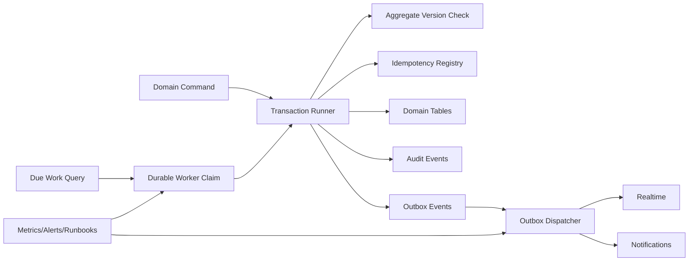
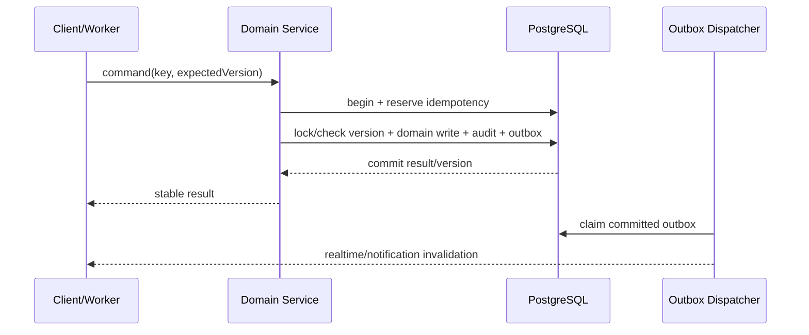

# SYS-PLATFORM — Transactions, Versions, Idempotency, Workers & Operations

**Status:** Accepted  
**Requirements:** REQ-AUDIT-001, REQ-LESSON-002, REQ-LESSON-003, REQ-SUB-002, REQ-SUB-003, REQ-SUB-004, REQ-TASK-001, REQ-NAV-002, REQ-LEAD-002  
**ADR:** ADR-001…006, ADR-008…012

## 1. Назначение и границы

Система предоставляет общие механизмы целостности: PostgreSQL transactions/constraints, aggregate versions, idempotency registry, audit, transactional outbox, worker claims, monitoring, migration и rollback. Она не содержит продуктовую логику ролей/денег/занятий.

## 2. Инварианты

- Domain state, audit и outbox фиксируются одним commit.
- Realtime/notification публикуются только из committed outbox.
- Retry mutation с тем же key/fingerprint не создаёт новый effect.
- Stale expected version не перезаписывает агрегат.
- Worker restart не теряет due work; два worker не совершают effect дважды.
- Migration имеет forward/compatibility/rollback-or-compensation plan и preflight.
- Sensitive data не попадает в logs/events.

## 3. Компоненты

## 4. Shared data contracts

| Store | Ключевые поля | Retention/constraint |
|---|---|---|
| `idempotency_records` | actor, operation, key, fingerprint, status, resultRef | unique actor+operation+key |
| Aggregate row | id, version, updatedAt | version increment in write |
| `audit_events` | id, actor, action, target, before/after refs, reason, requestId, at | append-only |
| `outbox_events` | eventId, type, aggregate ref/version, safe payload, publishedAt, attempts | eventId unique |
| `worker_claims` or domain claim | work ref, claimedAt/by, attempts | reclaim after lease |
| `migration_runs` | version, checksum, started/completed, evidence | immutable record |

Финансовые `resultRef` сохраняются столько же, сколько факты; технический response payload может очищаться после retention window.

## 5. Контракты платформы

| Операция | Вход | Выход | Ошибки |
|---|---|---|---|
| Execute versioned mutation | actor, op, key, fingerprint, expectedVersion, callback | committed result/version | 409 stale/key mismatch |
| Append audit/outbox | transaction context + safe event | ids in same commit | transaction rollback |
| Dispatch outbox | claimed unpublished batch | publish marks/attempts | retry/backoff/dead-letter alert |
| Claim due work | query + worker id/lease | exclusive batch | reclaim stale lease |
| Run migration | checksum + preflight | applied version/evidence | stop and rollback/compensate |
| Reconcile dataset | named invariant/query | signed counts/diffs | non-zero gate failure |

## 6. Mutation sequence

Если процесс падает после commit и до HTTP response, retry получает stored result. Если падает до commit, idempotency reservation откатывается или reclaim-ится.

## 7. Worker semantics

Due work выбирается ограниченными batch с `FOR UPDATE SKIP LOCKED` или эквивалентным claim. Domain terminal/unique constraints — последняя защита. Clock source — server UTC. Backoff bounded exponential; poison work после порога остаётся видимым и вызывает alert, а не исчезает.

Redis ускоряет wake-up/coordination, но потеря Redis не отменяет PostgreSQL due work/outbox.

## 8. События и приватность

Event envelope: `eventId`, `type`, `occurredAt`, `aggregateType/id/version`, `requestId`, минимальный safe payload. Финансовые суммы, контакты и comment body не отправляются как generic realtime; подписчик refetch-ит actor-scoped API.

Access invalidation и logout/session events имеют высокий приоритет и очищают client cache.

## 9. Миграции и release

Для каждой schema/data migration:

1. backup + restore-readiness;
2. read-only preflight counts/violations;
3. additive schema;
4. backfill restartable batches;
5. compatibility reads/writes;
6. shadow compare/reconciliation;
7. switch flag;
8. observe metrics;
9. remove legacy only в отдельном release.

Destructive rollback, который теряет новые facts, запрещён; используется forward fix или заранее определённая compensation.

## 10. Безопасность, observability и SLO

- Existing v3 auth/file/deploy/security ADR остаются обязательными.
- DB roles least privilege; audit/outbox append paths ограничены.
- Metrics: outbox oldest age/attempts, due worker backlog, idempotency conflicts, transaction retries, migration progress, reconciliation drift.
- Correlation: request id → audit id → outbox event id → domain result.
- Alerts: duplicate unique fact, non-zero reconciliation, backlog threshold, repeated poison work, access event leak.

## 11. Тестирование

- Unit: fingerprints, event redaction, retry classification.
- PostgreSQL integration (реальная dependency): parallel versions/keys/claims, crash boundaries, unique facts.
- Migration tests from anonymized production-shaped snapshot.
- Fault injection: Redis unavailable, dispatcher restart, provider failure.
- Operational smoke: backup/restore, deploy, rollback/forward recovery, metrics/alerts.

## 12. Trade-offs и DoD

| Решение | Выигрыш | Цена |
|---|---|---|
| PostgreSQL как coordination truth | Atomicity рядом с domain facts | Выше DB contention, нужен batching |
| Outbox invalidation без payload | Privacy и consistency | Дополнительный refetch |
| Additive phased migration | Безопасный production rollout | Временная двойная схема |

Готово, когда реальные PostgreSQL integration suites установлены и зелёные, concurrent tests не создают дублей, audit/outbox сопоставимы с result, migration/reconciliation gates автоматизированы, а restart/Redis outage не теряют работу.
