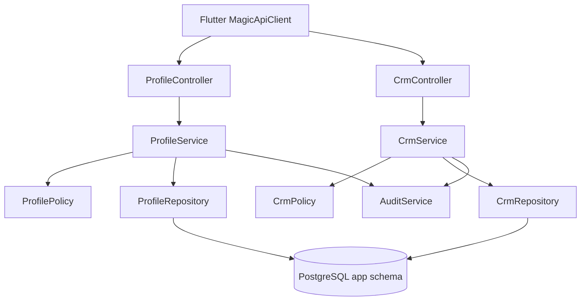

# System Design - Profile and CRM APIs

> [!IMPORTANT]
> Это наследованный compatibility baseline v3. В v4 правила ролей, client projections, расписания, задач и финансов заменены документами `access_control.md`, `client_crm.md`, `schedule_lifecycle.md`, `workflow_tasks.md` и `commerce.md`. В частности, старые строки про `admin` role management не являются действующим v4-решением.

**System IDs**: SYS-DATA, SYS-API, SYS-SEC
**Status**: Implementation-ready for S4/T4.1
**Related requirements**: REQ-V3-DATA-001, REQ-V3-SEC-001
**Related ADRs**: ADR-001, ADR-002, ADR-006

## 1. Overview

Profile and CRM APIs replace direct Supabase table/view access for profiles, students, teachers, groups, rooms, lessons, tasks, subscriptions, payments, leads, comments and balances.

Main job: provide role-scoped CRM read/write operations where all ownership, role and actor fields are derived server-side.

## 2. Goals and Non-Goals

| Goals | Non-Goals |
|---|---|
| Provide stable REST DTOs for Flutter cutover. | Recreate Supabase RLS in the client. |
| Enforce actor-scoped visibility for client, teacher, manager and admin. | Implement full BI/reporting dashboards in S4. |
| Preserve current v2 entities for migration. | Redesign school business process from scratch. |
| Audit privileged writes and role changes. | Accept role/user ownership fields from request body. |

## 3. Architecture

## 4. Components

| Component | Responsibility |
|---|---|
| `ProfileController` | `/profile` and `/admin/profiles` REST surface. |
| `CrmController` | `/crm/*` REST surface for leads, students, lessons, payments, tasks and reference data. |
| `ProfileService` | Profile self-service, admin profile management, role-safe updates. |
| `CrmService` | CRM workflows and query orchestration. |
| `ProfilePolicy` | Actor can view/update profile; role mutation rules. |
| `CrmPolicy` | Actor can view CRM entity; teacher/student/manager scoping. |
| `ProfileRepository`, `CrmRepository` | Parameterized SQL and transaction boundaries. |

## 5. Interface Design

All endpoints require `Authorization: Bearer <accessToken>` unless stated otherwise.

| Operation | Method | Path | Actors | Input | Output |
|---|---|---|---|---|---|
| Current profile | GET | `/profile/me` | authenticated | none | `ProfileDto` |
| Update own profile | PATCH | `/profile/me` | authenticated | `UpdateProfileDto` | `ProfileDto` |
| List profiles | GET | `/admin/profiles?role=&q=&limit=&cursor=` | manager, admin | filters | `Page<ProfileSummaryDto>` |
| Get profile by id | GET | `/admin/profiles/:id` | manager, admin, self | path id | `ProfileDto` or 404 |
| Update role | PATCH | `/admin/profiles/:id/role` | admin | `role` | `ProfileDto` |
| Current client summary | GET | `/crm/me` | client | none | lessons, subscriptions, balance, tasks |
| List students | GET | `/crm/students` | teacher, manager, admin | filters | `Page<StudentDto>` |
| Get student | GET | `/crm/students/:id` | owner client, assigned teacher, manager, admin | path id | `StudentDetailDto` |
| List teachers | GET | `/crm/teachers` | client, teacher, manager, admin | filters | `TeacherDto[]` scoped |
| Lessons range | GET | `/crm/lessons?from=&to=&studentId=&teacherId=` | all authenticated | filters | `LessonDto[]` scoped |
| Create/update lesson | POST/PATCH | `/crm/lessons` | manager, admin | lesson DTO | `LessonDto` |
| Tasks | GET/POST/PATCH | `/crm/tasks` | scoped actor | task DTO | task DTO |
| Payments | GET/POST | `/crm/payments` | client own read; manager/admin write | payment DTO | payment DTO |
| Leads | GET/POST/PATCH | `/crm/leads` | manager, admin | lead DTO | lead DTO |

## 6. Data Model

Initial v3 CRM schema should preserve migration compatibility with current Supabase entities.

| Table | Key fields | Notes |
|---|---|---|
| `app.profiles` | `user_id`, `first_name`, `last_name`, `phone`, `dob`, `avatar_file_id`, `email_otp_2fa_enabled` | One profile per user. |
| `app.students` | `profile_id`, `lead_id`, `status`, `custom_data` | Client-facing student identity. |
| `app.teachers` | `profile_id`, `status`, `specialization`, `custom_data` | Teacher identity. |
| `app.groups` | `teacher_id`, `name`, `price_per_lesson`, `branch_id`, `room_id` | Group lessons. |
| `app.group_students` | `group_id`, `student_id` | Unique active membership. |
| `app.rooms`, `app.branches` | reference data | Manager/admin maintained. |
| `app.lessons` | `student_id`, `group_id`, `teacher_id`, `scheduled_at`, `duration_minutes`, `status`, `is_trial` | Individual or group lesson. |
| `app.lesson_participation` | `lesson_id`, `student_id`, `status` | Required for group attendance. |
| `app.tasks` | `entity_type`, `entity_id`, `assigned_to`, `status`, `due_at` | CRM operational tasks. |
| `app.payments` | `student_id`, `amount`, `payment_date`, `method`, `created_by` | Financial write scope manager/admin. |
| `app.expected_payments`, `app.subscriptions`, `app.student_balances` | billing state | Keep migration-compatible read models. |
| `app.leads`, `app.lead_comments`, `app.lead_statuses` | lead pipeline | Manager/admin only. |
| `app.entity_comments`, `app.profile_notes` | comments/notes | Scoped by entity permissions. |

Recommended indexes:

- `profiles(user_id)` unique.
- Partial index on active users/profiles where `deleted_at is null`.
- `students(profile_id)`, `teachers(profile_id)`.
- `lessons(scheduled_at)`, `lessons(student_id, scheduled_at)`, `lessons(teacher_id, scheduled_at)`.
- `payments(student_id, payment_date desc)`.
- `tasks(assigned_to, status, due_at)`.

## 7. Authorization Matrix

| Actor | Allowed | Denied |
|---|---|---|
| client | Own profile, own student, own lessons/payments/tasks/subscription. | Other clients, staff-only CRM, role changes. |
| teacher | Assigned students, own schedule, permitted comments/tasks. | Finance/admin routes, unrelated students. |
| manager | Operational CRM, leads, schedules, payments. | Security role escalation unless explicitly admin. |
| admin | Full CRM and role management. | Direct DB bypass; all actions still audited. |

Rules:

- Request body fields `role`, `user_id`, `profile_id`, `created_by`, `updated_by` are ignored or rejected unless the route explicitly allows admin selection.
- Client-owned reads return `404` for foreign IDs to reduce enumeration.
- Privileged writes create `app.audit_events`.

## 8. Error and Pagination Contract

- Validation errors: `400` with request ID and DTO message.
- Missing object or hidden object: `404`.
- Authenticated but disallowed operation: `403`.
- Cursor pagination: opaque cursor based on `(created_at, id)` or `(scheduled_at, id)`.

## 9. Performance

- p95 common CRM reads target: under 500 ms.
- Use query-specific indexes and avoid N+1 joins.
- Prefer read DTO queries over exposing internal tables directly.
- Avoid broad `select *` for list endpoints.

## 10. Tests

- Unit: `ProfilePolicy`, `CrmPolicy`, DTO validation.
- Integration: profile self update, admin role update, client foreign student denial, teacher unrelated student denial, manager payment write.
- Security: actor matrix negative tests for every path with user-controlled IDs.

## 11. Trade-offs and Alternatives

| Option | Decision | Reason |
|---|---|---|
| One generic `/crm/table/:name` endpoint | Rejected | Recreates insecure Supabase table access and weakens DTO validation. |
| Domain-specific REST endpoints | Accepted | Clear authorization per workflow and stable Flutter contracts. |
| Database RLS as main guard | Rejected for v3 runtime | Backend guards and scoped repositories are the chosen boundary; DB constraints still provide defense-in-depth. |
| Read DTO queries/views | Accepted | Speeds Flutter cutover while keeping writes normalized and audited. |
