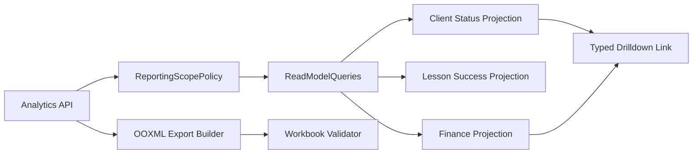
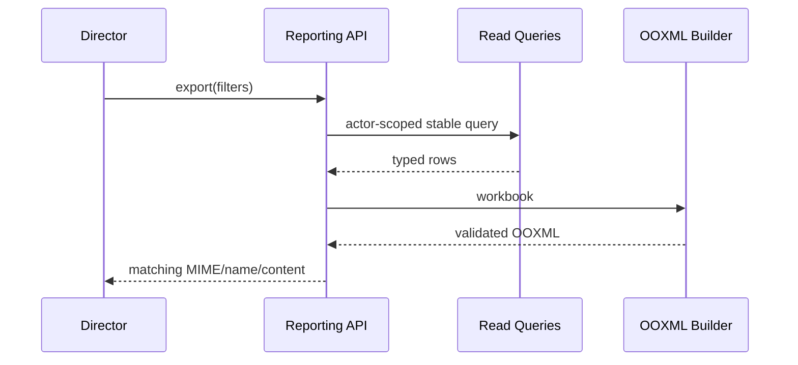

# SYS-REPORTING — Scoped Analytics, Drilldown & OOXML Export

**Status:** Accepted  
**Requirements:** REQ-REPORT-001, REQ-REPORT-002, REQ-CLIENT-003, REQ-LESSON-002, REQ-SUB-003, REQ-SUB-005, REQ-NAV-001  
**ADR:** ADR-007, ADR-009, ADR-012

## 1. Назначение и границы

Система строит actor-scoped read models и корректные выгрузки, связывает показатель с отфильтрованным списком. Она не меняет source tables и не выводит «посещаемость» из ручного статуса.

## 2. Инварианты

- Attendance/lesson-success metric = количество/доля `successfully_completed`.
- Revenue содержит только ActualPayment.
- School finance доступна только Director/sysadmin.
- Manager видит client status counts/drilldown, если capability не отключена Director.
- Admin/Manager не получают school revenue/expenses/forecast.
- Финансовая строка drilldown открывается только Director/sysadmin.
- `.xlsx` является валидным OOXML с совпадающими MIME/extension/content.

## 3. Компоненты

## 4. Read models

| Read model | Источник | Scope |
|---|---|---|
| ClientStatusSummary | active Client/Lead status | Manager/Director/sysadmin + override |
| ClientStatusList | same filtered records | same as summary |
| ClientOperationalSummary | lessons/tasks/active subscription balance | permitted client-card roles |
| LessonSuccessSummary | terminal lessons | actor branch/self scope |
| SchoolFinanceSummary | ActualPayment, expenses, obligations projections | Director/sysadmin only |
| ClientFinanceTimeline | client ledger/payment facts | Client self or staff client-card scope |

Summary и drilldown используют одну filter specification, чтобы count совпадал со списком.

## 5. Контракты операций

| Операция | Actor | Вход | Выход | Ошибки |
|---|---|---|---|---|
| Status summary | Manager/Director/sysadmin capability | date/branch/status filters | counts + EntityLink filter | 403 |
| Status drilldown | same | signed/validated filter spec | paged clients | 403/422 |
| School finance | Director/sysadmin | period/branch | aggregates + allowed links | 403 |
| Client finance | self/staff scoped | client/period | ledger timeline | 403 |
| Export xlsx | export capability + source report access | report/filter/locale | OOXML stream + filename/MIME | 403/422/500 |

## 6. OOXML design

Workbook создаётся библиотекой с настоящим Open XML package. Cells имеют явные numeric/date types, currency formatting и Unicode strings. Formulas ограничены известными шаблонами. Response:

- `.xlsx`: `application/vnd.openxmlformats-officedocument.spreadsheetml.sheet`;
- `.csv`: `text/csv; charset=utf-8` и расширение `.csv`;
- legacy `.xls` используется только для реально совместимого формата.

Export проходит structural validation до выдачи; большие наборы используют streaming/temporary private file с TTL.

## 7. Runtime и failure modes

- Unknown/stale filter → 422, не unscoped fallback.
- Export builder failure → no corrupt file; request id/error state.
- Read replica/projection lag, если появится, показывается timestamp; v4 по умолчанию читает primary-consistent projections.
- Deleted linked record → tombstone page.

## 8. Безопасность

- Scope predicate применяется в query, а не post-filter.
- Cache key включает actor scope/accessVersion.

## 9. Производительность и observability

- Status summary/list target p95 < 700 ms на production-like dataset.
- Export до 10 000 строк строится синхронно; 10 001–100 000 строк — job с private download; свыше 100 000 требует более узкого фильтра.
- Metrics: report latency/rows, count-list mismatch test, export validation failures, denied school-finance attempts.

## 10. Тестирование

- Unit: filter spec, derived success metric, money/date formatting.
- SQL integration: count equals drilldown, revenue excludes expected installments, role predicates.
- Actor matrix: Manager vs Director/sysadmin and Director-disabled Manager.
- OOXML validator + openpyxl/Excel smoke: Cyrillic, dates, currency, formulas.
- Navigation E2E from metric/finance row to filtered list/entity.

## 11. Миграция

Legacy attendance reports переключаются на terminal lesson metric после parity report. Legacy export endpoint остаётся façade, но content/extension исправляются. Cache включается только после actor-key tests.

## 12. Trade-offs

| Решение | Выигрыш | Цена |
|---|---|---|
| Shared filter spec summary/list | Counts доказуемы | Нужен versioned filter schema |
| Query-level scope | Нет утечки через page/count | Более сложные SQL policies |
| OOXML validation before delivery | Нет битых файлов | CPU/temporary storage |

## 13. Definition of Done

Готово, когда count совпадает со списком, school finance закрыта от Admin/Manager, attendance-derived metric подтверждена, а Excel открывает `.xlsx` без восстановления и предупреждений.
