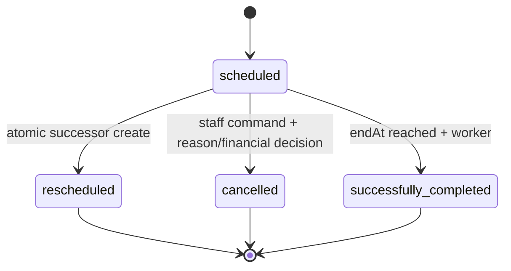
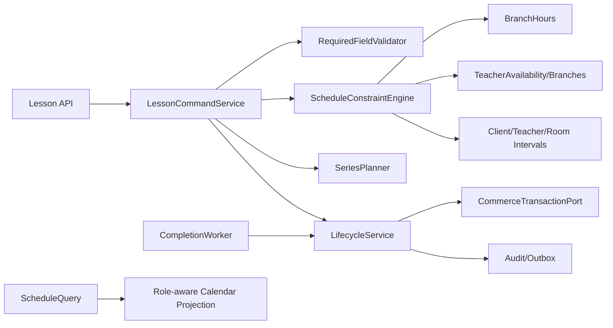
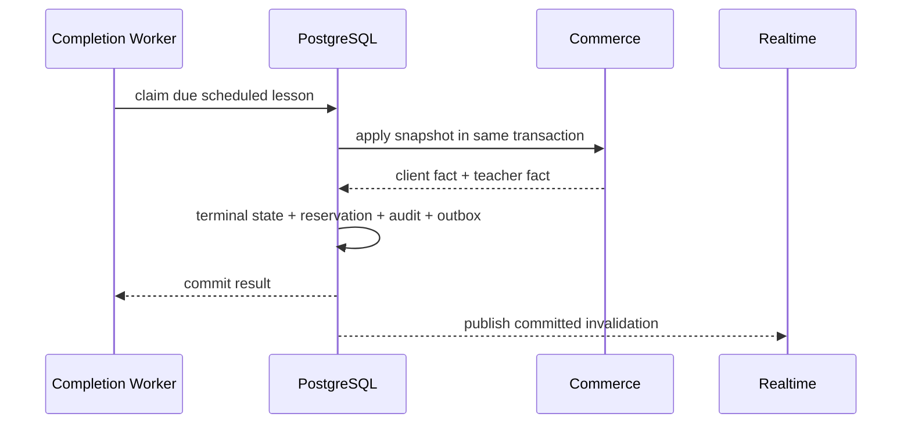

# SYS-SCHEDULE — Schedule Constraints & Lesson Lifecycle

**Status:** Accepted  
**Requirements:** REQ-LESSON-001, REQ-LESSON-002, REQ-LESSON-003, REQ-SCHED-001, REQ-SCHED-002, REQ-SCHED-003, REQ-TEACHER-001, REQ-NAV-001  
**ADR:** ADR-008, ADR-009, ADR-011, ADR-012

## 1. Назначение и границы

Система создаёт и показывает расписание, проверяет ресурсы/время, управляет series, переносом/отменой и автоматически завершает занятие. Финансовые facts применяет SYS-COMMERCE в общей transaction boundary.

## 2. State machine и инварианты

- Terminal state не возвращается в `scheduled`; исправление — audited compensating workflow.
- Урок не завершается до `endAt` и не требует attendance input.
- Client metric = count(`successfully_completed`) в разрешённом scope.
- Create/edit/series/drag/reschedule используют один constraint engine.
- Teacher имеет только read/open linked client/homework operations.

## 3. Компоненты

## 4. Модель данных

| Entity | Ключевые поля |
|---|---|
| Lesson | id, seriesId?, clientType/id, teacherId, branchId, roomId, startAt/endAt, trial, state, version |
| LessonSnapshot | successType, clientChargeType/value, teacherPayType/value, subscriptionId?, createdAt |
| LessonTransition | lessonId, from/to, reasonCode/text, actor/worker, predecessor/successor, financial decision |
| LessonSeries | recurrence rule, start/end/count, template snapshot, version |
| BranchHours | branchId, weekday, open/close, exception dates |
| TeacherAvailability | teacherId, interval/rule, available boolean, optional end |
| TeacherBranch | teacherId, branchId, active interval |
| LessonReservation | lessonId, subscriptionId, units, state |

Times хранятся как UTC instant; school timezone используется для branch-hour/recurrence interpretation.

## 5. Единая форма Lesson

Обязательные поля: Client (Lead или Student), teacher, branch, room, start/end, completion type, client write-off/cost, teacher compensation type/value. `Пробный урок` — независимый boolean и marker во всех связанных projections.

Форма не предлагает два взаимоисключающих поля Lead/Student. Search endpoint возвращает typed Client options.

## 6. Constraint engine

| Код violation | Проверка | Поведение |
|---|---|---|
| `OUTSIDE_BRANCH_HOURS` | interval внутри branch hours/exception | Block |
| `TEACHER_UNAVAILABLE` | availability covers full interval | Block |
| `TEACHER_BRANCH_MISMATCH` | active TeacherBranch | Block |
| `TEACHER_OVERLAP` | пересечение non-terminal lessons | Block |
| `CLIENT_OVERLAP` | ClientRef overlap | Block |
| `ROOM_OVERLAP` | room overlap | Block |
| `INVALID_INTERVAL` | start < end, duration policy | Block |
| `MISSING_FINANCIAL_SNAPSHOT` | required completion/write-off/pay fields | Block |
| `SUBSCRIPTION_CAPACITY` | units available/reservable | Block or explicit debt policy |

Интервалы half-open `[startAt, endAt)`, поэтому соседние занятия допустимы. Все violations возвращаются одной структурой с resource refs и конфликтующими lesson ids.

## 7. Контракты операций

| Операция | Actor | Вход | Выход | Ошибки |
|---|---|---|---|---|
| Validate draft | schedule writer | complete draft + excludeId? | violations + price preview | 422 |
| Create Lesson | Admin/Manager/Director/sysadmin | draft + idempotency key | Lesson + reservation | 409/422 |
| Create Series | same | template + recurrence | created list/failed index, atomic | 409/422 |
| Edit/drag | writer | lesson/version + changes | new version | 409 stale/conflict |
| Reschedule | writer | source/version, reason, financial decision, successor draft | source+successor | 409/422 |
| Cancel | writer | version, reason, financial decision | terminal Lesson | 409/422 |
| Teacher calendar | assigned Teacher | range/day/week | read-only projection | 403 |
| Completion worker | internal | due lesson claim | stable terminal result | retryable failure |
| System override | `system_admin` | draft, violation ids, reason | audited result | 403/422 |

## 8. Автозавершение

Worker clock определяется сервером. Повторный claim видит terminal state и возвращает уже созданные fact ids.

## 9. Перенос, цвета и subscription units

Перенос помечает исходную запись `rescheduled` и красным в client lesson history; successor проходит полную проверку. Успешно завершённое занятие и обеспеченная абонементом ячейка используют существующую зелёную палитру; ожидающее без подтверждённого покрытия — нейтральное/серое. Цвет вычисляется из `state + reservation`, не сохраняется как editable type.

## 10. Ошибки, безопасность и observability

- Несколько worker instances: claim/terminal guard предотвращают дубль.
- Commerce failure откатывает state целиком.
- Notification/realtime failure не откатывает committed lesson; outbox retry.
- Teacher write/attendance/complete endpoints отсутствуют или возвращают 403.
- Healthy-runtime target: due lesson переходит в terminal state не позднее 60 секунд после `endAt`.
- Metrics: due backlog age, completion latency, constraint counts, conflict rate, rollback/retry count.
- Alerts: oldest due > 120 секунд, duplicate financial unique violation, outbox lag.

## 11. Тестирование

- Unit/property: interval boundaries, DST/timezone recurrence, state transitions, palette projection.
- PostgreSQL integration: concurrent create/drag, two workers, commerce rollback, reschedule atomicity.
- Contract: identical violations on all write entry points.
- Actor matrix: teacher read-only, business writers, sysadmin override.
- Windows/Android E2E: unified Client field, trial marker, day/week teacher grid, card→series.

## 12. Миграция и rollout

1. Audit future lesson overlaps, missing resources/teacher branches/snapshots.
2. Backfill teacher branches and snapshots; unresolved rows block strict enablement.
3. Introduce new state/transition/reservation alongside legacy status.
4. Shadow-run constraints and compare current behavior.
5. Enable writes through unified service.
6. Start completion worker in observe-only, then transactional mode.
7. Remove attendance mutations/UI after derived metric parity.

## 13. Trade-offs и DoD

| Решение | Выигрыш | Цена |
|---|---|---|
| Half-open intervals | Ясные соседние слоты | Нужна единая реализация SQL/Dart |
| Atomic series create | Нет частичного расписания | Большая transaction/validation |
| Successor record on reschedule | Полная история | Больше записей |

Готово, когда future data проходит preflight, все write entry points дают одинаковые конфликты, worker не дублирует деньги, attendance controls удалены, а Teacher calendar полностью read-only и контекстно связан.
