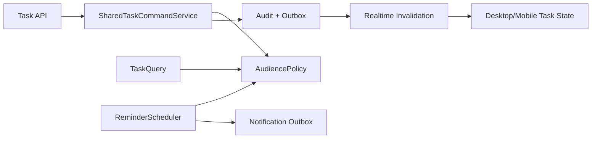
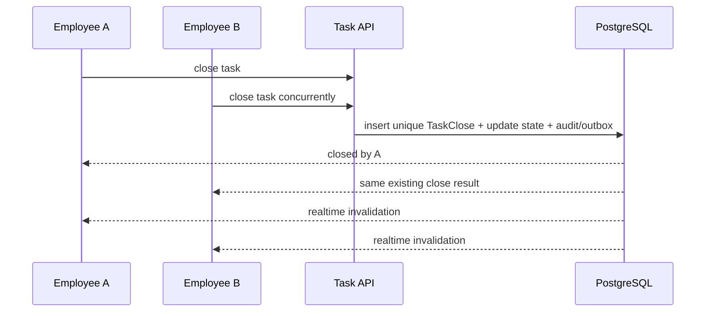

# SYS-WORKFLOW — Shared Tasks, Reminders & Realtime

**Status:** Accepted  
**Requirements:** REQ-TASK-001, REQ-TASK-002, REQ-NAV-001, REQ-NAV-003, REQ-AUDIT-001  
**ADR:** ADR-007, ADR-011, ADR-012

## 1. Назначение и границы

Система представляет назначение нескольким людям или филиалу одной общей задачей. Она отвечает за audience, единое закрытие, reminders и realtime invalidation, но не блокирует работу пользователя и не копирует отдельную task state каждому recipient.

## 2. Инварианты

- SharedTask имеет одно состояние `open|closed`.
- Первое допустимое закрытие завершает задачу для всех.
- Повторное/конкурентное закрытие возвращает тот же close result и не создаёт второй audit.
- Schedule: all-day или start/end; `end > start`.
- Audience поддерживает users, branch и all branches.
- Branch audience разрешается в текущих уполномоченных сотрудников филиала при чтении/уведомлении.
- Reminder заметен, но никогда не является blocking modal.

## 3. Компоненты

## 4. Модель данных

| Entity | Поля |
|---|---|
| SharedTask | id, title/body, allDay, startAt?, endAt?, state, linkedEntity?, version |
| TaskAudience | taskId, type user/branch/allBranches, targetId? |
| TaskClose | taskId unique, closedAt, closedBy, requestId |
| TaskReminder | taskId, dueAt, delivery channel/status, dedupe key |
| TaskAudienceResolutionAudit | taskId, action, actor, matched selector, membership version/time | Append-only proof of visibility/close |

Audience rows определяют видимость, но не создают recipient-specific completion.

## 5. Контракты операций

| Операция | Предусловие | Вход | Выход | Ошибки |
|---|---|---|---|---|
| Create task | task write + valid audience | schedule, audiences, entity link, idempotency | SharedTask | 403/409/422 |
| Update task | writer + open + version | fields/audience/version | new version | 403/409 |
| List my tasks | actor active | filters/page | scoped tasks + counters | 403 |
| Close task | actor is current authorized audience | task/version/idempotency | stable close result | 403/409 |
| Open linked entity | route/capability valid | EntityLink | context navigation | forbidden/tombstone |
| Dispatch reminder | internal due claim | reminder | non-blocking delivery | retry |

## 6. Runtime закрытия

Если actor покинул филиал до close, audience policy вычисляется на момент команды, и close запрещается, если нет другого explicit user audience.

## 7. UX

- Desktop: badge/panel/toast без блокировки текущего route.
- Mobile: collapsed filter ≤56 px; advanced filters — отдельная scrollable panel.
- Карточка содержит явную кнопку `Закрыть задачу`.
- Pending close показывает progress; failure оставляет task open и предлагает retry.
- Realtime close удаляет reminder/badge у остальных.

## 8. Ошибки и безопасность

- Notification provider failure не меняет task state; retry через outbox.
- Stale task update/close показывает current state.
- Linked entity projection проверяется независимо от task visibility.

## 9. Производительность и наблюдаемость

- Metrics: open/overdue counts, reminder lag, duplicate close suppression, realtime close lag.
- Realtime close/reminder removal target: не позднее 2 секунд после commit.
- Audit: create/update/audience/close с actor и linked reference.

## 10. Тестирование

- Unit: time validation, audience policy, mobile filter state.
- Integration: two closers, dynamic branch membership, reminder dedupe.
- Widget: non-blocking reminder, collapsed filter, retry state.
- E2E: multi-recipient task closes for all and linked context returns correctly.

## 11. Миграция

Существующие recipient copies группируются в SharedTask только при доказуемом общем origin; неоднозначные записи остаются отдельными. Новый write path создаёт одну задачу и audience rows.

## 12. Trade-offs

| Решение | Выигрыш | Цена |
|---|---|---|
| Dynamic branch audience | Новые сотрудники видят актуальную задачу | Исторический recipient list требует audit snapshot |
| Single close state | Нет блокировки конкретного сотрудника | Нет per-recipient completion |
| Non-modal reminder | Работа не блокируется | Нужна хорошая заметность |

## 13. Definition of Done

Готово, когда все audience types работают, конкурентное закрытие единично, reminder не блокирует UI, mobile filter укладывается в 56 px, а realtime закрывает уведомление у остальных.
