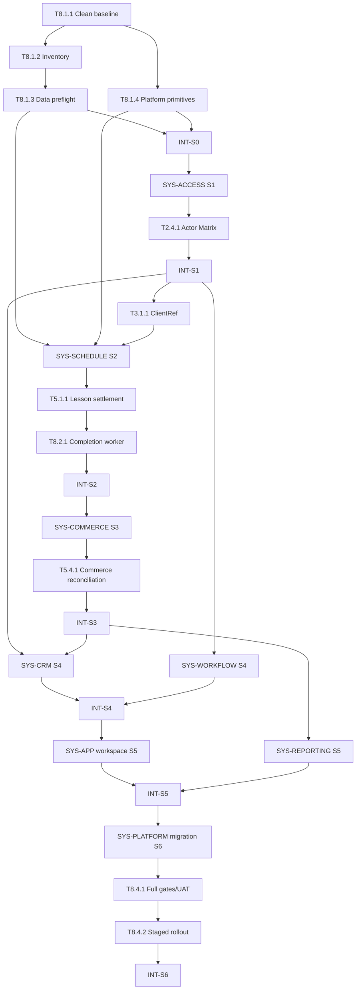

# MagicMusicCRM v4 — Technical Delivery Checklist

**Версия:** 4.0  
**Статус:** Ready for execution  
**Дата:** 2026-07-25  
**Источники истины:** [`01_PRD.md`](01_PRD.md), [`02_ARCHITECTURE_OVERVIEW.md`](02_ARCHITECTURE_OVERVIEW.md), [`03_ADR/`](03_ADR/), [`04_SYSTEM_DESIGN/`](04_SYSTEM_DESIGN/)  
**Правило отметки:** задача получает `[x]` только после выполнения всех её подпунктов, критериев и указанной проверки.

## 1. Правила исполнения

- Квант L3-задачи: 2–8 инженерных часов, включая тест и краткую документацию.
- Нельзя начинать Sprint, пока его зависимости и предыдущий обязательный `INT-SN` не закрыты.
- Backend является источником истины; UI guard не заменяет direct API denial.
- Для schema/data changes обязательны additive migration, preflight, rollback/compensation и reconciliation.
- Smoke/E2E выполняются на `INT-SN` и сквозных milestones; локальная логика проверяется unit/integration уровнем.
- Любая найденная регрессия оформляется отдельной bug-задачей и блокирует соответствующий `INT-SN`.
- Старые v3 façade/endpoints сохраняются до contract parity; big-bang rewrite запрещён.

## 2. Дорожная карта спринтов

| Sprint | Код | Результат | Exit criteria | Оценка |
|---|---|---|---|---:|
| S0 | Baseline & Evidence | Воспроизводимый baseline, inventory, preflight и platform primitives | Flutter/server gates зелёные; data risks измерены; idempotency/version/outbox foundation готов | 36 ч |
| S1 | Access & Privacy | Capability packages, personal overrides, safe projections | Actor Matrix 6 ролей зелёная; Manager не меняет права; Teacher payload чист; access ≤5 s | 78 ч |
| S2 | Lesson Integrity | Единый Lesson lifecycle, constraints, worker и teacher calendar | Нет attendance mutations; все write-paths проверяют конфликты; completion ≤60 s без дублей | 110 ч |
| S3 | Subscription Integrity | Каталог, snapshots, issue/replace/cancel и finance projections | Replace/cancel не меняют payments; reconciliation drift=0; права ролей подтверждены | 68 ч |
| S4 | CRM & Shared Work | Leads/Students/config/card/archive и общие задачи | Inbound≠manual; archive безопасен; одна task закрывается для всех; mobile filter ≤56 px | 94 ч |
| S5 | Connected Workspace | Все context links, desktop tabs, mobile stack, reports и OOXML | 10 вкладок; cross-tab ≤2 s; матрица переходов полна; `.xlsx` валиден | 100 ч |
| S6 | Migration & Release | Backfill, shadow parity, UAT, rollout/rollback | 29/29 REQ приняты; 6 ролей × Windows/Android; security/reconciliation/restore gates зелёные | 42 ч |
| **Всего** |  |  |  | **528 ч** |

Оценка — инженерные часы без времени ожидания владельца, внешних провайдеров и production maintenance window.

## 3. Граф зависимостей

Критический путь: `T8.1.1 → INT-S0 → SYS-ACCESS → INT-S1 → SYS-SCHEDULE → INT-S2 → SYS-COMMERCE → INT-S3 → SYS-CRM/WORKFLOW → INT-S4 → SYS-APP/REPORTING → INT-S5 → migration/UAT → INT-S6`.

---

# 4. WBS — SYS-PLATFORM

## Phase 1 — Foundation (S0)

- [x] **T8.1.1** [REQ-AUDIT-001]: Восстановить чистый локальный baseline
  - **Описание:** устранить расхождение установленных dev-зависимостей и зафиксировать воспроизводимые Flutter/backend gates до v4.
  - **Подпункты:**
    - [x] Выполнить clean install из lock-файлов, включая `@electric-sql/pglite`.
    - [x] Запустить обе PostgreSQL integration suites и полный server/Flutter baseline.
    - [x] Сохранить версии toolchain и результаты в `docs/audits/v4-baseline.md`.
  - **Вход:** `01_PRD.md §4`, ADR-012.
  - **Выход:** воспроизводимый install + baseline evidence.
  - **📎 Ссылка:** `04_SYSTEM_DESIGN/platform_integrity.md §11`.
  - **Критерии:** Given чистый checkout; When зависимости установлены из lock-файлов; Then `flutter analyze/test` и server typecheck/test/build завершаются без исключённых suite.
  - **Тип верификации:** Проверка компиляции + регрессионный тест.
  - **Инструкция:** `npm --prefix server ci && npm --prefix server run typecheck && npm --prefix server test && npm --prefix server run build && flutter analyze && flutter test`
  - **Оценка:** 4 ч. · **Зависимости:** нет · **Приоритет:** P0 · **Sprint:** S0

- [x] **T8.1.2** [REQ-RBAC-001, REQ-AUDIT-001]: Зафиксировать current-state inventory
  - **Описание:** составить машинно-проверяемый список role guards, DTO fields, schedule entry points, attendance mutations, finance writes и navigation sources.
  - **Подпункты:**
    - [x] Выгрузить backend routes/`@Roles`/policy calls и Flutter role/nav checks.
    - [x] Построить inventory таблиц/columns/indexes для lessons, subscriptions, payments, tasks, users.
    - [x] Связать каждый найденный entry point с одной системой v4.
  - **Вход:** `02_ARCHITECTURE_OVERVIEW.md §3–8`, результат T8.1.1.
  - **Выход:** `docs/audits/v4-current-state-inventory.md` + JSON inventory.
  - **📎 Ссылка:** `04_SYSTEM_DESIGN/access_control.md §12`, `schedule_lifecycle.md §12`.
  - **Критерии:** Given текущий код; When inventory script запущен; Then ни один route/write/nav source не остаётся без owner/status.
  - **Тип верификации:** Lint-проверка.
  - **Инструкция:** `pwsh -File scripts/v4_inventory.ps1 -Check`
  - **Оценка:** 6 ч. · **Зависимости:** T8.1.1 · **Приоритет:** P0 · **Sprint:** S0

- [x] **T8.1.3** [REQ-SCHED-002, REQ-SUB-002, REQ-CLIENT-002]: Создать read-only data preflight
  - **Описание:** измерить данные, которые помешают strict access/schedule/commerce migration.
  - **Подпункты:**
    - [x] Найти будущие overlaps, missing room/branch/teacher branch и неполные lesson snapshots.
    - [x] Найти issued subscriptions без доказуемого commercial snapshot и финансовые расхождения.
    - [x] Найти client/task/role rows без однозначного migration mapping.
  - **Вход:** inventory T8.1.2, `platform_integrity.md §9`.
  - **Выход:** restartable preflight command + JSON/Markdown report без изменений БД.
  - **📎 Ссылка:** ADR-008, ADR-009, ADR-012.
  - **Критерии:** Given production-shaped dump; When preflight запущен дважды; Then counts стабильны, rows адресуемы по id, БД не изменена.
  - **Тип верификации:** Интеграционный тест.
  - **Инструкция:** `npm --prefix server run v4:preflight -- --check-read-only`
  - **Оценка:** 8 ч. · **Зависимости:** T8.1.2 · **Приоритет:** P0 · **Sprint:** S0

- [x] **T8.1.4** [REQ-AUDIT-001, REQ-NAV-002]: Реализовать platform primitives
  - **Описание:** добавить reusable aggregate version, idempotency registry, transaction-bound audit и outbox foundation.
  - **Подпункты:**
    - [x] Создать additive migration и repository contracts.
    - [x] Реализовать fingerprint/key replay и stale-version conflict.
    - [x] Реализовать outbox claim/publish/retry с redacted envelope.
  - **Вход:** `platform_integrity.md §3–8`, ADR-011.
  - **Выход:** platform module, migration, unit/integration tests.
  - **📎 Ссылка:** `03_ADR/ADR_011_IDEMPOTENCY_VERSIONS_AND_OUTBOX.md`.
  - **Критерии:** Given два одинаковых/разных payload с одним key; When выполняются параллельно; Then одинаковый возвращает один result, различный — 409, audit/outbox существуют только после commit.
  - **Тип верификации:** Интеграционный тест.
  - **Инструкция:** `npm --prefix server test -- --runTestsByPath src/platform/platform-integrity-postgres.integration.spec.ts`
  - **Оценка:** 8 ч. · **Зависимости:** T8.1.1 · **Приоритет:** P0 · **Sprint:** S0

- [x] **T8.1.5** [REQ-SUB-004, REQ-REPORT-002]: Создать reconciliation harness
  - **Описание:** автоматизировать снимки и diff финансовых/lesson/task/access инвариантов до и после migration.
  - **Подпункты:**
    - [x] Определить named SQL invariants и tolerance=0 для экономических facts.
    - [x] Добавить signed JSON report с source/target counts и unexplained diff.
    - [x] Завершать команду ненулевым кодом при drift.
  - **Вход:** T8.1.3, `platform_integrity.md §5/§9`.
  - **Выход:** `scripts/v4_reconcile.*`, fixtures, report schema.
  - **📎 Ссылка:** ADR-009, ADR-012.
  - **Критерии:** Given fixture с одним искусственным дублем; When reconciliation запущен; Then drift найден и gate падает; clean fixture даёт 0.
  - **Тип верификации:** Интеграционный тест.
  - **Инструкция:** `npm --prefix server run v4:reconcile -- --fixture clean && npm --prefix server run v4:reconcile -- --fixture drift --expect-fail`
  - **Оценка:** 6 ч. · **Зависимости:** T8.1.3, T8.1.4 · **Приоритет:** P0 · **Sprint:** S0

## Phase 2 — Runtime integration (S2)

- [x] **T8.2.1** [REQ-LESSON-002, REQ-AUDIT-001]: Реализовать durable completion worker
  - **Описание:** claim-ить due lessons и вызывать Lesson lifecycle transaction без потери/дублирования.
  - **Подпункты:**
    - [x] Реализовать batch claim, lease/reclaim и terminal guard.
    - [x] Добавить retry/backoff/poison visibility и metrics.
    - [x] Добавить kill-after-commit и multi-worker tests.
  - **Вход:** T8.1.4, T4.2.4, T5.1.1; `platform_integrity.md §6–7`.
  - **Выход:** worker, health/metrics, concurrency tests.
  - **📎 Ссылка:** ADR-008, ADR-011.
  - **Критерии:** Given одно due занятие и два worker; When оба claim-ят; Then terminal state/facts/audit единственные и появляются ≤60 секунд после endAt.
  - **Тип верификации:** Интеграционный тест.
  - **Инструкция:** `npm --prefix server test -- --runTestsByPath src/crm/schedule/completion-worker-postgres.integration.spec.ts`
  - **Оценка:** 8 ч. · **Зависимости:** T8.1.4, T4.2.4, T5.1.1 · **Приоритет:** P0 · **Sprint:** S2

## Phase 3 — Migration (S6)

- [ ] **T8.3.1** [REQ-SCHED-002, REQ-RBAC-001]: Выполнить production preflight и управляемый backfill
  - **Описание:** на backup/staging-копии устранить missing teacher branches, lesson resources/snapshots и mapping gaps без догадок.
  - **Подпункты:**
    - [ ] Зафиксировать backup и preflight report.
    - [ ] Выполнить restartable backfill только однозначных rows.
    - [ ] Вывести неоднозначные rows в review queue и закрыть каждую решением.
  - **Вход:** T8.1.3, закрытые INT-S1…S5.
  - **Выход:** backfill evidence, zero unresolved blocker report.
  - **📎 Ссылка:** `schedule_lifecycle.md §12`, `access_control.md §12`.
  - **Критерии:** Given staging copy; When backfill повторён; Then второй запуск не меняет данные, unresolved blockers=0.
  - **Тип верификации:** Интеграционный тест.
  - **Инструкция:** `npm --prefix server run v4:backfill -- --dry-run && npm --prefix server run v4:backfill -- --apply && npm --prefix server run v4:preflight -- --require-zero-blockers`
  - **Оценка:** 8 ч. · **Зависимости:** INT-S5 · **Приоритет:** P0 · **Sprint:** S6

- [ ] **T8.3.2** [REQ-SUB-004, REQ-LESSON-002, REQ-TASK-001]: Выполнить v4 data migration dry-run
  - **Описание:** мигрировать capability packages, lesson lifecycle/snapshots, subscription facts и shared tasks на staging-копии.
  - **Подпункты:**
    - [ ] Выполнить additive schema и restartable data batches.
    - [ ] Сравнить source/target counts и named invariants.
    - [ ] Проверить rollback/forward compensation на копии.
  - **Вход:** T8.3.1, T8.1.5 и миграции domain systems.
  - **Выход:** migration run report, reconciliation drift=0, recovery evidence.
  - **📎 Ссылка:** `platform_integrity.md §9`.
  - **Критерии:** Given production-shaped snapshot; When migration выполняется дважды; Then второй запуск идемпотентен, экономический drift=0, восстановление проверено.
  - **Тип верификации:** Интеграционный тест.
  - **Инструкция:** `npm --prefix server run v4:migrate:dry-run && npm --prefix server run v4:reconcile -- --require-zero`
  - **Оценка:** 8 ч. · **Зависимости:** T8.3.1, T8.1.5 · **Приоритет:** P0 · **Sprint:** S6

- [ ] **T8.3.3** [REQ-RBAC-001, REQ-SCHED-001]: Включить compatibility/shadow parity gates
  - **Описание:** сравнить legacy façade и v4 services до переключения write/read paths.
  - **Подпункты:**
    - [ ] Логировать safe diff старой/новой access и constraint decisions.
    - [ ] Добавить feature flags по доменам и documented kill switches.
    - [ ] Запретить enable при unexplained parity diff.
  - **Вход:** T8.3.2, domain contract tests.
  - **Выход:** shadow dashboard/report и domain feature flags.
  - **📎 Ссылка:** `access_control.md §12`, `schedule_lifecycle.md §12`, ADR-012.
  - **Критерии:** Given одинаковый request corpus; When legacy/v4 shadow compare завершён; Then разрешённые различия объяснены, неизвестных=0.
  - **Тип верификации:** Регрессионный тест.
  - **Инструкция:** `npm --prefix server run v4:shadow-compare -- --require-zero-unexplained`
  - **Оценка:** 6 ч. · **Зависимости:** T8.3.2 · **Приоритет:** P0 · **Sprint:** S6

## Phase 4 — Release (S6)

- [ ] **T8.4.1** [REQ-RBAC-002, REQ-PRIV-001, REQ-NAV-002]: Выполнить полные technical/UAT gates
  - **Описание:** прогнать static, unit, integration, actor, concurrency, performance, security и device acceptance.
  - **Подпункты:**
    - [ ] Запустить полный Flutter/backend/security/reconciliation suite.
    - [ ] Выполнить 6-role сценарии на Windows и Android.
    - [ ] Проверить worker/outbox metrics, backup restore и alert drill.
  - **Вход:** T8.3.3, INT-S1…S5.
  - **Выход:** `.anws/v4/08_RELEASE_READINESS_REPORT.md`.
  - **📎 Ссылка:** ADR-006, ADR-012, `07_CHALLENGE_REPORT.md §6`.
  - **Критерии:** Given release candidate; When gates выполнены; Then Critical/High=0, 29/29 REQ accepted, drift=0, обе платформы подтверждены.
  - **Тип верификации:** E2E + регрессионный тест.
  - **Инструкция:** `pwsh -File scripts/v4_release_gate.ps1 -Windows -Android -RequireZeroDrift`
  - **Оценка:** 8 ч. · **Зависимости:** T8.3.3, INT-S5 · **Приоритет:** P0 · **Sprint:** S6

- [ ] **T8.4.2** [REQ-AUDIT-001]: Подготовить staged rollout, rollback и runbooks
  - **Описание:** оформить и отрепетировать безопасное включение v4 по feature flags.
  - **Подпункты:**
    - [ ] Зафиксировать maintenance/backup/deploy/observe/rollback sequence.
    - [ ] Выполнить staging rehearsal и rollback/forward recovery smoke.
    - [ ] Описать worker pause/resume, outbox drain и incident ownership.
  - **Вход:** T8.4.1, ADR-005, `platform_integrity.md §9–10`.
  - **Выход:** `docs/runbooks/v4-rollout.md`, rehearsal evidence.
  - **📎 Ссылка:** ADR-005, ADR-012.
  - **Критерии:** Given staging release; When rollout и rollback rehearsal выполнены; Then health/data/auth/realtime восстанавливаются, новые facts не теряются.
  - **Тип верификации:** Smoke-тест.
  - **Инструкция:** `pwsh -File scripts/v4_rollout_rehearsal.ps1 -Target staging -Rollback`
  - **Оценка:** 8 ч. · **Зависимости:** T8.4.1 · **Приоритет:** P0 · **Sprint:** S6

---

# 5. WBS — SYS-ACCESS

## Phase 1 — Foundation (S1)

- [x] **T2.1.1** [REQ-RBAC-001]: Создать capability registry и role-package schema
  - **Описание:** описать versioned capabilities, готовые пакеты шести ролей, override modes и access versions.
  - **Подпункты:**
    - [x] Создать additive migration с uniqueness/active-version constraints.
    - [x] Seed-ить approved packages без расширения текущего доступа.
    - [x] Добавить typed registry в NestJS и OpenAPI snapshot.
  - **Вход:** T8.1.2, T8.1.4, `access_control.md §4–5`.
  - **Выход:** migration, registry/package repository, seeds.
  - **📎 Ссылка:** ADR-007.
  - **Критерии:** Given clean/test DB; When migration+seed выполнены; Then каждая роль имеет один active package, unknown capability fail-closed.
  - **Тип верификации:** Интеграционный тест.
  - **Инструкция:** `npm --prefix server test -- --runTestsByPath src/access-control/capability-registry-postgres.integration.spec.ts`
  - **Оценка:** 8 ч. · **Зависимости:** T8.1.2, T8.1.4 · **Приоритет:** P0 · **Sprint:** S1

- [x] **T2.1.2** [REQ-RBAC-001, REQ-RBAC-002]: Реализовать hard-invariant evaluator
  - **Описание:** вычислять effective capability в порядке root/invariant/package/override/resource scope.
  - **Подпункты:**
    - [x] Закодировать Teacher privacy/schedule deny и Director/system_admin role rules.
    - [x] Защитить последнего active `system_admin`.
    - [x] Добавить table-driven matrix unit tests.
  - **Вход:** T2.1.1, `access_control.md §2/§7`.
  - **Выход:** `EffectiveAccessEvaluator`, invariant policies, tests.
  - **📎 Ссылка:** ADR-007 §Decision.
  - **Критерии:** Given incompatible personal allow; When evaluator вызван; Then hard deny сильнее override, а `system_admin` получает root allow.
  - **Тип верификации:** Unit-тест.
  - **Инструкция:** `npm --prefix server test -- --runTestsByPath src/access-control/effective-access-evaluator.spec.ts`
  - **Оценка:** 6 ч. · **Зависимости:** T2.1.1 · **Приоритет:** P0 · **Sprint:** S1

## Phase 2 — Core (S1)

- [x] **T2.2.1** [REQ-RBAC-001, REQ-AUDIT-001]: Реализовать role/package/override API
  - **Описание:** дать Director и emergency `system_admin` атомарные versioned команды управления доступом.
  - **Подпункты:**
    - [x] Реализовать list/package/assign-role/set-override DTO и policies.
    - [x] Сбрасывать overrides при смене роли после confirmation.
    - [x] Писать before/after/reason audit и access outbox в одной транзакции.
  - **Вход:** T2.1.2, T8.1.4, `access_control.md §6`.
  - **Выход:** controllers/services/repositories/OpenAPI.
  - **📎 Ссылка:** ADR-007, ADR-011.
  - **Критерии:** Given Manager/Director/sysadmin; When вызывают mutation; Then Manager=403, Director назначает только ниже себя, sysadmin любую роль, partial save невозможен.
  - **Тип верификации:** Интеграционный тест.
  - **Инструкция:** `npm --prefix server test -- --runTestsByPath src/access-control/access-mutations-postgres.integration.spec.ts`
  - **Оценка:** 8 ч. · **Зависимости:** T2.1.2, T8.1.4 · **Приоритет:** P0 · **Sprint:** S1

- [x] **T2.2.2** [REQ-PRIV-001, REQ-SUB-005]: Реализовать actor-aware client projections
  - **Описание:** исключать запрещённые teacher/client fields до сериализации и composition.
  - **Подпункты:**
    - [x] Создать projection profiles для 6 ролей и self/assigned scopes.
    - [x] Исключить contacts/representatives/finance/subscriptions/cost/debt у Teacher.
    - [x] Разделить cache/OpenAPI contract по projection scope.
  - **Вход:** T2.1.2, `access_control.md §8`, current DTO inventory T8.1.2.
  - **Выход:** projection factories, safe DTO contracts, negative tests.
  - **📎 Ссылка:** ADR-007.
  - **Критерии:** Given assigned Teacher; When загружены client/search/schedule/chat/export payloads; Then запрещённых keys/values нет, unrelated client=404/403.
  - **Тип верификации:** Контрактный интеграционный тест.
  - **Инструкция:** `npm --prefix server test -- --runTestsByPath src/access-control/teacher-projection.contract.spec.ts`
  - **Оценка:** 8 ч. · **Зависимости:** T2.1.2 · **Приоритет:** P0 · **Sprint:** S1

- [x] **T2.2.3** [REQ-PRIV-001, REQ-AUDIT-001]: Реализовать видимость конкретного комментария Teacher
  - **Описание:** хранить `sharedWithTeacher`, проверять assigned relation и аудитировать toggle.
  - **Подпункты:**
    - [x] Добавить versioned field/migration и projection predicate.
    - [x] Разрешить toggle Admin/Manager/Director/sysadmin.
    - [x] Исключить body комментария из realtime event.
  - **Вход:** T2.2.2, `access_control.md §6/§8`, `client_crm.md §4–5`.
  - **Выход:** comment share mutation/read projection/audit.
  - **📎 Ссылка:** ADR-007, ADR-011.
  - **Критерии:** Given hidden/shared comment; When Teacher читает assigned client; Then видит только shared, toggle создаёт одну audit row.
  - **Тип верификации:** Интеграционный тест.
  - **Инструкция:** `npm --prefix server test -- --runTestsByPath src/crm/clients/comment-sharing-postgres.integration.spec.ts`
  - **Оценка:** 6 ч. · **Зависимости:** T2.2.2, T8.1.4 · **Приоритет:** P0 · **Sprint:** S1

## Phase 3 — Integration (S1)

- [x] **T2.3.1** [REQ-RBAC-001]: Подключить capability guards ко всем v4 entry points
  - **Описание:** заменить scattered role sets на capability/resource policies, сохраняя compatibility façade.
  - **Подпункты:**
    - [x] Мигрировать endpoints по inventory и запретить unmapped route.
    - [x] Добавить repository-level actor scope к list/count queries.
    - [x] Сравнить shadow decisions со старой policy.
  - **Вход:** T2.2.1, T2.2.2, inventory T8.1.2.
  - **Выход:** guards/policies на всех v4 domain routes, parity report.
  - **📎 Ссылка:** `access_control.md §12`.
  - **Критерии:** Given route inventory; When policy coverage check запущен; Then 100% private routes имеют capability+scope и нет unexplained allow.
  - **Тип верификации:** Регрессионный тест.
  - **Инструкция:** `npm --prefix server run v4:access-coverage -- --require-complete`
  - **Оценка:** 8 ч. · **Зависимости:** T2.2.1, T2.2.2 · **Приоритет:** P0 · **Sprint:** S1

- [x] **T2.3.2** [REQ-RBAC-001, REQ-RBAC-002]: Реализовать access/session invalidation
  - **Описание:** после access change обновлять все активные сессии/вкладки, не полагаясь на старый UI snapshot.
  - **Подпункты:**
    - [x] Публиковать safe `access.invalidated` с accessVersion после commit.
    - [x] Refetch/clear projection caches и закрывать запрещённые routes.
    - [x] Скрывать system_admin account/role из business lists остальных ролей.
  - **Вход:** T2.2.1, T8.1.4, `access_control.md §9–10`.
  - **Выход:** realtime/session handlers и business-list filters.
  - **📎 Ссылка:** ADR-007, ADR-010.
  - **Критерии:** Given две active sessions; When Director снимает capability; Then обе теряют control ≤5 s, следующий API request уже denied.
  - **Тип верификации:** Интеграционный тест.
  - **Инструкция:** `npm --prefix server test -- --runTestsByPath src/access-control/access-invalidation.integration.spec.ts`
  - **Оценка:** 6 ч. · **Зависимости:** T2.2.1, T8.1.4 · **Приоритет:** P0 · **Sprint:** S1

## Phase 4 — Polish (S1)

- [x] **T2.4.1** [REQ-RBAC-001, REQ-RBAC-002, REQ-PRIV-001]: Закрыть Actor Matrix и payload leak scan
  - **Описание:** проверить каждый v4 route/read model под Client, Teacher, Admin, Manager, Director, system_admin.
  - **Подпункты:**
    - [x] Сгенерировать positive/negative route matrix из registry.
    - [x] Сканировать teacher JSON/log/realtime/export на forbidden fields/values.
    - [x] Зафиксировать coverage report и нулевые unknown routes.
  - **Вход:** T2.3.1, T2.3.2.
  - **Выход:** automated matrix suite + `docs/audits/v4-actor-matrix.md`.
  - **📎 Ссылка:** ADR-006, ADR-012.
  - **Критерии:** Given шесть seed actors; When suite запущен; Then 100% allowed проходят, 100% denied отклоняются сервером, leaks=0.
  - **Тип верификации:** Регрессионный тест.
  - **Инструкция:** `npm --prefix server run test:actor-matrix:v4`
  - **Оценка:** 8 ч. · **Зависимости:** T2.3.1, T2.3.2 · **Приоритет:** P0 · **Sprint:** S1

---

# 6. WBS — SYS-CRM

## Phase 1 — Foundation (S2/S4)

- [x] **T3.1.1** [REQ-LESSON-001, REQ-PRIV-001]: Создать единый ClientRef resolver/search
  - **Описание:** предоставить schedule/tasks/navigation один typed reference для Lead или Student с actor-safe label.
  - **Подпункты:**
    - [x] Реализовать `{type,id}` validation/resolution без polymorphic ID ambiguity.
    - [x] Добавить scoped search с ФИО/type и без teacher contacts/finance.
    - [x] Добавить tombstone/archived result contract.
  - **Вход:** T2.2.2, `client_crm.md §1–5`.
  - **Выход:** ClientRef DTO/resolver/search endpoint/tests.
  - **📎 Ссылка:** ADR-007, ADR-008.
  - **Критерии:** Given Lead/Student/archived/foreign client; When resolver вызван; Then возвращает typed allowed ref либо safe 403/404/tombstone.
  - **Тип верификации:** Интеграционный тест.
  - **Инструкция:** `npm --prefix server test -- --runTestsByPath src/crm/clients/client-ref.integration.spec.ts`
  - **Оценка:** 6 ч. · **Зависимости:** INT-S1 · **Приоритет:** P0 · **Sprint:** S2

- [x] **T3.1.2** [REQ-LEAD-001, REQ-CFG-001, REQ-CLIENT-001]: Добавить schema источников, required fields и typed custom fields
  - **Описание:** закрепить server validation Lead/Student и Director-only configuration.
  - **Подпункты:**
    - [x] Создать/нормализовать source и custom-field definitions/values.
    - [x] Ввести required Lead/Student DTO и phone normalization warning.
    - [x] Запретить field type change при existing values без migration.
  - **Вход:** T3.1.1, `client_crm.md §2/§4`.
  - **Выход:** migrations, validators, repositories.
  - **📎 Ссылка:** ADR-007, ADR-011.
  - **Критерии:** Given missing required/inactive source/type change; When write выполнен; Then 422 без partial record; Director/sysadmin CRUD проходит.
  - **Тип верификации:** Интеграционный тест.
  - **Инструкция:** `npm --prefix server test -- --runTestsByPath src/crm/clients/client-config-postgres.integration.spec.ts`
  - **Оценка:** 8 ч. · **Зависимости:** T3.1.1, T8.1.4 · **Приоритет:** P0 · **Sprint:** S4

## Phase 2 — Core (S4)

- [x] **T3.2.1** [REQ-LEAD-001, REQ-LEAD-002]: Разделить manual Lead и inbound ingestion
  - **Описание:** уведомлять только о подписанной входящей заявке и дедуплицировать её по ingestion id.
  - **Подпункты:**
    - [x] Реализовать signature/replay-window validation и idempotent ingestion.
    - [x] Создавать notification outbox только для inbound path.
    - [x] Оставить manual create без inbound notification.
  - **Вход:** T3.1.2, T8.1.4, inherited `notifications.md`.
  - **Выход:** manual/inbound commands, outbox event, tests.
  - **📎 Ссылка:** `client_crm.md §7.1`.
  - **Критерии:** Given manual и два одинаковых inbound requests; When обработаны; Then manual уведомлений=0, inbound Lead=1, notification=1.
  - **Тип верификации:** Интеграционный тест.
  - **Инструкция:** `npm --prefix server test -- --runTestsByPath src/crm/clients/inbound-lead-postgres.integration.spec.ts`
  - **Оценка:** 8 ч. · **Зависимости:** T3.1.2, T8.1.4 · **Приоритет:** P0 · **Sprint:** S4

- [x] **T3.2.2** [REQ-CLIENT-001, REQ-CLIENT-002]: Реализовать Lead→Student conversion
  - **Описание:** создавать Student с обязательным минимумом, сохранять связи и не удалять ученика при закрытии источника.
  - **Подпункты:**
    - [x] Создать unique ConversionLink и atomic conversion.
    - [x] Перенести совместимые custom data/relations.
    - [x] Разрешить Director/sysadmin закрыть/архивировать только source Lead.
  - **Вход:** T3.1.2, `client_crm.md §2/§4–5`.
  - **Выход:** conversion service/API/audit/tests.
  - **📎 Ссылка:** ADR-011.
  - **Критерии:** Given два concurrent convert; When выполнены; Then один Student/link, связи сохранены; source Lead cleanup не затрагивает Student.
  - **Тип верификации:** Интеграционный тест.
  - **Инструкция:** `npm --prefix server test -- --runTestsByPath src/crm/clients/conversion-postgres.integration.spec.ts`
  - **Оценка:** 8 ч. · **Зависимости:** T3.1.2 · **Приоритет:** P0 · **Sprint:** S4

- [x] **T3.2.3** [REQ-CLIENT-002, REQ-AUDIT-001]: Реализовать archive impact preview и safe tombstone
  - **Описание:** разрешить архивирование только Director/sysadmin после предупреждения, не удаляя связанные факты.
  - **Подпункты:**
    - [x] Собрать future lesson/task/subscription/finance impact одним batched query.
    - [x] Реализовать versioned confirm/reason и soft archive.
    - [x] Сохранить linked tombstone/navigation и audit.
  - **Вход:** T3.2.2, `client_crm.md §5/§7.2`.
  - **Выход:** preview/archive endpoints, tombstone projection.
  - **📎 Ссылка:** ADR-007, ADR-011.
  - **Критерии:** Given Admin/Director и client со связями; When archive вызван; Then Admin=403, Director видит warning/confirm, факты/links сохранены.
  - **Тип верификации:** Интеграционный тест.
  - **Инструкция:** `npm --prefix server test -- --runTestsByPath src/crm/clients/archive-postgres.integration.spec.ts`
  - **Оценка:** 6 ч. · **Зависимости:** T3.2.2 · **Приоритет:** P0 · **Sprint:** S4

- [x] **T3.2.4** [REQ-CLIENT-003, REQ-SUB-005]: Собрать role-aware Client Card read model
  - **Описание:** вернуть status, next lesson, lesson/task/homework/comment sections и допустимый subscription balance без N+1.
  - **Подпункты:**
    - [x] Реализовать batched composition и stable section contracts.
    - [x] Удалить дублирующий future menu и вычислять indicators из source systems.
    - [x] Подключить full/teacher/client projections.
  - **Вход:** T2.2.2, T3.2.3, INT-S3; `client_crm.md §6`.
  - **Выход:** client-card API/read model/performance test.
  - **📎 Ссылка:** `commerce.md §9`, `reporting.md §4`.
  - **Критерии:** Given одна карточка под разными ролями; When загружена; Then sections/indicators точны, Teacher safe, query count bounded.
  - **Тип верификации:** Интеграционный тест.
  - **Инструкция:** `npm --prefix server test -- --runTestsByPath src/crm/clients/client-card.integration.spec.ts`
  - **Оценка:** 8 ч. · **Зависимости:** T3.2.3, INT-S3 · **Приоритет:** P1 · **Sprint:** S4

## Phase 3 — Flutter integration (S4)

- [x] **T3.3.1** [REQ-LEAD-001, REQ-CFG-001, REQ-CLIENT-001]: Перешить Lead/Student/config forms
  - **Описание:** привести mobile/desktop формы к required fields, source selector и Director-only configuration.
  - **Подпункты:**
    - [x] Добавить inline/server error mapping и inactive-source refresh.
    - [x] Реализовать source/custom-field editor только Director/sysadmin.
    - [x] Покрыть narrow mobile layouts и loading/empty/error states.
  - **Вход:** T3.1.2, T3.2.1.
  - **Выход:** Flutter forms/screens/widget tests.
  - **📎 Ссылка:** `client_crm.md §5/§11`.
  - **Критерии:** Given каждая роль/mobile width; When формы открыты/сохранены; Then required UX корректен, запрещённые controls отсутствуют, API 403 обработан.
  - **Тип верификации:** Widget-тест.
  - **Инструкция:** `flutter test test/features/v4/client_forms_test.dart`
  - **Оценка:** 8 ч. · **Зависимости:** T3.1.2, T3.2.1 · **Приоритет:** P1 · **Sprint:** S4

- [x] **T3.3.2** [REQ-CLIENT-002, REQ-CLIENT-003, REQ-PRIV-001]: Перешить Client Card/archive/comment UX
  - **Описание:** показать role sections, indicators, archive warning и per-comment share без утечки Teacher.
  - **Подпункты:**
    - [x] Собрать adaptive tabs/sections с linked EntityLink actions.
    - [x] Реализовать archive preview/confirm/tombstone.
    - [x] Реализовать comment share toggle и teacher-limited card.
  - **Вход:** T2.2.3, T3.2.3, T3.2.4.
  - **Выход:** Flutter card screens/widget tests.
  - **📎 Ссылка:** `client_crm.md §6–11`.
  - **Критерии:** Given Teacher/Admin/Director; When одна карточка открыта; Then каждая видит только свой набор, archive только Director/sysadmin.
  - **Тип верификации:** Widget-тест.
  - **Инструкция:** `flutter test test/features/v4/client_card_roles_test.dart`
  - **Оценка:** 8 ч. · **Зависимости:** T2.2.3, T3.2.3, T3.2.4 · **Приоритет:** P0 · **Sprint:** S4

---

# 7. WBS — SYS-SCHEDULE

## Phase 1 — Foundation (S2)

- [x] **T4.1.1** [REQ-LESSON-001, REQ-LESSON-002, REQ-LESSON-003]: Добавить Lesson lifecycle schema
  - **Описание:** ввести explicit terminal states, immutable lesson snapshot, transitions и reservations.
  - **Подпункты:**
    - [x] Создать additive migration для state/version/snapshot/transition/predecessor/successor.
    - [x] Добавить unique terminal/financial references и reservation lifecycle.
    - [x] Сохранить compatibility mapping legacy statuses.
  - **Вход:** T8.1.3, T8.1.4, `schedule_lifecycle.md §2/§4`.
  - **Выход:** migrations/entities/repositories.
  - **📎 Ссылка:** ADR-008, ADR-011.
  - **Критерии:** Given legacy/new fixture; When migration применена; Then history сохранена, illegal transition/duplicate reservation запрещены.
  - **Тип верификации:** Интеграционный тест.
  - **Инструкция:** `npm --prefix server test -- --runTestsByPath src/crm/schedule/lesson-schema-postgres.integration.spec.ts`
  - **Оценка:** 8 ч. · **Зависимости:** T8.1.3, T8.1.4 · **Приоритет:** P0 · **Sprint:** S2

- [x] **T4.1.2** [REQ-SCHED-002]: Добавить BranchHours, TeacherAvailability и TeacherBranch
  - **Описание:** хранить регулярные часы, исключения, разовую/бессрочную недоступность и один/несколько филиалов Teacher.
  - **Подпункты:**
    - [x] Создать schema/API с UTC+school-timezone rules.
    - [x] Добавить Director/Manager operational policies согласно capability package.
    - [x] Подключить preflight/backfill blockers для Teacher без branch.
  - **Вход:** T8.1.3, T2.3.1, `schedule_lifecycle.md §4`.
  - **Выход:** reference schedule APIs/migrations/tests.
  - **📎 Ссылка:** ADR-008.
  - **Критерии:** Given recurring hours/exception/unavailability/multi-branch; When queried on DST/date boundaries; Then интервал вычислен однозначно.
  - **Тип верификации:** Unit + интеграционный тест.
  - **Инструкция:** `npm --prefix server test -- --runTestsByPath src/crm/schedule/availability.spec.ts src/crm/schedule/availability-postgres.integration.spec.ts`
  - **Оценка:** 8 ч. · **Зависимости:** T8.1.3, T2.3.1 · **Приоритет:** P0 · **Sprint:** S2

## Phase 2 — Core (S2)

- [x] **T4.2.1** [REQ-SCHED-001, REQ-SCHED-002]: Реализовать единый constraint engine
  - **Описание:** проверять half-open intervals, hours, availability, teacher branch и overlaps Client/Teacher/Room.
  - **Подпункты:**
    - [x] Реализовать pure interval/rule evaluators и structured violation codes.
    - [x] Реализовать indexed PostgreSQL conflict queries с `excludeLessonId`.
    - [x] Вернуть все violations одним deterministic response.
  - **Вход:** T3.1.1, T4.1.1, T4.1.2; `schedule_lifecycle.md §6`.
  - **Выход:** constraint service/repository/property tests.
  - **📎 Ссылка:** ADR-008.
  - **Критерии:** Given adjacent/overlapping/cross-branch intervals; When validated; Then adjacent allowed, каждый конфликт блокируется с resource/lesson refs.
  - **Тип верификации:** Unit + интеграционный тест.
  - **Инструкция:** `npm --prefix server test -- --runTestsByPath src/crm/schedule/constraint-engine.spec.ts src/crm/schedule/constraint-engine-postgres.integration.spec.ts`
  - **Оценка:** 8 ч. · **Зависимости:** T3.1.1, T4.1.1, T4.1.2 · **Приоритет:** P0 · **Sprint:** S2

- [x] **T4.2.2** [REQ-LESSON-001, REQ-SCHED-001]: Унифицировать create/edit/drag API
  - **Описание:** направить все single-lesson writes через required-field validator, constraint engine, version/idempotency.
  - **Подпункты:**
    - [x] Принять один ClientRef и independent `isTrial`.
    - [x] Сделать обязательными resource/completion/writeoff/teacher-pay fields.
    - [x] Удалить обход constraints из legacy drag/update endpoints.
  - **Вход:** T4.2.1, T8.1.4, `schedule_lifecycle.md §5/§7`.
  - **Выход:** unified command service + compatibility controllers.
  - **📎 Ссылка:** ADR-008, ADR-011.
  - **Критерии:** Given одинаковый invalid draft через create/edit/drag; When отправлен; Then violation response одинаков, duplicate request не создаёт lesson.
  - **Тип верификации:** Контрактный интеграционный тест.
  - **Инструкция:** `npm --prefix server test -- --runTestsByPath src/crm/schedule/lesson-write-parity.integration.spec.ts`
  - **Оценка:** 8 ч. · **Зависимости:** T4.2.1, T8.1.4 · **Приоритет:** P0 · **Sprint:** S2

- [x] **T4.2.3** [REQ-SCHED-003, REQ-SCHED-001]: Реализовать atomic LessonSeries
  - **Описание:** создавать постоянное расписание из карточки/формы целиком либо не создавать ничего.
  - **Подпункты:**
    - [x] Реализовать recurrence expansion в school timezone.
    - [x] Валидировать каждый occurrence до write.
    - [x] Вернуть failed index/violations и не оставлять partial series.
  - **Вход:** T4.2.2, `schedule_lifecycle.md §3/§7`.
  - **Выход:** series command/API/tests.
  - **📎 Ссылка:** ADR-008.
  - **Критерии:** Given series с конфликтом в N-м occurrence; When create вызван; Then created=0 и ошибка указывает N; valid series создаётся полностью.
  - **Тип верификации:** Интеграционный тест.
  - **Инструкция:** `npm --prefix server test -- --runTestsByPath src/crm/schedule/lesson-series-postgres.integration.spec.ts`
  - **Оценка:** 8 ч. · **Зависимости:** T4.2.2 · **Приоритет:** P1 · **Sprint:** S2

- [x] **T4.2.4** [REQ-LESSON-003, REQ-AUDIT-001]: Реализовать atomic reschedule/cancel
  - **Описание:** терминализировать исходное занятие, сохранять reason/financial decision и при переносе создавать проверенный successor.
  - **Подпункты:**
    - [x] Реализовать preview/confirm contract с expected version.
    - [x] Создать predecessor/successor links и transition audit.
    - [x] Откатывать всё при constraint/commerce failure.
  - **Вход:** T4.2.2, `schedule_lifecycle.md §7/§9`.
  - **Выход:** reschedule/cancel commands, transition projections.
  - **📎 Ссылка:** ADR-008, ADR-011.
  - **Критерии:** Given conflicting successor или injected failure; When reschedule вызван; Then исходный lesson не изменён; success создаёт terminal source+one successor+one audit.
  - **Тип верификации:** Интеграционный тест.
  - **Инструкция:** `npm --prefix server test -- --runTestsByPath src/crm/schedule/reschedule-postgres.integration.spec.ts`
  - **Оценка:** 8 ч. · **Зависимости:** T4.2.2 · **Приоритет:** P0 · **Sprint:** S2

- [x] **T4.2.5** [REQ-LESSON-002]: Удалить attendance write-domain и ввести derived metric
  - **Описание:** запретить ручную посещаемость/завершение всем бизнес-ролям, сохранив legacy evidence read-only.
  - **Подпункты:**
    - [x] Удалить/закрыть mutation routes/services/controls из inventory.
    - [x] Перевести metrics на `successfully_completed`.
    - [x] Сохранить legacy attendance rows только для migration/audit.
  - **Вход:** T4.1.1, T2.3.1, `schedule_lifecycle.md §2/§12`.
  - **Выход:** no-mutation contract, derived query, migration note.
  - **📎 Ссылка:** ADR-008.
  - **Критерии:** Given любая бизнес-роль/direct request; When attendance/complete mutation вызвана; Then route отсутствует/403, derived count совпадает с terminal lessons.
  - **Тип верификации:** Регрессионный тест.
  - **Инструкция:** `npm --prefix server test -- --runTestsByPath src/crm/schedule/no-attendance-mutations.contract.spec.ts`
  - **Оценка:** 6 ч. · **Зависимости:** T4.1.1, T2.3.1 · **Приоритет:** P0 · **Sprint:** S2

## Phase 3 — Flutter integration (S2)

- [x] **T4.3.1** [REQ-LESSON-001, REQ-SCHED-001]: Перешить Lesson form и conflict UX
  - **Описание:** заменить Student/Lead на Client selector, оставить trial toggle и показать structured violations.
  - **Подпункты:**
    - [x] Добавить required resource/financial/compensation controls.
    - [x] Реализовать validation preview и ссылки на конфликтующие записи.
    - [x] Удалить attendance/status controls и ручной override для бизнес-ролей.
  - **Вход:** T3.1.1, T4.2.2.
  - **Выход:** adaptive create/edit/reschedule form/widget tests.
  - **📎 Ссылка:** `schedule_lifecycle.md §5–7`.
  - **Критерии:** Given Lead/Student и invalid conflict; When form сохраняется; Then один Client выбран, trial независим, конфликт понятен, запись не создана.
  - **Тип верификации:** Widget-тест.
  - **Инструкция:** `flutter test test/features/v4/lesson_form_test.dart`
  - **Оценка:** 8 ч. · **Зависимости:** T3.1.1, T4.2.2 · **Приоритет:** P0 · **Sprint:** S2

- [x] **T4.3.2** [REQ-LESSON-003, REQ-CLIENT-003]: Реализовать state/reservation color projections
  - **Описание:** использовать готовую палитру для neutral, reserved/success green и rescheduled red без editable color status.
  - **Подпункты:**
    - [x] Создать единый mapper state+reservation→token.
    - [x] Применить его в schedule, client history и linked cards.
    - [x] Добавить trial marker во всех связанных surfaces.
  - **Вход:** T4.1.1, T4.2.4, дизайн-токены v7.
  - **Выход:** shared Flutter mapper/components/goldens.
  - **📎 Ссылка:** `schedule_lifecycle.md §9`.
  - **Критерии:** Given scheduled covered/uncovered, completed, rescheduled, trial; When rendered; Then цвета/marker едины и не редактируются как тип занятия.
  - **Тип верификации:** Golden/widget-тест.
  - **Инструкция:** `flutter test test/features/v4/lesson_state_palette_test.dart`
  - **Оценка:** 6 ч. · **Зависимости:** T4.1.1, T4.2.4 · **Приоритет:** P0 · **Sprint:** S2

- [x] **T4.3.3** [REQ-TEACHER-001, REQ-PRIV-001]: Создать read-only Teacher calendar День/Неделя
  - **Описание:** дать Teacher удобную сетку собственного расписания и limited client/homework drilldown без mutation controls.
  - **Подпункты:**
    - [x] Реализовать responsive day/week grid, loading/empty/error/retry.
    - [x] Открывать limited client card/history/homework.
    - [x] Удалить create/edit/drag/reschedule/cancel/attendance affordances.
  - **Вход:** T2.2.2, T4.2.2, T4.3.2.
  - **Выход:** Teacher schedule screen/widget/route tests.
  - **📎 Ссылка:** `schedule_lifecycle.md §1/§7/§10`.
  - **Критерии:** Given Teacher; When calendar используется; Then видны только assigned lessons и safe links, mutation controls=0, direct mutation=403.
  - **Тип верификации:** Widget + интеграционный тест.
  - **Инструкция:** `flutter test test/features/v4/teacher_schedule_read_only_test.dart`
  - **Оценка:** 8 ч. · **Зависимости:** T2.2.2, T4.2.2, T4.3.2 · **Приоритет:** P0 · **Sprint:** S2

## Phase 4 — Verification (S2)

- [x] **T4.4.1** [REQ-SCHED-001, REQ-LESSON-002]: Закрыть schedule concurrency/property suite
  - **Описание:** доказать parity всех write-paths, worker atomicity, timezone boundaries и отсутствие attendance.
  - **Подпункты:**
    - [x] Добавить randomized interval/DST/series cases.
    - [x] Выполнить parallel create/drag/reschedule/worker scenarios.
    - [x] Добавить route/UI inventory assertion attendance=0.
  - **Вход:** T4.2.1…T4.3.3, T8.2.1.
  - **Выход:** v4 schedule regression suite/report.
  - **📎 Ссылка:** ADR-008, ADR-012.
  - **Критерии:** Given generated cases и concurrent actors; When suite запущен; Then conflicts/terminal facts deterministic, дублей/ручных mutations=0.
  - **Тип верификации:** Регрессионный тест.
  - **Инструкция:** `npm --prefix server run test:schedule-v4 && flutter test test/features/v4/schedule_regression_test.dart`
  - **Оценка:** 8 ч. · **Зависимости:** T8.2.1, T4.3.3 · **Приоритет:** P0 · **Sprint:** S2

---

# 8. WBS — SYS-COMMERCE

## Phase 1 — Foundation (S2/S3)

- [x] **T5.1.1** [REQ-LESSON-002, REQ-SUB-004]: Реализовать idempotent Lesson settlement port
  - **Описание:** в transaction context создать ровно одно client charge/debt и teacher compensation по LessonSnapshot.
  - **Подпункты:**
    - [x] Создать unique facts by lesson id и money rounding policy.
    - [x] Поддержать fixed/hourly/none teacher compensation: hourly рассчитывается по длительности LessonSnapshot с округлением до minor units, none создаёт нулевой факт.
    - [x] Возвращать stable result при повторном completion.
  - **Вход:** T4.1.1, T8.1.4, `commerce.md §3–4`.
  - **Выход:** settlement service/repository/tests.
  - **📎 Ссылка:** ADR-008, ADR-009, ADR-011.
  - **Критерии:** Given два settlement вызова одного lesson; When выполняются параллельно; Then один client fact, один teacher fact, одинаковый result.
  - **Тип верификации:** Интеграционный тест.
  - **Инструкция:** `npm --prefix server test -- --runTestsByPath src/crm/commerce/lesson-settlement-postgres.integration.spec.ts`
  - **Оценка:** 8 ч. · **Зависимости:** T4.1.1, T8.1.4 · **Приоритет:** P0 · **Sprint:** S2

- [x] **T5.1.2** [REQ-SUB-001, REQ-SUB-002, REQ-SUB-003]: Создать catalog/snapshot/ledger schema
  - **Описание:** разделить mutable package, immutable issued snapshot, installments, payments и obligation/ledger facts.
  - **Подпункты:**
    - [x] Создать additive schema/constraints/indexes в minor units.
    - [x] Запретить UPDATE/DELETE проведённых payment/lesson facts.
    - [x] Добавить snapshot version и lifecycle events.
  - **Вход:** T8.1.3, T8.1.4, `commerce.md §2/§4`.
  - **Выход:** migrations/entities/repositories.
  - **📎 Ссылка:** ADR-009.
  - **Критерии:** Given issued snapshot/payment fact; When package изменён или fact update/delete вызван; Then snapshot не меняется, destructive write отклонён.
  - **Тип верификации:** Интеграционный тест.
  - **Инструкция:** `npm --prefix server test -- --runTestsByPath src/crm/commerce/commerce-schema-postgres.integration.spec.ts`
  - **Оценка:** 8 ч. · **Зависимости:** T8.1.3, T8.1.4 · **Приоритет:** P0 · **Sprint:** S3

## Phase 2 — Core (S3)

- [x] **T5.2.1** [REQ-SUB-001]: Реализовать Subscription Package catalog
  - **Описание:** дать Director/sysadmin versioned CRUD/archive/restore, остальным issuing roles — active read.
  - **Подпункты:**
    - [x] Реализовать API/policies/audit.
    - [x] Архивировать используемый package без разрыва historical refs.
    - [x] Добавить Flutter catalog/editor и package selector.
  - **Вход:** T5.1.2, T2.3.1, `commerce.md §5/§9`.
  - **Выход:** catalog API/UI/tests.
  - **📎 Ссылка:** ADR-007, ADR-009.
  - **Критерии:** Given Admin/Manager/Director/sysadmin; When package edit вызван; Then только Director/sysadmin меняют, новые issue используют новую version, старые snapshot прежние.
  - **Тип верификации:** Интеграционный + widget-тест.
  - **Инструкция:** `npm --prefix server test -- --runTestsByPath src/crm/commerce/package-catalog.integration.spec.ts && flutter test test/features/v4/subscription_catalog_test.dart`
  - **Оценка:** 8 ч. · **Зависимости:** T5.1.2, T2.3.1 · **Приоритет:** P0 · **Sprint:** S3

- [x] **T5.2.2** [REQ-SUB-002, REQ-SUB-003]: Реализовать issue/discount/installment/payment flow
  - **Описание:** атомарно выдать snapshot и obligations, отдельно фиксируя idempotent ActualPayment cash/cashless.
  - **Подпункты:**
    - [x] Валидировать percent xor fixed discount + mandatory reason/final≥0.
    - [x] Валидировать ≥2 installments и точную сумму.
    - [x] Реализовать issue/payment API и adaptive client-card form.
  - **Вход:** T5.1.2, T5.2.1, `commerce.md §5–6`.
  - **Выход:** issue/payment services/API/UI/tests.
  - **📎 Ссылка:** ADR-009, ADR-011.
  - **Критерии:** Given discount/installment/partial payment retry; When issue выполнен; Then snapshot/obligations точны, revenue содержит только payment, duplicate payment=0.
  - **Тип верификации:** Интеграционный + widget-тест.
  - **Инструкция:** `npm --prefix server test -- --runTestsByPath src/crm/commerce/subscription-issue-postgres.integration.spec.ts`
  - **Оценка:** 8 ч. · **Зависимости:** T5.1.2, T5.2.1 · **Приоритет:** P0 · **Sprint:** S3

- [x] **T5.2.3** [REQ-SUB-002, REQ-AUDIT-001]: Реализовать preview/confirm замены
  - **Описание:** перенести used units, сохранить payments и создать differential debt/overpayment.
  - **Подпункты:**
    - [x] Рассчитать used/future reservations и подписанный preview token.
    - [x] Заблокировать new volume < used.
    - [x] Атомарно закрыть old/create new snapshot/obligation/reservations/audit.
  - **Вход:** T5.2.2, `commerce.md §7`.
  - **Выход:** replace API/UI/warning/concurrency tests.
  - **📎 Ссылка:** ADR-009, ADR-011.
  - **Критерии:** Given used subscription и более дешёвый/дорогой package; When replace подтверждён; Then payments unchanged, один new snapshot, разница=debt/overpayment.
  - **Тип верификации:** Интеграционный тест.
  - **Инструкция:** `npm --prefix server test -- --runTestsByPath src/crm/commerce/subscription-replace-postgres.integration.spec.ts`
  - **Оценка:** 8 ч. · **Зависимости:** T5.2.2 · **Приоритет:** P0 · **Sprint:** S3

- [x] **T5.2.4** [REQ-SUB-004, REQ-AUDIT-001]: Реализовать preview/confirm отмены
  - **Описание:** деактивировать issued subscription и reservations без финансовой mutation/duplicate row.
  - **Подпункты:**
    - [x] Показать payments/writeoffs/balance/future lessons.
    - [x] Атомарно cancel lifecycle и пересчитать future reservation coverage.
    - [x] Создать только subscription action audit/outbox.
  - **Вход:** T5.2.2, T4.1.1, `commerce.md §8`.
  - **Выход:** cancel API/UI/tests.
  - **📎 Ссылка:** ADR-009, ADR-011.
  - **Критерии:** Given paid/used subscription с future lessons; When cancel выполнен; Then active исчез, lessons сохранены, payments/revenue/debt/history unchanged, новых finance facts=0.
  - **Тип верификации:** Интеграционный тест.
  - **Инструкция:** `npm --prefix server test -- --runTestsByPath src/crm/commerce/subscription-cancel-postgres.integration.spec.ts`
  - **Оценка:** 8 ч. · **Зависимости:** T5.2.2, T4.1.1 · **Приоритет:** P0 · **Sprint:** S3

## Phase 3 — Projections and integration (S3)

- [x] **T5.3.1** [REQ-SUB-005, REQ-CLIENT-003]: Реализовать role-scoped subscription/finance surfaces
  - **Описание:** Client видит own read-only, Admin/Manager client-card only, Director/sysadmin full, Teacher ничего.
  - **Подпункты:**
    - [x] Создать separate DTO/query scopes и cache keys.
    - [x] Перешить client self и staff client-card sections.
    - [x] Исключить finance data из teacher API/realtime/export.
  - **Вход:** T2.2.2, T5.2.4, `commerce.md §9`.
  - **Выход:** scoped endpoints/screens/actor tests.
  - **📎 Ссылка:** ADR-007, ADR-009.
  - **Критерии:** Given один client под 6 ролями; When finance screens/API открыты; Then каждый получает точный approved scope, Teacher keys=0.
  - **Тип верификации:** Контрактный + widget-тест.
  - **Инструкция:** `npm --prefix server test -- --runTestsByPath src/crm/commerce/commerce-projections.contract.spec.ts && flutter test test/features/v4/client_finance_roles_test.dart`
  - **Оценка:** 8 ч. · **Зависимости:** T2.2.2, T5.2.4 · **Приоритет:** P0 · **Sprint:** S3

- [x] **T5.3.2** [REQ-SUB-004, REQ-LESSON-003]: Интегрировать reservations с Lesson colors/settlement
  - **Описание:** после issue/replace/cancel детерминированно обновлять future coverage, не удаляя lessons.
  - **Подпункты:**
    - [x] Реализовать reservation allocation/release в transaction boundaries.
    - [x] Обновлять schedule/client projections post-commit.
    - [x] Сериализовать cancel/replace vs completion race.
  - **Вход:** T4.3.2, T5.1.1, T5.2.3, T5.2.4.
  - **Выход:** reservation service/events/race tests.
  - **📎 Ссылка:** `commerce.md §8/§10`, `schedule_lifecycle.md §9`.
  - **Критерии:** Given cancel/replace одновременно с completion; When race выполнена; Then один deterministic settlement, future lessons сохранены, цвет/coverage обновлены ≤2 s.
  - **Тип верификации:** Интеграционный тест.
  - **Инструкция:** `npm --prefix server test -- --runTestsByPath src/crm/commerce/subscription-lesson-race-postgres.integration.spec.ts`
  - **Оценка:** 8 ч. · **Зависимости:** T4.3.2, T5.1.1, T5.2.3, T5.2.4 · **Приоритет:** P0 · **Sprint:** S3

## Phase 4 — Verification (S3)

- [x] **T5.4.1** [REQ-SUB-001, REQ-SUB-002, REQ-SUB-003, REQ-SUB-004, REQ-SUB-005]: Закрыть commerce actor/concurrency/reconciliation suite
  - **Описание:** доказать права, append-only semantics, money calculations и zero drift.
  - **Подпункты:**
    - [x] Прогнать catalog/issue/replace/cancel/payment actor matrix.
    - [x] Прогнать concurrent retry/race fixtures.
    - [x] Сравнить payments/revenue/debt/balance/lesson facts baseline.
  - **Вход:** T5.2.1…T5.3.2, T8.1.5.
  - **Выход:** commerce regression/reconciliation report.
  - **📎 Ссылка:** ADR-009, ADR-012.
  - **Критерии:** Given production-shaped fixture; When suite завершён; Then duplicate facts=0, unauthorized=0 successful, unexplained drift=0.
  - **Тип верификации:** Регрессионный тест.
  - **Инструкция:** `npm --prefix server run test:commerce-v4 && npm --prefix server run v4:reconcile -- --scope commerce --require-zero`
  - **Оценка:** 8 ч. · **Зависимости:** T5.3.1, T5.3.2, T8.1.5 · **Приоритет:** P0 · **Sprint:** S3

---

# 9. WBS — SYS-WORKFLOW

## Phase 1 — Foundation (S4)

- [x] **T6.1.1** [REQ-TASK-001, REQ-AUDIT-001]: Создать SharedTask schema и audience audit
  - **Описание:** заменить recipient copies одной задачей с selectors user/users/branch/allBranches и единым close.
  - **Подпункты:**
    - [x] Создать additive tables SharedTask/TaskAudience/TaskClose/Reminder.
    - [x] Добавить `TaskAudienceResolutionAudit` с matched selector/membership time.
    - [x] Подготовить conservative migration: объединять только proven common-origin copies.
  - **Вход:** T8.1.3, T8.1.4, `workflow_tasks.md §2–4`.
  - **Выход:** migration/entities/repositories/migration fixtures.
  - **📎 Ссылка:** ADR-011.
  - **Критерии:** Given ambiguous/exact legacy copies; When migration выполнена; Then exact объединены, ambiguous сохранены раздельно, факты не потеряны.
  - **Тип верификации:** Интеграционный тест.
  - **Инструкция:** `npm --prefix server test -- --runTestsByPath src/crm/tasks/shared-task-migration-postgres.integration.spec.ts`
  - **Оценка:** 8 ч. · **Зависимости:** T8.1.3, T8.1.4 · **Приоритет:** P1 · **Sprint:** S4

## Phase 2 — Core (S4)

- [x] **T6.2.1** [REQ-TASK-001]: Реализовать task create/update/list/close API
  - **Описание:** валидировать all-day/interval, динамический audience и atomic first-close-wins.
  - **Подпункты:**
    - [ ] Реализовать time/audience/entity-link validation.
    - [ ] Разрешать list/close по текущему actor membership/capability.
    - [ ] Дедуплицировать create/close и вернуть stable close result.
  - **Вход:** T6.1.1, T2.3.1, `workflow_tasks.md §5–6`.
  - **Выход:** Task API/policies/audit/concurrency tests.
  - **📎 Ссылка:** ADR-007, ADR-011.
  - **Критерии:** Given task на нескольких/branch и два closers; When закрывают одновременно; Then state/audit/close=1 и результат виден всем.
  - **Тип верификации:** Интеграционный тест.
  - **Инструкция:** `npm --prefix server test -- --runTestsByPath src/crm/tasks/shared-task-postgres.integration.spec.ts`
  - **Оценка:** 8 ч. · **Зависимости:** T6.1.1, T2.3.1 · **Приоритет:** P1 · **Sprint:** S4

- [x] **T6.2.2** [REQ-TASK-002]: Реализовать non-blocking reminders и realtime close
  - **Описание:** напоминать через persisted outbox, не блокировать source action и очищать reminders ≤2 s после close.
  - **Подпункты:**
    - [ ] Реализовать due claim/dedupe/retry и provider fallback.
    - [ ] Публиковать safe task invalidation после commit.
    - [ ] Добавить counters/open-overdue projections.
  - **Вход:** T6.2.1, T8.1.4, inherited `notifications.md`.
  - **Выход:** reminder worker/events/metrics/tests.
  - **📎 Ссылка:** `workflow_tasks.md §7–9`.
  - **Критерии:** Given provider failure и close другим сотрудником; When процессы выполняются; Then CRM action успешен, reminder retried, у всех исчезает ≤2 s после close.
  - **Тип верификации:** Интеграционный тест.
  - **Инструкция:** `npm --prefix server test -- --runTestsByPath src/crm/tasks/task-reminders.integration.spec.ts`
  - **Оценка:** 6 ч. · **Зависимости:** T6.2.1, T8.1.4 · **Приоритет:** P1 · **Sprint:** S4

## Phase 3 — Flutter integration (S4)

- [x] **T6.3.1** [REQ-TASK-001, REQ-TASK-002, REQ-NAV-003]: Перешить desktop/mobile Task UX
  - **Описание:** поддержать все audience/time modes, явный close, non-modal reminder и компактный mobile filter.
  - **Подпункты:**
    - [ ] Реализовать create/edit/close pending/error/retry states.
    - [ ] Сделать reminder badge/panel non-modal.
    - [ ] Ограничить collapsed mobile filter 56 px и вынести advanced filters в scroll panel.
  - **Вход:** T6.2.1, T6.2.2.
  - **Выход:** Flutter task screens/widgets/tests.
  - **📎 Ссылка:** `workflow_tasks.md §7`.
  - **Критерии:** Given narrow mobile/desktop и open/overdue task; When пользователь продолжает CRM/закрывает; Then UI не блокируется, close явный, filter≤56 px.
  - **Тип верификации:** Widget-тест.
  - **Инструкция:** `flutter test test/features/v4/shared_tasks_ui_test.dart`
  - **Оценка:** 8 ч. · **Зависимости:** T6.2.1, T6.2.2 · **Приоритет:** P1 · **Sprint:** S4

## Phase 4 — Verification (S4)

- [x] **T6.4.1** [REQ-TASK-001, REQ-TASK-002]: Закрыть task audience/concurrency/device suite
  - **Описание:** проверить membership changes, two-close race, reminder outage и adaptive UX.
  - **Подпункты:**
    - [ ] Прогнать user/users/branch/allBranches cases.
    - [ ] Проверить matched-selector audit и permission loss before close.
    - [ ] Проверить realtime/device UI under provider failure.
  - **Вход:** T6.3.1.
  - **Выход:** task regression report.
  - **📎 Ссылка:** ADR-012.
  - **Критерии:** Given полная audience matrix; When suite завершён; Then duplicate close/audit=0, unauthorized close=0, reminder блокировок=0.
  - **Тип верификации:** Регрессионный тест.
  - **Инструкция:** `npm --prefix server run test:tasks-v4 && flutter test test/features/v4/shared_tasks_ui_test.dart`
  - **Оценка:** 6 ч. · **Зависимости:** T6.3.1 · **Приоритет:** P1 · **Sprint:** S4

---

# 10. WBS — SYS-REPORTING

## Phase 1 — Foundation/Core (S5)

- [x] **T7.1.1** [REQ-REPORT-002, REQ-CLIENT-003]: Реализовать status summary и общий filter spec
  - **Описание:** строить counts и drilldown из одного actor-scoped filter, включая Director override Manager capability.
  - **Подпункты:**
    - [x] Создать versioned filter schema и query-level scope.
    - [x] Реализовать summary/list с одинаковыми predicates.
    - [x] Вернуть typed drilldown EntityLink/filter.
  - **Вход:** T2.3.1, T3.2.4, `reporting.md §3–5`.
  - **Выход:** analytics endpoints/SQL tests.
  - **📎 Ссылка:** ADR-007, ADR-012.
  - **Критерии:** Given one dataset под Manager/Director и disabled override; When summary/list вызваны; Then count=list total, disabled Manager=403.
  - **Тип верификации:** Интеграционный тест.
  - **Инструкция:** `npm --prefix server test -- --runTestsByPath src/analytics/client-status-postgres.integration.spec.ts`
  - **Оценка:** 8 ч. · **Зависимости:** T2.3.1, T3.2.4 · **Приоритет:** P1 · **Sprint:** S5

- [x] **T7.1.2** [REQ-REPORT-002, REQ-LESSON-002, REQ-SUB-005]: Реализовать lesson/finance read models и hard scope
  - **Описание:** считать success из terminal lessons, revenue из ActualPayment и закрыть school finance от Admin/Manager.
  - **Подпункты:**
    - [x] Перевести attendance metrics на `successfully_completed`.
    - [x] Разделить client-finance и school-finance query policies.
    - [x] Добавить allowed finance-row links только Director/sysadmin.
  - **Вход:** INT-S2, INT-S3, T2.3.1, `reporting.md §2/§4`.
  - **Выход:** reporting queries/actor tests.
  - **📎 Ссылка:** ADR-009.
  - **Критерии:** Given Admin/Manager/Director/sysadmin; When finance/report API вызван; Then school aggregates только root business roles, revenue excludes expected installments.
  - **Тип верификации:** Интеграционный тест.
  - **Инструкция:** `npm --prefix server test -- --runTestsByPath src/analytics/v4-reporting-scope-postgres.integration.spec.ts`
  - **Оценка:** 8 ч. · **Зависимости:** INT-S2, INT-S3, T2.3.1 · **Приоритет:** P1 · **Sprint:** S5

## Phase 2 — Export/Flutter integration (S5)

- [x] **T7.2.1** [REQ-REPORT-001]: Реализовать валидный OOXML export
  - **Описание:** генерировать настоящий `.xlsx`, корректные MIME/types/Unicode/dates/money/formulas и async job для 10k–100k rows.
  - **Подпункты:**
    - [x] Выбрать/подключить server-side OOXML builder и structural validator.
    - [x] Реализовать sync/async/row-limit contracts и private download.
    - [x] Исправить extensions/MIME legacy export façade.
  - **Вход:** T7.1.1, T7.1.2, `reporting.md §5–7/§9`.
  - **Выход:** export service/API/validator fixtures.
  - **📎 Ссылка:** ADR-012.
  - **Критерии:** Given Cyrillic/date/money/formula fixture; When `.xlsx` создан; Then package валиден и открывается Excel без предупреждения; CSV имеет `.csv`.
  - **Тип верификации:** Интеграционный тест + ручная проверка Excel.
  - **Инструкция:** `npm --prefix server run test:export-v4 && pwsh -File scripts/validate_xlsx.ps1 -Fixture build/v4-report.xlsx`
  - **Оценка:** 8 ч. · **Зависимости:** T7.1.1, T7.1.2 · **Приоритет:** P1 · **Sprint:** S5

- [x] **T7.2.2** [REQ-REPORT-001, REQ-REPORT-002, REQ-NAV-001]: Перешить reports/drilldown/export UI
  - **Описание:** показывать role-safe metrics, переходить к filtered lists/records и корректно обрабатывать export job/download.
  - **Подпункты:**
    - [x] Реализовать loading/empty/error/forbidden states.
    - [x] Подключить EntityLink/filter и восстановление исходного контекста.
    - [x] Добавить download progress/error и platform file open.
  - **Вход:** T7.1.1, T7.1.2, T7.2.1, T1.2.1.
  - **Выход:** Flutter report screens/widget tests.
  - **📎 Ссылка:** `reporting.md §5/§10`.
  - **Критерии:** Given Manager/Director на mobile/desktop; When metric/export открыт; Then scope корректен, drilldown фильтр совпадает, валидный файл доступен.
  - **Тип верификации:** Widget-тест.
  - **Инструкция:** `flutter test test/features/v4/reporting_drilldown_test.dart`
  - **Оценка:** 8 ч. · **Зависимости:** T7.1.1, T7.1.2, T7.2.1, T1.2.1 · **Приоритет:** P1 · **Sprint:** S5

---

# 11. WBS — SYS-APP

## Phase 1 — Access integration (S1)

- [x] **T1.1.1** [REQ-RBAC-001, REQ-RBAC-002]: Подключить capability snapshot к Flutter shell
  - **Описание:** заменить role-name nav/affordance checks на server-sourced snapshot и обработать invalidation.
  - **Подпункты:**
    - [x] Создать snapshot provider/cache keyed by account/accessVersion.
    - [x] Закрывать/заменять forbidden routes после invalidation.
    - [x] Не показывать system_admin surfaces/role обычным business users.
  - **Вход:** T2.3.2, `app_workspace.md §3/§8`.
  - **Выход:** security providers/route guards/widget tests.
  - **📎 Ссылка:** ADR-007, ADR-010.
  - **Критерии:** Given open screen и revoked capability; When invalidation получена; Then control/route исчезает ≤5 s, sensitive cache очищен.
  - **Тип верификации:** Widget-тест.
  - **Инструкция:** `flutter test test/features/v4/capability_shell_test.dart`
  - **Оценка:** 8 ч. · **Зависимости:** T2.3.2 · **Приоритет:** P0 · **Sprint:** S1

- [x] **T1.1.2** [REQ-RBAC-001, REQ-RBAC-002]: Создать Director access editor и emergency root surface
  - **Описание:** показывать package value, effective checkbox/override, role reset warning и строгую actor hierarchy.
  - **Подпункты:**
    - [x] Реализовать user role/package/override form только Director/sysadmin.
    - [x] Добавить confirmation reason/reset-overrides и 409 refresh UX.
    - [x] Скрыть system_admin account/option в Director business UI.
  - **Вход:** T2.2.1, T1.1.1.
  - **Выход:** Flutter access management screens/tests.
  - **📎 Ссылка:** `access_control.md §6/§9`.
  - **Критерии:** Given Manager/Director/sysadmin; When user editor открыт; Then Manager controls=0, Director только lower roles, sysadmin emergency can all, errors не дают partial UI state.
  - **Тип верификации:** Widget-тест.
  - **Инструкция:** `flutter test test/features/v4/access_editor_roles_test.dart`
  - **Оценка:** 8 ч. · **Зависимости:** T2.2.1, T1.1.1 · **Приоритет:** P0 · **Sprint:** S1

## Phase 2 — Navigation/workspace core (S5)

- [x] **T1.2.1** [REQ-NAV-001, REQ-NAV-003]: Создать EntityLink registry
  - **Описание:** типизировать Client/Lesson/Task/Subscription/Payment/User/Homework/Chat/Report links и единый target route.
  - **Подпункты:**
    - [x] Определить versioned EntityLink/optionalFocus/filter schema.
    - [x] Зарегистрировать route builder + capability/projection policy.
    - [x] Добавить safe forbidden/deleted/archived states.
  - **Вход:** INT-S4, `app_workspace.md §3–5`, PRD §8.
  - **Выход:** `lib/core/navigation` registry/contracts/tests.
  - **📎 Ссылка:** ADR-010.
  - **Критерии:** Given каждая entity type/unknown/archived; When link resolved; Then target един, actor-safe, unknown не вызывает blank/infinite load.
  - **Тип верификации:** Unit/widget-тест.
  - **Инструкция:** `flutter test test/features/v4/entity_link_registry_test.dart`
  - **Оценка:** 8 ч. · **Зависимости:** INT-S4 · **Приоритет:** P0 · **Sprint:** S5

- [x] **T1.2.2** [REQ-NAV-001, REQ-NAV-003]: Реализовать mobile context stack/restoration
  - **Описание:** проходить связанные записи без вкладок и возвращать filters/date/scroll/selected column.
  - **Подпункты:**
    - [x] Создать restorable ContextRouteState для source screens.
    - [x] Поддержать 4-level drilldown и back.
    - [x] Реализовать authenticated deep link с правильным обратным путём.
  - **Вход:** T1.2.1, `app_workspace.md §4/§6`.
  - **Выход:** mobile router/state restoration/tests.
  - **📎 Ссылка:** ADR-010.
  - **Критерии:** Given 4-screen chain; When Back нажат последовательно; Then каждый source восстанавливает filter/date/scroll, tab strip/hover отсутствуют.
  - **Тип верификации:** Widget/E2E-тест.
  - **Инструкция:** `flutter test test/features/v4/mobile_context_navigation_test.dart`
  - **Оценка:** 8 ч. · **Зависимости:** T1.2.1 · **Приоритет:** P1 · **Sprint:** S5

- [x] **T1.2.3** [REQ-NAV-002]: Реализовать desktop WorkspaceController и tab-local stacks
  - **Описание:** создать верхнюю tab strip, 1–10 вкладок и независимые route/form scopes при общей session/cache.
  - **Подпункты:**
    - [x] Реализовать WorkspaceState/TabState/active selection.
    - [x] Изолировать route stack/form registry каждой вкладки.
    - [x] Обычный open фокусирует existing entity; explicit new допускает второй context.
  - **Вход:** T1.2.1, `app_workspace.md §2–5`.
  - **Выход:** `lib/core/workspace` shell/controller/tests.
  - **📎 Ссылка:** ADR-010.
  - **Критерии:** Given несколько entity/forms; When вкладки переключаются; Then navigation/form state независимы, auth/socket/cache не дублируются.
  - **Тип верификации:** Widget-тест.
  - **Инструкция:** `flutter test test/features/v4/desktop_workspace_controller_test.dart`
  - **Оценка:** 8 ч. · **Зависимости:** T1.2.1 · **Приоритет:** P0 · **Sprint:** S5

- [x] **T1.2.4** [REQ-NAV-002, REQ-RBAC-001]: Реализовать account-scoped restore и global logout
  - **Описание:** сохранять route refs/filters/dates/order отдельно по account/schemaVersion и очищать все окна ≤2 s при logout.
  - **Подпункты:**
    - [x] Создать versioned persistence без DTO/tokens/dirty values.
    - [x] Валидировать routes/capabilities при restore и safe fallback.
    - [x] Реализовать cross-window logout/session event.
  - **Вход:** T1.2.3, T1.1.1, `app_workspace.md §5/§7–8`.
  - **Выход:** workspace store/migrations/logout sync/tests.
  - **📎 Ссылка:** ADR-010.
  - **Критерии:** Given restart/account switch/two windows; When restore/logout выполнен; Then correct account state only, logout all≤2 s, sensitive/dirty data не persisted.
  - **Тип верификации:** Widget + интеграционный тест.
  - **Инструкция:** `flutter test test/features/v4/workspace_persistence_logout_test.dart`
  - **Оценка:** 8 ч. · **Зависимости:** T1.2.3, T1.1.1 · **Приоритет:** P0 · **Sprint:** S5

- [x] **T1.2.5** [REQ-NAV-002]: Реализовать shared cache invalidation и conflict UX
  - **Описание:** синхронизировать saved entity≤2 s, не затирая dirty form и не применяя silent last-write-wins.
  - **Подпункты:**
    - [x] Key-ить cache по entity+projection scope+version.
    - [x] Дедуплицировать event id и refetch clean tabs.
    - [x] Показать dirty conflict/reload/merge-cancel flow на 409.
  - **Вход:** T1.2.3, T8.1.4, `app_workspace.md §5–7`.
  - **Выход:** cache/invalidation/conflict components/tests.
  - **📎 Ссылка:** ADR-010, ADR-011.
  - **Критерии:** Given одна entity в двух tabs; When первая сохраняет; Then вторая clean обновляется≤2 s, dirty сохраняет ввод и stale save получает conflict.
  - **Тип верификации:** Widget + интеграционный тест.
  - **Инструкция:** `flutter test test/features/v4/cross_tab_conflict_test.dart`
  - **Оценка:** 8 ч. · **Зависимости:** T1.2.3, T8.1.4 · **Приоритет:** P0 · **Sprint:** S5

- [x] **T1.2.6** [REQ-NAV-002]: Добавить tab controls, D&D, limit и dirty-close
  - **Описание:** реализовать hover `⋯`, open-new/close/close-others, reorder и безопасное закрытие формы.
  - **Подпункты:**
    - [x] Добавить hover menu и linked-element open-new action.
    - [x] Реализовать drag-and-drop order persistence.
    - [x] Ограничить 10 tabs и добавить Save/Discard/Cancel dirty guard.
  - **Вход:** T1.2.3, T1.2.4.
  - **Выход:** desktop tab widgets/interactions/tests.
  - **📎 Ссылка:** `app_workspace.md §4/§7`.
  - **Критерии:** Given 10 tabs/dirty form; When open 11/close/reorder; Then 11-я не создаётся, dirty не теряется молча, order сохраняется.
  - **Тип верификации:** Widget-тест.
  - **Инструкция:** `flutter test test/features/v4/desktop_tab_controls_test.dart`
  - **Оценка:** 8 ч. · **Зависимости:** T1.2.3, T1.2.4 · **Приоритет:** P0 · **Sprint:** S5

## Phase 3 — Context coverage (S5)

- [x] **T1.3.1** [REQ-NAV-001, REQ-NAV-003]: Подключить полную матрицу связанных переходов
  - **Описание:** заменить ad-hoc dialogs/navigation на EntityLink во всех source screens PRD §8.
  - **Подпункты:**
    - [x] Schedule↔Client/Lesson/Teacher/Room/Branch.
    - [x] Client↔Lessons/Subscription/Payment/Task/Homework/Comments.
    - [x] Tasks/Reports/Users/Chat↔linked entity с actor-safe target.
  - **Вход:** T1.2.1…T1.2.6, T7.2.2.
  - **Выход:** completed transition inventory 100% + route tests.
  - **📎 Ссылка:** `app_workspace.md §11`, PRD §8.
  - **Критерии:** Given каждая source→target pair под applicable roles; When link/back выполнены; Then target един, source context сохранён, forbidden не утечёт.
  - **Тип верификации:** Регрессионный тест.
  - **Инструкция:** `flutter test test/features/v4/context_transition_matrix_test.dart`
  - **Оценка:** 8 ч. · **Зависимости:** T1.2.2, T1.2.4, T1.2.5, T1.2.6, T7.2.2 · **Приоритет:** P0 · **Sprint:** S5

## Phase 4 — Verification (S5)

- [x] **T1.4.1** [REQ-NAV-001, REQ-NAV-002, REQ-NAV-003]: Закрыть workspace/navigation device suite
  - **Описание:** проверить 10 tabs, two-tab conflict, restart/account/logout и 4-level mobile chain на Windows/Android.
  - **Подпункты:**
    - [x] Прогнать widget/golden regression desktop/mobile.
    - [x] Прогнать Windows workspace E2E с двумя tabs/windows.
    - [x] Прогнать Android deep-link/back restoration E2E.
  - **Вход:** T1.3.1.
  - **Выход:** device evidence + navigation coverage report.
  - **📎 Ссылка:** ADR-010, ADR-012.
  - **Критерии:** Given supported devices/6 roles; When scenarios выполнены; Then context loss/silent overwrite/cross-account leak=0, latency gates соблюдены.
  - **Тип верификации:** E2E-тест.
  - **Инструкция:** `pwsh -File scripts/v4_workspace_e2e.ps1 -Windows -Android`
  - **Оценка:** 8 ч. · **Зависимости:** T1.3.1 · **Приоритет:** P0 · **Sprint:** S5

---

# 12. Интеграционные контрольные точки

- [x] **INT-S0** [MILESTONE]: Baseline & Evidence
  - **Описание:** подтвердить, что v4 начинается с воспроизводимой зелёной базы, измеренных данных и рабочих platform primitives.
  - **Подпункты:**
    - [x] T8.1.1–T8.1.5 отмечены `[x]`, evidence приложен.
    - [x] Full server/Flutter gates зелёные без skipped integration suites.
    - [x] Preflight/reconciliation повторяемы и read-only/zero-drift fixtures доказаны.
  - **Вход:** T8.1.1, T8.1.2, T8.1.3, T8.1.4, T8.1.5.
  - **Выход:** `docs/audits/v4-s0-integration.md`.
  - **Критерии:** Given все задачи S0; When gate запущен на clean checkout; Then baseline зелёный и S1/S2 могут опираться на доказанные primitives.
  - **Тип верификации:** Интеграционный + smoke-тест.
  - **Инструкция:** `pwsh -File scripts/v4_sprint_gate.ps1 -Sprint S0`
  - **Оценка:** 4 ч. · **Зависимости:** все задачи S0 · **Приоритет:** P0

- [x] **INT-S1** [MILESTONE]: Access & Privacy
  - **Описание:** проверить совместную работу backend capabilities, Flutter shell/editor, safe projections и invalidation.
  - **Подпункты:**
    - [x] T2.1.1–T2.4.1 и T1.1.1–T1.1.2 отмечены `[x]`.
    - [x] Actor Matrix 6 ролей и teacher payload scan зелёные.
    - [x] Role/override применяются ≤5 s, Manager mutations denied, system_admin hidden/root rules подтверждены.
  - **Вход:** все задачи SYS-ACCESS S1 и SYS-APP Phase 1.
  - **Выход:** `docs/audits/v4-s1-access-privacy.md`.
  - **Критерии:** Given шесть акторов и две sessions; When role/override/read scenarios выполнены; Then approved allow/deny/projection полностью совпадают с PRD.
  - **Тип верификации:** Интеграционный + E2E smoke.
  - **Инструкция:** `pwsh -File scripts/v4_sprint_gate.ps1 -Sprint S1 -ActorMatrix`
  - **Оценка:** 4 ч. · **Зависимости:** INT-S0, T2.4.1, T1.1.2 · **Приоритет:** P0

- [x] **INT-S2** [MILESTONE]: Lesson Integrity
  - **Описание:** проверить unified Client lesson, constraints, series/reschedule, settlement, worker, colors и read-only Teacher.
  - **Подпункты:**
    - [x] T3.1.1, T4.1.1–T4.4.1, T5.1.1, T8.2.1 отмечены `[x]`.
    - [x] Attendance controls/routes=0; create/edit/drag/series violations parity.
    - [x] Two-worker completion даёт один charge/pay/audit ≤60 s.
  - **Вход:** все задачи S2.
  - **Выход:** `docs/audits/v4-s2-lesson-integrity.md`.
  - **Критерии:** Given production-shaped schedule и 6 roles; When critical scenarios выполнены; Then conflicts блокируют writes, Teacher read-only, lifecycle/finance atomic.
  - **Тип верификации:** Интеграционный + E2E smoke.
  - **Инструкция:** `pwsh -File scripts/v4_sprint_gate.ps1 -Sprint S2 -Concurrency`
  - **Оценка:** 4 ч. · **Зависимости:** INT-S1, T4.4.1, T8.2.1 · **Приоритет:** P0

- [x] **INT-S3** [MILESTONE]: Subscription Integrity
  - **Описание:** проверить catalog, issue, discount/installment/payment, replace/cancel, reservations и role projections.
  - **Подпункты:**
    - [x] T5.1.2–T5.4.1 отмечены `[x]`.
    - [x] Catalog/manage и issue/replace/cancel права совпадают с role matrix.
    - [x] Payments/revenue/history неизменны при replace/cancel; reconciliation drift=0.
  - **Вход:** все задачи SYS-COMMERCE S3.
  - **Выход:** `docs/audits/v4-s3-subscription-integrity.md`.
  - **Критерии:** Given paid/used/future lesson fixtures; When все lifecycle operations выполнены; Then snapshots/facts/balance/coverage детерминированы без дублей.
  - **Тип верификации:** Интеграционный + E2E smoke.
  - **Инструкция:** `pwsh -File scripts/v4_sprint_gate.ps1 -Sprint S3 -RequireZeroDrift`
  - **Оценка:** 4 ч. · **Зависимости:** INT-S2, T5.4.1 · **Приоритет:** P0

- [x] **INT-S4** [MILESTONE]: CRM & Shared Work
  - **Описание:** проверить Lead/Student/config/card/archive/comments и single-state shared tasks на mobile/desktop.
  - **Подпункты:**
    - [x] T3.1.2–T3.3.2 и T6.1.1–T6.4.1 отмечены `[x]`.
    - [x] Manual Lead не уведомляет; duplicate inbound создаёт одну заявку/notification.
    - [x] Archive только Director/sysadmin; two-close task даёт один result; mobile filter≤56 px.
  - **Вход:** все задачи S4.
  - **Выход:** `docs/audits/v4-s4-crm-tasks.md`.
  - **Критерии:** Given actor/device matrix; When CRM/task flows выполнены; Then data/links/privacy/audience states сохраняются и UI не блокируется.
  - **Тип верификации:** Интеграционный + E2E smoke.
  - **Инструкция:** `pwsh -File scripts/v4_sprint_gate.ps1 -Sprint S4`
  - **Оценка:** 4 ч. · **Зависимости:** INT-S3, T3.3.2, T6.4.1 · **Приоритет:** P0

- [x] **INT-S5** [MILESTONE]: Connected Workspace
  - **Описание:** проверить reports/OOXML и всю navigation matrix на Windows desktop workspace и Android stack.
  - **Подпункты:**
    - [x] T7.1.1–T7.2.2 и T1.2.1–T1.4.1 отмечены `[x]`.
    - [x] 10 tabs/D&D/ellipsis/restore/account/logout/conflict проходят latency/privacy gates.
    - [x] 100% source→target links и Excel fixtures приняты.
  - **Вход:** все задачи S5.
  - **Выход:** `docs/audits/v4-s5-connected-workspace.md`.
  - **Критерии:** Given 6 roles, Windows и Android; When transition/workspace/report scenarios выполнены; Then context loss/format warning/silent overwrite/access leak=0.
  - **Тип верификации:** E2E + smoke-тест.
  - **Инструкция:** `pwsh -File scripts/v4_sprint_gate.ps1 -Sprint S5 -Windows -Android -Excel`
  - **Оценка:** 4 ч. · **Зависимости:** INT-S4, T1.4.1, T7.2.2 · **Приоритет:** P0

- [ ] **INT-S6** [MILESTONE]: Migration & Production Readiness
  - **Описание:** финально подтвердить data migration, shadow parity, 29 требований, device/security/operations и staged rollback.
  - **Подпункты:**
    - [ ] T8.3.1–T8.4.2 и T8.4.1 release report приняты.
    - [ ] Preflight blockers=0, unexplained parity diff=0, financial drift=0.
    - [ ] Owner UAT, backup/restore, rollout/rollback и monitoring alerts подтверждены.
  - **Вход:** все S6 tasks и INT-S0…INT-S5.
  - **Выход:** утверждённый `.anws/v4/08_RELEASE_READINESS_REPORT.md` и release decision.
  - **Критерии:** Given release candidate/staging rehearsal; When final gate выполнен; Then все 29 REQ имеют evidence, Critical/High=0 и production rollout разрешён явно.
  - **Тип верификации:** Регрессионный + E2E + smoke-тест.
  - **Инструкция:** `pwsh -File scripts/v4_sprint_gate.ps1 -Sprint S6 -Final -RequireOwnerApproval`
  - **Оценка:** 4 ч. · **Зависимости:** INT-S5, T8.4.2 · **Приоритет:** P0

---

# 13. Матрица покрытия требований

| Requirement | Основные задачи | Sprint gate | Покрытие |
|---|---|---|---|
| REQ-RBAC-001 | T2.1.1, T2.1.2, T2.2.1, T2.3.1, T2.3.2, T1.1.1, T1.1.2 | INT-S1 | Полное |
| REQ-RBAC-002 | T2.1.2, T2.3.2, T1.1.1, T1.1.2 | INT-S1/S6 | Полное |
| REQ-PRIV-001 | T2.2.2, T2.2.3, T3.1.1, T3.3.2, T4.3.3 | INT-S1/S2/S4 | Полное |
| REQ-AUDIT-001 | T8.1.4, T2.2.1, T3.2.3, T4.2.4, T5.2.3, T5.2.4, T6.1.1 | все INT | Полное |
| REQ-LEAD-001 | T3.1.2, T3.2.1, T3.3.1 | INT-S4 | Полное |
| REQ-LEAD-002 | T3.2.1 | INT-S4 | Полное |
| REQ-CFG-001 | T3.1.2, T3.3.1 | INT-S4 | Полное |
| REQ-CLIENT-001 | T3.1.2, T3.2.2, T3.3.1 | INT-S4 | Полное |
| REQ-CLIENT-002 | T3.2.2, T3.2.3, T3.3.2 | INT-S4 | Полное |
| REQ-CLIENT-003 | T3.2.4, T3.3.2, T4.3.2, T7.1.1 | INT-S4/S5 | Полное |
| REQ-LESSON-001 | T3.1.1, T4.1.1, T4.2.2, T4.3.1 | INT-S2 | Полное |
| REQ-LESSON-002 | T4.1.1, T4.2.5, T5.1.1, T8.2.1, T4.4.1 | INT-S2 | Полное |
| REQ-LESSON-003 | T4.1.1, T4.2.4, T4.3.2, T5.3.2 | INT-S2/S3 | Полное |
| REQ-SCHED-001 | T4.2.1, T4.2.2, T4.2.3, T4.3.1, T4.4.1 | INT-S2 | Полное |
| REQ-SCHED-002 | T8.1.3, T4.1.2, T4.2.1, T8.3.1 | INT-S0/S2/S6 | Полное |
| REQ-SCHED-003 | T4.2.3, T1.3.1 | INT-S2/S5 | Полное |
| REQ-TEACHER-001 | T4.3.3, T2.2.2, T4.4.1 | INT-S2 | Полное |
| REQ-SUB-001 | T5.1.2, T5.2.1, T5.4.1 | INT-S3 | Полное |
| REQ-SUB-002 | T5.1.2, T5.2.2, T5.2.3, T5.4.1 | INT-S3 | Полное |
| REQ-SUB-003 | T5.1.2, T5.2.2, T5.4.1 | INT-S3 | Полное |
| REQ-SUB-004 | T8.1.5, T5.2.4, T5.3.2, T5.4.1 | INT-S3/S6 | Полное |
| REQ-SUB-005 | T2.2.2, T5.3.1, T7.1.2 | INT-S3/S5 | Полное |
| REQ-TASK-001 | T6.1.1, T6.2.1, T6.3.1, T6.4.1 | INT-S4 | Полное |
| REQ-TASK-002 | T6.2.2, T6.3.1, T6.4.1 | INT-S4 | Полное |
| REQ-NAV-001 | T1.2.1, T1.2.2, T1.3.1, T7.2.2 | INT-S5 | Полное |
| REQ-NAV-002 | T8.1.4, T1.2.3, T1.2.4, T1.2.5, T1.2.6, T1.4.1 | INT-S5 | Полное |
| REQ-NAV-003 | T1.2.1, T1.2.2, T1.3.1, T1.4.1 | INT-S5 | Полное |
| REQ-REPORT-001 | T7.2.1, T7.2.2 | INT-S5 | Полное |
| REQ-REPORT-002 | T7.1.1, T7.1.2, T7.2.2 | INT-S5 | Полное |

## 14. User Story Overlay

PRD не присваивает историям отдельные `US-*` ID, поэтому ниже даны стабильные overlay-id для сквозной проверки; они не создают новых требований.

### US-V4-001 — Директор управляет доступом, Teacher получает минимум данных (P0)

- **Цепочка:** T2.1.1 → T2.1.2 → T2.2.1/T2.2.2 → T2.3.2 → T1.1.1/T1.1.2 → T2.4.1 → INT-S1.
- **Системы:** ACCESS, APP, CRM projections, PLATFORM.
- **Автономная демонстрация:** Director меняет роль/галочку; Manager denied; Teacher открывает assigned client без contacts/finance; две сессии обновляются ≤5 s.
- **Статус покрытия:** Полное.

### US-V4-002 — Создание, перенос и автоматическое завершение занятия (P0)

- **Цепочка:** T3.1.1 → T4.1.1/T4.1.2 → T4.2.1/T4.2.2/T4.2.4 → T5.1.1 → T8.2.1 → T4.3.1/T4.3.2 → INT-S2.
- **Системы:** CRM, SCHEDULE, COMMERCE, PLATFORM, APP.
- **Автономная демонстрация:** Lead/Student выбирается одним полем, conflict блокирует, перенос создаёт red source+successor, worker завершает/списывает/начисляет один раз.
- **Статус покрытия:** Полное.

### US-V4-003 — Выдача, замена и отмена абонемента без искажения статистики (P0)

- **Цепочка:** T5.1.2 → T5.2.1/T5.2.2 → T5.2.3/T5.2.4 → T5.3.1/T5.3.2 → T5.4.1 → INT-S3.
- **Системы:** COMMERCE, SCHEDULE, ACCESS, APP, REPORTING.
- **Автономная демонстрация:** issue со скидкой/рассрочкой; replace создаёт debt/overpayment; cancel убирает active subscription, но payments/revenue/history остаются byte/amount-identical.
- **Статус покрытия:** Полное.

### US-V4-004 — Входящая заявка превращается в безопасную карточку клиента (P0/P1)

- **Цепочка:** T3.1.2 → T3.2.1/T3.2.2 → T3.2.3/T3.2.4 → T3.3.1/T3.3.2 → INT-S4.
- **Системы:** CRM, ACCESS, NOTIFICATIONS baseline, APP.
- **Автономная демонстрация:** duplicate inbound=1 Lead+1 notification; manual=0 notification; conversion сохраняет Student; archive предупреждает и доступен только Director/sysadmin.
- **Статус покрытия:** Полное.

### US-V4-005 — Общая задача не блокирует сотрудников (P1)

- **Цепочка:** T6.1.1 → T6.2.1/T6.2.2 → T6.3.1 → T6.4.1 → INT-S4.
- **Системы:** WORKFLOW, ACCESS, PLATFORM, APP/NOTIFICATIONS.
- **Автономная демонстрация:** task на branch/multiple users; два close дают один result; reminder исчезает у всех ≤2 s и не блокирует CRM; mobile filter≤56 px.
- **Статус покрытия:** Полное.

### US-V4-006 — Связанные записи и безопасные внутренние вкладки (P0/P1)

- **Цепочка:** T1.2.1 → T1.2.2/T1.2.3 → T1.2.4/T1.2.5/T1.2.6 → T1.3.1 → T1.4.1 → INT-S5.
- **Системы:** APP, ACCESS, все domain references, PLATFORM.
- **Автономная демонстрация:** Windows держит 10 tabs, D&D/restore/logout/conflict; Android проходит 4 links/back; filters/date/scroll сохраняются; cross-account leak=0.
- **Статус покрытия:** Полное.

### US-V4-007 — Проверяемый отчёт и корректный Excel (P1)

- **Цепочка:** T7.1.1/T7.1.2 → T7.2.1/T7.2.2 → T1.3.1 → INT-S5.
- **Системы:** REPORTING, ACCESS, APP, COMMERCE/SCHEDULE read models.
- **Автономная демонстрация:** Manager status count→same filtered list без school finance; Director finance row→record; `.xlsx` открывается Excel без предупреждения.
- **Статус покрытия:** Полное.

## 15. Глобальный Definition of Done v4

- [ ] Все L3-задачи и INT-S0…INT-S6 отмечены `[x]`; evidence доступен по указанным путям.
- [ ] Все 29 approved REQ имеют passed acceptance evidence; новых неутверждённых требований нет.
- [ ] Flutter analyze/test и backend typecheck/test/build/security gates зелёные без skipped critical suites.
- [ ] Actor Matrix шести ролей: 100% allow/deny; Teacher sensitive payload leaks=0.
- [ ] Attendance/lesson manual completion mutations и UI controls=0 для всех бизнес-ролей.
- [ ] Concurrent retries/tabs/workers не создают duplicate Lesson/Task/Payment/Subscription facts.
- [ ] Payment/revenue/debt/subscription/lesson reconciliation unexplained drift=0.
- [ ] Access invalidation≤5 s, logout≤2 s, entity cross-tab invalidation≤2 s, Lesson completion≤60 s.
- [ ] Windows: 10 tabs, D&D, ellipsis, restore, dirty/conflict/logout; Android: полный context stack без tabs.
- [ ] OOXML fixtures и реальная Microsoft Excel проверка проходят без format warning.
- [ ] Production-shaped migration, backup restore, staged rollout и rollback/forward recovery отрепетированы.
- [ ] Owner UAT на Windows и Android получен после технических gates.
