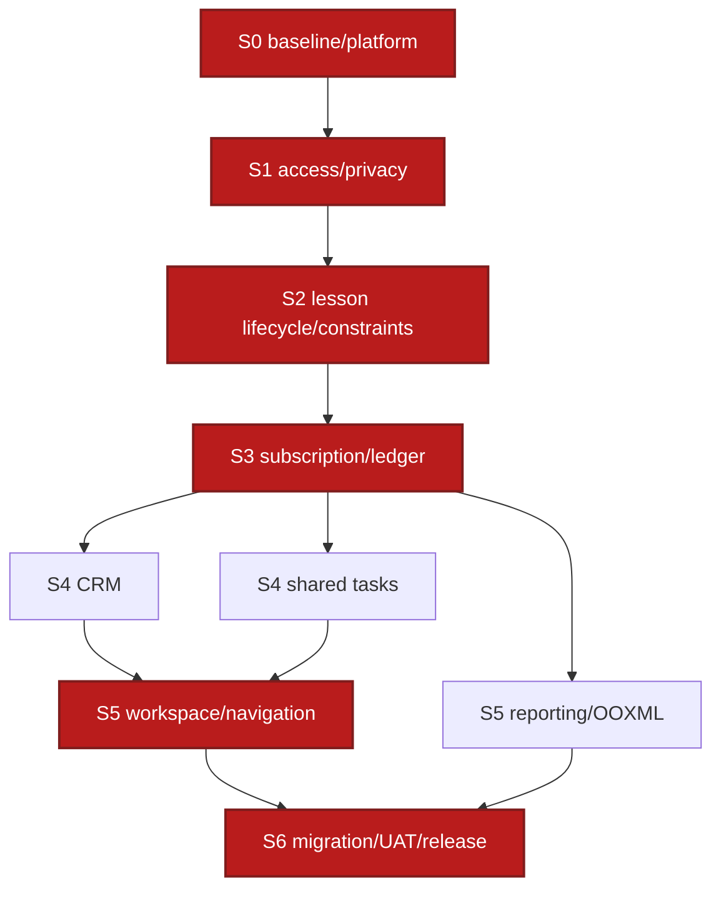

# MagicMusicCRM v4 — Task Plan Review

**Дата:** 2026-07-25  
**Статус:** Passed after remediation  
**Проверяемый файл:** [`05_TASKS.md`](05_TASKS.md)

## 1. Сводка

План проверен по 6 обязательным проходам. Обнаружено одно фактическое несоответствие — первоначальная сумма roadmap не совпадала с суммой L3/INT-оценок; значение исправлено на 528 часов. Открытых Critical/High/Medium/Low findings нет.

| Pass | Critical | High | Medium | Low | Результат |
|---|---:|---:|---:|---:|---|
| A — Дубликаты | 0 | 0 | 0 | 0 | 66 уникальных L3 ID, пересекающихся outputs не найдено |
| B — Неопределённости | 0 | 0 | 0 | 0 | `TODO/TBD/???` и непроверяемых «слов-ощущений» нет |
| C — Детализация | 0 | 0 | 0 | 0 | 73/73 задач имеют все обязательные поля и checked subpoints |
| D — Согласованность | 0 | 0 | 0 | 0 | 0 unknown task refs, 0 dependency cycles |
| E — Покрытие | 0 | 0 | 0 | 0 | 29/29 REQ прямое; 66/66 L3 имеют approved REQ |
| F — Гранулярность | 0 | 0 | 1 resolved | 0 | Все оценки 2–8 ч.; сумма roadmap исправлена |

## 2. Статистика плана

| Показатель | Значение |
|---|---:|
| L3 implementation tasks | 66 |
| Integration milestones | 7 |
| Всего чеклист-задач | 73 |
| P0, включая milestones | 60 |
| P1 | 13 |
| P2 | 0 |
| Суммарная оценка | 528 ч |
| Tasks вне диапазона 2–8 ч | 0 |
| Duplicate task IDs | 0 |
| Unknown requirement IDs | 0 |
| Dependency cycles | 0 |

Баланс Sprint:

| Sprint | L3 tasks | С INT | Комментарий |
|---|---:|---:|---|
| S0 | 5 | 36 ч | Последовательный foundation |
| S1 | 10 | 78 ч | Backend access и Flutter shell частично параллельны после API |
| S2 | 14 | 110 ч | Самая большая P0-волна; UI/worker/tests параллельны после lifecycle/constraints |
| S3 | 8 | 68 ч | Последовательное ядро replace/cancel с параллельным UI |
| S4 | 12 | 94 ч | CRM и WORKFLOW параллельны после INT-S3 |
| S5 | 12 | 100 ч | APP и REPORTING параллельны после EntityLink foundation |
| S6 | 5 | 42 ч | Последовательный release gate |

## 3. Результаты шести проходов

### Pass A — Дубликаты

- Семантические повторы отсутствуют: platform idempotency предоставляет primitive, а domain tasks применяют его к конкретным aggregates.
- `T4.2.5` удаляет attendance domain; `T7.1.2` отдельно меняет read metric — outputs не пересекаются.
- `T2.4.1`, `T4.4.1`, `T5.4.1`, `T6.4.1`, `T1.4.1` — domain regression suites; `INT-SN` проверяют совместную работу Sprint и не дублируют implementation.

### Pass B — Неопределённости

- Placeholder scan по `05_TASKS.md`, ADR и v4 designs: 0 `TODO`, `TBD`, `???`, `permitted role`, `agreed threshold`.
- Latency/limits оцифрованы: access 5 s, logout/entity invalidation 2 s, completion 60 s, task filter 56 px, tabs 10, export 10k/100k.
- Каждая sensitive mutation называет actor, expected behavior и failure result.

### Pass C — Детализация

Механическая проверка 73 blocks подтвердила наличие:

- описания и checked implementation subpoints;
- input и output;
- ссылки на design/ADR;
- Given/When/Then criteria;
- verification type и concrete command/scenario;
- оценки и зависимостей.

### Pass D — Согласованность

- Все 66 task IDs уникальны и все 66 упоминаний dependencies ссылаются на существующие IDs.
- Граф не содержит циклов.
- Domain tasks соответствуют восьми системам `02_ARCHITECTURE_OVERVIEW.md`.
- Критический порядок защищает финансовую целостность: access/platform → lesson → commerce → CRM/workflow → workspace/reporting → migration.

### Pass E — Покрытие

| Группа | REQ | Задачи есть | Сквозной gate |
|---|---:|---:|---|
| RBAC/Privacy/Audit | 4 | 4/4 | INT-S1 + INT-S6 |
| Leads/Clients/Config | 6 | 6/6 | INT-S4 |
| Lessons/Schedule/Teacher | 7 | 7/7 | INT-S2 |
| Subscriptions/Finance | 5 | 5/5 | INT-S3 |
| Tasks | 2 | 2/2 | INT-S4 |
| Navigation/Workspace | 3 | 3/3 | INT-S5 |
| Reports/Export | 2 | 2/2 | INT-S5 |
| **Всего** | **29** | **29/29** | **INT-S0…S6** |

Обратное покрытие: каждая L3-задача содержит хотя бы один exact approved `REQ-*`; platform/release tasks связаны с требованиями audit/integrity, а не добавляют новый продуктовый scope.

## 4. Критический путь

Узкие места:

- `T8.1.4` — общий primitive для конкурентных writes.
- `T2.4.1/INT-S1` — запрет начинать domain UI до доказанной privacy.
- `T4.2.1/T5.1.1/T8.2.1` — последовательная цепь constraint→settlement→worker.
- `T5.4.1/INT-S3` — zero-drift gate до client card/reporting.
- `T1.2.1` — общий EntityLink contract перед полной матрицей переходов.
- `T8.3.1…T8.4.2` — release идёт только последовательно.

## 5. Детальная находка

### TR-V4-001 — Roadmap недооценивал сумму атомарных задач

- **Severity:** Medium (resolved)
- **Pass:** F
- **Место:** ранняя редакция `05_TASKS.md §2`.
- **Доказательство:** автоматическая сумма 66 L3 + 7 INT дала 528 ч., первоначальная таблица показывала 450 ч. Это создавало бы скрытый дефицит 78 ч. и неверные Sprint commitments.
- **Исправление:** каждый Sprint пересчитан из полей `Оценка`; roadmap теперь показывает S0=36, S1=78, S2=110, S3=68, S4=94, S5=100, S6=42, total=528.
- **Проверка:** количество estimate fields=73; values outside 2–8 h=0; сумма=528.
- **Статус:** Resolved.

## 6. Решение аудита

`05_TASKS.md` допускается к исполнению через `/forge` после явного выбора старта S0. План не содержит нерешённых продуктовых вопросов: неизвестные runtime-данные не замаскированы предположениями, а вынесены в обязательные preflight/backfill/reconciliation tasks.
