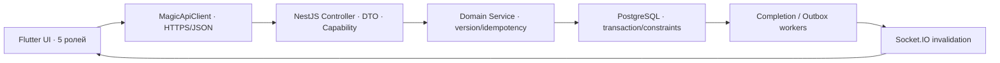

# 🔎 MagicMusicCRM v6/v7 — Deep Probe связей UI → API → Server → DB

| Поле | Значение |
|---|---|
| Дата | 2026-08-08 |
| Режим | Deep PROFILE → REASON → OBJECT → BENCHMARK → EMIT |
| Объём | Flutter + NestJS + PostgreSQL + Socket.IO + production Windows/Android |
| Источники | свежий AST/Git probe, deterministic inventories, full suites, production DB/health/logs |
| Решение | **PASS после двух production root-cause fixes** |

## 1. Executive conclusion

Проверена не только структура репозитория, но и фактическая цепочка на production:
Flutter-сервис → HTTPS API → NestJS policy/DTO → PostgreSQL → durable worker/outbox →
realtime invalidation → повторная загрузка авторизованной проекции.

Probe обнаружил два скрытых разрыва, которые агрегатные тесты не показывали:

1. `app.platform_outbox_events` имел producers и transactional claim/ack API, но не имел
   production consumer. Одно `commerce.subscription.changed` находилось без обработки
   около 17 часов с `attempts=0`.
2. Lesson completion worker был выключен production-конфигурацией, а его due-query
   ошибочно считала рабочими 11 832 legacy Lesson без явно выбранного финансового плана.
   Включение в таком виде могло массово перевести исторические занятия в retry/poison.

Оба разрыва закрыты в общем серверном слое. Outbox теперь lease/retry/dead-letter
доставляет safe invalidation через существующий `RealtimeBus`; readiness показывает его
lag. Completion worker включён, но атомарно выбирает только Lesson с
`lesson_settlement_plans.state='planned'`. Legacy-данные без решения не списывают деньги
и не создают оплату преподавателю.

## 2. Свежая карта

| Метрика | Результат |
|---|---:|
| Файлы / строки / AST parse errors | 1 270 / 310 582 / 0 |
| Git commits / authors | 771 / 5 |
| Flutter production-reachable files | 260 |
| Flutter routes / production screens | 22 / 21 |
| Navigation / modal sites | 266 / 98 |
| Flutter wire calls | 275 |
| Backend routes / DTO fields | 318 / 794 |
| Backend policy calls / role guards | 241 / 22 |
| Finance callsites / protected Lesson writes | 256 / 7 |
| Unknown owners / unknown Lesson mutation callers | 0 / 0 |

Tree-sitter успешно разобрал поддерживаемые языки без ошибок. Его текущий Dart/SQL
адаптер строит module-only nodes и не разрешает Dart imports; поэтому authoritative
доказательством связей Flutter остаются production inventory scripts, а не догадки AST.

## 3. Runtime graph

Клиентские payloads частично остаются map-decoded, поэтому runtime drift нельзя
исключить одной статикой. Этот риск компенсирован full backend suite, Actor Matrix,
двумя реальными device-runs и production log/DB evidence.

## 4. Production evidence

| Проверка | Результат |
|---|---:|
| API image | `sha256:8744ae77276d…01539142` |
| API/PostgreSQL/Redis | healthy; restart=0; OOM=false |
| Readiness | database/migrations/completion/outbox/v4 = `ok` |
| PostgreSQL migrations | 114; latest `0113_lesson_settlement_plan_revisions` |
| Invalid/not-ready indexes | 0 |
| Unvalidated constraints / blocked sessions | 0 / 0 |
| Outbox pending / dead-letter | 0 / 0 |
| Completion due/retry/poison | 0 / 0 / 0 |
| HTTPS readiness burst | 30/30 |
| API errors after stable start | 0 |
| Caddy 5xx after stable start | 0 |

Десять Caddy `502` относятся только к секундам двух контролируемых API recreates
(`no such host`/`connection refused`). После healthy transition — 0. Предыдущее
зависшее outbox-событие не удалялось вручную: новый worker сам обработал его с
`claimed=1 published=1`, после чего DB получила `published_at`.

## 5. Verification matrix

| Gate | Результат |
|---|---:|
| Backend typecheck / Nest build | PASS / PASS |
| Backend full | 156/156 suites; 1244/1244 tests |
| Actor/payload/route policy | 77/77 |
| Flutter full | 648/648 |
| Windows production accounts + relogin | 2/2 |
| Android 15 production accounts + relogin | 2/2 |
| Deterministic v4/v6/v7 inventories | PASS; unowned=0 |

Реальные проверки подтвердили Client/Teacher/Admin/Manager/Director, открытие учеников
преподавателя, cold session recovery, logout и переключение Client → Director → Client.

## 6. Risk matrix

| ID | Риск | Статус | Контроль |
|---|---|---|---|
| R1 | outbox commit без delivery | **closed** | worker + retry/dead-letter + readiness + unit/PostgreSQL tests |
| R2 | массовое settlement legacy Lesson | **closed** | SQL требует explicit planned decision |
| R3 | новые Lesson не завершаются автоматически | **closed** | production worker enabled; full atomic completion suite |
| R4 | 11 832 legacy Lesson не имеют финансового плана | **accepted safe boundary** | не создавать деньги без решения сотрудника; назначать план только через защищённый UI |
| R5 | старые OTP email terminal failures | **monitor** | active queue=0; две записи `smtp_timeout` от 2026-07-19 остаются технической историей |
| R6 | Flutter map payload drift | **residual** | 275-call inventory + service tests + real device runs |

## 7. Rollback

- Backup: `/opt/magicmusiccrm/backups/manual/pre-api-db-stability-20260808T145521Z`.
- PostgreSQL dump: 32 MB, `pg_restore --list` PASS, SHA-256
  `4281a2565705d2cd2ae73afc527f31fa2a6a33109ab7fce4a56730989055a282`.
- Server archive SHA-256:
  `3583967ff909c72eb7d3400af79e478915f4ed323a9a9044f7022e2624a551d1`.
- Previous image: `magicmusiccrm-v3-api:pre-api-db-stability-20260808T145521Z`.
- Backup additionally contains previous `docker-compose.yml` and production `.env`.

## 8. Verdict

**PASS.** Проверенные production связи UI → API → server → DB и обратная realtime/
worker-цепочка функционируют; активных error/retry/poison/dead-letter состояний нет.
Probe не обещает математически невозможное «ошибок никогда не будет»: он подтверждает
исправленные корни, наблюдаемость следующих сбоев и воспроизводимые release gates.
