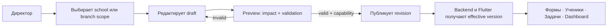
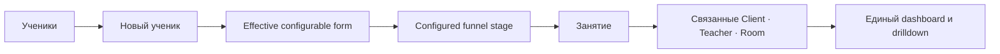

# MagicMusicCRM v6 — Product Requirements Document

| Поле | Значение |
|---|---|
| Функционал | Configurable CRM & Product UX Completion |
| Статус | **Approved — подтверждено владельцем 2026-08-04** |
| Версия документа | 6.0 |
| Дата | 2026-08-04 |
| Основание | Запросы владельца от 2026-08-03/04, `ТЗ СРМ МагМуз-1 (1).docx`, 4 HolliHop-референса и deep probe Flutter/NestJS-кода |
| Предыдущая версия | v5 Discovery; v4 остаётся источником действующих domain/security-инвариантов |

---

## 1. Резюме

v6 превращает текущие разрозненные custom fields и каталоги в управляемую CRM-конфигурацию, доступную на уровне школы и филиала. Одновременно версия закрывает подтверждённый UX-долг учеников, задач, карточки занятия, аналитики и всех routed surfaces, после чего завершает отложенную production/security-приёмку.

## 2. Контекст и проверенное текущее состояние

| Область | Подтверждённое состояние | Продуктовый разрыв |
|---|---|---|
| CRM-конфигурация | Есть custom fields Lead/Student, source/config API, capability overrides и каталог абонементов | Нет единого реестра категорий, placements, справочников, business parameters, school/branch scope и publish lifecycle |
| Ученики | Flutter группирует board через `studentStatusColumns`; backend `status` остаётся free text | «Пробные»/«Пауза» и порядок колонок зашиты в клиенте; директор не управляет воронкой |
| Создание ученика | `CreateStudentDialog` и `createStudent` уже работают из «Управление → Ученики» | В основном разделе «Ученики» нет canonical create action |
| Общие задачи | `TasksWidget` содержит legacy task UX и отдельную кнопку входа в `SharedTasksV4Panel` | Два соседних сценария, два create flow; в самом shared panel одновременно header action и FAB |
| Карточка занятия | Sheet получает display names, но не получает entity IDs | Ученик/Лид, преподаватель и аудитория не открываются как связанные записи |
| Аналитика | `ReportsWidget` показывает «Отчёты», «Финансы», «Активность», «Управление», «Абонементы», «Преподаватели», «Сводка» отдельными табами и загрузчиками | Нет единого dashboard, общей модели фильтров и согласованных диаграмм |
| Desktop workspace | Есть account-aware store/controller/shell и isolated widget tests | Shell/persistence/logout coordinator не подключены ни к одному production route; в v4 inventory осталось 327 `workspace-migration-pending` записей |
| Desktop scrolling | Global behavior удаляет glow; локальные scrollbars встречаются точечно | Нет системных видимых вертикальных/горизонтальных полос, draggable mouse thumbs и route-wide acceptance |
| Карточка клиента | Есть 8 student tabs, ledger, recurring series editor и переход из lesson row в schedule | Desktop dialog ограничен 600 px; schedule editor находится в «Инфо»; «Занятия» — плоский список без embedded Month/Week/Day context |
| Оплаты клиента | Есть отдельная вкладка, личный счёт и минимальное пополнение | Create payment принимает только сумму/комментарий и hardcode-ит method/date; нет полного branch/method/status/discount/surcharge/installment UX |
| Deep links | Есть typed `EntityLink` registry/navigator и отдельные переходы | Нет системного adoption; lesson details не получает IDs; Back/context preservation не единообразны |
| UX/UI | Есть v7 tokens/components и точечные regression fixes | Нет полного inventory форм, icon actions, подписей, navigation и loading/empty/error/forbidden states |
| Release | Технические v4-gates в основном пройдены | Security gate owner-deferred, известная High открыта, GitHub/privacy/rotation не подтверждены, production не approved |

### 2.1 Подтверждающие пути

- `lib/features/manager/presentation/providers/students_board_providers.dart`
- `lib/features/manager/presentation/widgets/students_board_widget.dart`
- `lib/features/crm/presentation/client_forms/client_create_dialogs.dart`
- `lib/features/admin/presentation/widgets/manage_entities_widget.dart`
- `lib/features/manager/presentation/widgets/tasks_widget.dart`
- `lib/features/manager/presentation/widgets/shared_tasks_v4_panel.dart`
- `lib/features/admin/presentation/widgets/lesson_details_sheet.dart`
- `lib/core/navigation/entity_link_navigator.dart`
- `lib/features/manager/presentation/widgets/reports_widget.dart`
- `.anws/v4/08_RELEASE_READINESS_REPORT.md`

## 3. Терминология

| Термин | Однозначное значение |
|---|---|
| Business configuration | Бизнес-метаданные и правила, которые можно менять без нарушения security, history и data integrity |
| Protected invariant | Не редактируемое через CRM правило доступа, идентичности, аудита, финансовой неизменяемости, lifecycle или concurrency |
| School configuration | Общешкольные значения по умолчанию |
| Branch override | Явное переопределение разрешённого ключа для одного филиала поверх school default |
| Effective configuration | Детерминированный результат `school default + branch override` одной опубликованной версии |
| Configuration area | Настраиваемая область: Lead, Student, Lesson, Task, Subscription, Analytics или другая зарегистрированная бизнес-область |
| Category | Упорядоченная секция полей на форме или карточке |
| Field placement | Размещение одного определения поля на форме, карточке, таблице или board без копирования определения |
| Dictionary | Versioned список бизнес-вариантов со stable keys и пользовательскими labels |
| Business parameter | Типизированное effective-dated число, сумма, процент, длительность или boolean default |
| Student funnel | Опубликованный набор стадий, порядка и разрешённых переходов доски «Ученики» |
| Published revision | Атомарный immutable snapshot конфигурации, используемый backend и Flutter |
| Canonical scenario | Единственный основной пользовательский путь для операции после миграции legacy-пути |
| Desktop workspace tab | Account-scoped вкладка с собственным route stack и восстанавливаемым пользовательским контекстом |
| Preferred schedule | Предпочтения/серия постоянного расписания клиента; это не фактический Lesson и не financial fact |
| Actual payment | Датированное поступление денег с филиалом, способом, статусом, оператором и audit identity |

## 4. Цели

- **G1 — Config coverage:** 100% зарегистрированных business dropdowns, configurable fields/categories/placements и business defaults читаются из effective published configuration; hardcoded business choices вне compatibility seed отсутствуют.
- **G2 — Scope parity:** для каждой area явно указан `school-only`, `branch-override` или `branch-only`; effective configuration проходит 100% school/branch matrix.
- **G3 — Safe publication:** ни одна draft/invalid/partial revision не влияет на active UI или backend validation; publish атомарен и инвалидирует затронутые сессии не позднее 5 секунд.
- **G4 — Canonical UX:** у создания ученика и общей задачи остаётся по одному canonical flow; legacy write paths и дублирующие primary actions равны нулю.
- **G5 — Connected context:** 100% доступных Student/Lead, Teacher и Room refs из lesson sheet открываются через actor-safe typed navigation без потери состояния расписания.
- **G6 — Unified insight:** operational и разрешённые финансовые показатели открываются в одном dashboard и используют одну модель периода/филиала; count, chart и drilldown predicates совпадают.
- **G7 — UX completeness:** 100% routed screens включены в inventory; у каждой формы и icon-only action есть понятная подпись/semantic label; loading, empty, error, forbidden и retry states приняты.
- **G8 — Production readiness:** Critical/High security findings = 0, repository privacy и credential rotation подтверждены, full security gate и owner UAT пройдены, production decision записан явно.
- **G9 — Desktop operability:** account-scoped 2–10 tabs реально смонтированы, восстанавливаются после restart, очищаются при logout; 100% desktop scrollables доступны мышью с видимыми полосами обоих применимых направлений.
- **G10 — Client workspace:** на Windows карточка клиента является быстрым полноразмерным рабочим пространством; preferred schedule, client calendar, payments и связанные записи доступны без повторного поиска и потери контекста.

## 5. Non-Goals

- **NG1:** Пользователь не загружает и не исполняет произвольный Dart/JavaScript/SQL, скрипты или формулы внутри CRM.
- **NG2:** Названия root-ролей, порядок capability evaluation, auth/session rules, audit semantics и privacy boundaries не становятся пользовательской конфигурацией.
- **NG3:** Исторические платежи, ledger/settlement facts, выданные коммерческие snapshots и завершённые lifecycle events не переписываются при изменении конфигурации.
- **NG4:** Используемая настройка не удаляется физически; она архивируется. Physical delete разрешён только для никогда не использованной записи.
- **NG5:** v6 не создаёт новый UI framework, второй navigation registry, второй capability engine или отдельный parallel task domain.
- **NG6:** Микросервисная переработка и смена Flutter/NestJS/PostgreSQL стека не входят в scope.
- **NG7:** Production rollout не выполняется автоматически после технических тестов и требует явного решения владельца.
- **NG8:** HolliHop используется как функциональный и информационно-архитектурный ориентир; его визуальный стиль, модель доступа и небезопасные mutable/delete semantics не копируются.

## 6. Пользовательские истории и требования

### US-V6-001 — Единая конфигурационная модель [REQ-CFG-001] (P0)

- **История:** Как Директор, я хочу видеть единый каталог настраиваемых областей, чтобы не искать независимые настройки в разных разделах.
- **Ценность:** Все business configuration имеет один управляемый lifecycle и понятный scope.
- **Затронутые системы:** SYS-APP, SYS-ACCESS, SYS-CRM, SYS-COMMERCE, SYS-WORKFLOW, SYS-REPORTING, SYS-PLATFORM.
- **Автономная проверка:** Зарегистрировать по одной school-only и branch-overridable area, получить effective metadata для двух филиалов.
- **Критерии приемки:**
  - **Given** опубликован school default и override филиала A, **When** одинаковый actor открывает area в филиалах A и B, **Then** A получает override, B — school default, а версия и источник каждого effective value видимы.
  - **Given** area не поддерживает branch scope, **When** пользователь пытается создать override, **Then** сервер возвращает field-level validation error и ничего не публикует.
  - **Given** неизвестный config key, **When** его присылает клиент, **Then** backend fail-closed отклоняет запрос и не сохраняет значение.

### US-V6-002 — Категории, поля и размещение [REQ-CFG-002] (P0)

- **История:** Как уполномоченный конфигуратор, я хочу создавать категории и размещать typed fields на формах и карточках, чтобы CRM соответствовала процессу школы без Flutter-релиза.
- **Ценность:** Формы Lead/Student и следующие зарегистрированные business surfaces меняются через metadata.
- **Затронутые системы:** SYS-APP, SYS-CRM, SYS-ACCESS, SYS-PLATFORM.
- **Автономная проверка:** Создать category и каждый поддержанный field type, разместить на create/edit/card/table surfaces, проверить required/hidden/read-only rules.
- **Критерии приемки:**
  - **Given** опубликовано поле с category/order/width, **When** открываются разрешённые surfaces на Windows и Android, **Then** одно определение отображается в заданных placements без дублирования данных.
  - **Given** поле required или имеет typed validation, **When** отправлено неверное значение, **Then** Flutter показывает field error, а backend независимо отклоняет тот же payload.
  - **Given** системное поле допускает только placement/label, **When** конфигуратор пытается сменить его storage type или invariant, **Then** publish блокируется с объяснением protected property.

### US-V6-003 — Справочники, параметры и варианты выбора [REQ-CFG-003] (P0)

- **История:** Как Директор, я хочу управлять вариантами бизнес-списков и числовыми defaults, чтобы допустимые значения не были зашиты в приложении.
- **Ценность:** Изменение бизнес-терминов и defaults не требует нового клиента при сохранении стабильных исторических ключей.
- **Затронутые системы:** SYS-APP, SYS-CRM, SYS-SCHEDULE, SYS-COMMERCE, SYS-WORKFLOW, SYS-REPORTING, SYS-PLATFORM.
- **Автономная проверка:** Изменить label/order/style активного option, архивировать используемый option, задать school parameter и branch override.
- **Критерии приемки:**
  - **Given** business dropdown зарегистрирован как configurable, **When** опубликован новый option, **Then** новые формы показывают его по stable key без client release.
  - **Given** option уже используется, **When** он архивирован, **Then** historical records сохраняют snapshot label/key, а новые формы не предлагают option.
  - **Given** effective-dated parameter изменён, **When** создаётся новый бизнес-snapshot, **Then** он получает новое значение; старые snapshots не меняются.
  - Role IDs, lifecycle terminal states, audit event types и протокольные enum остаются protected invariants.

### US-V6-004 — Черновик, preview, publish и rollback [REQ-CFG-004] (P0)

- **История:** Как конфигуратор, я хочу безопасно проверить изменения до публикации и вернуть прошлую конфигурацию новой ревизией, чтобы не ломать активную CRM.
- **Ценность:** Частично применённая конфигурация и рассинхронизация backend/UI невозможны.
- **Затронутые системы:** SYS-APP, SYS-ACCESS, SYS-PLATFORM и все consuming systems.
- **Автономная проверка:** Draft с несовместимой сменой типа, impact preview, concurrent publish, rollback и two-session invalidation.
- **Критерии приемки:**
  - **Given** draft содержит orphaned value, duplicate key, invalid placement или запрещённый override, **When** запускается preview/publish, **Then** виден полный impact report и publish запрещён.
  - **Given** valid draft, **When** publish подтверждён с expected base version и reason, **Then** создаётся одна immutable revision и все затронутые сессии получают новую effective version ≤5 s.
  - **Given** два concurrent publish одной base version, **When** оба подтверждены, **Then** проходит один, второй получает conflict с current version.
  - Rollback не удаляет историю: он публикует новую revision из выбранного предыдущего snapshot.

### US-V6-005 — Делегирование config-доступов [REQ-CFG-005] (P0)

- **История:** Как Директор, я хочу делегировать конкретному сотруднику чтение, изменение или публикацию отдельных areas, чтобы не выдавать лишние права.
- **Ценность:** Настройки распределяются по ответственности без role escalation.
- **Затронутые системы:** SYS-ACCESS, SYS-APP, SYS-PLATFORM.
- **Автономная проверка:** Матрица Director/system_admin/delegated/non-delegated по read/edit/publish и school/branch scope.
- **Критерии приемки:**
  - Делегирование использует существующий capability registry и personal overrides, а не отдельную ACL.
  - **Given** пользователь имеет edit без publish, **When** он сохраняет draft и пытается опубликовать, **Then** draft сохраняется, publish получает 403.
  - **Given** branch-scoped delegation, **When** пользователь меняет другой филиал или school default, **Then** операция запрещена до чтения/мутации защищённых данных.
  - Protected invariants нельзя снять personal override.

### US-V6-006 — Настраиваемая воронка учеников [REQ-STUDENT-001] (P0)

- **История:** Как Директор, я хочу настраивать стадии, порядок и допустимые переходы в «Учениках» для школы или филиала, чтобы доска соответствовала рабочему процессу.
- **Ценность:** «Пробные», «Пауза» и будущие стадии перестают быть Flutter-константами.
- **Затронутые системы:** SYS-CRM, SYS-APP, SYS-ACCESS, SYS-PLATFORM.
- **Автономная проверка:** School funnel, branch override, D&D allowed/denied transition, unknown legacy status.
- **Критерии приемки:**
  - **Given** опубликован funnel, **When** открыта доска, **Then** колонки, labels, порядок и style берутся из effective configuration.
  - **Given** transition запрещён или stage архивирован, **When** карточку перетаскивают, **Then** server отклоняет move, UI возвращает карточку и показывает причину.
  - **Given** legacy status не сопоставлен, **When** выполняется migration/preflight, **Then** запись попадает в явный remediation bucket и не теряется.
  - Empty/unknown stage не становится молча droppable fallback.

### US-V6-007 — Создание ученика в основном разделе [REQ-STUDENT-002] (P0)

- **История:** Как сотрудник с `crm.client.write`, я хочу создавать ученика из основного раздела «Ученики», чтобы не переходить в «Управление».
- **Ценность:** Основной рабочий сценарий становится самодостаточным.
- **Затронутые системы:** SYS-APP, SYS-CRM, SYS-ACCESS.
- **Автономная проверка:** Открыть create action на Students board, создать ученика с effective fields/stage/branch и увидеть карточку без ручного refresh.
- **Критерии приемки:**
  - Используется существующий canonical student create command; второй backend endpoint не создаётся.
  - Форма получает effective configuration выбранного филиала и валидируется сервером.
  - При success board обновляется и открывает/подсвечивает созданную запись; при 403/422/сети введённые данные не теряются.
  - У пользователя без write capability create action отсутствует.

### US-V6-008 — Один сценарий общих задач [REQ-TASK-001] (P0)

- **История:** Как сотрудник, я хочу создавать, фильтровать и закрывать общие задачи в одном разделе, чтобы не выбирать между legacy и v4 UI.
- **Ценность:** Один понятный task workflow и одна shared state model.
- **Затронутые системы:** SYS-WORKFLOW, SYS-APP, SYS-ACCESS, SYS-PLATFORM.
- **Автономная проверка:** Создание на users/branch/all branches, list/filter/edit/close, concurrent close, migrated legacy tasks.
- **Критерии приемки:**
  - На каждом viewport есть ровно один визуально основной create action; header+FAB duplication отсутствует.
  - `TasksWidget` и `SharedTasksV4Panel` не остаются двумя соседними продуктами: navigation ведёт в один canonical surface и один write contract.
  - Legacy tasks мигрируются losslessly либо остаются явно read-only до remediation; новый legacy write path отсутствует.
  - Recipients, branch audience, linked entity, reminders, filters и shared close доступны в canonical flow.

### US-V6-009 — Приёмка задач и язык действий [REQ-TASK-002] (P1)

- **История:** Как сотрудник реальной школы, я хочу понимать адресата и действие каждой задачи, чтобы не ошибаться при создании и закрытии.
- **Ценность:** Технически подключённые recipients/branches становятся подтверждённым рабочим UX.
- **Затронутые системы:** SYS-APP, SYS-WORKFLOW.
- **Автономная проверка:** Owner UAT на реальном account и минимум двух филиалах, screen-reader/tooltip inventory.
- **Критерии приемки:**
  - Все create/edit/close/reschedule/delete actions имеют единые глагольные labels и confirmation policy.
  - Dynamic branch audience и explicit user audience визуально различимы до submit.
  - UAT evidence покрывает single user, multiple users, one branch и all branches на Windows и Android.

### US-V6-010 — Переходы из карточки занятия [REQ-NAV-001] (P0)

- **История:** Как сотрудник, я хочу открыть ученика/лида, преподавателя и аудиторию из занятия, чтобы не искать запись заново.
- **Ценность:** Карточка занятия становится частью связанного workspace.
- **Затронутые системы:** SYS-APP, SYS-ACCESS, SYS-SCHEDULE, SYS-CRM.
- **Автономная проверка:** Student, Lead trial, Teacher, Room, missing ref, forbidden ref и back navigation на Windows/Android.
- **Критерии приемки:**
  - Sheet получает typed entity references, а не пытается восстановить ID из display names.
  - Доступная строка имеет явный affordance, keyboard focus и semantic label; нажатие использует существующий actor-safe entity navigator.
  - Forbidden/deleted/missing ref показывает устойчивое состояние без раскрытия причины существования недоступной записи.
  - Возврат сохраняет дату, режим, фильтры и scroll расписания.

### US-V6-011 — Единый dashboard аналитики [REQ-REPORT-001] (P0)

- **История:** Как Управляющий или Директор, я хочу видеть доступные показатели в одном dashboard с общими фильтрами, чтобы не сопоставлять разные вкладки вручную.
- **Ценность:** Operational и финансовая аналитика образуют одно объяснимое представление с RBAC.
- **Затронутые системы:** SYS-REPORTING, SYS-APP, SYS-ACCESS, SYS-PLATFORM.
- **Автономная проверка:** Role matrix, общий период/филиал, cards/charts/drilldowns/export, partial endpoint failure.
- **Критерии приемки:**
  - «Отчёты», «Финансы» и legacy «Сводка» объединены в один dashboard; отдельные рабочие модули могут оставаться sections, но не дублировать одни показатели.
  - Период и филиал задаются один раз; каждая card/chart/list/export получает идентичный normalized filter или явно помечает неприменимость.
  - Manager не видит и клиент не запрашивает school finance; Director/system_admin видят финансовые sections согласно capability snapshot.
  - Count, chart point и drilldown list используют одинаковые predicates; discrepancy gate = 0 unexplained rows/amounts.
  - Ошибка одной section не заменяет весь dashboard и предоставляет локальный retry.

### US-V6-012 — Системный UX/UI-аудит [REQ-UX-001] (P0)

- **История:** Как пользователь любой роли, я хочу одинаково понятные формы, действия, навигацию и состояния, чтобы не угадывать поведение каждого экрана.
- **Ценность:** Точечные исправления превращаются в проверяемую консистентность приложения.
- **Затронутые системы:** SYS-APP и все surfaced domain systems.
- **Автономная проверка:** Route × role × Windows/Android inventory с automated widget/accessibility checks и owner UAT.
- **Критерии приемки:**
  - 100% routed screens имеют owner, primary action, loading, empty, error, forbidden, retry и responsive-state отметку либо обоснованное N/A.
  - 100% icon-only interactive controls имеют tooltip/semantic label; primary destructive actions имеют однозначную подпись и confirmation.
  - Формы используют единые labels, required markers, field/server errors, disabled/saving/success behavior и сохраняют input при retry.
  - Navigation/back/deep link не теряет незавершённую форму или фильтры без явного решения пользователя.
  - Новые UI primitives создаются только если существующие v7 tokens/components не покрывают подтверждённый повторяющийся паттерн.

### US-V6-013 — Закрытие security-долга [REQ-SEC-001] (P0)

- **История:** Как владелец продукта, я хочу устранить отложенные security-риски до production, чтобы релиз не зависел от исключения владельца.
- **Ценность:** Production approval опирается на evidence, а не на waiver.
- **Затронутые системы:** SYS-PLATFORM, SYS-ACCESS, repository/CI/runtime operations.
- **Автономная проверка:** Privacy check, history/runtime secret scan, key rotation evidence, dependency/SAST/container/filesystem gates.
- **Критерии приемки:**
  - GitHub repository подтверждён как private до начала release gate.
  - Все credentials, затронутые известной High или обнаруженные scan, ротированы; старые значения отозваны и не проходят authentication.
  - History secret scan, runtime env exposure, Flutter secret boundary, source maps, Docker context/non-root, dependency, SAST и image/filesystem scans выполняются без owner-deferred.
  - Critical/High findings = 0; Moderate имеют owner, срок и документированное release решение.

### US-V6-014 — Финальная production-приёмка [REQ-REL-001] (P0)

- **История:** Как владелец продукта, я хочу получить единый release decision после технической и пользовательской приёмки, чтобы production rollout был обратимым и явно разрешённым.
- **Ценность:** Незакрытый INT-S6 получает финальный доказуемый исход.
- **Затронутые системы:** Все системы и operations.
- **Автономная проверка:** Production-shaped migration, reconciliation, shadow parity, backup/restore, staged rollout/rollback, monitoring, Windows/Android UAT.
- **Критерии приемки:**
  - Все v6 P0 requirements и унаследованные незакрытые v4 release requirements имеют evidence.
  - Migration blockers, unexplained parity diff, financial drift, duplicate facts и poison/dead-letter backlog равны нулю.
  - Owner UAT включает configurable CRM, Students, Tasks, Lesson links, Dashboard и UX route matrix на реальном account.
  - Production разрешён только явной записью `APPROVED`; любой незакрытый Critical/High или failed rollback оставляет `NOT APPROVED`.

### US-V6-015 — Реальные account-scoped вкладки на ПК [REQ-WORKSPACE-001] (P0)

- **История:** Как сотрудник на Windows, я хочу одновременно держать открытыми 2–10 рабочих вкладок и возвращаться к ним после перезапуска, чтобы не терять контекст между клиентами, расписанием, задачами и отчётами.
- **Ценность:** Параллельная офисная работа становится частью production shell, а не isolated demo.
- **Затронутые системы:** SYS-APP, SYS-ACCESS, SYS-PLATFORM и все routed surfaces.
- **Автономная проверка:** Реальный login → открыть/переупорядочить/дублировать 10 tabs → process restart → restore → logout → login тем же и другим account.
- **Критерии приемки:**
  - Production dashboard/router монтирует существующий `DesktopWorkspaceShell`; второй tab engine не создаётся.
  - **Given** пользователь A закрыл приложение с несколькими tabs, **When** он входит повторно, **Then** восстанавливаются только его разрешённые routes, active tab и route stacks; запрещённый/stale route заменяется безопасным fallback.
  - **Given** выполнен logout из любой поверхности/сессии, **When** account входит снова, **Then** сохранённые tabs этого account отсутствуют; tabs другого account никогда не отображаются.
  - Лимит 10, close/close others/reorder/duplicate, dirty-form decision, keyboard focus и context restore проходят Windows device test.

### US-V6-016 — Полная мышиная навигация и видимые scrollbars [REQ-DESKTOP-001] (P0)

- **История:** Как пользователь ПК без тачпада, я хочу видеть и перетаскивать полосы прокрутки по обеим применимым осям, чтобы любой экран был работоспособен только мышью.
- **Ценность:** Windows перестаёт быть увеличенной touch-версией.
- **Затронутые системы:** SYS-APP и все desktop scrollables.
- **Автономная проверка:** Inventory каждого vertical/horizontal/nested scrollable, Windows mouse-only pass, keyboard pass и narrow/wide viewport matrix.
- **Критерии приемки:**
  - На Windows каждый scrollable с overflow показывает заметные track/thumb; thumb можно зажать мышью и протянуть до начала/конца.
  - Horizontal tables, boards, tab strips и calendars имеют видимую horizontal bar; wheel/Shift+wheel policy единообразна и не крадёт vertical scroll у родителя.
  - Mobile не получает постоянно видимые desktop tracks; touch scrolling и accessibility не регрессируют.
  - Nested scrollables имеют раздельные controllers и не выбрасывают `attached to multiple scroll views`/pointer exceptions.

### US-V6-017 — Полноразмерная карточка и расписание клиента [REQ-CLIENT-001] (P0)

- **История:** Как администратор/управляющий, я хочу работать с клиентом в полноразмерной карточке и видеть его preferred/actual schedule в одном разделе «Занятия», чтобы не искать данные в «Инфо» и общем календаре.
- **Ценность:** Основной клиентский workflow соответствует desktop-скорости и приложенному функциональному ориентиру HolliHop.
- **Затронутые системы:** SYS-APP, SYS-CRM, SYS-SCHEDULE, SYS-ACCESS.
- **Автономная проверка:** Desktop/mobile layout, preferred schedule CRUD, Month/Week/Day calendar, branch switch, role scope, linked lesson and Back restore.
- **Критерии приемки:**
  - На Windows карточка использует доступное рабочее пространство (full-screen или large routed surface), а не фиксированный 600 px dialog; mobile остаётся adaptive sheet/route.
  - `StudentScheduleSection` и preferred schedule editor перемещены из «Инфо» в canonical «Занятия» без второго API/domain.
  - «Занятия» предоставляет Month/Week/Day; default branch берётся из effective client branch, пользователь может выбрать разрешённый филиал или доступный общешкольный scope.
  - Занятия выбранного клиента выделены success/green visual hierarchy, остальные actor-visible lessons — neutral gray; цвет не заменяет lifecycle state и имеет нецветовой marker/legend.
  - Preferred schedule поддерживает дату начала/окончания, дни недели, время/длительность, количество занятий в день, описание и разрешённый school/branch scope; фактические lessons остаются отдельными facts.

### US-V6-018 — Полный раздел оплат клиента [REQ-PAYMENT-001] (P0)

- **История:** Как сотрудник с доступом к финансам клиента, я хочу добавлять и проверять оплаты в отдельной вкладке карточки, чтобы корректно вести личный счёт, скидки, доплаты и рассрочки.
- **Ценность:** Кассовый workflow перестаёт быть минимальным top-up и не смешивается с каталогом абонементов.
- **Затронутые системы:** SYS-APP, SYS-COMMERCE, SYS-CRM, SYS-ACCESS, SYS-PLATFORM.
- **Автономная проверка:** Create actual payment, pending/paid transition, cash/non-cash, branch/school scope, discount/surcharge/installment, ledger reconciliation, retry/idempotency and role matrix.
- **Критерии приемки:**
  - Canonical Payments tab показывает личный счёт, приход/расход, actual payments, commercial obligations/installments и audit identity без изменения immutable history.
  - Create payment явно запрашивает дату, филиал, сумму, способ, статус, кто добавил/принял, комментарий и invoice/receipt identifier согласно effective configuration.
  - Скидка, доплата и рассрочка моделируются typed operations/terms с reason и reconciliation; отрицательная сумма или скрытая перезапись historical fact запрещены.
  - Default branch берётся из клиента; `all school` разрешён только для действительно общешкольной операции и capability, иначе запись всегда branch-scoped.
  - При retry создаётся ровно один payment/ledger effect; count/amount/balance до и после совпадают, а 403/422/network failure сохраняет введённую форму.

### US-V6-019 — Системные deep links и возврат контекста [REQ-NAV-002] (P0)

- **История:** Как пользователь, я хочу нажимать на любую доступную связанную запись и возвращаться Back туда же, чтобы не выполнять повторный поиск.
- **Ценность:** CRM становится связанным workspace, а не набором изолированных экранов.
- **Затронутые системы:** SYS-APP и все surfaced domain systems.
- **Автономная проверка:** Entity-link inventory по Client/Lead/Student/Teacher/Room/Lesson/Task/Payment/Subscription/Branch/User/Report drilldown на Windows/Android.
- **Критерии приемки:**
  - Все отображаемые typed refs используют существующий `EntityRouteRegistry`/navigator; новые локальные route switch и ID lookup по display name запрещены.
  - На Windows обычное открытие использует current workspace tab, explicit open-new создаёт tab; mobile использует один route stack.
  - Back сохраняет tab, фильтры, calendar mode/date/branch, list position и незавершённую форму согласно dirty-state policy.
  - Forbidden/deleted/archived refs показывают actor-safe state без existence leak; display text без разрешённого ref остаётся некликабельным и визуально честным.

### US-V6-020 — Приёмка v4 по реальным пользовательским workflow [REQ-UX-002] (P0)

- **История:** Как владелец, я хочу видеть доказательство каждого пункта ТЗ в реальном приложении, чтобы isolated tests не выдавались за готовый продукт.
- **Ценность:** Completion измеряется видимым поведением пользователя.
- **Затронутые системы:** Все системы.
- **Автономная проверка:** 26-point ТЗ matrix + top workflows для 6 ролей, school/branch scopes, Windows mouse-only и Android touch на seeded real account.
- **Критерии приемки:**
  - Каждый пункт ТЗ имеет `implemented/missing/blocked`, production route, role, scope, screenshot/video evidence, API trace и defect link; `implemented` без production mount запрещён.
  - Для каждого основного workflow фиксируются start state, user goal, happy path, validation/error/retry, Back/deep link и resulting data reconciliation.
  - HolliHop используется как функциональный benchmark, но final UI соответствует MagicMusic v7 tokens и RBAC/integrity invariants.
  - Owner подписывает UAT только после проверки на своём account; отсутствие seed/backend/device evidence остаётся `blocked`, а не автоматически `passed`.

### US-V6-021 — Адаптивные поверхности и системный Back [REQ-SURFACE-001] (P0)

- **История:** Как пользователь телефона, я хочу, чтобы рабочие окна занимали доступную ширину, могли раскрываться до полного экрана и корректно закрывались системной кнопкой Back, чтобы интерфейс ощущался как нативное приложение.
- **Ценность:** Формы и карточки перестают быть тесными desktop-dialog на мобильном экране, а возврат становится предсказуемым и безопасным для данных.
- **Затронутые системы:** SYS-APP и все routed/modal surfaces.
- **Автономная проверка:** Android compact/medium matrix, drag/snap/fullscreen, hardware/predictive Back, keyboard inset, safe areas, dirty form и nested overlay.
- **Критерии приемки:**
  - Primary workflow (карточка клиента, оплата, занятие, конфигурация, отчёт) открывается как полноэкранный route на compact width; sheet используется только для quick view/selection, dialog — только для короткого решения.
  - Mobile sheet занимает всю безопасную ширину, имеет видимый drag handle, snap-состояния, `maxChildSize = 1.0` и явное действие «Развернуть»; контент использует переданный `ScrollController`.
  - Верхняя app bar показывает Back при наличии предыдущего route; Android system/predictive Back сначала закрывает верхний overlay, затем route, и никогда молча не переносит пользователя на home.
  - Dirty form блокирует уход через UI Back, system Back, gesture, breadcrumb и закрытие tab одним и тем же Save/Discard/Cancel решением.
  - Safe area, экранная клавиатура, landscape, screen reader и reduced motion не скрывают primary action и не делают sheet неуправляемым.

### US-V6-022 — Контекстная строка и breadcrumbs на ПК [REQ-NAV-003] (P0)

- **История:** Как сотрудник на ПК, я хочу видеть путь до текущего объекта и переходить к любому разрешённому предку, чтобы не нажимать «Назад» много раз и не терять рабочую вкладку.
- **Ценность:** Глубокие CRM-сценарии получают навигацию уровня Проводника без смешивания истории и иерархии.
- **Затронутые системы:** SYS-APP, SYS-ACCESS и все deep-linkable entities.
- **Автономная проверка:** 1–8 breadcrumb nodes, ellipsis, keyboard, narrow desktop, forbidden/stale ancestor, tab-specific Back/Forward history и direct deep link.
- **Критерии приемки:**
  - Desktop context bar содержит Back, Forward, breadcrumbs и page actions; Back/Forward работают только с историей активной вкладки, breadcrumbs — только с иерархией текущего route.
  - Breadcrumb nodes формируются из typed route metadata, а не из display text; текущий node не кликабелен, доступные предки открываются без создания случайной новой вкладки.
  - При нехватке ширины старые nodes сворачиваются в доступное меню `…`, page actions уходят в overflow, а название текущего объекта остаётся видимым.
  - Direct deep link восстанавливает корректный breadcrumb trail даже без предшествующей in-app навигации; forbidden/stale node заменяется actor-safe fallback без existence leak.
  - Medium/compact layouts не имитируют desktop breadcrumbs: используют Back + краткий title и при необходимости доступное меню пути.

## 7. Сквозные UX-потоки

## 8. Сквозные ограничения

### 8.1 Безопасность и данные

- Backend остаётся источником истины для access, validation и domain invariants; Flutter metadata не является авторизацией.
- Effective configuration partitioned минимум по school, branch, actor projection и published version.
- Sensitive config values не попадают в realtime payload; event содержит только scope, area и version.
- Любая config mutation versioned, idempotent, audited и применяет expected version.
- Используемые stable keys и historical snapshots не переименовываются как storage identity.
- Branch override не расширяет resource scope actor-а.

### 8.2 Производительность и устойчивость

- Effective configuration read p95 < 700 ms без прогретого client cache на production-like dataset.
- Повторное открытие той же published version использует cache; invalidation до active session ≤5 s.
- Dashboard initial usable content p95 < 2 s; медленная section загружается независимо и не блокирует остальные.
- Student board сохраняет server pagination/virtualization path; лимит 500 не считается production-ready pagination.
- Publish, student move и task close безопасны при concurrent retry.

### 8.3 Совместимость и миграция

- Existing public API может оставаться compatibility façade только на время миграции; parity измеряется до удаления legacy path.
- Hardcoded business enums сначала регистрируются как seeded stable config keys, затем consumers переключаются на published metadata, после чего constants удаляются.
- Unknown/legacy values никогда не теряются молча и попадают в remediation inventory.
- Android остаётся single-stack; Windows использует существующий workspace/tab model.

## 9. Метрики успеха

| Метрика | Цель | Evidence |
|---|---:|---|
| Зарегистрированные configurable business choices, читаемые из published config | 100% | Automated inventory + code scan |
| School/branch effective resolution cases | 100% | PostgreSQL actor/scope matrix |
| Partial/invalid live revisions | 0 | Publish concurrency/integration suite |
| Config invalidation active sessions | ≤5 s | Two-session integration test |
| Hardcoded Student funnel stages после cutover | 0 | Flutter/server source inventory |
| Primary create actions Student/Task на surface | 1 | Widget tests + UAT |
| New legacy task writes | 0 | Route/inventory/database evidence |
| Valid lesson refs with actor-safe navigation | 100% | Widget/route matrix |
| Production routes, смонтированные в desktop workspace | 100% | Router inventory + Windows device test |
| Account tab restore after restart / residual tabs after logout | 100% / 0 | Two-account restart/logout test |
| Desktop scrollables с mouse-draggable visible bars | 100% применимых осей | Scroll inventory + Windows mouse UAT |
| Client Lessons с preferred schedule и Month/Week/Day calendar | 100% | Widget/API/device matrix |
| Create-payment required fields и ledger reconciliation | 100% / 0 drift | Contract + PostgreSQL integration + UAT |
| Typed entity refs, использующие canonical navigator | 100% | Entity-link inventory |
| Dashboard unexplained count/amount/filter differences | 0 | Reporting reconciliation tests |
| Routed screens с полным UX-state inventory | 100% | Signed audit matrix |
| Icon-only controls без semantic label/tooltip | 0 | Widget/accessibility scan |
| Security Critical/High | 0 | Full security gate |
| Owner-deferred release gates | 0 | Release report |

## 10. Зависимости и порядок продукта

1. Зафиксировать v4 baseline, 26-point claim-gap, open High и runtime/repository evidence.
2. Смонтировать существующий desktop workspace и глобальную mouse/scrollbar policy.
3. Пересобрать client workspace: full desktop card, Lessons/preferred calendar, Payments и typed links.
4. Ввести безопасный configuration registry, scopes, revision lifecycle и delegated capabilities.
5. Перевести Student funnel и configurable forms на effective metadata.
6. Свести Tasks к canonical SharedTask UX/data path.
7. Расширить existing typed navigation на полный entity-link inventory.
8. Собрать единый reporting dashboard и common filters.
9. Провести полный UX/UI route/workflow audit и исправить найденные разрывы.
10. Выполнить migration/UAT/security/release gates и получить owner decision.

## 11. Definition of Done

- [ ] Все REQ-CFG/STUDENT/TASK/NAV/WORKSPACE/DESKTOP/CLIENT/PAYMENT/REPORT/UX/SEC/REL имеют автономное evidence.
- [ ] В published business surfaces нет незарегистрированных hardcoded options/defaults.
- [ ] Backend/Flutter effective configuration parity и school/branch matrix зелёные.
- [ ] Legacy Student/Task/reporting paths либо удалены, либо имеют явный временный read-only compatibility owner и deadline.
- [ ] Flutter analyze/full test и backend typecheck/full test/build проходят без skipped critical suites.
- [ ] Actor/capability/privacy matrix не получила unexplained allow и sensitive leaks.
- [ ] Windows/Android real-account UAT подписан владельцем.
- [ ] Existing workspace classes реально подключены; restart/logout and two-account isolation evidence зелёные.
- [ ] 100% применимых desktop scroll axes имеют видимый draggable mouse scrollbar.
- [ ] Client Lessons/Payments соответствуют утверждённым workflow и branch/school scope; ledger drift = 0.
- [ ] 26 пунктов исходного ТЗ имеют production evidence; isolated-only implementation не считается выполнением.
- [ ] Repository private, keys rotated, Critical/High=0, security gate не deferred.
- [ ] Production-shaped migration, backup/restore, rollout/rollback и alerts отрепетированы.
- [ ] Release report содержит явное `APPROVED` или `NOT APPROVED` без подразумеваемого разрешения.

## 12. Скан двусмысленности

| Измерение | Статус | Проверка |
|---|---|---|
| Границы функций | Clear | Goals, requirements и 8 Non-Goals определены |
| Модель данных | Clear | Scope, revision, field/category/placement/dictionary/parameter/funnel lifecycles определены |
| UX и интерфейс | Clear | Canonical flows, states, responsive/accessibility требования заданы |
| Нефункциональные требования | Clear | Latency, invalidation, security, privacy и concurrency оцифрованы |
| Зависимости | Clear | v4 invariants, capabilities, typed navigation и domain APIs перечислены |
| Граничные случаи | Clear | Unknown/used/archived/conflict/forbidden/partial failure покрыты |
| Компромиссы | Clear | Arbitrary code, invariant configuration, new frameworks/services исключены |
| Терминология | Clear | Ubiquitous language закреплён в §3 |
| Сигналы готовности | Clear | GWT, metrics и DoD заданы |
| Заглушки | Clear | Метки незакрытых уточнений и placeholders отсутствуют |

## 13. Продуктовый checkpoint — подтверждён

Владелец подтвердил 2026-08-04:

1. Цели G1–G10.
2. User Stories US-V6-001…US-V6-020.
3. Protected invariants и Non-Goals NG1–NG8.
4. School defaults + разрешённые sparse branch overrides.
5. Draft → preview → atomic publish как обязательный lifecycle конфигурации.
