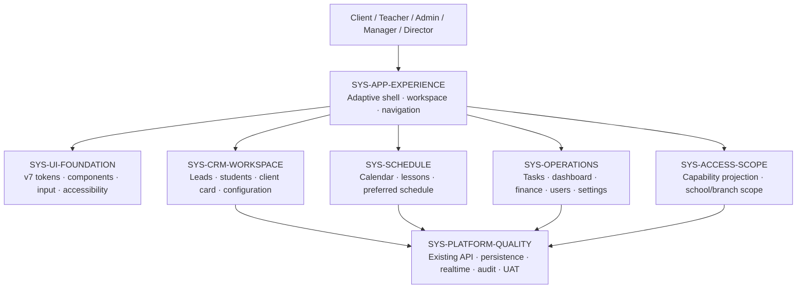
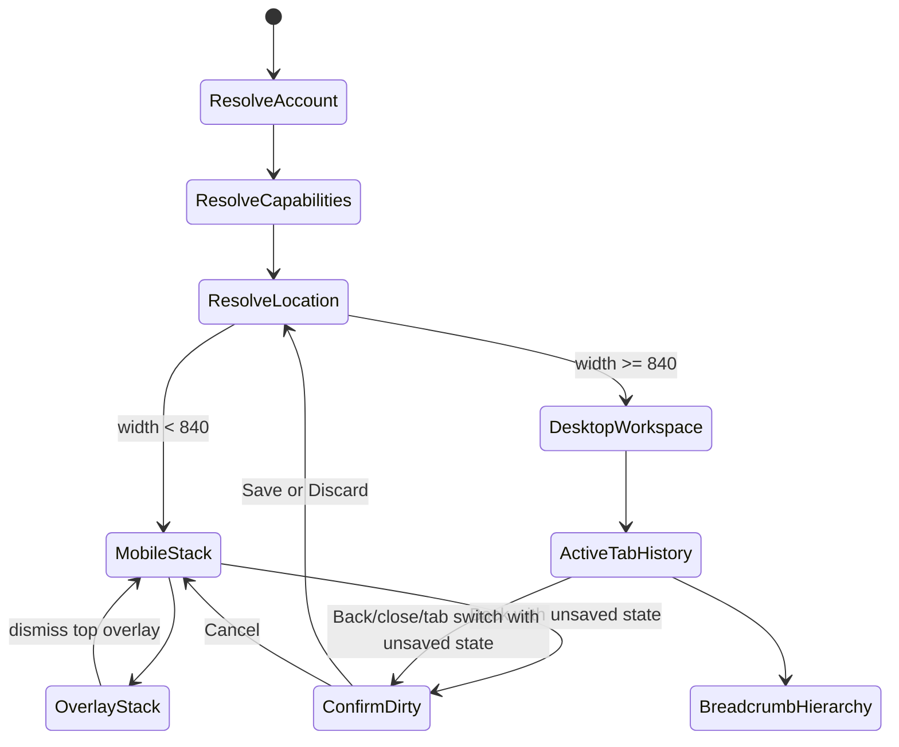

# MagicMusicCRM v6 — Architecture Overview

> **Status:** Proposed after approved PRD  
> **Principle:** reskin/reflow existing Flutter application; existing API, integrity and RBAC remain authoritative.

## 1. Architecture objective

v6 turns the existing application into one connected, configurable workspace. It does not introduce a second client, router, tab engine, component library or domain model. The smallest coherent change is to mount and finish what already exists, then route every surfaced workflow through the same navigation, access and state contracts.

## 2. System map

## 3. System responsibilities

| System | Owns | Explicitly does not own |
|---|---|---|
| `SYS-APP-EXPERIENCE` | Adaptive shell, production-mounted workspace tabs, per-tab history, breadcrumbs, route/surface policy, Back and deep-link orchestration | Domain authorization or duplicate entity fetching |
| `SYS-UI-FOUNDATION` | Existing v7 tokens, reusable visual states, focus/keyboard/semantics, scroll behavior, adaptive surface primitives | Domain state or a new visual language |
| `SYS-ACCESS-SCOPE` | Capability snapshot, visible navigation projection, resource scope, school/branch selector rules | Security decisions based only on hidden UI |
| `SYS-CRM-WORKSPACE` | Configurable CRM, lead/student funnels, full client workspace, client-linked sections | A second schedule, payment or task domain |
| `SYS-SCHEDULE` | Calendar modes, lessons, preferred schedule and typed links from lesson context | Finance mutations and free-form display-name routing |
| `SYS-OPERATIONS` | One tasks workflow, unified dashboard, client payments UI, users/settings/config entry points | Manager access to school finance |
| `SYS-PLATFORM-QUALITY` | Existing API contracts, persistence, realtime, audit, reconciliation, release and security gates | A frontend rewrite or speculative platform |

## 4. Reuse map

v6 reuses the existing production seams:

- `GoRouter` remains the canonical external route/deep-link mechanism.
- `DesktopWorkspaceShell`, `WorkspaceController` and `WorkspaceStore` become the production desktop tab implementation; no second tab engine is permitted.
- `EntityRouteRegistry` remains the typed entity navigation registry; display names are never used as identifiers.
- `lib/core/theme/design_tokens.dart`, `app_theme.dart` and `lib/core/widgets/v7/` remain the visual source of truth.
- Existing feature services/providers remain the only network path. UI reflow may share controllers/content, but must not duplicate or rename service calls.
- Existing capability/resource-scope evaluation remains authoritative. Navigation is a projection of access, never a replacement for it.

## 5. Runtime navigation model

One canonical location descriptor connects GoRouter, workspace history and breadcrumb metadata. It contains a route identity, typed parameters, safe restoration state and actor-safe display metadata. It does not contain domain records or secrets.

## 6. Adaptive layout boundaries

Layout branches by available width, not operating-system name:

| Class | Width | Primary navigation | Work surface |
|---|---:|---|---|
| Compact | `< 600` | Bottom navigation / concise app bar | Full-screen routes; draggable sheets only for quick views/selections |
| Medium | `600–839` | Navigation rail or compact sidebar | Full-screen route or single-pane detail; no desktop breadcrumb bar |
| Expanded | `840–1199` | Sidebar + workspace tabs | Context bar with collapsed breadcrumbs; routed work area |
| Large | `>= 1200` | Sidebar + workspace tabs | Full breadcrumbs, optional master-detail where it reduces navigation |

The shell may use `LayoutBuilder`/`MediaQuery.sizeOf`; device checks are limited to input behavior such as persistent desktop scrollbars.

## 7. Access and scope invariants

- Business hierarchy: `client < teacher < admin < manager < director < system_admin`.
- Admin sees only Chat, Schedule and Clients.
- Manager has operational access but never school-wide finance unless an explicit future policy changes `CrmPolicy.canReadSchoolFinance`.
- Director/system_admin may access school finance according to capabilities; client-card finance remains separately governed.
- Every scope-aware screen receives an effective `school` or `branch` scope. Client workflows default to the client's effective branch.
- `Вся школа` appears only when both the operation and capability allow it. Changing visual scope never widens resource authorization.
- Teacher navigation and payloads remain actor-scoped and read-only where required; hidden controls are not considered enforcement.

## 8. Data and integration boundaries

This UX redesign changes presentation and navigation contracts only. Existing backend APIs remain source of truth. Any v6 domain extension already required by the approved PRD follows existing versioned/idempotent commands, immutable facts, audit/outbox and reconciliation rules. Frontend-only work must keep `git diff server/` empty.

## 9. Quality gates

- Wire-to-service baseline before and after each migrated screen.
- Route × role × scope × width inventory with loading/empty/error/forbidden/retry states.
- Windows mouse-only, keyboard-only and persistent scrollbar pass.
- Android UI Back, system/predictive Back, draggable sheet and dirty-form pass.
- Direct deep-link and return-context tests for typed entities.
- Real-account owner UAT; isolated widget tests do not prove production mounting.
- Security/release gate: zero open Critical/High, tested rollback and explicit `APPROVED`.

## 10. Architecture decisions

- [ADR-001 — Preserve v7 and existing runtime](03_ADR/ADR_001_preserve_v7_existing_runtime.md)
- [ADR-002 — Adaptive surface policy](03_ADR/ADR_002_adaptive_surface_policy.md)
- [ADR-003 — Unified navigation, history and breadcrumbs](03_ADR/ADR_003_navigation_history_breadcrumbs.md)
- [ADR-004 — Desktop input and scrolling](03_ADR/ADR_004_desktop_input_scrolling.md)
- [ADR-005 — Capability-projected role and scope UX](03_ADR/ADR_005_capability_projected_role_scope.md)
- [ADR-006 — UX quality and release evidence](03_ADR/ADR_006_ux_quality_release_evidence.md)

