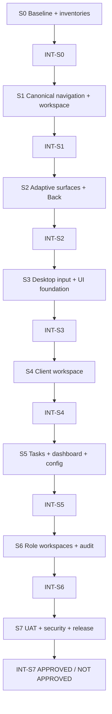

# MagicMusicCRM v6 — UX/UI & Configurable CRM Delivery Blueprint

**Версия:** 6.0  
**Статус:** Ready for owner design checkpoint  
**Дата:** 2026-08-04  
**Источники истины:** `01_PRD.md`, `02_ARCHITECTURE_OVERVIEW.md`, `03_ADR/`, `04_SYSTEM_DESIGN/`, `07_CHALLENGE_REPORT.md`  
**Правило отметки:** `[x]` ставится только после production mounting, указанной автономной проверки и evidence. Isolated widget/unit test без реального route не закрывает задачу.

## 1. Правила исполнения

- Квант задачи: 2–8 инженерных часов, включая минимальный runnable check и evidence.
- Порядок: `S0 → S1 → S2 → S3 → S4 → S5 → S6 → S7`; следующий Sprint не начинается до обязательного `INT-SN`.
- Reskin/reflow, не rewrite: существующие API/services/providers/GoRouter/workspace/entity registry/v7 tokens переиспользуются.
- Frontend-задачи не меняют `server/`; исключения возможны только для уже утверждённых domain requirements и выделяются отдельно.
- Capability/resource scope вычисляется до построения navigation/provider; скрытый UI не считается защитой.
- Для каждого migrated screen обязателен wire-to-service baseline → reflow → diff.
- Новая shared primitive допускается только для подтверждённого повторяющегося поведения и поставляется с первым production consumer.
- Windows: mouse-only + keyboard; Android: touch + UI/system/predictive Back; оба: direct deep links и real-account UAT.

## 2. Дорожная карта

| Sprint | Результат | Exit criteria | Оценка |
|---|---|---|---:|
| S0 | Evidence & UX foundation | Inventory/baseline полны; дизайн и route/surface contracts зафиксированы | 32 ч |
| S1 | Navigation kernel & desktop workspace | Один canonical location; tabs/history/breadcrumbs mounted; restore/logout безопасны | 40 ч |
| S2 | Adaptive surfaces & mobile Back | Primary routes, expandable sheets и predictive Back единообразны | 38 ч |
| S3 | Desktop input & visual consistency | Все scroll owners работают мышью; forms/states/a11y используют v7 | 36 ч |
| S4 | Client workspace & schedule/payments | Full client route, Lessons/Payments, entity links и configurable Student entry готовы | 48 ч |
| S5 | Tasks, analytics & configuration | Один tasks flow, dashboard, CRM config/delegation и school/branch UX готовы | 46 ч |
| S6 | Role workspaces & cross-app audit | 5 persona workflows и capability-negative network gates зелёные | 38 ч |
| S7 | Real-account UAT, security & release | 26-point evidence, zero Critical/High, rollback и explicit APPROVED | 34 ч |
| **Всего** |  |  | **312 ч** |

Оценка не включает ожидание владельца, credentials, seeded backend, external security actions и maintenance window.

## 3. Граф зависимостей

Критический путь: `V6-001 → INT-S0 → V6-101 → INT-S1 → V6-201 → INT-S2 → V6-301 → INT-S3 → V6-401 → INT-S4 → V6-501 → INT-S5 → V6-601 → INT-S6 → V6-701 → INT-S7`.

---

## 4. Sprint S0 — Evidence & UX foundation

- [x] **V6-001** `[REQ-UX-001, REQ-UX-002]` — Зафиксировать production route/surface inventory.
  - **Работа:** выгрузить routed screens, modal/sheet/dialog entry points, owner role/scope, primary action и loading/empty/error/forbidden/retry states; отдельно отметить production mount vs isolated code.
  - **Критерий:** 100% production routes и всех упомянутых в ТЗ surfaces имеют owner/status; unowned=0.
  - **Проверка/evidence:** machine-checkable JSON + `docs/audits/v6-route-surface-inventory.md`; command returns non-zero on unowned route.
  - **Оценка:** 6 ч · **Зависимости:** нет · **Приоритет:** P0.

- [x] **V6-002** `[REQ-NAV-001..003, REQ-WORKSPACE-001]` — Инвентаризировать router/workspace/entity-link seams.
  - **Работа:** сопоставить GoRouter routes, workspace stack/store, `EntityRouteRegistry`, 327 pending navigation items, typed refs, display-name fallbacks и restorable view state.
  - **Критерий:** каждый deep-linkable entity и pending call site имеет canonical target/owner/migration status; локальные display-name lookups перечислены.
  - **Проверка/evidence:** `docs/audits/v6-navigation-inventory.md` + check script; ручная выборка 20 refs совпадает с кодом.
  - **Оценка:** 6 ч · **Зависимости:** V6-001 · **Приоритет:** P0.

- [x] **V6-003** `[REQ-DESKTOP-001, REQ-SURFACE-001]` — Инвентаризировать scroll/input и Android Back.
  - **Работа:** найти vertical/horizontal/nested scroll owners/controllers, mouse drag/wheel behavior, `PopScope`/Navigator paths, dirty forms, keyboard insets и safe-area violations.
  - **Критерий:** каждый overflow и каждый exit path привязан к явному controller/pop owner; multi-attach/unsafe-pop candidates перечислены.
  - **Проверка/evidence:** `docs/audits/v6-input-back-inventory.md`, Windows mouse-only smoke и Android Back smoke на baseline.
  - **Оценка:** 6 ч · **Зависимости:** V6-001 · **Приоритет:** P0.

- [x] **V6-004** `[REQ-UX-001, REQ-SURFACE-001]` — Заморозить v7 tokens/component/state delta.
  - **Работа:** подтвердить current tokens/Inter/assets, специфицировать только недостающие repeated behaviors (`ContextBar`, adaptive surface, draggable sheet, entity link, page state, scope selector, explicit scrollbar).
  - **Критерий:** ни один новый цвет/font/radius/package не добавлен без owner-approved reason; каждая новая primitive имеет ≥2 consumers или заменяет incomplete shared widget.
  - **Проверка/evidence:** component contract checklist + owner visual checkpoint at representative desktop/mobile states.
  - **Оценка:** 5 ч · **Зависимости:** V6-001, V6-003 · **Приоритет:** P0.

- [x] **V6-005** `[ALL V6 REQ]` — Снять wire-to-service и role/scope baseline.
  - **Работа:** для Schedule, Client, Payment, Tasks, Dashboard, Config записать method/path/body/result count per principal; зафиксировать Admin/Manager/Teacher negative requests.
  - **Критерий:** baseline воспроизводим на seeded backend; секреты/PII редактированы; missing workflow явно `blocked`.
  - **Проверка/evidence:** versioned redacted traces + automated comparison harness.
  - **Оценка:** 5 ч · **Зависимости:** V6-001 · **Приоритет:** P0.

- [x] **INT-S0** — Принять foundation.
  - **Критерий:** inventories complete, PRD↔design traceability=100%, visual direction owner-confirmed, baseline gates зелёные, Critical challenge findings=0.
  - **Проверка:** `flutter analyze`, full Flutter tests, relevant server baseline, inventory checks, `git diff server/` empty for design/front changes.
  - **Оценка:** 4 ч · **Зависимости:** V6-001..005 · **Приоритет:** P0.

---

## 5. Sprint S1 — Navigation kernel & desktop workspace

- [x] **V6-101** `[REQ-NAV-002, REQ-NAV-003]` — Ввести canonical location adapter поверх существующей навигации.
  - **Работа:** связать stable route identity, typed params, parent metadata, access declaration и versioned safe view state с GoRouter/workspace/entity registry без второго registry.
  - **Критерий:** direct URL и in-app navigation дают одинаковую current location/breadcrumb; display name не используется как ID.
  - **Проверка:** unit/property checks для encode/decode/parent + widget direct-link tests.
  - **Оценка:** 8 ч · **Зависимости:** INT-S0 · **Приоритет:** P0.

- [x] **V6-102** `[REQ-WORKSPACE-001]` — Смонтировать существующий desktop workspace в production shell.
  - **Работа:** подключить `DesktopWorkspaceShell`/controller/store к реальному dashboard/router, account identity и capability refresh.
  - **Критерий:** production route поддерживает 10 tabs, active state, close/reorder/duplicate; isolated/demo engine отсутствует.
  - **Проверка:** Windows widget/device flow login → 10 tabs → reorder/duplicate/close.
  - **Оценка:** 8 ч · **Зависимости:** V6-101 · **Приоритет:** P0.

- [ ] **V6-103** `[REQ-WORKSPACE-001, REQ-SEC-001]` — Безопасное restore и logout reset.
  - **Работа:** account/schema-version key, safe-state serialization, access/resource revalidation, dirty decision, clear current-account cache on logout/role change.
  - **Критерий:** restart restores only permitted routes; stale/deleted/forbidden routes safely fall back; user B never sees user A tabs.
  - **Проверка:** restart, logout/login, user switch, role downgrade, route schema bump tests.
  - **Оценка:** 7 ч · **Зависимости:** V6-102 · **Приоритет:** P0.

- [ ] **V6-104** `[REQ-NAV-003]` — Реализовать desktop context bar и breadcrumbs.
  - **Работа:** Back/Forward states, typed ancestor trail, current node, ellipsis/path menu, page actions overflow, focus/tooltips.
  - **Критерий:** 1–8 nodes and long Russian titles fit at 840/1000/1200 widths; ancestors jump without accidental new tab; current is not clickable.
  - **Проверка:** widget/golden layouts + keyboard flow + direct-link reconstruction.
  - **Оценка:** 7 ч · **Зависимости:** V6-101, V6-102 · **Приоритет:** P0.

- [ ] **V6-105** `[REQ-NAV-001, REQ-NAV-002]` — Унифицировать typed entity navigation policy.
  - **Работа:** current-tab/open-new-tab/mobile-stack behaviors and actor-safe missing/forbidden/tombstone state through existing `EntityRouteRegistry`.
  - **Критерий:** Client/Lead/Student/Teacher/Room/Lesson/Task/Payment/Subscription/Branch/User/Report refs follow one policy and restore source filters/date/position.
  - **Проверка:** entity-link matrix on Windows/Android; forbidden refs cause no existence leak or forbidden prefetch.
  - **Оценка:** 6 ч · **Зависимости:** V6-101, V6-104 · **Приоритет:** P0.

- [ ] **INT-S1** — Принять navigation/workspace kernel.
  - **Критерий:** CH-01/08 closed; production workspace mounted; per-tab history, breadcrumbs, restart/logout and deep links pass; second registry=0.
  - **Проверка:** targeted + full Flutter tests, Windows flow, negative network assertions, `git diff server/` empty.
  - **Оценка:** 4 ч · **Зависимости:** V6-101..105 · **Приоритет:** P0.

---

## 6. Sprint S2 — Adaptive surfaces & mobile Back

- [ ] **V6-201** `[REQ-SURFACE-001]` — Поставить adaptive surface policy в shared presentation layer.
  - **Работа:** route/page for primary jobs, existing magic sheet/drawer for contextual jobs, dialog only for short decisions; no new navigation stack.
  - **Критерий:** declarative surface kind selects correct container at 360/600/840 without duplicating content/service calls.
  - **Проверка:** representative Client/Lesson/Payment surface widget tests + wire-to-service diff.
  - **Оценка:** 7 ч · **Зависимости:** INT-S1 · **Приоритет:** P0.

- [ ] **V6-202** `[REQ-SURFACE-001]` — Реализовать full-width expandable mobile sheet.
  - **Работа:** visible handle, 0.58/0.90/1.0 snaps, labelled expand/collapse, supplied scroll controller, safe area and keyboard inset.
  - **Критерий:** drag and button reach fullscreen; last field/action stays visible; nested scroll remains stable; screen reader announces state.
  - **Проверка:** Android widget/device tests portrait/landscape, keyboard open, long/short content.
  - **Оценка:** 7 ч · **Зависимости:** V6-201 · **Приоритет:** P0.

- [ ] **V6-203** `[REQ-SURFACE-001, REQ-NAV-002]` — Унифицировать UI/system/predictive Back.
  - **Работа:** ahead-of-time `PopScope`/navigator pop policy; overlay → route → tab-root/exit order; consistent app-bar Back.
  - **Критерий:** system gesture never silently routes home or discards input; top overlay dismisses first.
  - **Проверка:** Android predictive Back matrix for top/nested routes, partial/full sheet, nested dialog.
  - **Оценка:** 7 ч · **Зависимости:** V6-201, V6-202 · **Приоритет:** P0.

- [ ] **V6-204** `[REQ-SURFACE-001, REQ-UX-001]` — Один dirty-form exit contract.
  - **Работа:** Save/Discard/Cancel for app Back, system Back, breadcrumb, tab switch/close, logout; preserve server/field errors and idempotency metadata.
  - **Критерий:** every exit path produces the same decision/result; Cancel stays, Save awaits success, Discard explicitly clears.
  - **Проверка:** reusable contract tests + three real forms including network failure/conflict.
  - **Оценка:** 7 ч · **Зависимости:** V6-203 · **Приоритет:** P0.

- [ ] **V6-205** `[REQ-SURFACE-001, REQ-UX-001]` — Мигрировать representative modal set.
  - **Работа:** Lesson quick view, one long edit form, one selector and one confirmation use the new policy; delete duplicate container code only after parity.
  - **Критерий:** primary work is full route on compact; quick view expands; confirmation remains concise; API trace unchanged.
  - **Проверка:** Android/Windows flows + screenshot comparison to approved v7 tokens.
  - **Оценка:** 6 ч · **Зависимости:** V6-201..204 · **Приоритет:** P0.

- [ ] **INT-S2** — Принять adaptive surfaces/Back.
  - **Критерий:** CH-02/03 closed; 360–839 layouts, keyboard/safe area, predictive Back and dirty policy pass; duplicate mutations=0.
  - **Проверка:** targeted/full Flutter tests, Android device run, trace diff, `git diff server/` empty.
  - **Оценка:** 4 ч · **Зависимости:** V6-201..205 · **Приоритет:** P0.

---

## 7. Sprint S3 — Desktop input & visual consistency

- [ ] **V6-301** `[REQ-DESKTOP-001]` — Ввести explicit desktop scrollbar ownership.
  - **Работа:** global theme only for appearance; explicit controller/bar owners for page, table, board, calendar, tab strip and nested sections; vertical/horizontal tracks visible on overflow.
  - **Критерий:** thumb can be dragged mouse-only start↔end; no controller attaches to multiple positions; mobile persistent bars absent.
  - **Проверка:** widget/controller assertions + Windows mouse-only inventory pass + exception log=0.
  - **Оценка:** 8 ч · **Зависимости:** INT-S2 · **Приоритет:** P0.

- [ ] **V6-302** `[REQ-DESKTOP-001]` — Нормализовать wheel, Shift+wheel и nested scrolling.
  - **Работа:** define pointer policy for kanban/calendar/tables and avoid stealing parent vertical scroll; expose overflow arrows/menu where scrollbar alone is insufficient.
  - **Критерий:** every two-axis surface is traversable by ordinary mouse; nested column/calendar scroll has deterministic owner.
  - **Проверка:** Windows device scenarios for all inventory rows at narrow/wide window sizes.
  - **Оценка:** 6 ч · **Зависимости:** V6-301 · **Приоритет:** P0.

- [ ] **V6-303** `[REQ-UX-001]` — Системный keyboard/focus/tooltip/semantics pass.
  - **Работа:** logical focus traversal, visible focus ring, Enter/Space/Escape, Back shortcuts where safe, semantic labels/tooltips for icon-only actions.
  - **Критерий:** icon-only unlabeled controls=0; every primary workflow completes keyboard-only; Escape never discards dirty input.
  - **Проверка:** automated semantics/focus checks + Windows keyboard-only UAT.
  - **Оценка:** 6 ч · **Зависимости:** V6-301 · **Приоритет:** P0.

- [ ] **V6-304** `[REQ-UX-001]` — Унифицировать forms/actions/page states на v7.
  - **Работа:** persistent labels, required/help/error, saving/conflict/retry, one primary action, remove duplicate FAB/header create patterns, loading/empty/error/forbidden components.
  - **Критерий:** route inventory has no unexplained state/action gap; input survives retry; destructive actions labelled and impact-confirmed.
  - **Проверка:** lint/inventory check + representative form/state widget tests + owner visual review.
  - **Оценка:** 7 ч · **Зависимости:** V6-303 · **Приоритет:** P0.

- [ ] **V6-305** `[REQ-UX-001]` — Закрыть typography/responsive/reduced-motion baseline.
  - **Работа:** bundle Inter if still missing, verify text scale/long Russian labels, 160/240/300ms token motion and reduced-motion behavior; no invented palette.
  - **Критерий:** 360/600/840/1200 layouts have no clipped critical action; contrast/focus/meaning-without-color checks pass.
  - **Проверка:** golden/widget matrix + accessibility smoke.
  - **Оценка:** 5 ч · **Зависимости:** V6-304 · **Приоритет:** P1.

- [ ] **INT-S3** — Принять desktop input/UI foundation.
  - **Критерий:** CH-05/07/10 closed; mouse-only + keyboard-only complete; visual/state inventory complete; no new unapproved framework/package.
  - **Проверка:** full Flutter analyze/test, Windows device pass, responsive goldens, `git diff server/` empty.
  - **Оценка:** 4 ч · **Зависимости:** V6-301..305 · **Приоритет:** P0.

---

## 8. Sprint S4 — Client workspace, lessons & payments

- [ ] **V6-401** `[REQ-CLIENT-001, REQ-NAV-002]` — Перевести client card в canonical full workspace route.
  - **Работа:** desktop full work area, compact full-screen route, stable section deep links and actor-safe capability projection; share existing providers/content.
  - **Критерий:** fixed 600px primary dialog absent; Overview/Lessons/Payments/Subscriptions/History & Tasks/Contacts/Documents/Custom fields route correctly and preserve context.
  - **Проверка:** Admin/Manager/Director + deny cases on 360/840/1200; API trace parity.
  - **Оценка:** 8 ч · **Зависимости:** INT-S3 · **Приоритет:** P0.

- [ ] **V6-402** `[REQ-CLIENT-001]` — Перенести preferred schedule в section `Занятия`.
  - **Работа:** remove duplicate Info placement; editor supports date range, weekdays, time/duration, lessons/day, description and effective scope through existing domain path.
  - **Критерий:** one canonical editor/list; default client branch; school option only when valid/capable; preferred plan remains distinct from actual lessons.
  - **Проверка:** CRUD + branch/school + validation + Back/dirty form tests.
  - **Оценка:** 7 ч · **Зависимости:** V6-401 · **Приоритет:** P0.

- [ ] **V6-403** `[REQ-CLIENT-001, REQ-NAV-001]` — Добавить client Month/Week/Day calendar.
  - **Работа:** actor-scoped viewport query, branch selector, selected-client green+marker, other visible lessons neutral gray, lifecycle/trial/conflict independent; lesson quick link.
  - **Критерий:** no unbounded school fetch or hidden client fields; mode/date/scope restore after linked navigation; non-color legend present.
  - **Проверка:** lifecycle × relation matrix, viewport/network assertions, Windows/Android drilldown.
  - **Оценка:** 8 ч · **Зависимости:** V6-402, V6-105 · **Приоритет:** P0.

- [ ] **V6-404** `[REQ-PAYMENT-001]` — Реализовать canonical Client Payments section/form.
  - **Работа:** balance, income/expense, actual payments, obligations/installments; create route with branch/date/amount/method/status/actors/comment/id and typed discount/surcharge/installment preview.
  - **Критерий:** immutable history not edited; invalid negative/hidden rewrite blocked; retry creates exactly one ledger effect; Manager sees only allowed client finance.
  - **Проверка:** money/idempotency/reconciliation tests, role/scope negative requests, network failure preserves input.
  - **Оценка:** 8 ч · **Зависимости:** V6-401, approved commerce backend readiness · **Приоритет:** P0.

- [ ] **V6-405** `[REQ-STUDENT-001, REQ-STUDENT-002, REQ-CFG-001..005]` — Подключить configurable Student UX и создание из main section.
  - **Работа:** replace hard-coded `Пробные/Пауза` with effective funnel config; Director configures columns/order; `Создать ученика` available in primary Students flow; reuse one create form.
  - **Критерий:** board and form render effective school defaults + sparse branch overrides; no second Management-only create implementation.
  - **Проверка:** config publish/branch override/rollback + create from both legacy redirect and canonical route.
  - **Оценка:** 7 ч · **Зависимости:** V6-401, config backend readiness · **Приоритет:** P0.

- [ ] **V6-406** `[REQ-NAV-001, REQ-NAV-002]` — Завершить links из lesson/client contexts.
  - **Работа:** clickable typed Student/Lead/Teacher/Room/Lesson/Task/Payment/Subscription refs with current-tab/new-tab policy and safe unavailable state.
  - **Критерий:** all matrix refs have visible focus/semantic affordance; Back returns exact client section/calendar/list state.
  - **Проверка:** full entity-link matrix for allow/missing/archived/forbidden on Windows/Android.
  - **Оценка:** 6 ч · **Зависимости:** V6-401..404, V6-105 · **Приоритет:** P0.

- [ ] **INT-S4** — Принять client workspace.
  - **Критерий:** CH-06/11 closed; full card, Lessons, Payments, configurable Student entry and linked navigation mounted in production; trace/reconciliation clean.
  - **Проверка:** full Flutter tests + targeted integration, role/scope matrix, Windows/Android device runs, relevant server tests only where approved.
  - **Оценка:** 4 ч · **Зависимости:** V6-401..406 · **Приоритет:** P0.

---

## 9. Sprint S5 — Tasks, analytics & configurable CRM

- [ ] **V6-501** `[REQ-TASK-001]` — Свести legacy/new tasks к одному canonical route/model.
  - **Работа:** one create action/provider/detail/history; redirect legacy entry points; remove header+FAB duplication; preserve links/audit.
  - **Критерий:** one task can be created/updated/closed from every allowed entry without parallel state or duplicate notifications.
  - **Проверка:** route/provider inventory duplicate=0; create/edit/close/link flows and API trace parity.
  - **Оценка:** 8 ч · **Зависимости:** INT-S4 · **Приоритет:** P0.

- [ ] **V6-502** `[REQ-TASK-002]` — Завершить task audience/branch UX и language audit.
  - **Работа:** distinguish explicit users vs dynamic branch/school recipients before submit; normalize labels and confirmations across task actions.
  - **Критерий:** single/multi user, one branch/all permitted branches show accurate preview and result; ambiguous icon-only actions=0.
  - **Проверка:** Windows/Android real-account-ready matrix with resulting recipient reconciliation.
  - **Оценка:** 6 ч · **Зависимости:** V6-501 · **Приоритет:** P0.

- [ ] **V6-503** `[REQ-REPORT-001]` — Собрать unified dashboard с общими filters.
  - **Работа:** one normalized period/scope state for operational, client, lessons, tasks and permitted finance; section-local loading/error/retry and typed drilldowns.
  - **Критерий:** reports/finance/summary no longer duplicate same KPI; card/chart/drilldown predicates match; one section failure does not blank page.
  - **Проверка:** count/amount parity, partial failure, filter restore/deep-link tests.
  - **Оценка:** 8 ч · **Зависимости:** INT-S4 · **Приоритет:** P0.

- [ ] **V6-504** `[REQ-REPORT-001, REQ-SEC-001]` — Enforce role-safe dashboard composition/prefetch.
  - **Работа:** build sections/providers only after capability projection; Manager school finance absent and unrequested, Director/system_admin allowed according to policy.
  - **Критерий:** no school-finance request for Client/Teacher/Admin/Manager; forbidden deep link returns actor-safe state.
  - **Проверка:** negative network assertions + backend direct denial + role navigation matrix.
  - **Оценка:** 5 ч · **Зависимости:** V6-503 · **Приоритет:** P0.

- [ ] **V6-505** `[REQ-CFG-001..004]` — Реализовать unified CRM configuration workspace.
  - **Работа:** object/category/field/options/layout/business number/selection configuration, school defaults + sparse branch overrides, draft → validate/impact preview → publish → rollback revision.
  - **Критерий:** supported forms/boards consume effective config; invalid publish atomicity preserved; rollback never rewrites history.
  - **Проверка:** config type matrix, preview/publish/rollback, concurrent version conflict and affected-screen trace.
  - **Оценка:** 8 ч · **Зависимости:** V6-405, config backend readiness · **Приоритет:** P0.

- [ ] **V6-506** `[REQ-CFG-005]` — Добавить config access delegation UX.
  - **Работа:** Director assigns only allowed lower capabilities/scope; Manager sees only delegated configuration; preview/audit/reason and access invalidation.
  - **Критерий:** Admin cannot configure; Manager cannot self-escalate or assign Director/system_admin; changes reach active sessions within existing access SLA.
  - **Проверка:** five-role mutation matrix, two-session invalidation, audit before/after/reason.
  - **Оценка:** 7 ч · **Зависимости:** V6-505 · **Приоритет:** P0.

- [ ] **INT-S5** — Принять operations/configuration.
  - **Критерий:** one task flow, role-safe unified dashboard and effective configurable CRM mounted; duplicate routes/providers/KPIs=0; Manager finance negative gate green.
  - **Проверка:** full front/server relevant gates, role/scope/device flows, API trace/reconciliation, security regression.
  - **Оценка:** 4 ч · **Зависимости:** V6-501..506 · **Приоритет:** P0.

---

## 10. Sprint S6 — Role workspaces & cross-app UX audit

- [ ] **V6-601** `[REQ-UX-001, REQ-SEC-001]` — Подключить capability-projected navigation for five personas.
  - **Работа:** one nav model with role-oriented order/density; Client, Teacher, Admin, Manager, Director surfaces from current capability/resource snapshot; no hard-coded `isStaff` expansion.
  - **Критерий:** Admin only Chat/Schedule/Clients; Manager operational without school finance; Director config/finance per capability; role change updates active shell.
  - **Проверка:** five-role nav × endpoint matrix + two-session access invalidation.
  - **Оценка:** 8 ч · **Зависимости:** INT-S5 · **Приоритет:** P0.

- [ ] **V6-602** `[REQ-UX-001, REQ-NAV-002]` — Принять Client и Teacher top workflows.
  - **Работа:** client next lesson/chat/own context; teacher Day/Week assigned read-only calendar and allowed drilldowns; adaptive/mobile Back and deep links.
  - **Критерий:** Teacher mutation affordances and forbidden payload fields absent; Client cannot navigate outside self scope; source context restores.
  - **Проверка:** actor-scoped GET traces, direct mutation 403, Android/Windows workflow evidence.
  - **Оценка:** 6 ч · **Зависимости:** V6-601 · **Приоритет:** P0.

- [ ] **V6-603** `[REQ-UX-001, REQ-NAV-002]` — Принять Admin/Manager/Director top workflows.
  - **Работа:** operational day/search/client for Admin; funnels/tasks/reports for Manager; school/branch finance/config/access drilldowns for Director.
  - **Критерий:** each role completes its top 5 workflows without inaccessible dead end, duplicated route or lost Back state; negative sections never request data.
  - **Проверка:** role × scope × Windows/Android scripted UAT with API trace.
  - **Оценка:** 7 ч · **Зависимости:** V6-601 · **Приоритет:** P0.

- [ ] **V6-604** `[REQ-UX-001, REQ-DESKTOP-001, REQ-SURFACE-001]` — Выполнить 100% routed UX state audit.
  - **Работа:** close remaining labels, primary-action, form, state, responsive, scrollbar, Back, breadcrumb/deep-link and accessibility gaps from inventory.
  - **Критерий:** inventory gap count=0 or documented N/A accepted by owner; icon-only unlabeled=0; duplicated create actions=0.
  - **Проверка:** inventory check, semantics/focus suite, representative visual snapshots, device smoke.
  - **Оценка:** 7 ч · **Зависимости:** V6-602, V6-603 · **Приоритет:** P0.

- [ ] **V6-605** `[REQ-UX-002]` — Подготовить 26-point requirement evidence pack.
  - **Работа:** map every DOCX item to production route, role, scope, status, screenshot/video, API trace, data result and defect/blocker.
  - **Критерий:** no item is `implemented` without mounted route and observable result; missing environment stays `blocked`.
  - **Проверка/evidence:** `docs/audits/v6-user-workflow-acceptance.md` + linked artifacts.
  - **Оценка:** 6 ч · **Зависимости:** V6-604 · **Приоритет:** P0.

- [ ] **INT-S6** — Принять role/UX coverage.
  - **Критерий:** CH-04/09 closed; 5 personas and school/branch scopes pass; route UX coverage=100%; 26-point pack ready for owner execution.
  - **Проверка:** actor/network matrix, Flutter/server gates, Windows/Android rehearsals, no open UX P0 defect.
  - **Оценка:** 4 ч · **Зависимости:** V6-601..605 · **Приоритет:** P0.

---

## 11. Sprint S7 — Real-account UAT, security & production

- [ ] **V6-701** `[REQ-UX-002, REQ-TASK-002]` — Провести owner real-account UAT.
  - **Работа:** execute 26-point pack and top workflows for all available personas/scopes; recipients/branches, tabs/restart/logout, mouse-only, mobile sheets/Back, client lessons/payments and dashboard.
  - **Критерий:** owner signs each item pass/fail/blocked; actual recipients/data/ledger reconcile with preview; defect links created for every failure.
  - **Проверка/evidence:** signed dated UAT matrix with device/app/backend versions and redacted traces.
  - **Оценка:** 8 ч engineering support · **Зависимости:** INT-S6, owner account/devices · **Приоритет:** P0.

- [ ] **V6-702** `[REQ-SEC-001]` — Закрыть repository/key/high-finding security gate.
  - **Работа:** verify private repository, rotate/revoke exposed or affected credentials, history/runtime/Flutter/source-map/Docker/dependency/SAST/image scans; track Moderate owners/dates.
  - **Критерий:** Critical/High=0; old keys fail; sensitive values absent from evidence/workspace cache/build artifacts.
  - **Проверка/evidence:** signed security report and rotation proof without secret values.
  - **Оценка:** 8 ч · **Зависимости:** INT-S6, repository/provider authority · **Приоритет:** P0.

- [ ] **V6-703** `[REQ-REL-001]` — Выполнить production-shaped reconciliation/backup/rollback rehearsal.
  - **Работа:** migrations/preflight where applicable, shadow parity, payment/task/config reconciliation, backup restore, staged rollout and timed rollback.
  - **Критерий:** blockers/unexplained diff/financial drift/duplicate effects/poison backlog=0; restore and rollback meet documented bounds.
  - **Проверка/evidence:** reproducible commands, logs, counts/checksums and signed rehearsal report.
  - **Оценка:** 8 ч · **Зависимости:** V6-701, V6-702 · **Приоритет:** P0.

- [ ] **V6-704** `[REQ-REL-001]` — Execute staged rollout and observe.
  - **Работа:** release to staged cohort, monitor auth/access, navigation restore, API errors, duplicate mutations, client finance and latency; stop/rollback criteria active.
  - **Критерий:** observation window remains inside SLO/error budgets; rollback remains executable; owner records explicit decision.
  - **Проверка/evidence:** release timeline, dashboards, incident/rollback log and final decision record.
  - **Оценка:** 6 ч · **Зависимости:** V6-703 · **Приоритет:** P0.

- [ ] **INT-S7** — Final production decision.
  - **Критерий:** all P0 requirements/evidence complete; owner UAT signed; Critical/High=0; rollback green. Output is exactly `APPROVED` or `NOT APPROVED` with blockers.
  - **Проверка:** final release-readiness report cross-checks every requirement/task/evidence link.
  - **Оценка:** 4 ч · **Зависимости:** V6-701..704 · **Приоритет:** P0.

---

## 12. Requirement traceability

| Requirement | Primary tasks | Integration gate |
|---|---|---|
| `REQ-CFG-001` | V6-405, V6-505 | INT-S5 |
| `REQ-CFG-002` | V6-405, V6-505 | INT-S5 |
| `REQ-CFG-003` | V6-505 | INT-S5 |
| `REQ-CFG-004` | V6-505 | INT-S5 |
| `REQ-CFG-005` | V6-506 | INT-S5 |
| `REQ-STUDENT-001` | V6-405 | INT-S4 |
| `REQ-STUDENT-002` | V6-405 | INT-S4 |
| `REQ-TASK-001` | V6-501 | INT-S5 |
| `REQ-TASK-002` | V6-502, V6-701 | INT-S7 |
| `REQ-NAV-001` | V6-105, V6-403, V6-406 | INT-S4 |
| `REQ-NAV-002` | V6-101, V6-105, V6-401, V6-406 | INT-S6 |
| `REQ-NAV-003` | V6-101, V6-104 | INT-S1 |
| `REQ-REPORT-001` | V6-503, V6-504 | INT-S5 |
| `REQ-UX-001` | V6-001, V6-304, V6-604 | INT-S6 |
| `REQ-UX-002` | V6-005, V6-605, V6-701 | INT-S7 |
| `REQ-SEC-001` | V6-103, V6-504, V6-601, V6-702 | INT-S7 |
| `REQ-REL-001` | V6-703, V6-704 | INT-S7 |
| `REQ-WORKSPACE-001` | V6-102, V6-103 | INT-S1 |
| `REQ-DESKTOP-001` | V6-003, V6-301, V6-302 | INT-S3 |
| `REQ-CLIENT-001` | V6-401, V6-402, V6-403 | INT-S4 |
| `REQ-PAYMENT-001` | V6-404 | INT-S4 |
| `REQ-SURFACE-001` | V6-201..205 | INT-S2 |

## 13. Definition of Ready for implementation

- Owner confirms this design supplement and representative desktop/mobile target states.
- Seeded backend and role accounts exist or related task is marked `blocked` before execution.
- Existing working tree changes are inventoried; tasks do not overwrite unrelated user work.
- Each task assignee can point to its production route, existing service/provider and smallest runnable verification.

## 14. Definition of Done for v6

- 22/22 requirements have passed integration evidence.
- Production uses one router/entity metadata path, one workspace tab engine, one task flow and one effective configuration model.
- Windows is fully operable by mouse/keyboard with visible draggable scrollbars; Android sheets/routes and system Back are predictable.
- All five personas see an intuitive capability-safe workspace; Manager school finance is absent and unrequested.
- Owner real-account UAT, security, restore/reconciliation and rollback are signed.
- Final release decision is explicitly `APPROVED`.
