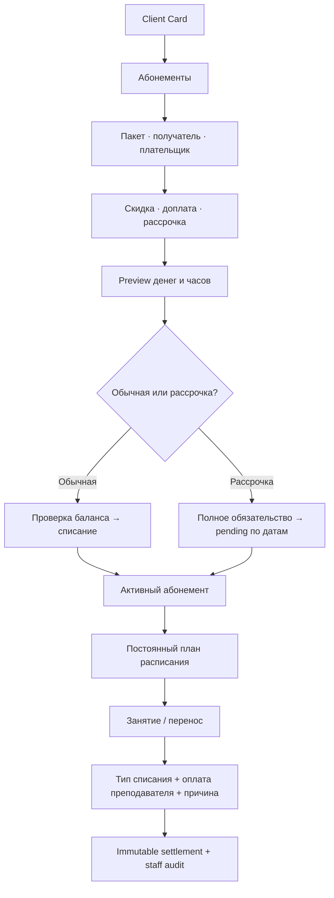

# MagicMusicCRM v7 — PRD финансово-учебной модели

**Проект:** MagicMusicCRM  
**Функционал:** личный счёт, абонементы, расчёт занятий и постоянные расписания  
**Статус:** Approved  
**Версия:** 7.0  
**Ответственный:** Codex / владелец продукта  
**Дата:** 2026-08-07

**Подтверждение владельца:** 2026-08-07 — PRD и все перечисленные решения
подтверждены; разрешено полное выполнение v7.

> Все принятые требования v6 сохраняются. Этот документ определяет v7-delta и
> имеет приоритет только для затронутых финансовых, lesson и Client Card flows.

---

## 1. Резюме

v7 объединяет личный счёт, покупку и отмену абонемента, рассрочку, списание
часов, оплату преподавателя и постоянные расписания. Все денежные и учебные
изменения атомарны, причины действий доступны сотрудникам, а обычная
статистика не искажается отменёнными или сторнированными фактами.

## 2. Контекст

### 2.1 Проблемы

- Выдача абонемента создаёт обязательство и отдельную оплату, но не реализует
  понятную покупку с личного счёта выбранного плательщика.
- Оплата с личного счёта другого клиента не входит в одну атомарную покупку.
- Текущие attendance-типы неполны, не настраиваются директором и почти не
  представлены в UI.
- Drag/edit расписания обходят обязательный reason/financial transition flow.
- Способ оплаты преподавателю нельзя явно выбрать и проверить при каждом
  расчётном действии.
- Schedule series не объединены в именованные индивидуальные/групповые планы с
  собственной историей и лентой дат.
- Выдача абонемента и ДЗ спрятаны в общем меню «Действия»; единой верхней
  staff-заметки нет.
- Причины рискованных действий либо не собираются, либо не имеют единого
  staff-visible дома.

### 2.2 Возможность

Один согласованный workflow устраняет расхождения личного счёта, долгов,
абонементных часов и зарплаты преподавателей, одновременно сокращая число
неявных действий в Client Card.

## 3. Цели и границы

### 3.1 Цели

- **[G1] Финансовая атомарность:** 100% покупок, возвратов, подтверждений и
  сторно создают либо полный согласованный набор фактов, либо 0 фактов.
- **[G2] Reconciliation:** расхождение ledger ↔ подтверждённые оплаты ↔ долги ↔
  абонементные обязательства всегда равно 0 копеек.
- **[G3] Lesson integrity:** 100% изменений даты/времени проходят единый
  reason + client settlement + teacher compensation preview/command.
- **[G4] Историческая точность:** изменение настроек никогда не меняет snapshot
  уже рассчитанного занятия, покупки или выплаты.
- **[G5] Рабочая скорость:** из открытой карточки выдача абонемента, ДЗ,
  завершение расписания или подтверждение pending-оплаты доступны не более чем
  за 2 осмысленных действия; API preview p95 ≤ 2 секунды на штатном объёме.
- **[G6] Наблюдаемость:** 100% операций, требующих причину, показывают её вместе
  с автором и временем Администратору, Управляющему и Директору.
- **[G7] Безопасные конструкторы:** организационная сущность не может быть
  создана без обязательных бизнес-связей, а учётная запись сотрудника создаётся
  только с явными обязательными данными входа и допустимой ролью.

### 3.2 Non-Goals

- **[NG1]** Физическое удаление платежей, ledger, settlement или audit-фактов.
- **[NG2]** Автоматический выбор оплаты преподавателю из типа списания.
- **[NG3]** Банковский эквайринг, автоматическая сверка с банком или онлайн-ККТ.
- **[NG4]** Доступ Teacher/Client к staff-финансам, техническому аудиту или
  настройке типов.
- **[NG5]** Переписывание исторических операций после изменения каталога,
  ставки, цвета, скидки или расписания.
- **[NG6]** Смешивание индивидуальных и групповых строк в одном постоянном
  расписании.

## 4. Пользовательские истории

### US-V7-001 — Покупка абонемента [REQ-COMMERCE-101] (P0)

- **Описание:** Как сотрудник, я хочу купить абонемент получателю с его или
  чужого личного счёта, чтобы владелец абонемента и плательщик были указаны
  явно.
- **Ценность:** одна операция выдаёт часы и создаёт корректный денежный эффект.
- **Тестируемость:** PostgreSQL-тест конкурентных покупок, insufficient funds,
  recipient ≠ payer, retry/idempotency и rollback.
- **Системы:** SYS-CRM-WORKSPACE, SYS-OPERATIONS, SYS-ACCESS-SCOPE,
  SYS-PLATFORM-QUALITY.
- **Критерии приемки:**
  - **Given** выбран пакет, получатель, плательщик и коммерческие условия,
    **When** сотрудник подтверждает обычную покупку, **Then** итоговая цена
    атомарно списывается с доступного баланса плательщика, а получатель получает
    snapshot абонемента со всеми часами.
  - **Given** на счёте недостаточно денег, **When** выполняется обычная покупка,
    **Then** API возвращает field-level отказ, а subscription/ledger/audit = 0.
  - **Given** скидка, доплата или рассрочка, **When** показывается preview,
    **Then** итог, плательщик, часы и последствия видны до подтверждения.
  - **Given** повтор идентичной команды, **When** сеть повторяет запрос,
    **Then** существует ровно одна покупка и один набор финансовых фактов.
- **Граничные случаи:** payer=recipient; другой активный клиент; архивный клиент;
  две покупки одновременно; смена пакета между preview и commit.

### US-V7-002 — Рассрочка и три статуса [REQ-PAYMENT-101] (P0)

- **Описание:** Как сотрудник, я хочу видеть каждую часть рассрочки и проверять
  поступление, чтобы долг не выдавался за деньги на личном счёте.
- **Ценность:** баланс и очередь проверки отражают реальное состояние оплаты.
- **Тестируемость:** clock-driven due-date тест и матрица переходов статусов.
- **Системы:** SYS-OPERATIONS, SYS-CRM-WORKSPACE, SYS-PLATFORM-QUALITY.
- **Критерии приемки:**
  - **Given** покупка в рассрочку, **When** она подтверждена, **Then** вся итоговая
    цена фиксируется как коммерческое обязательство, а все часы доступны сразу.
  - **Given** наступила дата части, **When** worker создаёт запись, **Then** она
    получает статус `Проведён, ожидает подтверждения` и пометку «Проверить
    оплату за рассрочку».
  - **Given** pending-запись, **When** сотрудник проверяет сумму, дату, способ и
    номер операции, **Then** он переводит её в `Оплачен` или `Не оплачен`.
  - `Не оплачен` учитывается как долг; pending — отдельная очередь и не увеличивает
    доступный баланс; `Оплачен` — подтверждённый неизменяемый доходный факт.
  - Paid нельзя редактировать назад; ошибка исправляется отдельным сторно.
- **Граничные случаи:** worker retry; просрочка; частичная сумма; неверная валюта;
  подтверждение двумя сотрудниками; отмена покупки с pending/unpaid частями.

### US-V7-003 — Отмена абонемента и возврат [REQ-COMMERCE-102] (P0)

- **Описание:** Как сотрудник, я хочу безопасно отменить абонемент и вернуть
  допустимую сумму исходному плательщику, не искажая статистику продаж.
- **Ценность:** клиент получает корректный возврат, а история остаётся доказуемой.
- **Тестируемость:** preview/commit, used/reserved hours, partial payments,
  counterparty payer, replay и reporting exclusion.
- **Системы:** SYS-CRM-WORKSPACE, SYS-OPERATIONS, SYS-PLATFORM-QUALITY.
- **Критерии приемки:**
  - **Given** активный абонемент, **When** открывается отмена, **Then** preview
    показывает использованные/зарезервированные/оставшиеся часы, подтверждённо
    оплаченную сумму, pending/unpaid части и рекомендуемый возврат.
  - Рекомендуемый возврат не превышает подтверждённо профинансированную сумму
    и рассчитывается пропорционально неиспользованным часам. Для разовой
    покупки из личного счёта профинансирована вся списанная стоимость; для
    рассрочки — только подтверждённые части. Уменьшение возврата требует причины.
  - Возврат идёт исходному плательщику; pending/unpaid остаток закрывается без
    создания дохода.
  - Исходная продажа и сторно исключаются из обычной статистики, но сохраняются
    в защищённом аудите и технической staff-истории.
- **Граничные случаи:** 0 использованных часов; все часы использованы; несколько
  оплат; предыдущий частичный возврат; архивный плательщик.

### US-V7-004 — Сторно оплаты [REQ-PAYMENT-102] (P0)

- **Описание:** Как Администратор/Управляющий/Директор, я хочу удалить ошибочную
  оплату с причиной, чтобы исправить баланс без физического уничтожения факта.
- **Ценность:** ошибки исправляются, а злоупотребление остаётся видимым.
- **Тестируемость:** paid/pending/unpaid matrix, balance reconciliation,
  duplicate reversal и staff audit visibility.
- **Системы:** SYS-OPERATIONS, SYS-ACCESS-SCOPE, SYS-PLATFORM-QUALITY.
- **Критерии приемки:**
  - **Given** доступная оплата, **When** сотрудник выбирает «Удалить» и указывает
    причину, **Then** создаётся атомарное сторно, а исходный факт не удаляется.
  - Исходная оплата и сторно не входят в обычную финансовую статистику.
  - Техническая история показывает действие, причину, автора, время и связь с
    исходной оплатой всем трём staff-ролям.
  - Teacher/Client не получают техническую запись или скрытые денежные поля.
- **Граничные случаи:** повторное удаление; связанный абонемент; уже отменённая
  покупка; параллельное подтверждение pending.

### US-V7-005 — Настраиваемые типы списаний [REQ-LESSON-101] (P0)

- **Описание:** Как Директор, я хочу настраивать типы списаний занятий, чтобы
  школа могла менять названия и правила без переписывания истории.
- **Ценность:** правила HolliHop становятся управляемым бизнес-каталогом.
- **Тестируемость:** draft→preview→publish→rollback, school/branch override и
  immutable lesson snapshot.
- **Системы:** SYS-CRM-WORKSPACE, SYS-SCHEDULE, SYS-ACCESS-SCOPE,
  SYS-PLATFORM-QUALITY.
- **Критерии приемки:**
  - Начальный каталог содержит: Занятие; Частично оплачиваемое занятие;
    Бесплатное занятие; Оплачиваемый пропуск; Частично оплачиваемый пропуск;
    Неоплачиваемый пропуск; Занятие со штрафом.
  - Директор настраивает label, цвет, долю списания часов 0–200%, фиксированный
    денежный штраф, допустимые contexts и school default/branch override.
  - Использованный тип можно только архивировать; historical label/rule/color
    snapshot не меняется.
  - При создании разового занятия или строки постоянного расписания сотрудник
    обязательно выбирает тип; `Бесплатное занятие` создаёт нулевое списание.
  - UI всегда показывает цвет вместе с текстовой/иконной меткой.
- **Граничные случаи:** архив типа с будущими lessons; rollback; неизвестный key;
  200% списание при недостатке часов; филиальный override.

### US-V7-006 — Явная оплата преподавателя [REQ-LESSON-102] (P0)

- **Описание:** Как сотрудник, я хочу вручную выбрать способ оплаты
  преподавателю до назначения занятия, чтобы контролировать выплату, а система
  атомарно применила зафиксированное решение после окончания.
- **Ценность:** зарплата не выводится из клиентского списания неявно.
- **Тестируемость:** calculation-mode matrix, required reason override и payroll
  snapshot reconciliation.
- **Системы:** SYS-SCHEDULE, SYS-OPERATIONS, SYS-ACCESS-SCOPE,
  SYS-PLATFORM-QUALITY.
- **Критерии приемки:**
  - Директор настраивает каталог: Не оплачивать; Полная стандартная ставка;
    Процент ставки; Фиксированная сумма; Почасовая сумма.
  - Сотрудник всегда выбирает тип отдельно от клиентского списания до создания
    разового занятия или строки плана и видит итог.
  - Директор задаёт default value; изменение итогового процента/суммы сотрудником
    требует причины.
  - Начисление автоматически фиксируется после конца занятия в одной транзакции
    с клиентским списанием; ошибка оставляет `Требует проверки` и 0 частичных
    фактов.
  - До занятия решение меняется вместе с резервом; после проведения correction
    атомарно сторнирует effective-факты и применяет замену с причиной.
- **Граничные случаи:** ставка отсутствует; 0%; archived type; повтор transition;
  групповой урок с несколькими клиентскими списаниями.

### US-V7-007 — Единый перенос занятия [REQ-SCHEDULE-101] (P0)

- **Описание:** Как сотрудник, я хочу из любого экрана переносить занятие через
  один reason/settlement workflow, чтобы drag-and-drop не обходил расчёты.
- **Ценность:** календарь и карточка клиента дают одинаковый финансовый результат.
- **Тестируемость:** каждый entry point вызывает один preview/command; прямой
  PATCH даты/времени отсутствует.
- **Системы:** SYS-SCHEDULE, SYS-CRM-WORKSPACE, SYS-PLATFORM-QUALITY.
- **Критерии приемки:**
  - Изменение даты/времени через drag, editor, lesson sheet, client tray или
    calendar обязательно запрашивает причину, тип списания и оплату преподавателю.
  - Preview показывает source/successor, часы, деньги, зарплату и конфликты.
  - Перенос со списанием может списать исходное занятие; successor позже
    рассчитывается отдельно, поэтому UI явно предупреждает о двух списаниях.
  - Замена только преподавателя/аудитории требует причины, но не клиентского
    settlement; массовая операция использует один preview по выбранным lessons.
- **Граничные случаи:** stale version; insufficient subscription hours; conflict;
  offline retry; частично выполненная серия запрещена.

### US-V7-008 — Постоянные расписания [REQ-SCHEDULE-102] (P0)

- **Описание:** Как сотрудник, я хочу иметь несколько именованных постоянных
  расписаний клиента, чтобы индивидуальные и групповые занятия не смешивались.
- **Ценность:** активные курсы и завершённая история читаются одним взглядом.
- **Тестируемость:** create/update/end plan, multi-series generation, date tray,
  active/ended default states и series concurrency.
- **Системы:** SYS-SCHEDULE, SYS-CRM-WORKSPACE, SYS-PLATFORM-QUALITY.
- **Критерии приемки:**
  - План имеет имя, тип `Индивидуальное` или `Групповое`, период и 1+ строк
    «Преподаватель — день — время — период — аудитория».
  - Несколько дней могут использовать общего преподавателя/аудиторию/расчёт;
    отдельная строка может переопределить их, но teacher/room обязательны.
  - Preview проверяет каждую фактическую дату по длительности против филиала,
    доступности и пересечений клиента, преподавателя и аудитории во всех планах.
    Staff видит причину и связанную конфликтующую запись.
  - Добавление участника в существующее групповое занятие не создаёт повторную
    бронь преподавателя или аудитории.
  - Индивидуальные и групповые строки не смешиваются в одном плане.
  - Каждый план имеет собственную горизонтальную ленту фактических дат с
    стрелками; active раскрыты, ended свёрнуты, история доступна.
  - План может быть бессрочным. Завершение запрашивает последнюю дату и после
    preview отменяет более поздние непроведённые lessons, не меняя прошлые.
  - Абонемент явно выбирается на плане и наследуется создаваемыми lessons.
- **Граничные случаи:** несколько планов одного типа; смена абонемента effective
  from; окончание посреди недели; пустой tray; архивный teacher/room.

### US-V7-009 — Профильные действия Client Card [REQ-CLIENT-101] (P1)

- **Описание:** Как сотрудник, я хочу выполнять действие в его смысловом
  разделе, чтобы не искать его в общем меню.
- **Ценность:** карточка соответствует чтению сверху вниз и требует меньше кликов.
- **Тестируемость:** responsive widget tests и action ownership inventory.
- **Системы:** SYS-CRM-WORKSPACE, SYS-APP-EXPERIENCE.
- **Критерии приемки:**
  - Общее меню «Действия» удалено.
  - Выдать/заменить/отменить абонемент можно внутри `Абонементы`, включая empty
    state; `Задать ДЗ` находится в `Прогресс`; архивирование остаётся отдельным.
  - Desktop и mobile используют одинаковые команды и capability guards.
  - Внутренний переход представлен кликабельным текстом сущности, а не отдельной
    кнопкой. Desktop всегда открывает и выбирает новую workspace-вкладку,
    сохраняя source; compact использует канонический route stack.
  - Client Card остаётся длинным canvas на desktop; compact использует короткие
    тематические вкладки над теми же providers/commands.
  - В календаре Client Card по умолчанию включено `Скрывать чужие занятия`;
    после отключения свои занятия зелёные, остальные actor-visible — серые.
- **Граничные случаи:** Lead conversion; нет пакетов; forbidden capability;
  network retry с сохранением формы.

### US-V7-010 — Общая заметка и причины [REQ-CLIENT-102] (P0)

- **Описание:** Как staff-пользователь, я хочу видеть общую заметку клиента и
  причины важных действий, чтобы коллеги понимали контекст решения.
- **Ценность:** операционный контекст не теряется между сменами.
- **Тестируемость:** Lead→Student conversion, version conflict, role projection
  и audit history.
- **Системы:** SYS-CRM-WORKSPACE, SYS-ACCESS-SCOPE, SYS-PLATFORM-QUALITY.
- **Критерии приемки:**
  - Вверху Client Card находится одно plain-text поле общей заметки для
    Администратора, Управляющего и Директора; Teacher/Client его не получают.
  - Заметка сохраняется losslessly при Lead→Student conversion и имеет versioned
    before/after audit.
  - Причины переноса, override оплаты преподавателю, чужого плательщика,
    возврата и сторно доступны этим трём ролям в staff-технической истории.
  - Причина не заменяется кодом и не теряется после restart/direct link.
- **Граничные случаи:** одновременное редактирование; пустая заметка; 2000+ знаков;
  архив клиента; конвертация с существующими комментариями.

### US-V7-011 — RBAC и отчётность [REQ-REPORT-101] (P0)

- **Описание:** Как Директор, я хочу согласованные права и отчёты, чтобы клиентские
  деньги не расширяли доступ к общешкольным финансам.
- **Ценность:** операционная доступность не нарушает финансовую изоляцию ролей.
- **Тестируемость:** Actor Matrix × routes × payload fields × report predicates.
- **Системы:** SYS-ACCESS-SCOPE, SYS-OPERATIONS, SYS-PLATFORM-QUALITY.
- **Критерии приемки:**
  - Admin/Manager/Director могут покупать/отменять абонемент, использовать чужой
    счёт, подтверждать и сторнировать клиентские оплаты с причиной.
  - Только Director/system_admin настраивают каталоги; прежний запрет school
    finance для Admin/Manager сохраняется.
  - `Не оплачен` входит в долг; pending — очередь проверки; paid — выручка и
    доступный баланс; voided pair исключена из обычной статистики.
  - Ни один forbidden actor не запускает скрытый provider/request.
- **Граничные случаи:** role change в открытой форме; revoked capability;
  branch mismatch; другой плательщик из недоступного scope.

### US-V7-012 — Запланированный автоматический расчёт [REQ-LESSON-103] (P0)

- **Описание:** Как сотрудник, я хочу полностью определить расчёт до занятия,
  чтобы после его окончания система провела его без ручной очереди.
- **Ценность:** часы и зарплата применяются предсказуемо, а ручная работа нужна
  только для исключений.
- **Тестируемость:** create/edit/worker/correction races, fault injection,
  configuration revision и reconciliation.
- **Системы:** SYS-SCHEDULE, SYS-COMMERCE-INTEGRITY, SYS-PLATFORM-QUALITY.
- **Критерии приемки:**
  - Lesson хранит versioned planned settlement с выбранными settlement/pay keys,
    per-client subscriptions и immutable configuration revisions.
  - Worker после `scheduled_at + duration` одной транзакцией меняет lifecycle,
    создаёт все client facts, teacher accrual, terminalizes reservations, audit и
    outbox; повтор не создаёт дублей.
  - Domain failure переводит занятие в `settlement_pending / Требует проверки`
    без частичных фактов и показывает staff безопасную причину.
  - Изменение до занятия пересчитывает reservations атомарно. После проведения
    correction сохраняет исходные факты, создаёт reversal/replacement и даёт
    ordinary reporting только effective-результат.
- **Граничные случаи:** catalog archived after planning; cancelled subscription;
  worker restart; concurrent pre-start edit; repeated correction; group lesson.

### US-V7-013 — Preview постоянного расписания [REQ-SCHEDULE-103] (P0)

- **Описание:** Как сотрудник, я хочу до сохранения видеть занятость ресурсов на
  всех датах плана, чтобы понимать, какую строку исправить.
- **Ценность:** серверный запрет становится объяснимым рабочим инструментом.
- **Тестируемость:** date expansion, half-open intervals, cross-plan conflicts,
  group membership exception и preview/commit parity.
- **Системы:** SYS-SCHEDULE, SYS-CRM-WORKSPACE, SYS-PLATFORM-QUALITY.
- **Критерии приемки:**
  - Один preview использует тот же constraint engine, timezone и horizon, что и
    commit, и возвращает row/date/resource/conflicting lesson ids.
  - UI показывает `Филиал закрыт`, `Преподаватель недоступен/занят`, `Клиент
    занят`, `Аудитория занята` и позволяет перейти по тексту конфликтующей записи.
  - Разные свободные преподаватели и аудитории могут работать одновременно;
    одна аудитория или один преподаватель не могут пересекаться по длительности.
- **Граничные случаи:** открытый период, строка без occurrence, DST/timezone,
  conflict inside same new plan, stale preview.

### US-V7-014 — Организационные конструкторы [REQ-ORG-101] (P0)

- **Описание:** Как Управляющий или Директор, я хочу создавать преподавателей,
  сотрудников, группы и аудитории только с согласованными филиальными связями,
  чтобы в расписании и правах не появлялись неполные сущности.
- **Ценность:** форма предотвращает ошибку до отправки, а API не позволяет
  обойти те же правила прямым запросом.
- **Критерии приемки:**
  - активный преподаватель имеет минимум один филиал и одну дисциплину из
    доступного этому филиалу набора; обязательные email/пароль сразу создают
    связанный активный аккаунт с ролью Teacher; свободного дубля
    «Специализация» нет;
  - сотрудник имеет минимум один филиал, обязательные email/пароль и изменяемую
    каноническую бизнес-роль; создание атомарно создаёт активный аккаунт,
    профиль, CRM-сущность и их системную связь;
  - выбранная бизнес-роль задаёт начальную access-role нового пользователя;
    последующее изменение CRM-роли не меняет права незаметно — access-role
    редактируется только в управлении пользователями;
  - для старого преподавателя или сотрудника без аккаунта директор может задать
    email/пароль: технический профиль повышается до активного аккаунта либо
    недостающий профиль создаётся и связывается атомарно; второй аккаунт для уже
    авторизованной сущности запрещён;
  - группа обязательно имеет филиал, назначенного в него преподавателя и
    аудиторию этого филиала; UI фильтрует варианты до отправки, API повторяет
    проверку атомарно;
  - аудитории создаются и редактируются внутри карточки филиала; филиал и
    корректная вместимость обязательны;
  - значения select-полей создаются только через «Варианты для полей»;
    устаревший inline-конструктор недоступен.
- **Граничные случаи:** пустой справочник; филиал без дисциплин/аудиторий;
  преподаватель другого филиала; прямой API-вызов; ошибка в середине multi-row
  create; занятый email; слабый пароль; повторная выдача доступа; ошибка
  создания системной связи.

## 5. UX

Цвет никогда не является единственным признаком. Все destructive/financial
preview содержат суммы, часы, плательщика, получателя, причину и необратимые
последствия. Pending-платежи имеют заметный marker проверки и отдельный счётчик.

## 6. Ограничения

### 6.1 Целостность

- Деньги хранятся в minor units; часы — decimal с явным округлением.
- Все команды versioned/idempotent и выполняются в одной PostgreSQL-транзакции.
- Payment, reversal, purchase, settlement, reason и configuration snapshot
  append-only; использованные определения только архивируются.
- Realtime публикуется после commit; сбой уведомления не откатывает факт.
- Старые attendance/payment данные мигрируются losslessly со стабильными keys.

### 6.2 Безопасность

- Backend capability/resource scope — единственный источник разрешения.
- Чужой плательщик требует explicit UUID, preview ФИО/баланса и reason.
- Причины/технический аудит видят только Admin/Manager/Director/system_admin.
- Teacher/Client payload не содержит payer, refund, rate или technical reason.
- Логи приложения не содержат PII, полные платёжные реквизиты или balance dump.

### 6.3 Производительность

- Client Card не делает unbounded school query.
- Date tray и plan lessons загружаются bounded window; стрелки догружают страницу.
- Preview p95 ≤ 2 с; повторный UI-submit блокируется до ответа/retry decision.

## 7. Метрики успеха

| Метрика | Цель | Проверка |
|---|---:|---|
| Частичные финансовые мутации | 0 | PostgreSQL fault-injection |
| Ledger/obligation reconciliation delta | 0 коп. | preflight + integration |
| Обход reason/transition при переносе времени | 0 callsites | inventory + tests |
| Необъяснённые role allow | 0 | Actor Matrix |
| Потерянные причины действий | 0 | audit/UI reconciliation |
| Дублированные Client Card actions | 0 | production inventory |
| Исторические snapshots, изменённые config publish | 0 | migration/config tests |

## 8. Definition of Done

- [ ] Все Given-When-Then выполнены.
- [ ] Migration down→up и legacy backfill проходят на PostgreSQL.
- [ ] Backend typecheck/build, targeted commerce/schedule и full suites зелёные.
- [ ] Flutter analyze, targeted widgets и full tests зелёные.
- [ ] Actor/payload matrix подтверждает роли и отсутствие утечек.
- [ ] Windows + Android проверяют Client Card, tray, перенос, payment status и Back.
- [ ] Reconciliation/preflight повторяется дважды без drift.
- [ ] Owner UAT на реальных пяти аккаунтах принят.
- [ ] Rollback rehearsed; Critical/High defects = 0.

## 9. Скан неоднозначности

| Измерение | Статус | Основание |
|---|---|---|
| Границы функций | Clear | Goals, 6 Non-Goals, 11 stories |
| Модель данных | Clear | lifecycle покупки, оплаты, settlement, plan, audit |
| UX | Clear | профильные actions, preview, states, responsive parity |
| NFR | Clear | atomicity, p95, bounded queries, privacy |
| Зависимости | Clear | существующие Flutter/NestJS/PostgreSQL/config lifecycle |
| Граничные случаи | Clear | указаны в каждой истории |
| Компромиссы | Clear | no physical delete, no bank integration, manual teacher choice |
| Терминология | Clear | единый glossary в concept_model.json |
| Готовность | Clear | измеримые AC/metrics/DoD |
| Заглушки | Clear | Незаполненные маркеры отсутствуют |
