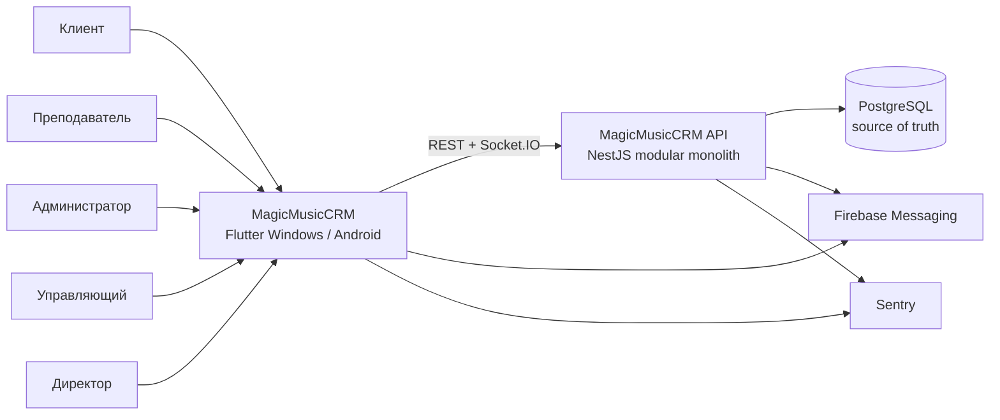
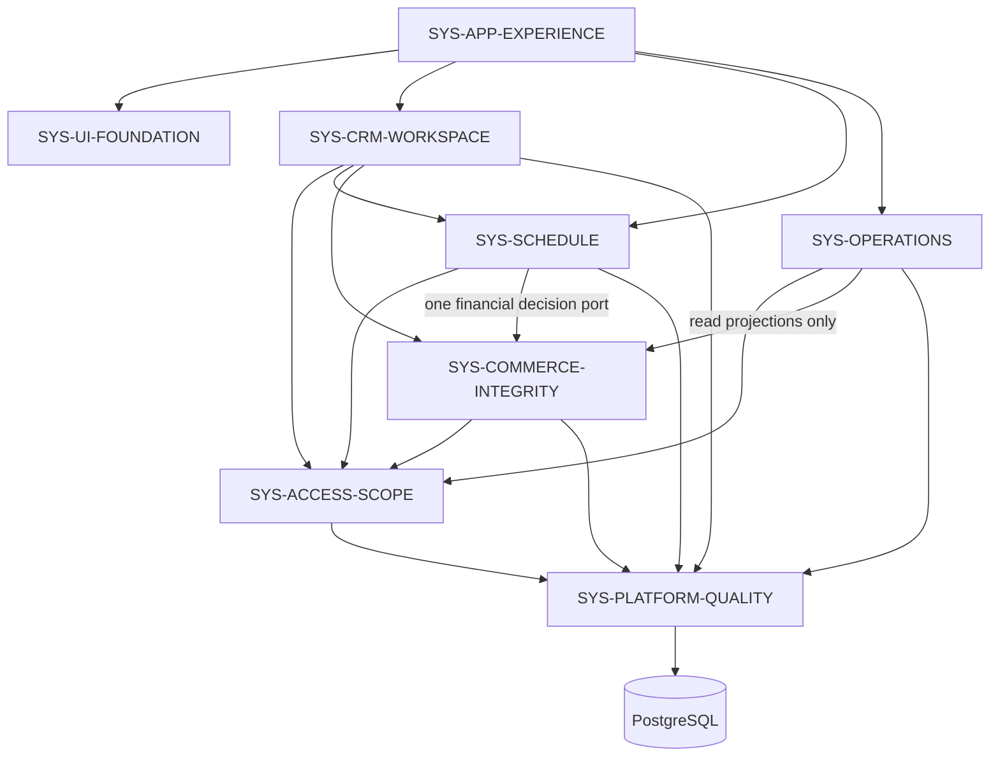

# MagicMusicCRM v7 — Architecture Overview

> **Статус:** Accepted  
> **Основание:** PRD v7 подтверждён владельцем 2026-08-07  
> **Принцип:** одно существующее приложение и одна PostgreSQL ACID-граница;
> новые доменные факты добавляются, существующие факты не переписываются.

## 1. Контекст системы



v7 не создаёт новый deployable. Flutter остаётся единственным staff/client
интерфейсом, NestJS — единственным API, PostgreSQL — источником истины. Ни
Firebase, ни realtime-события не содержат авторитетные финансовые значения:
они только уведомляют о необходимости перечитать actor-safe проекцию.

## 2. Инвентаризация систем

Логические системы нужны для владения правилами, но не являются
микросервисами.

| ID | Ответственность | Граница | Стек |
|---|---|---|---|
| `SYS-APP-EXPERIENCE` | Shell, канонические маршруты, breadcrumbs, desktop tabs, Back/deep-link и adaptive surface policy | Не хранит доменные записи и не решает RBAC | Flutter, GoRouter, Riverpod |
| `SYS-UI-FOUNDATION` | v7 tokens/components, формы, accessibility, keyboard/scroll и responsive layout | Не вызывает API напрямую | Flutter Material |
| `SYS-ACCESS-SCOPE` | Capabilities, роли, school/branch/client scope и actor-safe projection | Скрытый UI не считается защитой | NestJS guards/policy, PostgreSQL, Flutter projection |
| `SYS-CRM-WORKSPACE` | Lead/Student, Client Card, общая заметка, conversion и композиция клиентских разделов | Не вычисляет баланс, settlement или payroll | Flutter + NestJS CRM |
| `SYS-SCHEDULE` | Lessons, recurring plans/series, plan preview, конфликты, перенос, planned decision lifecycle и completion worker | Не вычисляет денежные правила самостоятельно | Flutter calendar + NestJS schedule |
| `SYS-COMMERCE-INTEGRITY` | Личный счёт, subscriptions/installments/payment reversal, planned/final client settlement, teacher compensation и correction facts | Не владеет календарной геометрией или school-wide UI reports | NestJS commerce, PostgreSQL ledger |
| `SYS-OPERATIONS` | Tasks, dashboard, finance drilldowns, users/settings и technical staff history presentation | Не меняет immutable commerce facts в обход команд | Flutter + NestJS projections |
| `SYS-PLATFORM-QUALITY` | Транзакции, idempotency, version guards, audit/outbox, realtime invalidation, reconciliation, migrations и release gates | Не содержит дублирующей бизнес-модели | PostgreSQL, NestJS, Jest, Flutter tests |

## 3. Владение v7-агрегатами

| Агрегат/факт | Владелец | Правило записи |
|---|---|---|
| `PersonalAccount` / ledger | `SYS-COMMERCE-INTEGRITY` | append-only; balance вычисляется |
| `SubscriptionPurchase` | `SYS-COMMERCE-INTEGRITY` | preview → versioned/idempotent commit |
| `SubscriptionObligationReserve` | `SYS-COMMERCE-INTEGRITY` | полное обязательство рассрочки, не wallet cash |
| `InstallmentPayment` | `SYS-COMMERCE-INTEGRITY` | `unpaid → posted_pending → paid`; correction через reversal |
| `PaymentReversal` | `SYS-COMMERCE-INTEGRITY` | не удаляет source; создаёт reporting exclusion pair |
| `PlannedLessonSettlement` | `SYS-SCHEDULE` + Commerce validation port | versioned до terminal state, bound к immutable config revisions |
| `LessonSettlement` / teacher accrual / correction | `SYS-COMMERCE-INTEGRITY` | append-only facts из transition/worker; effective result через reversal links |
| `RecurringSchedulePlan` / series | `SYS-SCHEDULE` | effective-dated, versioned, завершение через preview |
| `ClientInternalNote` | `SYS-CRM-WORKSPACE` | одна versioned note, survives Lead→Student |
| `OperationalAuditEntry` | `SYS-PLATFORM-QUALITY` | immutable, actor-scoped, reason + before/after refs |
| Каталоги settlement/compensation | `SYS-COMMERCE-INTEGRITY` через существующий configuration lifecycle | draft → impact preview → publish/rollback; used values archive-only |

### 3.1 Физические корни кода

| Система | Production roots |
|---|---|
| App Experience | `lib/core/navigation/`, `lib/core/router/`, `lib/core/workspace/`, shell в `lib/features/admin/` |
| UI Foundation | `lib/core/theme/`, `lib/core/widgets/` |
| Access & Scope | `server/src/access-control/`, Flutter capability/session projection в `lib/core/` |
| CRM Workspace | `server/src/crm/`, исключая выделенные ниже commerce/schedule seams; `lib/features/crm/` |
| Schedule | `server/src/crm/schedule/`, `server/src/crm/crm-schedule.controller.ts`, Flutter schedule widgets/services |
| Commerce Integrity | `server/src/crm/commerce/`, `server/src/crm/subscription-commerce.controller.ts`, commerce DTO/repositories; Flutter finance service и Client Card finance sections |
| Operations | backend dashboard/tasks/people/finance read surfaces; соответствующие Flutter destinations |
| Platform Quality | `server/src/db/`, platform/audit/outbox/realtime/security seams, `tools/`, `test/`, `integration_test/` |

```text
MagicMusicCRM/
├── lib/                              # Flutter deployable
│   ├── core/                         # app experience, UI, access clients
│   └── features/
│       ├── crm/                      # Client Card + commerce/schedule surfaces
│       └── admin/                    # schedule/operations destinations
├── server/                           # NestJS deployable
│   ├── db/migrations/                # PostgreSQL schema evolution
│   └── src/
│       ├── access-control/           # authoritative RBAC/resource scope
│       └── crm/
│           ├── commerce/             # money/hours immutable commands
│           └── schedule/             # time/conflict/lifecycle commands
├── test/                             # Flutter regression tests
├── integration_test/                 # on-device acceptance seams
└── .anws/v7/                         # approved architecture and design
```

## 4. Матрица границ

| Система | Вход | Выход | Зависимости |
|---|---|---|---|
| App Experience | typed route, account, width, source context | выбранная каноническая surface/location | UI, Access, domain projections |
| UI Foundation | actor-safe view model, commands, validation errors | доступная форма/состояние без собственной бизнес-логики | App Experience |
| Access & Scope | actor, capability version, resource refs | allow/deny + bounded scope/projection | Platform, PostgreSQL |
| CRM Workspace | ClientRef, note command, section focus | client projection, note history, typed links | Access, Schedule, Commerce |
| Schedule | lesson/plan command, expected version, reason | constraint preview, source/successor transition | Access, Commerce port, Platform |
| Commerce | recipient, payer, amount/hours, payment/settlement command | ledger/subscription/payment/accrual facts и projections | Access, Platform |
| Operations | filter/scope, audit reference | bounded dashboard/history/drilldown | Access, Commerce read model, Platform |
| Platform Quality | transaction callback, idempotency, audit/outbox event | atomic commit/rollback, invalidation, reconciliation evidence | PostgreSQL, realtime/Sentry |

## 5. Граф зависимостей



Цикл `Schedule ↔ Commerce` запрещён: Schedule управляет временем и lifecycle,
а перед commit передаёт финансовое решение через существующий port. Commerce
добавляет settlement/accrual факты в ту же транзакцию, не вызывая Schedule.

## 6. Ключевые command boundaries

### 6.1 Покупка абонемента

`previewPurchase` возвращает package snapshot, recipient/payer, итоговую цену,
скидку/доплату, баланс либо рассрочное обязательство и preview token. Commit
повторно проверяет обе client scopes, блокирует payer account/aggregate,
проверяет token/version и одной транзакцией создаёт purchase, subscription,
ledger debit либо obligation reserve/installments, audit и outbox.

### 6.2 Статусы и удаление оплаты

Due worker идемпотентно создаёт `posted_pending`. Сотрудник переводит запись в
`paid` или `unpaid` с реквизитами проверки. UI-команда «Удалить» создаёт
status-aware cancellation/reversal: source сохраняется, paid получает денежный
reversal, а reporting exclusion связывает пару. Обычные отчёты исключают пару;
technical history показывает причину Admin/Manager/Director.

### 6.3 Перенос и расчёт занятия

Все изменения date/time используют один `lesson transition preview/commit`.
Команда содержит обязательную причину, settlement type и выбранную вручную
teacher compensation rule. Schedule проверяет conflicts/source-successor;
Commerce проверяет subscription hours и рассчитывает snapshots. Обе части
фиксируются одной транзакцией. Прямой PATCH date/time после миграции запрещён
контрактным inventory-тестом.

### 6.4 Постоянное расписание

Plan — именованный контейнер одного типа (`individual` или `group`) с 1+ series,
ссылкой на subscription и собственной tray projection. Завершение сначала
показывает затрагиваемые future lessons, затем одной командой effective-dates
plan/series и отменяет только будущие незавершённые занятия.

## 7. Access и конфиденциальность

- Admin/Manager/Director получают capability на client-finance purchase,
  cross-account payer, refund и payment reversal в разрешённом client scope.
- Только Director/system_admin публикуют settlement/compensation catalogs.
- Admin и Manager по-прежнему не получают school-wide finance.
- Teacher/Client не получают payer search, internal note, operational reasons,
  reporting exclusion или технические денежные поля даже в сериализованном JSON.
- Команда с другим плательщиком проверяет scope обоих клиентов; неизвестный или
  недоступный payer возвращает actor-safe 404.
- Любой commit повторно читает current capability/version; открытая форма не
  сохраняет отозванное право.

## 8. Данные и согласованность

- Денежные суммы — integer minor units + ISO currency; часы — существующий
  decimal/fractional units contract.
- Факты payment/ledger/settlement/accrual/audit immutable на уровне PostgreSQL.
- Изменяемые агрегаты имеют positive version и expected-version command.
- Preview token подписывает критичный snapshot; commit не доверяет Flutter.
- Idempotency key + request fingerprint запрещают повтор с другим payload.
- Reconciliation проверяет ledger, paid, debt, obligation, reversal exclusions,
  subscription hours и teacher accrual; допустимое расхождение — 0.
- Исторические label/color/rule/rate сохраняются snapshot-ом и не меняются при
  публикации нового каталога.

## 9. Обоснование декомпозиции

Commerce выделен из прежнего широкого `SYS-OPERATIONS`, потому что только он
владеет атомарными денежными и часовыми фактами. Schedule остаётся отдельным:
конфликты и временная генерация меняются независимо от ledger. CRM Workspace
композирует карточку, но не копирует их правила. Platform Quality объединяет
общие механизмы транзакций/audit/reconciliation, не становясь бизнес-комбайном.

Все восемь систем помещаются в существующие два deployable и один PostgreSQL.
Это сохраняет ясные владельцы данных без распределённых транзакций и без
инфраструктуры, которую текущая нагрузка не оправдывает.

## 10. ADR

- [ADR-001 — Preserve v7 and existing runtime](03_ADR/ADR_001_preserve_v7_existing_runtime.md)
- [ADR-002 — Adaptive surface policy](03_ADR/ADR_002_adaptive_surface_policy.md)
- [ADR-003 — Unified navigation, history and breadcrumbs](03_ADR/ADR_003_navigation_history_breadcrumbs.md)
- [ADR-004 — Desktop input and scrolling](03_ADR/ADR_004_desktop_input_scrolling.md)
- [ADR-005 — Capability-projected role and scope UX](03_ADR/ADR_005_capability_projected_role_scope.md)
- [ADR-006 — UX quality and release evidence](03_ADR/ADR_006_ux_quality_release_evidence.md)
- [ADR-007 — Финансово-учебный runtime v7](03_ADR/ADR_007_v7_finance_runtime.md)
- [ADR-008 — Append-only клиентские финансы](03_ADR/ADR_008_append_only_client_finance.md)
- [ADR-009 — Единый атомарный lesson transition](03_ADR/ADR_009_atomic_lesson_transition.md)
- [ADR-010 — Client-finance capabilities и видимые причины](03_ADR/ADR_010_client_finance_capabilities_and_reasons.md)
