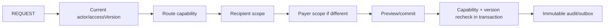

# SYS-ACCESS-SCOPE / SYS-PLATFORM-QUALITY — v7 Design

**Статус:** Accepted  
**PRD:** REQ-REPORT-101, REQ-CLIENT-102  
**ADR:** ADR-007, ADR-008, ADR-010

## 1. Overview

v7 добавляет два capability keys в существующий registry и расширяет текущий
audit/outbox/reconciliation. Второй RBAC или журнал не создаётся.

## 2. Goals / Non-Goals

- Admin/Manager/Director выполняют risky client-finance actions в разрешённом
  client scope.
- Только Director/system_admin публикуют settlement/pay catalogs.
- Admin/Manager не получают school-wide finance.
- Причины видны коллегам трёх ролей, но не Teacher/Client.
- Role revocation/current version проверяются на каждом commit.

## 3. Capabilities

| Key | Client | Teacher | Admin | Manager | Director | System admin |
|---|---:|---:|---:|---:|---:|---:|
| `commerce.client_finance.read` | self | deny | allow | allow | allow | allow |
| `commerce.client_finance.write` | deny | deny | allow | allow | allow | allow |
| `config.commerce.manage` | deny | deny | deny | deny | allow | allow |
| `commerce.school_finance.read` | deny | deny | deny | deny | allow | allow |

Legacy `commerce.subscription.issue` remains mapped only while old route adapter
exists; production UI uses `commerce.client_finance.write`, then old key/adapter
is removed or retained solely for backward compatibility with explicit inventory.

Unified CRM Configuration remains one snapshot. On publish, backend compares the
protected `lessonSettlementTypes` and `teacherCompensationRules` segments with
the current effective snapshot: an actor without `config.commerce.manage` may
publish other permitted CRM changes only when both protected segments are
byte-equivalent. Hiding catalog UI is not enforcement.

## 4. Authorization flow

Denied payer/recipient behaves as not found. Branch mismatch cannot be bypassed by
UUID. Flutter capability projection hides actions and does not create providers,
but backend remains authoritative.

## 5. Audit contract

Risky command audit requires:

- stable action and entity/ref;
- full trimmed `reasonText` (1..500), separate optional reasonCode;
- actor id and server time;
- before/after references without embedding secrets;
- recipient/payer refs where applicable;
- idempotency/request/audit correlation;
- technical-only marker for reversals/voids.

Required actions: cross-account purchase, discount/surcharge, payment status
change/reversal, subscription refund/cancel, lesson move/cancel/settle,
teacher-pay override, plan update/end and internal-note update.

## 6. Projection and reports

- Operational history allowlists actions and resolves actor-safe display labels.
- Teacher/Client serializer and log redactor treat payer, debt, reasons,
  reversal/exclusion and teacher compensation as restricted fields.
- Ordinary revenue/payment queries share one reporting-exclusion predicate.
- Technical audit rows never feed dashboard KPIs/exports.
- Manager/Admin can see client-card facts but cannot instantiate school-finance
  dashboard/export providers.

## 7. Reconciliation and quality gates

Reconciliation checks per currency/client/subscription/lesson:

- actual paid + adjustments vs account balance;
- obligation debits/credits and installments;
- reversal source/counterpart equality and exclusion cardinality;
- subscription total = used + reserved + remaining;
- terminal lesson client/teacher fact cardinality;
- audit/outbox exactly once for successful idempotent command.

Gate order: migration down→up → targeted PostgreSQL → Actor/Payload Matrix →
backend full/typecheck/build → Flutter targeted/full/analyze → Windows/Android →
two identical preflight/reconcile runs → owner UAT.

## 8. Performance/retention

- operational history cursor/limit; indexes entity/action/time/id;
- audit remains append-only under existing retention/backup policy;
- outbox carries ids/invalidation tags only, not amounts/reasons;
- no cache of authorization decisions past accessVersion invalidation.

## 9. Failure handling

- unknown capability/config key fails closed;
- stale accessVersion cannot commit after role change;
- audit/outbox failure rolls back business facts;
- duplicate idempotency returns same audit/event refs;
- projection error cannot fall back to unscoped raw rows.

## 10. Verification

- Actor Matrix routes × 6 actors × recipient/payer branch cases;
- exact payload key leak tests for Teacher/Client;
- Admin client-card actions allowed while `/crm/reports/finance` denied;
- Manager same school-finance deny; Director config allowed;
- another admin can read reason after restart/direct link;
- reporting exclusion and technical history diverge exactly as specified.

## 11. Trade-offs

- One broad client-finance write capability matches identical requested roles;
  separate per-button keys add administration without current value.
- Reasons remain in authoritative audit rather than a second activity table.
- Technical history is bounded on demand, not pushed in realtime payloads.

## 12. Implementation map

- `server/src/access-control/capability-registry.ts`, route policy and migration;
- `CrmPolicy` resource checks for both Students;
- Platform Integrity audit/outbox and v4 reconciliation;
- Flutter capability model/navigation guards and Client Card history.
