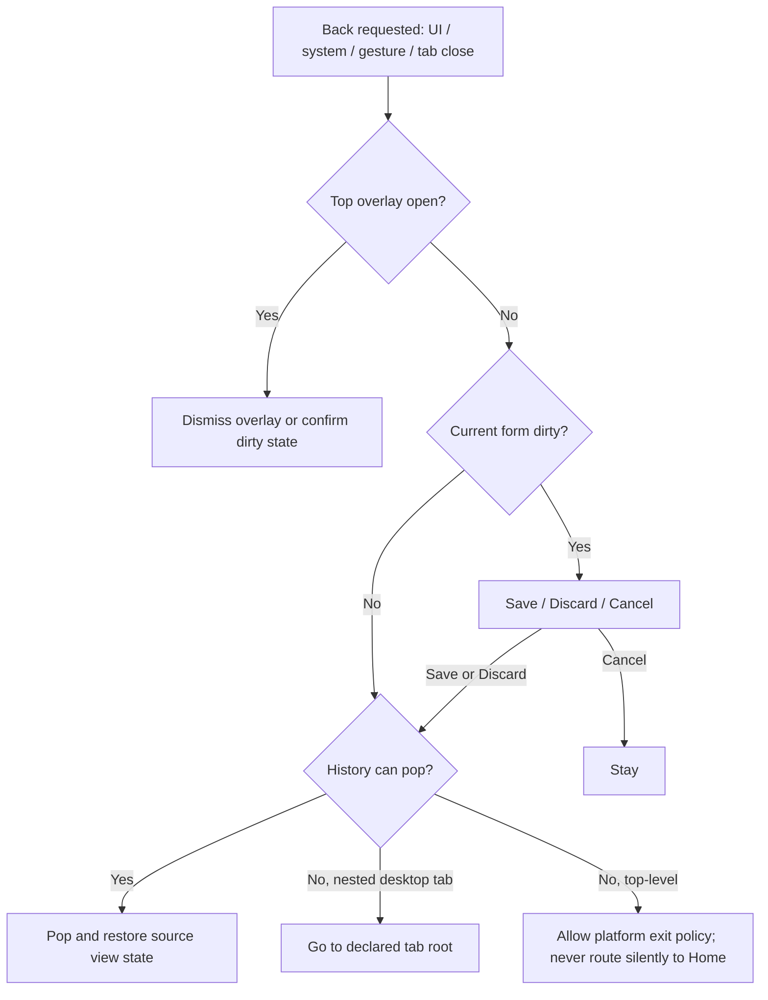

# App Experience Redesign — v6

> **Level:** L0 system design  
> **Status:** Proposed  
> **Requirements:** `REQ-WORKSPACE-001`, `REQ-DESKTOP-001`, `REQ-NAV-001..003`, `REQ-SURFACE-001`, `REQ-UX-001..002` and all surfaced v6 domain requirements.

## 1. Intended product after v6

MagicMusicCRM becomes a connected work environment rather than a collection of dialogs. The approved v7 appearance remains: dark charcoal surfaces, restrained gold brand accent, clear functional colors, Inter typography, compact desktop density and calmer mobile density. v6 changes composition, navigation and behavior—not brand identity.

The result should feel predictable after one learned pattern:

1. Top-level section selects the job area.
2. On desktop, a workspace tab preserves each parallel context.
3. Context bar shows Back/Forward, hierarchy path and page actions.
4. Typed links open related records without losing the source state.
5. On mobile, primary work is a page; quick context is a sheet that can expand to full screen.
6. School/branch scope is visible wherever it changes results or mutations.

## 2. Design goals

- Make the shortest common workflow obvious for every supported role.
- Preserve context across links, tabs, restart, Back and direct deep links.
- Make Windows fully usable with mouse and keyboard, Android fully usable with touch and system Back.
- Expose only authorized navigation and data without weakening server-side enforcement.
- Reuse existing services, providers, routes, workspace and v7 components.
- Provide one canonical visual/state language for forms, actions and async content.

## 3. Non-goals

- A new visual brand, design framework, router or backend API layer.
- Copying HolliHop pixel-for-pixel.
- Hiding inaccessible data only on the frontend.
- Turning every popup into a full-screen route or every screen into a dashboard.
- Adding role-specific forks when capability projection and adaptive layout suffice.

## 4. Role-oriented information architecture

| Role | Primary landing | Always prominent | Deliberately absent |
|---|---|---|---|
| Client | Next lesson / messages | Chat, My school, own schedule/homework/profile | Staff tools, other clients, internal finance/config |
| Teacher | Today / Week schedule | Chat, assigned lessons/clients, shared comments, homework context | Create/drag lessons, attendance mutation, client private contacts/finance |
| Admin | Operational day | Chat, Schedule, Clients | Users/config, managerial reports, school finance |
| Manager | Operations overview | Clients, Schedule, Tasks, operational users/reports | School-wide finance and financial analytics |
| Director | School overview | All operational areas, Finance, Analytics, Configuration, Access | Technical emergency surfaces unless separately authorized |

`system_admin` is an emergency/technical capability superset, not a separate everyday visual persona. The visible shell is derived from capabilities; role rows define prioritization and density.

## 5. Global anatomy

### 5.1 Desktop (`>= 840`)

```text
┌ Sidebar ┬ Workspace tabs: Клиенты | Анна Смирнова • | Расписание ┐
│         ├ Back Forward  Клиенты > Сокол > Анна Смирнова > Оплаты │
│         ├────────────────────────────────────────── Page actions ┤
│         │                                                        │
│         │                  Routed work area                      │
│         │        visible vertical/horizontal scrollbars         │
└─────────┴────────────────────────────────────────────────────────┘
```

- Sidebar changes top-level area in the current tab unless the user explicitly opens a new tab.
- Tab title mirrors the current meaningful object, dirty marker and actor-safe state.
- Context bar is sticky inside the workspace, not repeated inside content.
- Page-level primary action is right-aligned and unique; secondary actions use text/outline or overflow.

### 5.2 Mobile (`< 840`)

```text
┌ Back   Current object/section                 More ┐
├─────────────────────────────────────────────────────┤
│                                                     │
│                Full-width route content             │
│                                                     │
├─────────────────────────────────────────────────────┤
│           Sticky primary action when needed         │
└ Chat ─ Schedule/Home ─ Clients/Profile ─────────────┘
```

- Top app bar always reflects whether Back is available.
- Bottom navigation appears only on top-level destinations; nested routes keep the stack and do not silently switch home.
- Forms use full width with 16px side padding; multi-column desktop forms collapse to one logical order.
- Primary actions remain reachable above keyboard/safe area.

## 6. Navigation contract

### 6.1 Three navigation layers

| Mechanism | Meaning | Persistence | Example |
|---|---|---|---|
| Workspace tab | Parallel task context | Per account across restart; cleared on logout | Client A and Schedule open side-by-side |
| Back/Forward | Chronological history of active context | Per tab, safe restorable state only | Return from lesson to same calendar date |
| Breadcrumbs | Parent hierarchy of current route | Rebuilt from typed route metadata | Clients → Sokol → Anna → Payments |

### 6.2 Canonical location

Every deep-linkable screen declares:

- stable route name and typed parameters;
- required capability/resource scope;
- parent resolver for breadcrumbs;
- actor-safe title and optional icon;
- restorable view state schema/version;
- preferred surface type by width;
- entity link targets available from the page.

The implementation extends the existing route/entity metadata rather than adding a parallel registry. Domain records remain in providers and are revalidated on restoration.

### 6.3 Back algorithm



Use ahead-of-time pop state (`PopScope`/`NavigatorPopHandler`/`Form.canPop`) so Android predictive Back is correct.

## 7. Adaptive surface policy

| Job | Compact | Expanded desktop | Examples |
|---|---|---|---|
| Primary/multi-step work | Full-screen route | Workspace route/page | Client card, payment, lesson edit, configuration |
| Quick view | Draggable sheet | Side sheet or bounded large sheet | Lesson summary before navigation |
| Short contextual edit | Draggable sheet, expandable | Bounded sheet/modal if source context matters | Preferred-time quick edit |
| Selection/search | Full-width sheet/drawer | Popover/drawer | Teacher, branch, recipient |
| Confirmation | Dialog | Dialog | Delete/cancel with impact |
| Dense comparison | Route | Full work area | Reports, finance, tables |

Mobile draggable sheet requirements:

- width: all available safe width; no floating side gutters on compact phones;
- initial extent around `0.58`, snap extents `0.58 / 0.90 / 1.00` when content benefits;
- visible handle plus labelled `Развернуть`/`Свернуть` action;
- supplied scroll controller attached to the primary scrollable;
- top app bar appears at full extent; close/back semantics remain stable;
- keyboard inset and sticky action do not cover the last field.

## 8. Scope selector

`MagicScopeSelector` is a repeated UI pattern, not a new domain model. It renders only route-supported and capability-allowed choices:

- Client context defaults to effective client branch.
- List/dashboard context restores the last permitted choice per account and route.
- `Вся школа` is absent—not disabled—when the operation cannot be school-wide.
- Current scope appears near the page title/filter bar and in mutation confirmation when materially relevant.
- Deep links carry explicit scope only when safe; stale/forbidden scope falls back to a permitted choice with a visible notice.

## 9. Visual system

Preserve `design_tokens.dart` and `app_theme.dart` as source of truth:

- charcoal background/surfaces/sidebar/input/dividers;
- gold brand/accent `#C5A059`;
- action blue, success, warning and danger tokens for meaning;
- radii 10/14 and existing spacing scale 4/8/12/16/20/24;
- motion durations 160/240/300ms, disabled or reduced for reduced-motion preference;
- Inter bundled for consistent metrics, falling back safely until packaged.

Color never acts alone. Current-client calendar events combine green with a client marker/label; lifecycle remains its own token. Focus rings, text labels, icons and tooltips communicate state.

## 10. Minimal shared component delta

Use existing components first. Add or extend only repeated behavior:

| Primitive | Responsibility | Reuses |
|---|---|---|
| `AdaptiveWorkspaceScaffold` | Width class, shell slots, top-level vs nested navigation | Existing dashboard shell / LayoutBuilder |
| `MagicContextBar` | Back/Forward, breadcrumbs, page actions/overflow | Existing icon buttons, menu and tokens |
| `MagicAdaptiveSurface` | Chooses route/sheet/dialog container from declared job | Existing `showMagicSheet/Drawer` |
| `MagicDraggableSheet` | Handle, extents, expand, safe area, dirty-state integration | Flutter `DraggableScrollableSheet` |
| `MagicDesktopScrollbar` | Styled explicit controller owner per axis | Flutter `Scrollbar`/theme |
| `MagicEntityLink` | Typed actor-safe entity text; desktop new-tab/compact stack policy, focus and semantics | Existing `EntityRouteRegistry` |
| `MagicPageState` | Consistent loading/empty/error/forbidden/retry region | Existing skeleton/toast components |
| `MagicScopeSelector` | Displays valid effective school/branch choices | Existing branch selector/provider |

Do not add a base class or new package for these patterns. If an existing widget already satisfies the contract, rename/reuse it rather than wrapping it.

## 11. Domain experience after redesign

### Client workspace

Desktop client card is a routed full work area and one vertically scrollable workspace-canvas: its capability-projected sections are visible in a stable reading order without a section tab switch. The role-projected left navigation rail remains mounted while any client is open; every entry path resolves under the canonical `Клиенты > Лид/Ученик · имя` context instead of creating a parallel standalone surface. Large desktop uses bounded field widths and two-column section rows where content permits; section deep links scroll to the matching block. Mobile remains a full-screen nested route with compact thematic tabs over the same providers and commands. Canonical sections: Overview, Lessons, Payments, Subscriptions, History & Tasks, Contacts/Representatives, Documents. Configuration-driven Custom fields are a collapsed region inside Overview on every width, never a separate client-card destination. Preferred schedule moves out of Info into Lessons; the actual client calendar follows it as an interactive expandable region and defaults to hiding other clients' lessons. Payments remains separate from subscriptions.

Internal related-record navigation is rendered on the entity label itself: client,
teacher, room, group, lesson, payment, subscription, task and user names use the
typed `EntityRouteRegistry` seam. Desktop always opens/selects a new workspace
tab after snapshotting the source view; compact pushes the canonical route.
Standalone «Открыть в новой вкладке» controls are not part of the UI.

Lead and Student boards share one toolbar/layout contract: search and an expandable `Фильтры` control on the left, one role-gated create FAB at bottom-right. Client Overview treats Advertising source, Request type, Learning goal, Level, Category and Lesson type as primary fields. Advertising source is one canonical `lead_sources.id` reference shared by Lead and Student and copied losslessly during conversion; legacy `adSource` is migration input only and never a second editable field.

### Schedule and lessons

Calendar mode/date/branch/filter/scroll are restorable. Lesson quick view exposes typed Client/Teacher/Room links and an explicit Edit action. Navigating to a linked record and Back returns to the exact date/mode/position. Client Lessons embeds Month/Week/Day: selected client's lessons are green plus labelled marker, other actor-visible lessons neutral gray.

### Tasks

One canonical create action and one canonical task model. Legacy routes redirect to the canonical screen until removed. Audience preview distinguishes explicit users from dynamic branch recipients before submit.

### Analytics and finance

One dashboard owns shared period/scope filters and section-level loading/error states. Capability projection removes school-finance sections and requests for Manager. Drilldowns are typed deep links and preserve filters on Back.

### Configuration and users

Configuration is organized by object/category, draft/revision state and scope inheritance. Director can delegate defined config capabilities below self; preview shows affected forms/records/branches before publish. Changes use the same labels, validation and conflict states as operational forms.

## 12. State language

Every routed surface and repeated component specifies:

- default, hover, focus, pressed and selected;
- disabled with reason where useful;
- loading with layout-preserving skeleton/progress;
- empty with explanation and one appropriate next action;
- validation and server error near cause plus summary when long;
- offline/network retry without clearing input;
- version conflict with reload/compare/retry choice;
- forbidden without resource-existence disclosure;
- success feedback that does not block continued work.

One surface has one primary action. Destructive actions are labelled, visually separated and require impact-aware confirmation.

## 13. Accessibility and platform input

- Minimum compact touch target: 48dp; dense desktop controls retain at least 36px visual height and 44px interactive hit area where feasible.
- All icon-only controls have tooltip and semantic label.
- Logical focus order follows reading/workflow order; Enter/Space activate, Escape dismisses the top dismissible surface, standard shortcuts work only where conflict-free.
- Visible focus indicators meet contrast expectations; meaning is not conveyed by color alone.
- Desktop overflow always has a visible draggable thumb; mobile persistent tracks remain off.
- Text scales without clipping critical actions; screen reader announcements cover validation, loading completion and route title.

## 14. Performance and privacy

- Navigate with stable refs; fetch actor-scoped data after capability resolution.
- Client embedded calendar queries viewport range, effective branch and actor scope; it does not download an unbounded school calendar.
- Persist only route identifiers, safe parameters and view state; never raw client/payment records or auth tokens in workspace cache.
- Restoration validates account, route schema/version, capability and resource existence before rendering.
- Layout changes avoid duplicate providers/API calls; per-screen wire-to-service diff is mandatory.

## 15. Verification and rollout

1. Inventory and baseline existing routes, surfaces, scroll owners and network calls.
2. Ship navigation kernel and adaptive surfaces behind production integration tests.
3. Migrate shared high-frequency workflows: Schedule, Client, Tasks.
4. Migrate dashboard/configuration and role-specific shells.
5. Run role × scope × width/device matrix and real-account owner UAT.
6. Remove redirected legacy entry points only after parity evidence.
7. Approve production only after security, reconciliation and rollback gates pass.

Detailed matrices and component contracts: [app_experience_redesign.detail.md](app_experience_redesign.detail.md).
