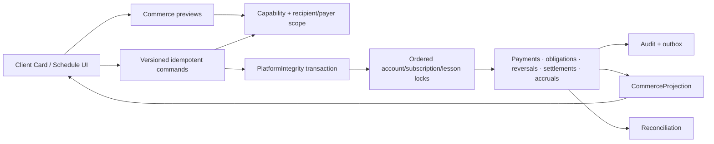
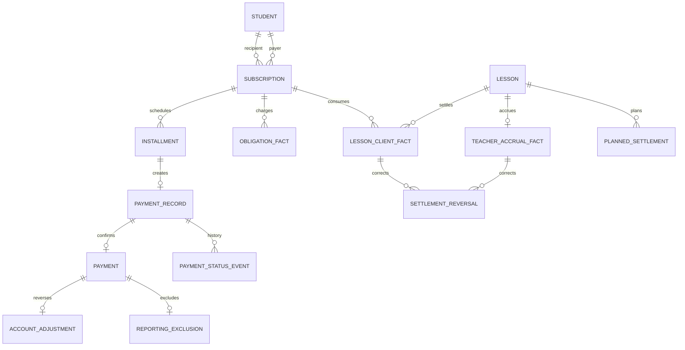
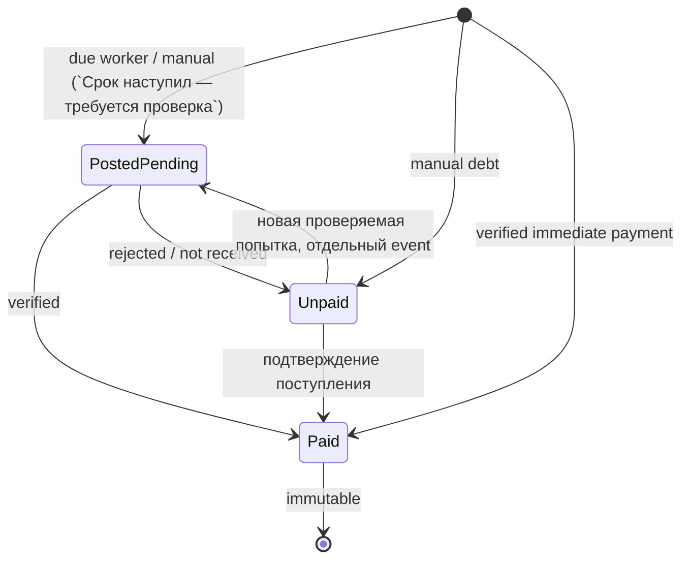

# SYS-COMMERCE-INTEGRITY — System Design

**Статус:** Accepted  
**PRD:** REQ-COMMERCE-101/102, REQ-PAYMENT-101/102,
REQ-LESSON-101/102/103, REQ-REPORT-101
**ADR:** ADR-007, ADR-008, ADR-009, ADR-010

## 1. Overview

Система является единственным владельцем денег, абонементных часов,
settlement и начисления преподавателю. Она расширяет существующие
`server/src/crm/commerce/` и Commerce Projection; новый сервис или второй ledger
не создаются.

## 2. Goals / Non-Goals

### Goals

- атомарно купить абонемент получателю с его или чужого личного счёта;
- выдать все часы и зафиксировать полное обязательство рассрочки;
- поддержать `Не оплачен / Проведён, ожидает подтверждения / Оплачен`;
- отменить абонемент и сторнировать оплату без физического удаления;
- валидировать planned client settlement/teacher pay, автоматически проводить их
  после lesson end и поддерживать append-only correction;
- хранить базовую почасовую ставку преподавателя effective-dated историей,
  собирать независимую от клиентского funding payroll-проекцию и регистрировать
  выплаты без имитации банковского или кассового перевода;
- давать reconciliation delta = 0 и bounded actor-safe projections.

### Non-Goals

- банковский эквайринг/касса;
- mutable balance column как источник истины;
- автоматический выбор оплаты преподавателю по типу списания;
- общешкольные финансы для Admin/Manager;
- event sourcing framework или отдельный commerce deployable.

## 3. Architecture

## 4. Components

| Компонент | Работа | Переиспользование |
|---|---|---|
| `SubscriptionPurchaseService` | preview/commit, payer lock, balance guard, issue hours | развивает `SubscriptionIssueService` |
| `PaymentLifecycleService` | create/transition due/manual payment records | вызывает `ActualPaymentService` при `paid` |
| `PaymentReversalService` | preview/storno/reporting exclusion | переиспользует account adjustment fact |
| `SubscriptionLifecycleService` | cancel/refund original payer | расширяет текущий preview token flow |
| `LessonFinancialDecisionService` | settlement + teacher accrual snapshot | заменяет boolean boundary |
| `PlannedLessonSettlementService` | binds manual decision to config revisions and reservation impact | расширяет settlement port |
| `LessonSettlementCorrectionService` | atomic reversal/exclusion + optional replacement | переиспользует append-only facts |
| `CommerceConfigurationAdapter` | effective settlement/pay rules | расширяет unified CRM Configuration snapshot |
| `TeachersService` | атомарная карточка, филиалы/дисциплины/custom eligibility и effective-dated базовая ставка | расширяет один существующий Teacher create/update path |
| `PayrollService` | проведённые/оплачиваемые занятия, часы, accrual, adjustments, payouts и debt | читает effective teacher facts и legacy fallback без второго payroll ledger |
| `CommerceProjectionRepository` | единственный wallet/debt/pending/revenue/subscription/movements/history read contract для Client Card, dashboards, analytics и exports | расширяет один существующий SQL projection |
| `CommerceReconciliation` | ledger/obligation/payment/exclusion/hours/accrual checks | расширяет v4 preflight/reconcile |

## 5. Operation contracts

| Действие | Предусловие | Вход | Атомарный выход |
|---|---|---|---|
| Purchase preview | package active; обе client scopes | recipient, payer, terms, funding mode | signed preview: price/hours/balance/obligation |
| Purchase commit | fresh token/version/idempotency | preview token, reason if payer differs | subscription + payer debit/obligation + installments + audit |
| Due payment create | installment due, no record | clock, installment id | `posted_pending` record + marker |
| Payment transition | current record/version | target `paid` or `unpaid`, check fields | status event; при paid — immutable cash payment |
| Payment reversal | staff scope, not already reversed | payment id/version/reason/token | negative adjustment + exclusion pair + audit |
| Cancel preview | active subscription | subscription/version | used/reserved/paid/refundable/pending/unpaid impact |
| Cancel commit | fresh preview, reason | refund ≤ confirmed-funded cap | close unfunded obligation + refund original payer + exclusion + audit |
| Lesson settlement | valid lesson/config/subscription | settlement rule + teacher rule + reason | client facts + teacher accrual snapshots |
| Planned settlement | scheduled lesson/current revisions | required client + teacher decisions | versioned plan + exact reservation impact |
| Settlement correction | effective completed settlement | reason + replacement/cancel | reversal/exclusion + optional new effective facts |
| Teacher create/update | actor may manage Teacher/payroll | identity, branches, disciplines, levels, categories, salary metadata, rate/effective date | одна Teacher mutation + append-only rate history; при create также user/profile/link |
| Teacher payout | positive amount and payroll capability | teacher, kind, paidAt, comment | append-only payout/bonus/deduction + audit |
| Teacher payroll report | payroll capability and bounded date filters | period, branch, teacher, teaching attributes | completed/payable counts, hours, effective accrual, adjustments, payouts and period balance; Teacher card retains all-time debt |

## 6. API interfaces

Все mutating POST используют `Idempotency-Key` и `X-Request-Id`.

| Method / path | Назначение | Capability |
|---|---|---|
| `POST /crm/students/:recipientId/subscriptions/purchase/preview` | покупка preview | `commerce.client_finance.write` |
| `POST /crm/students/:recipientId/subscriptions/purchase` | атомарная покупка | `commerce.client_finance.write` |
| `POST /crm/students/:studentId/payment-records` | ручная запись одного из 3 статусов | `commerce.client_finance.write` |
| `POST /crm/students/:studentId/payment-records/:id/transition` | pending→paid/unpaid | `commerce.client_finance.write` |
| `POST /crm/students/:studentId/payment-records/:id/reverse/preview` | impact сторно | `commerce.client_finance.write` |
| `POST /crm/students/:studentId/payment-records/:id/reverse` | сторно/техническое удаление | `commerce.client_finance.write` |
| существующие `.../cancel/preview`, `.../cancel` | refund original payer | `commerce.client_finance.write` |
| `GET /crm/students/:id/commerce` | единая проекция | `commerce.client_finance.read` |
| `POST /crm/teachers`, `PATCH /crm/teachers/:id` | единая карточка Teacher и ставка | existing Teacher manage + payroll guard for monetary fields |
| `GET /crm/teachers/:id/payroll` | карточка начислений и общей задолженности | per-teacher payroll read |
| `POST /crm/teachers/:id/payouts` | регистрация выплаты/доплаты/вычета | per-teacher payroll write |
| `GET /crm/reports/teacher-stats` | периодная payroll-проекция | per-teacher payroll read |

Существующий `subscriptions/issue` становится внутренним adapter либо удаляется
после миграции production callers; одновременно активных семантически разных
issue/purchase путей быть не должно.

## 7. Data model

Ключевые additions и constraints приведены в
[`commerce_integrity.detail.md`](commerce_integrity.detail.md).

## 8. Lifecycles

`voided/reversed` — технический lifecycle, не четвёртый статус оплаты. Он
скрывает запись из ordinary views через exclusion link, сохраняя history.

`posted_pending` не утверждает, что банк или касса уже провели платёж. Это
операционное состояние наступившего срока, требующее проверки сотрудником;
пользовательский label в каждом UI и экспорте — `Срок наступил — требуется
проверка`.

## 9. Projection semantics

| Поле | Формула/источник |
|---|---|
| `balanceMinor` | confirmed payments + paid adjustments + obligation credits − obligation debits − personal-account lesson charges |
| `availableBalanceMinor` | balance с учётом активных reservations/holds |
| `pendingMinor` | active `posted_pending` records |
| `debtMinor` | active `unpaid` records с наступившей датой |
| `remainingObligationMinor` | purchase charge − confirmed funding − cancelled unfunded obligation |
| `revenueMinor` | paid cash facts, не состоящие в reporting exclusion |

Lesson/client/teacher projections use only non-reversed effective facts. Planned
decisions and failed worker reasons are operational state, not revenue/payroll.

Teacher base rate is rubles per astronomical hour. Presets are presentation-only;
the backend accepts any non-negative decimal. `0` means `Входит в оклад`: the
lesson remains in completed/hour statistics but creates no piece-rate debt.
`teachers.salary` is reference metadata and is never silently added to lesson
accrual. A salary obligation would require an explicit future payroll fact, not a
screen-local formula.

For a selected payroll period the projection distinguishes all completed lessons,
payable lessons (`effective amount > 0`) and zero-pay lessons, and reports accrued,
bonus, deduction, payout and period balance separately. The Teacher card keeps the
authoritative all-time debt `effective accrual + bonus - deduction - payout`; a
period movement is not mislabelled as settlement of specific lessons because
payouts are aggregate facts.

Future installment schedule не является долгом; полная purchase obligation уже
видна отдельно и не выдаётся за деньги на счёте.

## 10. Security and performance

- Admin/Manager/Director write; only Director/system_admin config catalogs.
- recipient и payer проходят отдельный resource-scope check; safe 404 on deny.
- lock order: sorted `student:<uuid>`, затем subscription/payment/lesson ids.
- preview не держит DB transaction; commit повторно загружает всё после locks.
- amounts — `bigint` minor units, shares/hours — fixed hundredths/basis points.
- projection limit/cursor ≤ 100; индексы по student/status/due/occurred/id.
- Teacher/Client payload allowlist исключает payer, reason, reversal/audit fields.

## 11. Failure and observability

- stale token/version → `409` без фактов;
- worker domain failure → review-required with 0 partial facts;
- correction failure → reversal/replacement rollback together;
- insufficient one-time balance → field-level `422`;
- same idempotency + different payload → `409`;
- deadlock/serialization retry — bounded server retry либо safe client retry key;
- outbox после commit инвалидирует recipient и payer commerce projections;
- audit содержит human reason, actor, before/after refs; без PII в outbox/logs.

## 12. Verification

- calculation unit tests: discount/surcharge/refund/share/penalty;
- PostgreSQL fault injection и two-writer races;
- status/reversal/report predicate matrix;
- Actor Matrix/payload leak for six roles and two-client scope;
- atomic Teacher create/update with multi-branch/discipline/custom selections and
  exactly one intended effective-rate history entry;
- payroll calculation/report matrix for payable/zero-pay counts, arbitrary period,
  correction-effective fact, bonus/deduction/payout and CSV parity;
- migration down→up + lossless legacy paid backfill;
- reconciliation twice, delta 0;
- worker retry/poison and post-terminal correction races;
- Flutter Client Card tests and real accounts 3/4/5.

## 13. Trade-offs

1. New `payment_records` aggregate vs mutating immutable `payments`: выбран
   aggregate + paid fact, чтобы три статуса не переписывали кассовую историю.
2. Existing config snapshot vs отдельный catalog service: выбран snapshot,
   потому что draft/preview/publish/rollback/scope уже существуют.
3. Calculated balance vs mutable counter: выбран calculation; индекс/SQL дешевле
   риска drift, а materialized read model добавляется только по измеренному p95.

## 14. Implementation map

- Backend: `server/src/crm/commerce/`, subscription controller/DTO,
  configuration snapshot, access registry/route policy.
- Database: additive migrations `0103+`.
- Flutter: `magic_crm_service_finance.dart`, Client Card payment/subscription
  sections and shared adaptive forms, plus one shared Teacher employment/rate form
  used by both create and edit.
- Reports: один ordinary exclusion predicate; technical history отдельно.
