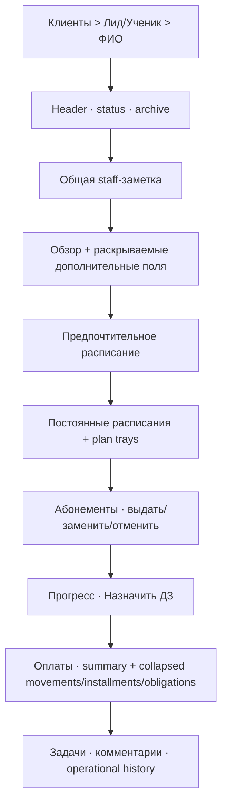

# SYS-CRM-WORKSPACE — v7 Client Card Design

**Статус:** Accepted  
**PRD:** REQ-CLIENT-101/102 и Client Card части commerce/schedule stories  
**ADR:** ADR-002, ADR-003, ADR-008, ADR-010

## 1. Overview

Client Card остаётся одним каноническим workspace внутри видимого navigation
rail. Desktop использует длинный scrollable canvas; compact использует короткие
тематические вкладки над теми же providers/commands. Новые commerce/schedule
действия живут в смысловых секциях вместе с общей staff-note/history.

## 2. Goals / Non-Goals

- Всё важное видно сверху вниз без переключения табов.
- Действия находятся в своих секциях; общего меню «Действия» нет.
- Tasks/comments/history достижимы быстрым скроллом; тяжёлые finance lists
  свёрнуты по умолчанию.
- Desktop использует компактную grid-композицию; mobile группирует тот же порядок
  во вкладки `Обзор / Занятия / Абонементы и оплаты / Прогресс / История`.
- Не создаются отдельные routes/cards для одной и той же сущности.

## 3. Composition

Preferred schedule может быть пустым; Plans/actual lesson trays всё равно
загружаются и отображаются.

Раскрываемый Month/Week/Day calendar следует за preferred schedule. Чекбокс
`Скрывать чужие занятия` включён при первом открытии; выключение показывает все
actor-visible lessons, где текущий клиент отмечен зелёным, остальные — серым.

## 4. Components

| Компонент | Владеет |
|---|---|
| `ClientCardWorkspaceSections` | единый порядок и expanded two-column packing |
| `ClientInternalNoteCard` | versioned plain-text note + save conflict |
| `RecurringSchedulePlanSection` | active/ended plans and trays |
| `SubscriptionSection` | issue/replace/cancel actions including empty state |
| `PaymentSection` | summary, 3 statuses, collapsed details, reverse action |
| `ProgressSection` | homework action and outcomes |
| `ClientOperationalHistory` | bounded staff-only reasons/actions |

## 5. Interface contracts

| UI action | Command owner | Return behavior |
|---|---|---|
| Выдать абонемент | Commerce purchase | refresh recipient + payer if different |
| Отменить абонемент | Commerce lifecycle | remain at same section/scroll |
| Удалить оплату | Payment reversal | confirm impact, show technical marker |
| Перенести занятие | Schedule transition | refresh plan tray/calendar, preserve route |
| Перейти к связанной записи | Entity text link | desktop new tab / compact canonical stack |
| Назначить ДЗ | Shared Homework | stays in Progress |
| Архивировать | Client Archive | separate header action + preview |
| Изменить заметку | Client note command | expected version, inline conflict/reload |

## 6. Client note data model

`app.client_internal_notes`: one row with optional `lead_id` and `student_id`,
body, version, updated_by/at. Shape requires at least one ref; unique partial
indexes per Lead/Student. Lead→Student conversion fills `student_id` on the same
row in its existing transaction. No configurable-field duplicate is created.

API:

- `GET /crm/clients/:type/:id/internal-note`;
- `PUT /crm/clients/:type/:id/internal-note` with expectedVersion/body;
- projection only Admin/Manager/Director; Teacher/Client receives neither field
  nor provider request.

## 7. Operational history

`GET /crm/clients/:type/:id/operational-history?cursor&limit` resolves conversion
lineage and selects allowlisted audit actions: cross-payer purchase, discount,
surcharge, refund, payment reversal/void, lesson move/cancel/settle, teacher-pay
override, plan end and note change. Item includes user-facing action, full reason,
actor name, time and safe before/after summary. Default limit 30, max 100.

Technical history is not a financial report and never contributes to KPIs.

## 8. Responsive/accessibility

- Expanded: compact field columns and paired cards where total reading width
  remains useful; narrow sections do not stretch labels across the viewport.
- Compact: full-width thematic tabs, one column inside a tab, inputs/actions and
  keyboard-safe sheets; changing tab does not refetch the card aggregate.
- All expansion panels expose semantic expanded state and keyboard activation.
- Payment/lesson markers use text/icon plus color; destructive confirmations
  name client, payer, amount/hours and reason.
- Scroll position and focused section stay in typed route view state.

## 9. Loading/error ownership

Header/overview loads first. Plans, subscriptions, payments, tasks/comments and
history have independent loading/error/retry states; one failed finance request
does not blank the card. Forbidden capability prevents provider creation.

## 10. Security/performance

- note/history endpoints check ClientRef scope before query;
- payer search is separate bounded actor-safe selector;
- sections reuse current card aggregate/projections, no N+1 per plan/date;
- direct links and breadcrumbs always remain under `Клиенты` canonical route;
- no hidden finance payload in Teacher card.

## 11. Verification

- desktop 840/1000/1200 and mobile 360/600/text-scale matrix;
- one production route/provider/action ownership inventory;
- empty preferred schedule still shows plans/trays;
- payments details default collapsed and tasks/history remain quickly reachable;
- Lead→Student note identity and history preserved;
- Back/deep-link/scroll state and Admin/Manager/Director projection tests.
- default hide-other toggle and green/gray Month/Week/Day tests.

## 12. Trade-offs

- One long canvas is retained on desktop because the owner prioritizes immediate
  overview; compact tabs reduce phone scrolling without duplicating state.
- One plain note is separate from comments/configurable fields because it has a
  unique staff-wide purpose and conversion lifecycle.
- Operational history reuses audit rather than copying reasons into Client rows.

## 13. Implementation map

- Flutter `lib/features/crm/presentation/client_card/`;
- existing typed client route/workspace state;
- backend ClientRef/conversion/audit projection seams;
- Commerce/Schedule controllers from sibling design documents.
