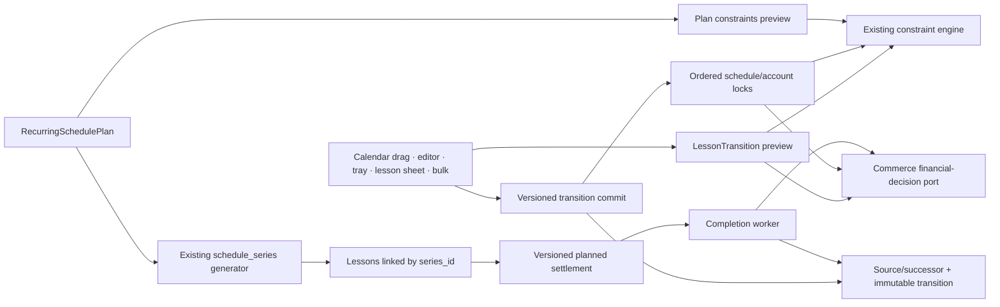
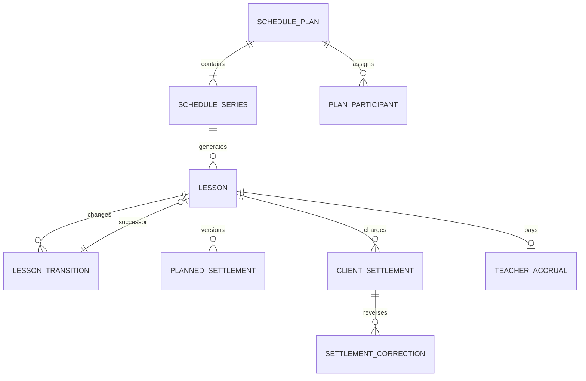
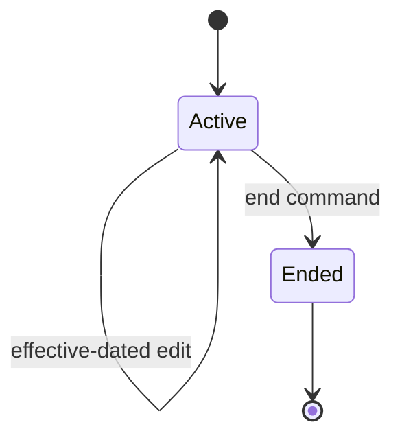
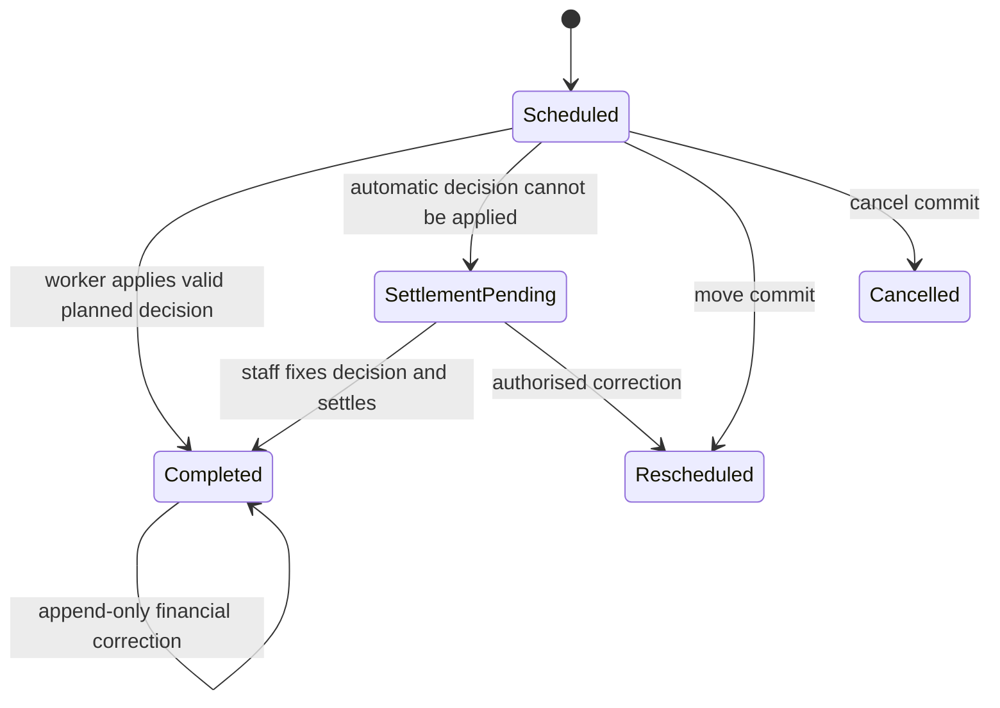

# SYS-SCHEDULE — v7 System Design

**Статус:** Accepted  
**PRD:** REQ-SCHEDULE-101/102/103, REQ-LESSON-101/102/103
**ADR:** ADR-007, ADR-009, ADR-010

## 1. Overview

Schedule владеет временем, conflicts и lifecycle занятий. v7 добавляет один
обязательный transition flow и именованный `RecurringSchedulePlan` поверх уже
существующих effective-dated `schedule_series`.

## 2. Goals / Non-Goals

### Goals

- все изменения date/time из любого экрана проходят reason + financial preview;
- settlement и teacher compensation выбираются сотрудником явно до создания;
- worker автоматически применяет planned decision после конца занятия;
- correction до/после terminal state остаётся атомарным и audit-visible;
- несколько индивидуальных/групповых планов имеют собственные rows/date tray;
- active планы раскрыты, ended свёрнуты и сохраняют историю;
- завершение плана bounded-preview отменяет только будущие незавершённые lessons.

### Non-Goals

- второй календарь/генератор series;
- прямые финансовые записи из Schedule;
- объединение индивидуальных и групповых rows в одном плане;
- автосвязь client settlement → teacher compensation;
- скрытый перенос через обычный PATCH.

## 3. Architecture

## 4. Components

| Компонент | Ответственность |
|---|---|
| `LessonTransitionService` | один preview/commit для reschedule/cancel/resource change/settle |
| `ScheduleConstraintEngine` | teacher/room/client/branch/time conflicts |
| `LessonFinancialDecisionPort` | typed request/result Commerce без обратного вызова |
| `RecurringSchedulePlanService` | create/update/end plan и plan-level preview |
| `PlannedLessonSettlementService` | validate/version/revision binding and reservation recalculation |
| `LessonCompletionWorker` | atomic auto-settle; safe review-required fallback |
| `LessonSettlementCorrectionService` | append-only reversal/replacement after terminal settlement |
| `LessonSeriesCommandService` | генерация и effective-date rows, теперь под plan |
| `PlanTrayProjection` | bounded фактические даты/markers с cursor |
| Flutter `LessonDecisionController` | единая форма для всех entry points |

## 5. Operation contracts

| Действие | Предусловие | Вход | Выход |
|---|---|---|---|
| Transition preview | lesson current/version, config active | operation, successor?, reason, settlement, compensation | conflicts + source/successor + hours/money/pay + token |
| Transition commit | token/version/idempotency fresh | confirm + same input | lifecycle + financial facts + audit/outbox |
| Planned decision preview/update | scheduled lesson/version | settlement/pay/per-client choices | fixed revisions + reservation impact |
| Automatic completion | lesson due + valid plan | worker claim | completed + facts, or review-required with 0 partial facts |
| Settlement correction | completed/version | reason + replacement or cancel | reversal/exclusion + optional replacement |
| Bulk preview/commit | same branch/supported operation | lesson ids, one reason/decisions | per-item impact, all-or-nothing result |
| Plan preview/create | subject scope valid | name/kind/period/1+ resource+decision rows | per-date violations / plan + series + lessons |
| Update plan | expected version | effectiveFrom + changed rows/subscriptions | old rows end + continuations |
| End preview | active plan | last date | future lesson/reservation/finance impact |
| End commit | fresh token/version | last date/reason/confirm | ended plan/series + future cancellations |

## 6. API interfaces

| Method / path | Назначение |
|---|---|
| existing `POST /crm/lessons/:id/reschedule/preview` | единый rich preview |
| existing `POST /crm/lessons/:id/reschedule` | date/time/resource successor commit |
| existing `POST /crm/lessons/:id/cancel[/preview]` | cancellation/paid-miss/etc. |
| `POST /crm/lessons/:id/settle/preview` | manual normal/free/miss/penalty result |
| `POST /crm/lessons/:id/settle` | terminal settlement |
| `POST /crm/lessons/:id/planned-settlement/preview` | preview pre-start decision/reservation |
| `PUT /crm/lessons/:id/planned-settlement` | versioned pre-start decision update |
| `POST /crm/lessons/:id/settlement-correction/preview` | terminal reversal/replacement preview |
| `POST /crm/lessons/:id/settlement-correction` | atomic correction commit |
| `POST /crm/lessons/bulk-transition[/preview]` | one reason, atomic batch |
| `GET/POST /crm/schedule-plans` | list/create active+ended plans |
| `POST /crm/schedule-plans/constraints/preview` | every row/date/resource violation |
| `PATCH /crm/schedule-plans/:id` | effective-dated update |
| `POST /crm/schedule-plans/:id/end/preview` | bounded impact |
| `POST /crm/schedule-plans/:id/end` | finish plan |
| `GET /crm/schedule-plans/:id/tray` | cursor date tray/history |

`PATCH /crm/lessons/:id` сохраняется только для не-temporal/non-resource полей.
Backend DTO/contract test отклоняет date/time/teacher/room/financial changes.

## 7. Data model

- `schedule_plans`: id, title, kind, student/group subject, period, status,
  version, created/ended actor/reason/time.
- `schedule_series.plan_id`: required for new v7 series; legacy may be null.
- individual plan stores one selected subscription; group plan stores per-student
  subscription assignment in `schedule_plan_participants`.
- lessons keep existing `series_id/series_date`; plan resolves through series,
  avoiding duplicate `plan_id` on every lesson.
- planned settlement stores decision plus exact published settlement/compensation
  revision ids; one active version per scheduled lesson.

Подробности: [`schedule_v7.detail.md`](schedule_v7.detail.md).

## 8. Lifecycle

`SettlementPending` не создаёт client/teacher financial facts. Обе независимые
настройки обязательны до создания; состояние означает только исключение, которое
не удалось применить автоматически.

## 9. UX contract

- Drag/drop/resize сначала возвращает card на место и открывает decision surface;
  календарь меняется только после commit.
- Preview показывает исходное и новое время, reason, client hours/money,
  teacher amount, conflicts и предупреждение о возможных двух списаниях.
- Цвет settlement всегда сопровождается label/icon/pattern.
- Client Card: plans сразу после preferred schedule; план имеет rows и собственный
  двухстрочный horizontally-scrollable tray со стрелками.
- Plan editor позволяет common values для нескольких дней и row overrides.
  Preview перечисляет occurrence date и понятные teacher/room/client violations;
  conflicting records открываются по их entity text.
- Empty preferred schedule не скрывает plans/actual lessons.
- Desktop использует drawer/dialog по adaptive policy, mobile — expandable
  full-width sheet/full-screen route; controller/commands одинаковые.

## 10. Security and performance

- `schedule.lesson.write` + client/teacher/room/branch scope на preview и commit.
- Finance fields проецируются только ролям с client-finance read.
- plan/tray query bounded: active + first 20 ended, tray page ≤ 40 dates.
- series generation сохраняет текущую bounded horizon и unique `(series_id,date)`.
- locks сортируются; transaction не ждёт ввода пользователя.
- ended history использует indexes plan/status/date/series.

## 11. Failure handling

- stale lesson/plan/config/token → 409, форма сохраняется и обновляет preview;
- conflict/insufficient hours → 422 без source transition;
- transient worker failure retries bounded; persistent/domain failure atomically
  marks review-required and exposes a staff-safe reason;
- correction failure rolls back reversal and replacement together;
- partial bulk запрещён: одна ошибка откатывает batch;
- expired/archived rule нельзя выбрать, но historical snapshot отображается;
- post-commit outbox invalidates calendar, source/successor clients and teacher.

## 12. Verification

- inventory всех Flutter date/time/resource mutation callsites;
- direct PATCH rejection contract;
- PostgreSQL source/successor/financial rollback and two-writer race;
- group participant settlement and subscription selection;
- plan create/edit/end, open-ended, mid-week, ended history and tray pagination;
- Month/Week/Day/client tray parity on Windows/Android.

## 13. Trade-offs

1. Plan aggregate поверх existing series вместо замены generator: меньше migration
   risk и сохраняется unique/date concurrency.
2. Planned manual choice + automatic completion вместо обязательной ручной
   очереди: сохраняет контроль сотрудника и убирает повторную работу; exception
   queue остаётся только для ошибок.
3. Existing per-lesson transitions вместо UI-only modal: backend invariant
   важнее малого diff, потому что новые callers иначе обойдут расчёт.

## 14. Implementation map

- `server/src/crm/schedule/lesson-transition*.ts`, controller/DTO;
- `lesson-series-command.service.ts` и новый тонкий plan service/repository;
- Flutter Schedule actions/details/drag и Client Card schedule section;
- Commerce decision port/facts из `commerce_integrity.md`.
