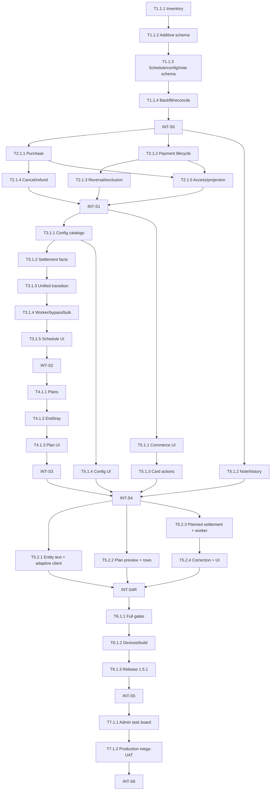

# MagicMusicCRM v7 — Исполняемый план

**Источник истины:** PRD/Architecture/ADR/System Design `.anws/v7`  
**Правило:** targeted check после задачи; smoke/E2E только на `INT-S*`; full
regression и devices — в финальной волне.

## Зависимости

## Дорожная карта

| Спринт | Код | Результат | Exit criteria | Оценка |
|---|---|---|---|---:|
| S0 | Data Foundation | additive schema + inventory + lossless backfill | migration down→up, facts immutable, baseline/reconcile green | 23 ч |
| S1 | Client Commerce | purchase/payment/cancel/reversal/access | PostgreSQL finance flows atomic, roles/report exclusion green | 36 ч |
| S2 | Lesson Integrity | catalogs + manual settlement + unified transition | no direct temporal PATCH; N client + 1 teacher facts | 34 ч |
| S3 | Recurring Plans | named plans, rows, end/history/tray | active/ended/group/individual flows green | 22 ч |
| S4 | Client Workspace | adaptive UI, note/history/actions/config | desktop/mobile parity and no duplicate Actions | 30 ч |
| S4R | Owner Refinement | entity-text links, plan conflicts, planned auto settlement/correction | atomic worker/correction + explainable constraints + adaptive parity | 74 ч |
| S5 | Final Candidate | full regression, devices, release evidence | all gates + 5 accounts + signed artifacts | 24 ч |
| S6 | Owner Production Mega-UAT | Admin tasks + связанный production-прогон | owner matrix, UI/API/DB reconciliation, explicit decision | 93 ч |

## S0 — Data Foundation

### SYS-PLATFORM-QUALITY / Foundation

- [x] **T1.1.1** [REQ-PAYMENT-102]: Инвентаризировать все finance/lesson mutation и reporting consumers
  - **Описание**: Сгенерировать воспроизводимый список SQL/callsites, которые читают payments/adjustments/obligations или меняют temporal lesson fields; зафиксировать baseline CH-V7-04.
  - **Входные данные**: [`07_CHALLENGE_REPORT.md` §CH-V7-04](07_CHALLENGE_REPORT.md), [`commerce_integrity.detail.md` §8](04_SYSTEM_DESIGN/commerce_integrity.detail.md).
  - **Выходные данные**: generator + JSON/Markdown baseline с `unowned=0` либо явными владельцами.
  - **📎 Ссылка**: ADR-008, ADR-009.
  - **Критерии приемки**:
    - Given production backend/Flutter tree, When generator запущен, Then перечислены все ordinary finance queries и protected lesson writes.
    - Given новый неизвестный caller, When stale-check запущен, Then тест падает.
  - **Тип верификации**: Unit/contract test.
  - **Инструкция по верификации**: запустить новый inventory test/script дважды и сравнить детерминированный output.
  - **Оценка**: 4 ч.
  - **Зависимости**: нет.
  - **Приоритет**: P0.

- [x] **T1.1.2** [REQ-COMMERCE-101, REQ-PAYMENT-101, REQ-PAYMENT-102]: Добавить v7 commerce schema
  - **Описание**: Создать migrations для payer/funding, payment records/events/exclusions и capability registry; сохранить legacy payments/subscriptions.
  - **Входные данные**: [`commerce_integrity.detail.md` §1](04_SYSTEM_DESIGN/commerce_integrity.detail.md), [`schedule_v7.detail.md` §3](04_SYSTEM_DESIGN/schedule_v7.detail.md), результат T1.1.1.
  - **Выходные данные**: commerce/access up/down SQL и schema repository types.
  - **📎 Ссылка**: ADR-007, ADR-008.
  - **Критерии приемки**:
    - Given current DB, When up применён, Then новые constraints/indexes/triggers существуют и legacy facts не изменены.
    - Given пустые v7 facts, When down применён, Then schema возвращается losslessly; при v7 facts destructive down fail-safe.
  - **Тип верификации**: PostgreSQL integration.
  - **Инструкция по верификации**: migration down→up на test PostgreSQL + schema assertions.
  - **Оценка**: 6 ч.
  - **Зависимости**: T1.1.1.
  - **Приоритет**: P0.

- [x] **T1.1.3** [REQ-SCHEDULE-102, REQ-LESSON-101, REQ-CLIENT-102]: Добавить schedule/config/note schema
  - **Описание**: Создать отдельную additive migration для catalog snapshot fields/facts, recurring plans/participants и canonical client note.
  - **Входные данные**: T1.1.2, [`schedule_v7.detail.md` §3](04_SYSTEM_DESIGN/schedule_v7.detail.md), [`crm_workspace_v7.md` §6](04_SYSTEM_DESIGN/crm_workspace_v7.md).
  - **Выходные данные**: schedule/config/note up/down SQL, indexes/constraints/types.
  - **📎 Ссылка**: ADR-008, ADR-009.
  - **Критерии приемки**:
    - Given current DB, When migration up применён, Then new plan/note/catalog facts are additive and existing series/config remain readable.
    - Given invalid mixed subject/snapshot/lineage shape, When insert attempted, Then named DB constraint rejects it.
  - **Тип верификации**: PostgreSQL integration.
  - **Инструкция по верификации**: schema shape/constraint/down→up targeted suite.
  - **Оценка**: 5 ч.
  - **Зависимости**: T1.1.2.
  - **Приоритет**: P0.

- [x] **T1.1.4** [REQ-REPORT-101]: Реализовать lossless backfill и v7 reconciliation
  - **Описание**: Backfill payer=recipient/mode=legacy, paid payment records и aggregate versions; расширить preflight/reconcile без догадок о неоднозначных links.
  - **Входные данные**: T1.1.2, [`access_audit_v7.md` §7](04_SYSTEM_DESIGN/access_audit_v7.md).
  - **Выходные данные**: backfill SQL/service, reconciliation checks и fixtures.
  - **📎 Ссылка**: ADR-008.
  - **Критерии приемки**:
    - Given legacy paid rows, When backfill повторён, Then records/linkage exactly once и суммы/даты совпадают.
    - Given tampered pair/version, When reconcile запущен, Then точная ошибка выявлена; clean delta=0.
  - **Тип верификации**: PostgreSQL integration.
  - **Инструкция по верификации**: targeted backfill/reconcile suite два последовательных clean run.
  - **Оценка**: 4 ч.
  - **Зависимости**: T1.1.2, T1.1.3.
  - **Приоритет**: P0.

- [x] **INT-S0** [MILESTONE]: Интеграционная проверка S0
  - **Описание**: Подтвердить additive/lossless data foundation перед командами.
  - **Входные данные**: T1.1.1–T1.1.4.
  - **Выходные данные**: `docs/audits/v7-s0-data-foundation.md`.
  - **📎 Ссылка**: ADR-007 §Стратегия проверки.
  - **Критерии приемки**:
    - Given current fixture DB, When baseline→up→backfill→reconcile→down(empty)→up выполнены, Then drift=0 и inventory unowned=0.
  - **Тип верификации**: Integration/Smoke.
  - **Инструкция по верификации**: targeted PostgreSQL suites, typecheck/build и inventory stale-check.
  - **Оценка**: 4 ч.
  - **Зависимости**: T1.1.1, T1.1.2, T1.1.3, T1.1.4.
  - **Приоритет**: P0.

## S1 — Client Commerce

### SYS-COMMERCE-INTEGRITY / Core

- [x] **T2.1.1** [REQ-COMMERCE-101]: Атомарная purchase preview/commit с payer
  - **Описание**: Развить issue flow в один purchase command, добавить two-client scope, balance guard, funding/installments, signed preview и post-commit invalidation.
  - **Входные данные**: INT-S0, [`commerce_integrity.detail.md` §2](04_SYSTEM_DESIGN/commerce_integrity.detail.md).
  - **Выходные данные**: DTO/controller/service/repository endpoints + tests.
  - **📎 Ссылка**: ADR-007, ADR-010.
  - **Критерии приемки**:
    - Given достаточный счёт payer, When recipient≠payer purchase commit, Then один debit/абонемент/audit создан.
    - Given insufficient or concurrent purchase, When commit, Then loser получает отказ и пишет 0 partial facts.
  - **Тип верификации**: PostgreSQL integration.
  - **Инструкция по верификации**: purchase race/fault/idempotency/scope test paths.
  - **Оценка**: 8 ч.
  - **Зависимости**: INT-S0.
  - **Приоритет**: P0.

- [x] **T2.1.2** [REQ-PAYMENT-101]: Три статуса оплаты и due worker
  - **Описание**: Реализовать manual/due payment record, posted_pending marker, verified paid/unpaid transitions и immutable actual payment creation.
  - **Входные данные**: INT-S0, [`commerce_integrity.detail.md` §3](04_SYSTEM_DESIGN/commerce_integrity.detail.md).
  - **Выходные данные**: PaymentLifecycle service/repository/DTO/worker.
  - **📎 Ссылка**: ADR-008.
  - **Критерии приемки**:
    - Given due installment, When worker повторён, Then одна pending record с marker.
    - Given two verifiers, When оба подтверждают, Then одна paid fact; unpaid входит в debt, pending не входит в balance/debt.
  - **Тип верификации**: PostgreSQL integration + clock unit.
  - **Инструкция по верификации**: due/replay/status/concurrency test file.
  - **Оценка**: 7 ч.
  - **Зависимости**: INT-S0.
  - **Приоритет**: P0.

- [x] **T2.1.3** [REQ-PAYMENT-102, REQ-REPORT-101]: Payment reversal и единый reporting exclusion
  - **Описание**: Добавить preview/storno, status-aware void и общий exclusion predicate/view во все consumers из T1.1.1.
  - **Входные данные**: T2.1.2, [`commerce_integrity.detail.md` §4/8](04_SYSTEM_DESIGN/commerce_integrity.detail.md), CH-V7-04.
  - **Выходные данные**: reversal service/API, shared report predicate, updated queries/exports.
  - **📎 Ссылка**: ADR-008.
  - **Критерии приемки**:
    - Given paid record, When Admin удаляет с причиной, Then opposite adjustment/exclusion/audit exactly once.
    - Given fixture, When card/dashboard/report/export queried, Then pair excluded everywhere and technical history includes it.
  - **Тип верификации**: PostgreSQL integration/contract.
  - **Инструкция по верификации**: reversal fixture against every inventory consumer; stale-check unowned=0.
  - **Оценка**: 7 ч.
  - **Зависимости**: T2.1.2, T1.1.1.
  - **Приоритет**: P0.

- [x] **T2.1.4** [REQ-COMMERCE-102]: Отмена абонемента и корректный refund
  - **Описание**: Расширить existing cancel preview/commit на original payer, confirmed-funded/unfunded split, configurable lower refund и closure pending/unpaid.
  - **Входные данные**: T2.1.1, T2.1.2, [`commerce_integrity.detail.md` §5](04_SYSTEM_DESIGN/commerce_integrity.detail.md).
  - **Выходные данные**: updated cancellation token/context/repository/API.
  - **📎 Ссылка**: ADR-008.
  - **Критерии приемки**:
    - Given one-time wallet purchase, When unused cancel, Then full funded refund is available regardless of linked payment.
    - Given partial installment/use/reservations, When cancel, Then unfunded closes, chosen refund respects cap/reason, no double credit.
  - **Тип верификации**: PostgreSQL integration.
  - **Инструкция по верификации**: matrix funding mode × paid parts × used/reserved × prior refund.
  - **Оценка**: 7 ч.
  - **Зависимости**: T2.1.1, T2.1.2.
  - **Приоритет**: P0.

- [x] **T2.1.5** [REQ-REPORT-101, REQ-CLIENT-102]: Client-finance capabilities, projections и audit reasons
  - **Описание**: Добавить write/config capabilities, route policy, recipient+payer scope, bounded payment projections и mandatory human reasons.
  - **Входные данные**: T2.1.1–T2.1.4, [`access_audit_v7.md`](04_SYSTEM_DESIGN/access_audit_v7.md).
  - **Выходные данные**: registry/migration/policy/projection/audit changes.
  - **📎 Ссылка**: ADR-010.
  - **Критерии приемки**:
    - Given Admin/Manager/Director, When client-finance command in scope, Then allowed; Teacher/Client denied.
    - Given Admin/Manager, When school-finance/config-catalog requested, Then denied/no hidden payload/request.
  - **Тип верификации**: Actor Matrix/payload contract.
  - **Инструкция по верификации**: targeted capability route/resource/payload suites.
  - **Оценка**: 4 ч.
  - **Зависимости**: T2.1.1, T2.1.2, T2.1.3, T2.1.4.
  - **Приоритет**: P0.

- [x] **INT-S1** [MILESTONE]: Интеграционная проверка S1 — Client Commerce
  - **Описание**: Пройти purchase→installment→verify/unpaid→reverse/cancel цепочки и роли.
  - **Входные данные**: T2.1.1–T2.1.5.
  - **Выходные данные**: `docs/audits/v7-int-s1-client-commerce.md`.
  - **📎 Ссылка**: `commerce_integrity.md` §12.
  - **Критерии приемки**:
    - Given all S1 tasks, When targeted commerce/actor/reconcile smoke executed, Then atomicity/idempotency/reporting/roles pass and delta=0.
  - **Тип верификации**: Integration/Smoke.
  - **Инструкция по верификации**: commerce test script + typecheck/build + preflight twice.
  - **Оценка**: 3 ч.
  - **Зависимости**: T2.1.1–T2.1.5.
  - **Приоритет**: P0.

## S2 — Lesson Integrity

### SYS-COMMERCE-INTEGRITY + SYS-SCHEDULE / Core

- [x] **T3.1.1** [REQ-LESSON-101, REQ-LESSON-102]: Configurable settlement/pay catalogs
  - **Описание**: Расширить unified config snapshot/validation/impact/publish на два независимых каталога, seed 7+5 типов и защитить Director-only segments.
  - **Входные данные**: INT-S1, [`commerce_integrity.detail.md` §1](04_SYSTEM_DESIGN/commerce_integrity.detail.md), CH-V7-02.
  - **Выходные данные**: config types/normalizers/migration/projections/tests.
  - **📎 Ссылка**: ADR-010.
  - **Критерии приемки**:
    - Given Director, When publish/rollback, Then effective school/branch catalog versioned.
    - Given Manager mixed publish, When protected segment changed, Then writes=0; unchanged segment permits legitimate CRM change.
  - **Тип верификации**: PostgreSQL integration/unit.
  - **Инструкция по верификации**: config access/publish/rollback/history snapshot suites.
  - **Оценка**: 7 ч.
  - **Зависимости**: INT-S1.
  - **Приоритет**: P0.

- [x] **T3.1.2** [REQ-LESSON-101, REQ-LESSON-102]: Реализовать settlement и teacher accrual facts
  - **Описание**: Заменить boolean boundary typed financial decision, рассчитать share/penalty и независимую teacher rule с immutable snapshots.
  - **Входные данные**: T3.1.1, [`commerce_integrity.detail.md` §6/7](04_SYSTEM_DESIGN/commerce_integrity.detail.md).
  - **Выходные данные**: decision DTO/service/port/repository and fact tests.
  - **📎 Ссылка**: ADR-009.
  - **Критерии приемки**:
    - Given 0–200%/penalty/group decisions, When settled, Then exact N client facts + one teacher fact.
    - Given config later changes, When history read, Then old label/color/rules/amount unchanged.
  - **Тип верификации**: Unit + PostgreSQL integration.
  - **Инструкция по верификации**: calculation matrix and group settlement suite.
  - **Оценка**: 7 ч.
  - **Зависимости**: T3.1.1.
  - **Приоритет**: P0.

- [x] **T3.1.3** [REQ-SCHEDULE-101]: Единый lesson transition preview/commit
  - **Описание**: Расширить reschedule/cancel/settle на rich decision, signed preview, atomic source/successor и Commerce facts.
  - **Входные данные**: T3.1.2, [`schedule_v7.detail.md` §1–5](04_SYSTEM_DESIGN/schedule_v7.detail.md), T1.1.1.
  - **Выходные данные**: schedule DTO/controller/services/worker/contracts.
  - **📎 Ссылка**: ADR-009.
  - **Критерии приемки**:
    - Given reschedule/cancel/settle, When commit succeeds, Then lifecycle and finance facts commit together; any fault writes 0.
    - Given stale/conflict/insufficient hours, When commit attempted, Then source remains scheduled and no successor/facts exist.
  - **Тип верификации**: PostgreSQL integration/contract.
  - **Инструкция по верификации**: reschedule/cancel/settle fault/race/idempotency suites.
  - **Оценка**: 7 ч.
  - **Зависимости**: T3.1.2, T1.1.1.
  - **Приоритет**: P0.

- [x] **T3.1.4** [REQ-SCHEDULE-101]: Закрыть worker, direct PATCH и bulk bypass
  - **Описание**: Перевести completion worker в settlement_pending, запретить protected PATCH и добавить один atomic bulk transition с inventory ownership.
  - **Входные данные**: T3.1.3, [`schedule_v7.detail.md` §1/5/8](04_SYSTEM_DESIGN/schedule_v7.detail.md), T1.1.1.
  - **Выходные данные**: worker state, DTO guard, bulk API and no-bypass contract.
  - **📎 Ссылка**: ADR-009.
  - **Критерии приемки**:
    - Given clock passes lesson, When worker runs, Then settlement_pending and 0 finance facts; explicit settle creates facts once.
    - Given protected PATCH or unknown temporal caller, When contract/inventory runs, Then request/test fails; bulk is all-or-nothing.
  - **Тип верификации**: PostgreSQL integration/contract.
  - **Инструкция по верификации**: completion/no-bypass/bulk rollback suites and inventory stale-check.
  - **Оценка**: 5 ч.
  - **Зависимости**: T3.1.3, T1.1.1.
  - **Приоритет**: P0.

- [x] **T3.1.5** [REQ-SCHEDULE-101]: Подключить единый Flutter LessonDecision flow
  - **Описание**: Один controller/adaptive form для drag/editor/details/client tray, rich preview и non-color markers; удалить updateLesson для protected fields.
  - **Входные данные**: T3.1.4, [`schedule_v7.md` §9](04_SYSTEM_DESIGN/schedule_v7.md).
  - **Выходные данные**: Flutter models/service/controller/surfaces/callsite migration.
  - **📎 Ссылка**: ADR-002, ADR-009.
  - **Критерии приемки**:
    - Given Month/Week/Day/tray, When move initiated, Then one reason/settlement/pay form appears before mutation.
    - Given conflict/stale/error, When submit fails, Then source stays, input preserved and retry available.
  - **Тип верификации**: Flutter widget/regression.
  - **Инструкция по верификации**: targeted schedule/client widget tests + analyze.
  - **Оценка**: 5 ч.
  - **Зависимости**: T3.1.4.
  - **Приоритет**: P0.

- [x] **INT-S2** [MILESTONE]: Интеграционная проверка S2 — Lesson Integrity
  - **Описание**: Сквозной move/settle/config/roles smoke без обходов.
  - **Входные данные**: T3.1.1–T3.1.5.
  - **Выходные данные**: `docs/audits/v7-int-s2-lesson-integrity.md`.
  - **📎 Ссылка**: `schedule_v7.md` §12.
  - **Критерии приемки**:
    - Given config and lessons, When normal/miss/free/penalty/move/group flows run, Then exact snapshots/facts/markers and direct bypass=0.
  - **Тип верификации**: Integration/Smoke.
  - **Инструкция по верификации**: targeted backend + Flutter schedule suites and one Windows/Android interaction smoke.
  - **Оценка**: 3 ч.
  - **Зависимости**: T3.1.1–T3.1.5.
  - **Приоритет**: P0.

## S3 — Recurring Plans

### SYS-SCHEDULE / Integration

- [x] **T4.1.1** [REQ-SCHEDULE-102]: Plan aggregate и create/effective edit
  - **Описание**: Реализовать named individual/group plan поверх existing series, participant subscriptions, version/idempotency and generation.
  - **Входные данные**: INT-S2, [`schedule_v7.detail.md` §3/4](04_SYSTEM_DESIGN/schedule_v7.detail.md).
  - **Выходные данные**: plan DTO/controller/service/repository/API.
  - **📎 Ссылка**: ADR-007, ADR-009.
  - **Критерии приемки**:
    - Given valid rows, When plan created, Then 1 plan + N series + unique lessons and explicit subscription assignments.
    - Given effective edit, When committed, Then past snapshots unchanged and continuations start on date.
  - **Тип верификации**: PostgreSQL integration.
  - **Инструкция по верификации**: individual/group/open-ended/concurrency/generation tests.
  - **Оценка**: 7 ч.
  - **Зависимости**: INT-S2.
  - **Приоритет**: P0.

- [x] **T4.1.2** [REQ-SCHEDULE-102]: End preview/commit и bounded plan tray
  - **Описание**: Добавить impact token, future cancellation/reservation release и cursor tray/history projection.
  - **Входные данные**: T4.1.1, [`schedule_v7.detail.md` §5/6](04_SYSTEM_DESIGN/schedule_v7.detail.md).
  - **Выходные данные**: end/tray endpoints, SQL indexes/projections/tests.
  - **📎 Ссылка**: ADR-009.
  - **Критерии приемки**:
    - Given last date mid-week, When end committed, Then only later unsettled lessons cancelled and past/history retained.
    - Given long plan, When arrows page, Then bounded stable cursor returns markers without duplicates.
  - **Тип верификации**: PostgreSQL integration.
  - **Инструкция по верификации**: plan end/fault/stale/tray pagination suites.
  - **Оценка**: 6 ч.
  - **Зависимости**: T4.1.1.
  - **Приоритет**: P0.

- [x] **T4.1.3** [REQ-SCHEDULE-102]: Client Card plan section
  - **Описание**: Render active expanded/ended collapsed plans, rows and own two-row tray; shared adaptive create/edit/end surfaces.
  - **Входные данные**: T4.1.2, [`crm_workspace_v7.md` §3](04_SYSTEM_DESIGN/crm_workspace_v7.md).
  - **Выходные данные**: Flutter service models/controller/section/tests.
  - **📎 Ссылка**: ADR-002, ADR-003.
  - **Критерии приемки**:
    - Given no preferred schedule, When card opens, Then actual plans/trays visible.
    - Given active/ended, When rendered desktop/mobile, Then default expansion and history/arrows match contract.
  - **Тип верификации**: Flutter widget.
  - **Инструкция по верификации**: width/text-scale/empty/active/ended/tray tests + analyze.
  - **Оценка**: 6 ч.
  - **Зависимости**: T4.1.2.
  - **Приоритет**: P1.

- [x] **INT-S3** [MILESTONE]: Интеграционная проверка S3 — Recurring Plans
  - **Описание**: Пройти individual/group create/edit/end/history на backend и UI.
  - **Входные данные**: T4.1.1–T4.1.3.
  - **Выходные данные**: `docs/audits/v7-int-s3-recurring-plans.md`.
  - **📎 Ссылка**: `schedule_v7.md` §12.
  - **Критерии приемки**:
    - Given test clients/groups, When complete plan lifecycle runs, Then series/lessons/subscriptions/tray reconcile and Back state preserved.
  - **Тип верификации**: Integration/Smoke.
  - **Инструкция по верификации**: plan backend suites + Flutter targeted + desktop/mobile smoke.
  - **Оценка**: 3 ч.
  - **Зависимости**: T4.1.1–T4.1.3.
  - **Приоритет**: P0.

## S4 — Client Workspace

### SYS-CRM-WORKSPACE / Integration & Polish

- [x] **T5.1.1** [REQ-COMMERCE-101, REQ-PAYMENT-101, REQ-PAYMENT-102, REQ-COMMERCE-102]: Commerce UI в профильных секциях
  - **Описание**: Подключить purchase payer selector/preview, payment statuses/verification/reversal и cancel refund к одному Client Card controller.
  - **Входные данные**: INT-S1, [`crm_workspace_v7.md` §5](04_SYSTEM_DESIGN/crm_workspace_v7.md).
  - **Выходные данные**: Flutter models/service/forms/payment/subscription sections.
  - **📎 Ссылка**: ADR-008, ADR-010.
  - **Критерии приемки**:
    - Given another payer, When selected, Then FIO/amount/reason preview explicit and both cards refresh.
    - Given pending/unpaid/paid/reversed, When rendered, Then exactly 3 payment statuses plus technical marker and safe actions.
  - **Тип верификации**: Flutter widget/regression.
  - **Инструкция по верификации**: finance client-card tests + analyze.
  - **Оценка**: 7 ч.
  - **Зависимости**: INT-S1.
  - **Приоритет**: P0.

- [x] **T5.1.2** [REQ-CLIENT-102]: Общая note и operational history backend/UI
  - **Описание**: Один versioned Lead/Student note, conversion preservation и bounded allowlisted technical history visible staff roles.
  - **Входные данные**: INT-S0, [`crm_workspace_v7.md` §6/7](04_SYSTEM_DESIGN/crm_workspace_v7.md).
  - **Выходные данные**: note/history endpoints, conversion hook, Flutter cards/tests.
  - **📎 Ссылка**: ADR-010.
  - **Критерии приемки**:
    - Given Lead note, When converted, Then same row/version history accessible on Student.
    - Given action by one Admin, When another Admin/Manager/Director opens history, Then full reason/author/time visible; Teacher/Client no request/field.
  - **Тип верификации**: PostgreSQL integration + Flutter widget.
  - **Инструкция по верификации**: conversion/concurrency/role/history tests.
  - **Оценка**: 7 ч.
  - **Зависимости**: INT-S0, T2.1.5.
  - **Приоритет**: P0.

- [x] **T5.1.3** [REQ-CLIENT-101]: Удалить общее Actions и завершить длинную карточку
  - **Описание**: Subscription actions только в section, homework в Progress, archive отдельно; payment movements/installments/obligations collapsed; Tasks/History доступны через section jump не более чем за два действия.
  - **Входные данные**: T5.1.1, T5.1.2, T4.1.3, [`crm_workspace_v7.md` §3/8](04_SYSTEM_DESIGN/crm_workspace_v7.md).
  - **Выходные данные**: cleaned Client Card production composition and action inventory.
  - **📎 Ссылка**: ADR-002, ADR-003.
  - **Критерии приемки**:
    - Given desktop/mobile card, When opened, Then no general Actions/duplicate command and finance details default collapsed.
    - Given direct route/cross-app entry, When card opens/back, Then rail/breadcrumb/scroll context canonical.
  - **Тип верификации**: Flutter widget/inventory.
  - **Инструкция по верификации**: responsive/card/navigation/action ownership tests.
  - **Оценка**: 5 ч.
  - **Зависимости**: T5.1.1, T5.1.2, T4.1.3.
  - **Приоритет**: P1.

- [x] **T5.1.4** [REQ-LESSON-101, REQ-LESSON-102]: Director commerce catalog UI
  - **Описание**: Встроить два независимых каталога в unified Configuration с colors/non-color preview, archive/reorder and impact publish.
  - **Входные данные**: T3.1.1, [`commerce_integrity.md` §4](04_SYSTEM_DESIGN/commerce_integrity.md).
  - **Выходные данные**: Flutter config models/sections/editors/tests.
  - **📎 Ссылка**: ADR-010.
  - **Критерии приемки**:
    - Given Director, When draft→preview→publish/rollback, Then forms consume effective version.
    - Given Admin/Manager/Teacher/Client, When config opened, Then catalog controls/provider absent.
  - **Тип верификации**: Flutter widget + backend contract.
  - **Инструкция по верификации**: configuration role/dirty/back/publish tests.
  - **Оценка**: 7 ч.
  - **Зависимости**: T3.1.1.
  - **Приоритет**: P1.

- [x] **INT-S4** [MILESTONE]: Интеграционная проверка S4 — Client Workspace
  - **Описание**: Проверить одну production Client Card со всеми v7 flows и ролями.
  - **Входные данные**: T5.1.1–T5.1.4, INT-S3.
  - **Выходные данные**: `docs/audits/v7-int-s4-client-workspace.md`.
  - **📎 Ссылка**: `crm_workspace_v7.md` §11.
  - **Критерии приемки**:
    - Given accounts 3/4/5 and Lead/Student, When all sections/actions/routes run, Then UI parity, reason visibility, forbidden requests=0 and duplicates=0.
  - **Тип верификации**: Integration/Smoke/E2E.
  - **Инструкция по верификации**: targeted Flutter/backend + Windows/Android story smoke with network log.
  - **Оценка**: 4 ч.
  - **Зависимости**: T5.1.1–T5.1.4, INT-S3.
  - **Приоритет**: P0.

## S4R — Owner Refinement

### SYS-APP-EXPERIENCE / SYS-CRM-WORKSPACE

- [x] **T5.2.1** [REQ-CLIENT-101]: Entity-text navigation, client calendar focus и adaptive Client Card
  - **Описание**: Удалить отдельные internal open/new-tab controls; все typed related records открывать по тексту сущности. Desktop всегда создаёт/выбирает новую workspace tab с source view state; compact использует canonical stack. Добавить default hide-other client lessons и compact thematic tabs без duplicate providers.
  - **Входные данные**: INT-S4, ADR-003, `crm_workspace_v7.md` §3/8.
  - **Выходные данные**: единый navigator policy, text-link affordances и adaptive Client Card/calendar.
  - **📎 Ссылка**: US-V7-009, ADR-003.
  - **Критерии приемки**:
    - Given typed client/teacher/room/group/lesson/payment/subscription/task/user label, When activated by pointer/keyboard, Then desktop opens one new selected tab and source tab remains byte-equivalent; compact pushes canonical route.
    - Given Client Card calendar first expansion, Then hide-other checked; unchecked shows current client green and others neutral in Month/Week/Day.
    - Given desktop/compact, Then one long canvas vs thematic tabs share the same providers/commands and forbidden requests remain 0.
  - **Тип верификации**: Flutter unit/widget/integration + Windows/Android smoke.
  - **Инструкция по верификации**: typed navigation policy, link affordance, workspace limit/source-state, client schedule colors and widths 360/600/840/1200.
  - **Оценка**: 12 ч.
  - **Зависимости**: INT-S4.
  - **Приоритет**: P0.

### SYS-SCHEDULE / SYS-CRM-WORKSPACE

- [x] **T5.2.2** [REQ-SCHEDULE-102, REQ-SCHEDULE-103]: Multi-row plan editor и authoritative constraints preview
  - **Описание**: Добавить plan preview endpoint поверх существующих occurrence expansion/constraint engine; UI common defaults + repeatable rows с required teacher/room/decision и понятными per-date violations/typed links.
  - **Входные данные**: INT-S4, `schedule_v7.md` §5/6/9, existing ScheduleConstraintEngine.
  - **Выходные данные**: preview DTO/controller/service и Flutter multi-row plan editor.
  - **📎 Ссылка**: US-V7-008, US-V7-013, ADR-009.
  - **Критерии приемки**:
    - Given rows across dates, When preview/commit runs, Then both use the same half-open teacher/client/room/branch validation and return identical violations.
    - Given same teacher/room overlap, Then save blocked with date/resource/conflicting lesson; different free teacher+room allowed.
    - Given existing group lesson, When participant added, Then no duplicate teacher/room booking is created.
  - **Тип верификации**: PostgreSQL integration + Flutter widget.
  - **Инструкция по верификации**: cross-plan/cross-row/DST/open-ended matrix and visible error-link tests.
  - **Оценка**: 16 ч.
  - **Зависимости**: INT-S4.
  - **Приоритет**: P0.

### SYS-SCHEDULE / SYS-COMMERCE-INTEGRITY / SYS-PLATFORM-QUALITY

- [x] **T5.2.3** [REQ-LESSON-101, REQ-LESSON-102, REQ-LESSON-103]: Planned settlement schema, reservations и automatic worker
  - **Описание**: Добавить versioned planned decision bound к immutable config revisions для individual/group lessons и plan rows; create/update reservations атомарно; completion worker вызывает existing settlement port и пишет terminal facts exactly once.
  - **Входные данные**: INT-S4, ADR-008/009, `commerce_integrity.md` §5/7, `schedule_v7.detail.md` §1.
  - **Выходные данные**: additive migration/backfill, DTO/services/worker, Flutter required selectors.
  - **📎 Ссылка**: US-V7-005/006/012.
  - **Критерии приемки**:
    - Given create/plan lesson, Then settlement/pay selections required, free lesson = zero client settlement, config revision frozen and exact reservation allocated.
    - Given lesson end, When worker succeeds/replays/restarts, Then one terminal transition, N client facts and one teacher fact; reconciliation delta 0.
    - Given domain/persistent failure, Then no partial facts and lesson is review-required with staff-safe reason.
  - **Тип верификации**: migration + PostgreSQL concurrency/fault + Flutter widget.
  - **Инструкция по верификации**: down→up, create/edit/plan/group, worker kill/retry/poison, subscription race and catalog rollback.
  - **Оценка**: 26 ч.
  - **Зависимости**: INT-S4.
  - **Приоритет**: P0.

- [x] **T5.2.4** [REQ-LESSON-103, REQ-REPORT-101]: Atomic pre-start edit и post-terminal correction
  - **Описание**: Реализовать signed preview/commit: до старта менять planned decision/reservations; после settlement одной транзакцией создавать reversal/exclusion и optional replacement. Причина/author/effective result доступны staff и ordinary reporting не видит superseded facts.
  - **Входные данные**: T5.2.3, ADR-008/009, reporting inventory T1.1.1.
  - **Выходные данные**: correction schema/service/API/UI/history/reconciliation.
  - **📎 Ссылка**: US-V7-010/011/012.
  - **Критерии приемки**:
    - Given pre-start edit, Then expected versions and reservation delta commit together.
    - Given completed lesson, When correction replacement/cancel commits, Then source facts immutable, reversal+replacement all-or-nothing, payroll/client/report totals show only effective result.
    - Given Admin/Manager/Director, Then full human reason is visible; Teacher/Client receive no hidden finance/audit fields.
  - **Тип верификации**: PostgreSQL fault/reconciliation + Actor Matrix + Flutter widget.
  - **Инструкция по верификации**: two-writer/replay/failure-at-each-write, all reporting consumers and staff history.
  - **Оценка**: 14 ч.
  - **Зависимости**: T5.2.3.
  - **Приоритет**: P0.

- [x] **INT-S4R** [MILESTONE]: Owner refinement integration gate
  - **Описание**: Доказать четыре уточнённых потока вместе: text links, client calendar/adaptive card, recurring constraints и planned auto settlement/correction.
  - **Входные данные**: T5.2.1–T5.2.4.
  - **Выходные данные**: `docs/audits/v7-int-s4r-owner-refinement.md`.
  - **📎 Ссылка**: US-V7-009/012/013, ADR-003/009.
  - **Критерии приемки**:
    - Given accounts 3/4/5, Windows/Android and real PostgreSQL, When complete stories run, Then source state survives links, conflicts explain failure, worker/correction remain atomic and hidden requests/leaks=0.
  - **Тип верификации**: Integration/Smoke/E2E.
  - **Инструкция по верификации**: targeted/full suites plus real-device/network-log story matrix.
  - **Оценка**: 6 ч.
  - **Зависимости**: T5.2.1–T5.2.4.
  - **Приоритет**: P0.

## S5 — Final Candidate

### SYS-PLATFORM-QUALITY / Release

- [x] **T6.1.1** [REQ-REPORT-101]: Полный regression/security/reconciliation gate
  - **Описание**: Запустить/исправить full backend/Flutter, Actor Matrix, inventories, migrations и reconciliation без ослабления checks.
  - **Входные данные**: INT-S4R, ADR-007 §Стратегия проверки.
  - **Выходные данные**: green logs and error inventory.
  - **📎 Ссылка**: `access_audit_v7.md` §7.
  - **Критерии приемки**:
    - Given complete v7, When all gates run, Then typecheck/build/analyze/full tests green, unowned=0, drift=0, Critical/High=0.
  - **Тип верификации**: Full regression/security.
  - **Инструкция по верификации**: backend typecheck/build/test/security; Flutter analyze/test; migration/preflight/inventory twice.
  - **Оценка**: 8 ч.
  - **Зависимости**: INT-S4R.
  - **Приоритет**: P0.

- [x] **T6.1.2** [REQ-COMMERCE-101, REQ-SCHEDULE-101, REQ-CLIENT-101]: Windows/Android и 5 аккаунтов
  - **Описание**: Выполнить реальный login/relogin и story UAT на target devices, собрать release artifacts и проверить подпись/launch.
  - **Входные данные**: T6.1.1, реальные `magic1..5@gmail.com` / `123456`.
  - **Выходные данные**: screenshots/logs/checklist, Windows/APK/AAB artifacts.
  - **📎 Ссылка**: ADR-006, ADR-010.
  - **Критерии приемки**:
    - Given accounts 1..5, When restart/logout/relogin and role stories run, Then correct scope/session and no forbidden finance leak.
    - Given release builds, When launched/signed checked, Then artifacts install/start and version matches.
  - **Тип верификации**: E2E/Manual/Smoke.
  - **Инструкция по верификации**: existing Windows/Android runbooks plus v7 story matrix.
  - **Оценка**: 8 ч.
  - **Зависимости**: T6.1.1.
  - **Приоритет**: P0.

- [x] **T6.1.3** [REQ-REPORT-101]: Оформить final candidate v7 `1.5.1`
  - **Описание**: Только после green real checks установить version `1.5.1`, обновить audits, manifest/changelog/AGENTS/tasks, release hashes and rollback notes; удалить только доказанный dead adapter/code.
  - **Входные данные**: T6.1.2, все INT reports.
  - **Выходные данные**: final candidate audit, checked tasks, clean inventory/versioned artifacts.
  - **📎 Ссылка**: ADR-006, ADR-007.
  - **Критерии приемки**:
    - Given green evidence, When candidate оформлен, Then docs/code/artifacts describe one same revision/version and worktree has no untracked release debt.
  - **Тип верификации**: Documentation/inventory/build verification.
  - **Инструкция по верификации**: diff-check, version/hash/manifest consistency and final release launch.
  - **Оценка**: 4 ч.
  - **Зависимости**: T6.1.2.
  - **Приоритет**: P0.

- [x] **INT-S5** [MILESTONE]: Финальная приёмка v7
  - **Описание**: Принять или отклонить v7 по фактическим evidence, не по наличию кода.
  - **Входные данные**: T6.1.1–T6.1.3.
  - **Выходные данные**: `docs/audits/v7-final-candidate.md`, release decision.
  - **📎 Ссылка**: PRD §Definition of Done.
  - **Критерии приемки**:
    - Given all evidence, When DoD reviewed, Then every box has artifact/log; unresolved required item keeps goal active.
  - **Тип верификации**: Full release acceptance.
  - **Инструкция по верификации**: повторить critical smoke, compare hashes/results and record APPROVED only if all pass.
  - **Оценка**: 4 ч.
  - **Зависимости**: T6.1.1, T6.1.2, T6.1.3.
  - **Приоритет**: P0.

## S6 — Owner Production Mega-UAT

### SYS-OPERATIONS / SYS-ACCESS-SCOPE

- [x] **T7.1.1** [OWNER-2026-08-08]: Общая доска задач Администратора
  - **Описание**: Добавить Admin в branch-scoped read/close task workflow и production navigation без create/edit; стартовое состояние доски — одновременно `Мои задачи` и `Сегодня`, остальные существующие фильтры остаются доступны.
  - **Входные данные**: подтверждение владельца 2026-08-08, существующие capability projection, SharedTask API/provider и task filter model.
  - **Выходные данные**: минимальные read/close capability/nav/default-filter изменения и regression tests без task-write/school-finance/config expansion.
  - **Критерии приемки**:
    - Given Admin opens Tasks first time, Then board requests only allowed scope and shows `Мои задачи + Сегодня`.
    - Given Admin changes filters, Then все существующие разрешённые фильтры работают без повышения scope.
    - Given Teacher/Client or out-of-scope Admin, Then task payload/access remains denied or projected safely.
  - **Тип верификации**: backend Actor Matrix + Flutter unit/widget/integration.
  - **Инструкция по верификации**: capability/package/route checks, default filter regression, Admin Windows Release smoke.
  - **Оценка**: 6 ч.
  - **Зависимости**: INT-S5.
  - **Приоритет**: P0.

### SYS-PLATFORM-QUALITY / ALL PRODUCTION SYSTEMS

- [ ] **T7.1.2** [OWNER-2026-08-08]: Выполнить связанный production-мегатест
  - **Описание**: Выполнить `docs/audits/v7-owner-production-mega-uat-plan.md` на production с UAT-prefixed филиалом `Оборонная 30`, реальными `magic1..5`, Windows для Admin/Manager/Director и Android emulator для Client/Teacher.
  - **Входные данные**: T7.1.1, production backup/restore-check, signed Release 1.5.1.
  - **Выходные данные**: уникальные screenshots, redacted traces, exports, ID ledger, API/DB/reconciliation и defect/retest log.
  - **Критерии приемки**:
    - Given all planned custom/role/commerce/schedule/operations scenarios, When executed through real UI, Then each row is PASS/FAIL/BLOCKED with role-correct visible proof and exact persisted result.
    - Given production immutable facts, Then every UAT entity/fact is traceable, ordinary reversal/exclusion follows domain rules and no manual DB deletion hides history.
  - **Тип верификации**: Production E2E/Manual/Smoke/Reconciliation.
  - **Инструкция по верификации**: follow runbook G0–G14; stop on financial drift, data leak, duplicate effect or unexplained 5xx.
  - **Оценка**: 83 ч + worker/webhook ожидание.
  - **Зависимости**: T7.1.1.
  - **Приоритет**: P0.

- [x] **T7.1.3** [OWNER-2026-08-08]: Исключить неполные организационные конструкторы
  - **Описание**: Исправить Teacher/Staff/Group/Room UI→API→DB: обязательные
    филиальные связи, branch-filtered справочники, атомарные записи, разделение
    бизнес-роли сотрудника и access-role пользователя; перенести аудитории в
    карточку филиала и удалить legacy inline-варианты полей.
  - **Входные данные**: production-дефекты T7.1.2, US-V7-014, существующие
    branch/discipline/profile-link/settings contracts.
  - **Выходные данные**: единые формы без свободных дублей, серверные guards,
    transaction tests и role/scope regression.
  - **Критерии приемки**:
    - Given empty/mismatched required reference, When UI or direct API submits,
      Then mutation is blocked before partial state and the reason is explicit.
    - Given staff creation with required email/password, Then active user,
      profile, CRM staff, branch links and user↔staff link commit atomically;
      later business-role edits do not mutate access-role implicitly.
    - Given teacher creation with required email/password, Then active Teacher
      user, profile, CRM teacher, branch/discipline links and user↔teacher link
      commit atomically and the account appears in Users immediately.
    - Given an old Teacher/Staff row without app access, When Director provisions
      email/password, Then its technical identity is upgraded (or missing
      identity created) atomically and duplicate provisioning is rejected.
    - Given a branch card, Then its rooms are listed/created/edited there and no
      standalone room constructor remains.
  - **Тип верификации**: Flutter widget/service + backend unit/PostgreSQL +
    Actor Matrix + Windows Release production retest.
  - **Инструкция по верификации**: targeted tests, full gates, direct-API negative
    matrix and UI/API/DB evidence in the T7.1.2 defect/retest log.
  - **Оценка**: 18 ч.
  - **Зависимости**: T7.1.1; блокирует продолжение T7.1.2.
  - **Приоритет**: P0.

- [ ] **T7.1.4** [OWNER-2026-08-10]: Устранить сквозные логические расхождения v7
  - **Описание**: По результату owner-review унифицировать финансовые проекции,
    исправить post-completion reschedule, конфликтные guards, payment/task
    semantics, bounded lists, room capacity, client offboarding и production
    fail-closed flags без создания параллельных доменных путей.
  - **Входные данные**: T7.1.2 audit findings, `commerce_integrity*`,
    `schedule_v7*`, canonical task repository и текущий Release UI.
  - **Выходные данные**: один finance/conflict source of truth, атомарный перенос
    завершённого занятия с reversal и scheduled successor, исправленные labels,
    cursor/infinite-scroll списки, optional room capacity, plan-aware archive,
    production runtime guard и обновлённая UAT-матрица.
  - **Критерии приемки**:
    - Given dashboard/analytics/client card, Then debt/pending/revenue используют
      одну Commerce projection semantics и не расходятся после reversal/correction.
    - Given a successfully completed lesson, When authorised staff reschedules it,
      Then all effective lesson client/teacher/reservation facts are reversed or
      excluded atomically, a scheduled successor is created, and the successor is
      completed by the normal worker exactly once.
    - Given any one-time or recurring lesson candidate, Then the canonical engine
      blocks teacher, room, client/group, branch assignment, branch-hours and
      closed-day conflicts; a conflicting plan remains editable by row/day/time
      and creates no partial lessons before a clean preview.
    - Given a due unverified payment, UI names it `Срок наступил — требуется
      проверка`; all-day task overdue state is identical on board and dashboards.
    - Given room create/edit, capacity is optional and does not imply an enforced
      scheduling constraint; settlement type color never controls lesson-card
      background, which is limited to booked/completed/conflict plus trial badge.
    - Given more than one API page of students/teachers/lessons/options, scrolling
      loads subsequent cursor pages without silent truncation or a manual button.
    - Given client offboarding, active recurring plans/series and their future
      scheduled lessons are ended/cancelled through canonical commands while
      immutable history and finance facts remain.
    - Given production environment, missing/non-v4 access or schedule flags and
      non-zero parity drift fail startup/readiness instead of selecting legacy.
  - **Тип верификации**: backend unit/PostgreSQL transaction + Flutter widget +
    pagination + actor/conflict matrix + production configuration smoke.
  - **Инструкция по верификации**: targeted regressions, full gates, then retest
    affected UAT-060/065/073/074/075/084-086/090-095/103/145 rows.
  - **Оценка**: 32 ч.
  - **Зависимости**: T7.1.3; блокирует завершение T7.1.2 и INT-S6.
  - **Приоритет**: P0.

- [ ] **INT-S6** [MILESTONE]: Owner production decision
  - **Описание**: Сопоставить каждый результат мегатеста с UI/API/DB evidence и принять или отклонить production candidate.
  - **Входные данные**: T7.1.1–T7.1.2.
  - **Выходные данные**: `docs/audits/v7-owner-production-mega-uat-result.md` и итоговый DOCX.
  - **Критерии приемки**: каждый обязательный шаг подписан; открытый P0, необъяснённый drift/error или отсутствующий role proof даёт `NOT APPROVED`.
  - **Тип верификации**: Owner acceptance.
  - **Инструкция по верификации**: независимая проверка evidence index, hashes, defects/retests and final reconciliation.
  - **Оценка**: 4 ч.
  - **Зависимости**: T7.1.2, T7.1.3, T7.1.4.
  - **Приоритет**: P0.

## User Story Overlay

| User Story | Задачи | Проверяемый результат | Покрытие |
|---|---|---|---|
| US-V7-001 Purchase | T1.1.2→T2.1.1→T2.1.5→T5.1.1→INT-S4 | recipient/payer purchase UI+DB | Полное |
| US-V7-002 Installments | T1.1.2→T2.1.2→T5.1.1→INT-S1 | due/pending/unpaid/paid | Полное |
| US-V7-003 Cancel/refund | T2.1.1→T2.1.4→T5.1.1→INT-S1 | funded/unfunded cancel | Полное |
| US-V7-004 Payment reversal | T1.1.1→T2.1.3→T5.1.1→INT-S1 | exclusion + technical history | Полное |
| US-V7-005 Settlement types | T3.1.1→T3.1.2→T5.1.4→INT-S2 | config + immutable snapshot | Полное |
| US-V7-006 Teacher pay | T3.1.1→T3.1.2→T3.1.3→INT-S2 | manual selection + accrual | Полное |
| US-V7-007 Unified move | T1.1.1→T3.1.3→T3.1.4→T3.1.5→INT-S2 | every entry point same command | Полное |
| US-V7-008 Plans | T4.1.1→T4.1.2→T4.1.3→INT-S3 | active/ended/group/individual tray | Полное |
| US-V7-009 Card actions | T5.1.1→T5.1.3→INT-S4 | no general Actions/duplicates | Полное |
| US-V7-010 Note/reasons | T2.1.5→T5.1.2→INT-S4 | staff context survives conversion | Полное |
| US-V7-011 RBAC/reports | T1.1.1→T2.1.3→T2.1.5→T6.1.1→INT-S5 | roles/leaks/reports/reconcile | Полное |
| US-V7-012 Planned auto settlement | T5.2.3→T5.2.4→INT-S4R→INT-S5 | required preselection, atomic worker/correction | Полное |
| US-V7-013 Plan constraints preview | T5.2.2→INT-S4R→INT-S5 | per-row/date explainable conflicts | Полное |

## Итог

- Level-3 implementation tasks: **30**
- Integration milestones: **8**
- P0 tasks/milestones: **35**; P1: **3**
- Прогноз: **336 ч** включая production mega-UAT и release evidence.
