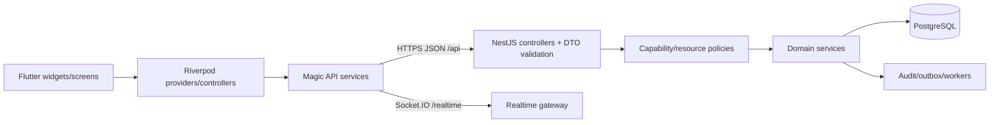

> generated_by: nexus-mapper v2 + project exhaustive inventories
> verified_at: 2026-08-10T14:11:29.427591+00:00
> source_revision: 13a9734356eca27f3d7b60dec00c639f1d85264b
> source_digest_sha256: cc6c200f55daa66889d4cd3a5de0176abe3d95eaf450576addb0db652f42a15f
> provenance: untruncated AST, Dart analyzer, route/DTO/policy/schema inventories and Git forensics

# Runtime and dependency topology

Process roots and spawn sites remain recorded in the generated wire baseline.
REST DTO/policy validation is strong on the server; map-shaped Flutter decoding
is a weaker boundary and requires Release UI smoke.
