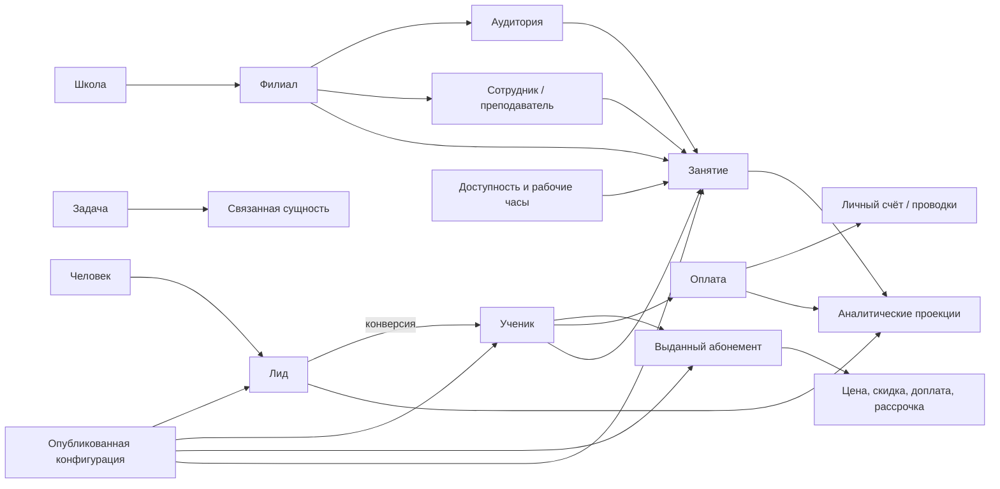
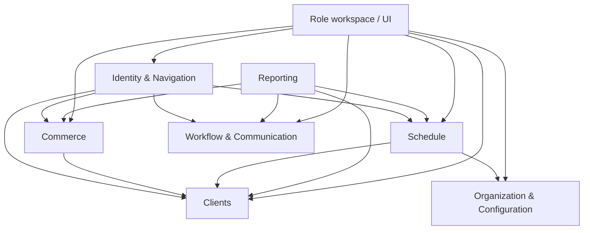

# MagicMusicCRM — карта сути продукта

> Версия карты: 1.0
> Дата проверки кода: 2026-08-05
> Назначение: единая понятная модель приложения для владельца продукта, дизайнера и разработчика
> Статус: зафиксировано текущее устройство и целевая логика; это не заявление о готовности функций

## 1. Что это за продукт

MagicMusicCRM — рабочая система музыкальной школы, которая связывает в одном месте:

- путь человека от обращения и Лида до Ученика;
- филиалы, аудитории, преподавателей и их доступность;
- расписание, серии и фактические занятия;
- абонементы, условия продажи, оплаты, списания и остатки;
- задачи, коммуникации, документы и историю изменений;
- аналитику школы и настройки её бизнес-процессов.

Главная ценность приложения — не количество экранов. Пользователь должен видеть одну связанную картину школы и переходить между её объектами без поиска нужного раздела и без чтения технических идентификаторов.

## 2. Как читать эту карту

В документе используются четыре отметки:

- **Факт** — подтверждено текущим кодом или контрактом сервера.
- **Проблема** — возможность отсутствует, спрятана, дублируется или неудобна в реальном сценарии.
- **Цель** — правило, по которому нужно собирать продукт.
- **Решение требуется** — бизнес-вопрос, который нельзя корректно решить только по коду.

Результаты автоматических тестов и наличие класса в репозитории не считаются доказательством готового пользовательского сценария. Функция считается доступной, только если она имеет понятный вход в интерфейсе, работает на реальном аккаунте и даёт проверяемый результат.

Security-аудит сознательно не входит в текущий приоритет. Существующие ограничения доступа нельзя ломать, но расширенную security-приёмку следует выполнять после продуктовой и UX-переработки.

## 3. Неподвижные правила продукта

### 3.1. Человек видит названия, машина хранит идентификаторы

UUID допустим в URL, API, базе данных и диагностическом журнале. Он не должен быть основным текстом в:

- хлебных крошках и названиях вкладок;
- заголовках карточек и связанных записей;
- фильтрах и выбранных значениях;
- оплатах, абонементах, задачах и истории;
- сообщениях об ошибке;
- экспортируемых отчётах.

Пользователь всегда видит имя, название или осмысленный номер. Технический ID можно показать только в отдельном блоке «Техническая информация» или скопировать через специальное действие.

### 3.2. Один бизнес-смысл — один источник истины

Нельзя поддерживать параллельно два календаря, две модели задач, два редактора одинаковой воронки или несколько несовместимых селекторов филиала. Один доменный сценарий может выглядеть по-разному на телефоне и ПК, но обязан использовать одинаковые данные, правила и состояния.

### 3.3. Настройки живут в «Настройках», работа — в рабочих разделах

Разделы «Клиенты», «Расписание», «Финансы» и «Задачи» используют опубликованную конфигурацию. Редактирование воронок, полей, справочников, филиалов, комнат и правил расписания находится в одном разделе «Настройки системы».

На рабочем экране допустима ссылка «Перейти к настройке», но не второй самостоятельный редактор.

### 3.4. Общешкольная логика и филиал — два состояния одного правила

Каждая подходящая настройка должна явно иметь область:

- «Вся школа» — значение по умолчанию;
- конкретный филиал — переопределение только разрешённых параметров;
- «Наследуется от школы» — видимое состояние, а не скрытая техническая логика.

Выбор филиала не должен создавать отдельную версию функции или отдельный экран.

### 3.5. Исторические факты не меняются вслед за настройками

Изменение цены, скидочной политики, названия этапа или рабочих часов влияет на будущие операции. Уже выданный абонемент, проведённая оплата, завершённое занятие и запись аудита сохраняют снимок условий на момент операции.

## 4. Пользователи и их главная работа

| Роль | Основная работа | Что должно быть видно в первую очередь |
|---|---|---|
| Клиент | Смотреть свои занятия, абонемент, домашние задания и общаться со школой | Следующее занятие, остаток, долг/баланс, сообщения |
| Преподаватель | Видеть назначенное расписание и учеников, вести учебную работу | Сегодня/неделя, аудитория и филиал, ученик, ДЗ |
| Администратор | Записывать клиентов, управлять расписанием и карточками | Клиенты, свободные слоты, быстрые переходы, текущие задачи по процессу |
| Управляющий | Управлять операционной работой назначенных филиалов | Воронки, загрузка, задачи, сотрудники, отклонения; настройки по умолчанию только для просмотра |
| Директор | Управлять школой, финансами, конфигурацией и доступами | Сводка школы, финансы, настройки, версии и влияние изменений |
| Администратор системы | Техническое сопровождение и аварийный доступ | Системные операции, диагностика, доступы |

Роль определяет доступный срез, но не должна создавать другую терминологию или несовместимые варианты одного компонента.

## 5. Карта предметной области

### 5.1. Организация

- **Школа** — верхняя область общих правил и отчётности.
- **Филиал** — операционная область с названием, адресом, часовым поясом, рабочими часами и набором аудиторий.
- **Аудитория** — физический ресурс конкретного филиала. Человек должен видеть «Филиал · Аудитория», а не отдельно взятый UUID комнаты.
- **Преподаватель** — сотрудник с назначенными филиалами, дисциплинами и правилами доступности.

### 5.2. Клиентский путь

- **Человек** — реальная персона и контактные данные.
- **Лид** — обращение до начала регулярного обучения.
- **Ученик** — клиент учебного процесса.
- **Конверсия** — связь Лида и созданного Ученика с сохранением истории, задач, оплат и других допустимых отношений.
- **Этап воронки** — настраиваемое состояние Лида или Ученика, а не строка, зашитая в экран.
- **Карточка клиента** — единое рабочее пространство, а не отдельная несвязанная форма для каждого статуса.

### 5.3. Расписание

- **Рабочие часы филиала** — недельные интервалы и исключения по датам.
- **Назначение преподавателя** — филиал и период действия назначения.
- **Доступность преподавателя** — повторяющиеся и разовые интервалы «доступен/недоступен».
- **План постоянного расписания** — именованный атомарный набор правил для
  индивидуальных или групповых занятий с active/ended history.
- **Серия занятий** — внутренняя материализация одной строки плана; legacy
  `schedule-series` не является отдельным пользовательским редактором.
- **Занятие** — фактическая запись с филиалом, аудиторией, преподавателем, клиентом/группой, временем и жизненным циклом.
- **Schedule Analyzer** — единая серверная группировка конфликтов и ranked-
  подбор альтернатив для разовых Lesson и постоянных Plan.
- **Конфликт** — структурированное нарушение с fingerprint, ресурсом, строками,
  датами, участниками и ссылками на пересекающиеся Lesson.

Сервер уже различает: неверный интервал, время вне рабочих часов филиала, недоступность преподавателя, отсутствие назначения преподавателя в филиал, пересечение преподавателя, клиента или аудитории.

### 5.4. Деньги и абонементы

- **Пакет абонемента** — настраиваемое предложение школы или филиала.
- **Выданный абонемент** — неизменяемый коммерческий снимок выбранного пакета.
- **Коммерческие условия** — базовая цена, скидка, доплата, итог, способ оплаты и рассрочка.
- **Оплата** — факт поступления денег с датой, филиалом, способом, статусом, оператором, назначением и номером.
- **Личный счёт** — проводки поступлений и списаний.
- **Остаток занятий** — серверная проекция доступных оплаченных единиц после резервов, проведённых занятий, долгов и нескольких абонементов. Это не простая разница двух чисел на клиенте.

### 5.5. Задачи

- **Задача** — единая запись с названием, сроком, состоянием, приоритетом, напоминанием и связанной сущностью.
- **Аудитория** — конкретные сотрудники, филиалы или вся школа с предпросмотром реальных получателей.
- **Связанная сущность** — клиент, занятие, оплата или другой объект, который открывается через общий механизм переходов.

### 5.6. Настройки и аналитика

- **Черновик конфигурации** — редактируемая будущая версия.
- **Предпросмотр влияния** — какие формы, записи и филиалы изменятся.
- **Публикация** — атомарное включение версии.
- **Откат** — новая опубликованная версия на основе старой, а не переписывание истории.
- **Аналитика** — проекция операционных данных. Она не является вторым источником статусов, задач или финансов.

## 6. Область «вся школа / филиал»

| Объект или правило | Вся школа | Филиал | Как показывать пользователю |
|---|---|---|---|
| Поля и категории CRM | базовая схема | разрешённые точечные переопределения | бейдж области и источник значения |
| Справочники | общий набор | добавки/исключения только по явному правилу | «Наследуется» / «Переопределено» |
| Воронка Лидов/Учеников | схема по умолчанию | порядок/этапы филиала, если разрешено | один редактор с переключателем области |
| Бизнес-параметры | значение по умолчанию | локальное значение | рядом показать оба значения |
| Пакеты абонементов | общешкольный каталог | филиальный пакет или ограничение | название области вместо ID |
| Рабочие часы | общая политика не заменяет часы филиала | обязательная фактическая настройка | календарь недели + исключения |
| Доступность преподавателя | общая карточка сотрудника | назначение и интервалы по филиалам | календарь доступности |
| Расписание | агрегированный просмотр | фактическое место каждого занятия | выбранная область всегда видна |
| Задачи | аудитория всей школы | динамическая аудитория филиала | точное число получателей до отправки |
| Аналитика | сумма разрешённых филиалов | один филиал | единый фильтр во всех блоках |

Нельзя передавать «общешкольный режим» технической строкой вроде `null` без понятного текста. В интерфейсе это самостоятельное выбранное значение «Вся школа».

## 7. Единый человекочитаемый адрес сущности

### 7.1. Корневая проблема

Текущий `EntityRouteRegistry` формирует название страницы как `Тип · entityId`. Из-за этого один архитектурный дефект проявляется в разных местах: карточка клиента, оплата, занятие, пользователь и вкладка получают UUID. Исправлять отдельную хлебную крошку недостаточно.

### 7.2. Целевой контракт представления

Каждая ссылка должна переносить стабильный ID для машины и получать отдельное представление для человека:

| Сущность | Основная подпись | Дополнительный контекст |
|---|---|---|
| Лид / Ученик | Фамилия Имя | тип · этап · филиал |
| Преподаватель / сотрудник | Фамилия Имя | роль · филиалы |
| Филиал | Название филиала | адрес |
| Аудитория | Название аудитории | название филиала |
| Занятие | дата и время · клиент | преподаватель · филиал · аудитория |
| Оплата | № документа или дата · сумма | клиент · филиал · статус |
| Абонемент | название пакета | клиент · остаток · срок |
| Задача | название | срок · исполнитель/аудитория |
| Отчёт | название отчёта | период · область |

Один общий механизм разрешения подписи должен обслуживать:

- заголовок вкладки;
- хлебные крошки;
- карточку связанной записи;
- поисковый результат и селектор;
- историю и уведомление;
- сообщение об удалённой или недоступной записи.

Если запись удалена, показывается «Удалённая запись» и безопасный контекст из сохранённого снимка. Если доступ запрещён — «Связанная запись недоступна». UUID не должен становиться запасным пользовательским названием.

### 7.3. Где правило уже нарушается

- реестр навигации добавляет `entityId` в заголовок;
- список ученических филиалов при отсутствии имени откатывается к ID;
- форма пакета абонемента просит вводить `branchId` обычным текстом;
- часть диагностических карточек и окон занятия показывает сокращённые ID;
- разные экраны сами собирают ФИО из несовпадающих полей и порядка имени/фамилии.

Это нужно исправлять одним контрактом отображения, а не десятками локальных `?? 'Без названия'`.

## 8. Целевая информационная архитектура

### 8.1. Основная навигация сотрудников

1. Обзор
2. Чат
3. Расписание
4. Клиенты
5. Задачи
6. Аналитика
7. Пользователи — только при наличии права
8. Настройки системы — последним разделом, только при наличии права

Отдельная верхнеуровневая вкладка «Финансы» не нужна, если финансовые операции и аналитика собраны в понятном разделе «Аналитика», а финансы конкретного клиента находятся в его карточке. Если операционный финансовый журнал нужен ежедневно, он остаётся подразделом «Аналитика → Финансовые операции», а не вторым независимым dashboard.

### 8.2. «Настройки системы»

Раздел должен быть самостоятельным рабочим пространством директора после «Аналитики»:

1. **Организация**
   - реквизиты школы;
   - филиалы: создать, изменить, архивировать;
   - аудитории филиала: создать, изменить, архивировать;
   - дисциплины и другие организационные справочники.
2. **Расписание**
   - часовой пояс и рабочие часы филиала;
   - выходные и исключения;
   - назначения преподавателей по филиалам;
   - недельная и разовая доступность преподавателей;
   - просмотр правил конфликтов и понятных запретов.
3. **CRM**
   - единый редактор воронки Лидов и Учеников;
   - категории, поля и их размещение;
   - переиспользуемые справочники;
   - бизнес-параметры;
   - предпросмотр, публикация, история и откат.
4. **Продажи и оплаты**
   - каталог абонементов;
   - способы оплаты и отображаемые статусы;
   - разрешённые скидки, доплаты и шаблоны рассрочки;
   - правила нумерации документов, если они должны настраиваться.
5. **Пользователи и доступы**
   - сотрудники и роли;
   - привязка аккаунта к сотруднику/клиенту;
   - настройки уведомлений и делегированные права.
6. **Данные и обслуживание**
   - импорт;
   - дубликаты и объединение;
   - очередь проверки телефонов;
   - запросы на удаление;
   - технические журналы для уполномоченных ролей.

В каждом подразделе сверху должны быть видны область настройки, состояние «черновик/опубликовано», наследование и последнее изменение.

Правило доступа к организационным и расписательным настройкам:

- Директор редактирует их в пределах своей школы;
- Управляющий по своей базовой роли только просматривает настройки назначенных ему филиалов;
- Директор может отдельно выдать Управляющему право редактирования;
- делегированное право действует только для назначенных Управляющему филиалов и не даёт общешкольного редактирования;
- Управляющий не может передавать это право другим пользователям;
- выдача, отзыв и каждое изменение по делегированному праву фиксируются в аудите.

### 8.3. Что убрать с рабочих экранов

- «Конфигурация CRM» из панели Лидов;
- шестерёнку редактирования ученической воронки из доски Учеников;
- отдельное окно колонок Лидов;
- ручное поле `branchId` из формы пакета;
- управление филиалами и аудиториями из универсального окна сущностей.

При необходимости рабочий экран может показать ссылку «Настроить в Настройках системы», сохранив текущий контекст филиала.

## 9. Расписание как единая платформа

### 9.1. Один компонент, три контекста

| Контекст | Данные и правила | Отличие представления |
|---|---|---|
| Основное расписание | все разрешённые занятия области | полноценные фильтры и действия |
| Карточка клиента | то же расписание выбранного филиала | занятия клиента зелёные, остальные серые |
| Кабинет преподавателя | те же занятия, ограниченные назначениями | только День/Неделя и разрешённые действия |

Карточка клиента не должна иметь второй календарный движок. Она должна открывать тот же вид расписания с контекстом `clientId`, выбранным филиалом из карточки и сохранёнными датой/режимом.

### 9.2. Режим «Месяц»

- показывает загрузку дней и число занятий;
- занятия выбранного клиента выделяет зелёным;
- остальные занятия показывает нейтральным серым;
- по нажатию на день открывает этот день в том же контексте;
- не пытается уместить полную карточку каждого занятия в маленькую ячейку.

### 9.3. Режим «Неделя»

Каждая карточка занятия обязана показывать минимум:

- время и длительность;
- клиента или группу;
- преподавателя;
- `Филиал · Аудитория`;
- состояние занятия и конфликт;
- признак пробного занятия без зависимости только от цвета.

Шапка дней и колонка времени остаются видимыми при прокрутке. Масштаб и плотность должны позволять читать неделю мышью на ПК и жестами на телефоне.

### 9.4. Режим «День»

- переключение колонок «по аудиториям / по преподавателям»;
- свободные, занятые и недоступные интервалы визуально различаются;
- перетаскивание доступно только при праве на запись;
- занятие открывает связанные записи клиента, преподавателя, аудитории и филиала;
- переход назад возвращает дату, режим, фильтры и прокрутку.

### 9.5. Создание и перенос занятия

До сохранения интерфейс отправляет черновик на проверку и одновременно показывает все нарушения:

1. время вне рабочих часов филиала;
2. преподаватель не назначен в филиал;
3. преподаватель недоступен;
4. преподаватель занят;
5. клиент занят;
6. аудитория занята;
7. интервал задан неверно.

Сервер остаётся окончательным арбитром и повторяет проверку внутри записи. Если бизнес допускает принудительное размещение, это должно быть отдельное право с причиной и аудитом, а не кнопка «всё равно сохранить» для всех.

## 10. Канонические переиспользуемые сценарии

| Логика | Один канонический сценарий | Где применяется |
|---|---|---|
| Переход к сущности | типизированная ссылка + человекочитаемое представление | весь продукт |
| Выбор области | «Вся школа / Филиал» с именем и наследованием | настройки, аналитика, задачи |
| Выбор филиала | единый searchable selector, никогда не text ID | формы, фильтры, карточки |
| Выбор человека | единый поиск с типом, ФИО, телефоном и филиалом | занятия, задачи, оплаты |
| Воронка | один редактор этапов с параметром `Лид/Ученик` | CRM-настройки |
| Расписание | один viewport и одна модель карточки занятия | глобально, клиент, педагог |
| Коммерческие условия | единый расчёт цены, скидки, доплаты и рассрочки | выдача/замена абонемента |
| Оплата | единая форма факта оплаты | карточка клиента, финансовый журнал |
| Задачи | одна модель и один workbench | раздел задач, карточка клиента, обзор |
| Состояния страницы | единые loading/empty/error/forbidden/retry | все разделы |
| Окно операции | одна адаптивная политика sheet/drawer/fullscreen | телефон и ПК |

Переиспользование означает общий источник данных, правила и состояние. Это не обязательно один огромный Widget со множеством флагов: общий доменный контроллер и небольшие контекстные представления предпочтительнее «универсального комбайна».

## 11. Основные сквозные процессы

### 11.1. Обращение → Лид → Ученик

1. Администратор создаёт Лида из опубликованной формы выбранного филиала.
2. Лид попадает в эффективную воронку и получает ответственного.
3. Из карточки доступны задача, коммуникация и запись на пробное занятие.
4. Конверсия создаёт Ученика и сохраняет связь с исходным Лидом.
5. История, связи и разрешённые значения переносятся один раз и без дублей.
6. Ученик появляется в своей воронке и получает доступ к абонементам/оплатам.

### 11.2. Настройка нового филиала

1. Директор создаёт филиал и задаёт название, адрес, часовой пояс.
2. Добавляет аудитории.
3. Настраивает недельные часы и исключения.
4. Назначает преподавателей и их доступность.
5. При необходимости создаёт филиальные переопределения CRM/каталога.
6. Проверяет предпросмотр расписания и только после этого открывает филиал для записи.

Сейчас этот процесс разорван: CRUD филиалов/аудиторий спрятан в не подключённом окне, а UI для пунктов 3–4 отсутствует.

### 11.3. Запись на занятие

1. Пользователь выбирает филиал, клиента/группу, преподавателя, аудиторию, дату и длительность.
2. Интерфейс показывает доступные интервалы и не предлагает заведомо запрещённые.
3. Перед записью сервер возвращает полный список нарушений.
4. Успешно созданное занятие появляется во всех контекстах одного расписания.
5. Из занятия открываются карточки всех связанных сущностей.

### 11.4. Продажа абонемента и приём оплаты

1. Выбирается пакет с понятным названием и областью.
2. Фиксируются цена, скидка/доплата, причина и рассрочка.
3. При необходимости одновременно создаётся первая оплата.
4. В карточке видны обязательства, поступления, списания, долг и остаток оплаченных занятий.
5. Финансовый журнал открывает эту же оплату и её клиента по человекочитаемой ссылке.

### 11.5. Задача

1. Создатель задаёт содержание, срок, напоминание и связанную запись.
2. Выбирает людей, филиал или всю школу.
3. До отправки видит точных текущих получателей.
4. Задача показывается в общем разделе и в карточке связанного объекта.
5. Закрытие создаёт одну запись истории и одинаково отражается во всех местах.

## 12. Что реально найдено в текущей реализации

### 12.1. Навигация

**Факт:** аккаунт-зависимые вкладки, история Back/Forward и typed links существуют и подключены к desktop workspace.

**Проблема:** заголовки вкладок и хлебных крошек формируются до загрузки человекочитаемого представления и поэтому используют ID. Разные экраны дополнительно открывают карточки напрямую, обходя единый presentation-контракт.

### 12.2. Настройки

**Факт:** текущий пункт «Настройки» открывает `CrmConfigurationWorkspace`: поля, категории, справочники, бизнес-параметры, ученическую воронку и версии.

**Факт:** CRUD филиалов и аудиторий уже написан в `ManageEntitiesWidget`, но сам экран не импортируется производственным shell. Его элементы частично используются только каталогом абонементов.

**Факт:** сервер имеет API рабочих часов филиала, назначений и доступности преподавателя.

**Проблема:** Flutter не вызывает API изменения рабочих часов и доступности преподавателя. Следовательно, пользовательской настройки этого процесса сейчас нет.

### 12.3. Воронки

**Факт:** Лиды открывают `ManageStatusesDialog`, который умеет добавление, порядок и удаление, но прямо документирует отсутствие изменения существующего этапа и отсутствие филиальной модели.

**Факт:** Ученики используют отдельный `StudentFunnelEditor` с областью школа/филиал, публикацией, версиями и откатом.

**Проблема:** одинаковая бизнес-операция реализована двумя несовместимыми окнами и контрактами. Редактор Учеников должен стать основой общего редактора, а лидовая модель — получить недостающий серверный контракт вместо сохранения слабого окна.

### 12.4. Расписание

**Факт:** основное расписание уже имеет Месяц/Неделю/День, серверные конфликты, режимы по аудиториям/преподавателям и переходы к связанным сущностям.

**Факт:** карточка клиента использует отдельный `ClientScheduleCalendar` на Syncfusion и делает два запроса matrix для общего и клиентского набора.

**Проблема:** это вторая реализация календаря с другой визуальной моделью. Она не переиспользует основной schedule viewport, поэтому исправления читаемости недели, карточки занятия и поведения переходов придётся дублировать.

### 12.5. Финансы

**Факт:** форма выдачи абонемента уже содержит процентную/фиксированную скидку, доплату, причины, способ оплаты и рассрочку.

**Проблема:** форма прямого добавления оплаты этого не содержит. Здесь смешаны два разных смысла: коммерческие условия относятся к продаже/изменению абонемента, а оплата — к погашению обязательства. В UI нужно сделать эту связь понятной и не копировать скидку в обычную оплату без бизнес-основания.

**Проблема:** остаток абонемента существует в данных и показан в разделе абонементов, но в «Занятиях» нет понятной сводки «оплачено / зарезервировано / осталось / долг».

### 12.6. Задачи

**Факт:** production использует одну модель `app.shared_tasks` и один workbench `SharedTasksV4Panel`. Миграция `0101` сохраняет приоритет, филиал, аудитории, историю и legacy typed link; старые `TasksWidget`, `/crm/tasks` и runtime-чтения `app.tasks` удалены.

**Правило области:** преподаватель видит задачи, получателем которых является; Управляющий дополнительно видит задачи своего филиала; Директор и Администратор системы — доступные задачи всей школы. Режимы «Мои / Мой филиал / Вся школа / Все доступные» используют ту же visibility-проекцию, что dashboard и карточки клиентов. Реальная owner-UAT остаётся этапом 9.

### 12.7. Аналитика

**Факт:** production-раздел разделён на «Обзор» и «Журналы». Один `DashboardFilter` управляет периодом и филиалом в обзорных KPI, журнале действий, финансовых операциях и расчётах преподавателей; каталог абонементов сохранён отдельной неаналитической поверхностью до консолидации настроек.

**Факт:** client status и lesson KPI открывают исходные записи с тем же серверным predicate; задача ведёт в канонический `SharedTasksV4Panel`. Общешкольная finance-секция и её запросы создаются только при `commerce.school_finance.read`. XLSX строится из той же `schoolFinance`-проекции, проходит reconciliation значений/формулы и реально открывается Microsoft Excel.

## 13. Корневые причины, а не отдельные симптомы

1. **Нет единого слоя человекочитаемого представления сущностей.** Поэтому ID протекают во все новые ссылки и вкладки.
2. **Настройки организованы по истории реализации, а не по работе директора.** Возможности разбросаны между CRM config, досками, ManageEntities, пользователями и отчётами.
3. **Контекстные экраны копируют доменную функцию.** Клиентский календарь, две воронки и две модели задач развиваются отдельно.
4. **UI часто получает сырые `Map<String, dynamic>`.** Каждый экран заново угадывает поля имени, branch name и fallback, что создаёт расхождения.
5. **Большие экраны одновременно управляют загрузкой, бизнес-правилами и визуалом.** Самые изменяемые файлы — клиентская карточка, messenger shell и расписание — становятся точками регрессий.
6. **«Код существует» принималось за «сценарий готов».** Не подключённые экраны и непроверенные реальные данные получали статус завершённых.

## 14. Целевые границы системы

Не требуется делить приложение на микросервисы или переписывать Flutter с нуля. Достаточно семи ясных доменных границ внутри существующих Flutter и NestJS приложений:

1. **Identity & Navigation** — typed links, presentation references, вкладки, Back, deep links.
2. **Organization & Configuration** — школа, филиалы, аудитории, настройки и версии.
3. **Clients** — Лиды, Ученики, конверсия, карточка и отношения.
4. **Schedule** — доступность, серии, занятия, конфликты и единый viewport.
5. **Commerce** — каталог, абонементы, условия, оплаты, ledger и остатки.
6. **Workflow & Communication** — задачи, аудитории, напоминания, чат и уведомления.
7. **Reporting** — только проекции и drilldown к каноническим объектам.

Правило зависимости: Reporting читает домены, но не создаёт вторую бизнес-истину. Настройки публикуют правила, операционные домены их потребляют. Navigation знает, как показать ссылку, но не владеет данными сущности.

## 15. Что объединить, перенести и удалить

| Действие | Что | Почему |
|---|---|---|
| Объединить | Lead и Student funnel editors | одна логика этапов, области, версии и публикации |
| Объединить | основное, клиентское и преподавательское расписание | одна модель занятия и поведения |
| Объединить | старые и shared tasks | одна задача во всех разделах |
| Объединить | способы построения ФИО/названий | один human presentation contract |
| Перенести | филиалы, аудитории, рабочие часы, доступность | в «Настройки → Организация/Расписание» |
| Перенести | CRM config actions с досок | в «Настройки → CRM» |
| Перенести | каталог абонементов | в «Настройки → Продажи и оплаты» с переходом из карточки |
| Переработать | Analytics tabs | единый dashboard и логичные операционные подразделы |
| Удалить после миграции | `ClientConfigurationDialog` | дублирует новый configuration workspace |
| Удалить после миграции | старый `TasksWidget` и старые write paths | сохраняют параллельную модель задач |
| Удалить/разобрать | не подключённый `ManageEntitiesWidget` | полезные части переезжают в настройки, контейнер-комбайн не нужен |
| Заменить | text input `branchId` | человекочитаемый selector филиала |

Удаление выполняется только после проверки паритета данных и действий на реальном аккаунте.

## 16. Порядок дальнейшей работы

1. Ввести единый человекочитаемый presentation-контракт и убрать UUID из всех пользовательских поверхностей.
2. Собрать настоящий раздел «Настройки системы» и перенести туда существующие редакторы филиалов, аудиторий и CRM.
3. Добавить UI рабочих часов, назначений и доступности преподавателей поверх уже существующих серверных контрактов.
4. Выделить каноническое ядро расписания и заменить клиентский календарь контекстным использованием этого ядра.
5. Объединить редакторы воронок Лидов и Учеников вокруг одной модели школа/филиал/версия.
6. Завершить коммерческий путь: понятные условия продажи, оплата обязательств и остаток оплаченных занятий.
7. Завершить миграцию задач и удалить старую модель из dashboard, карточек и уведомлений.
8. Пересобрать аналитику вокруг одной системы фильтров, смысловых групп и переходов к исходным данным.
9. Провести роль-за-ролью UX-проход на Windows и Android с реальными данными.
10. После продуктовой приёмки закрыть отложенную production/security-приёмку.

Этот порядок устраняет причины в правильной зависимости: сначала идентичность и настройки, затем переиспользуемые домены, после этого конкретные экраны и визуальная полировка.

## 17. Критерии целостного продукта

Продукт можно считать «сшитым», когда:

- пользователь не встречает UUID ни в одном обычном сценарии;
- каждый изменяемый бизнес-параметр имеет единственный логичный дом в Настройках;
- филиал всегда показан именем и область «школа/филиал» не двусмысленна;
- филиал нельзя полноценно использовать до настройки комнат, часов и ресурсов;
- занятый/недоступный слот объясняется до сохранения и повторно блокируется сервером;
- одно занятие одинаково отображается в основном расписании, карточке клиента и кабинете преподавателя;
- воронки Лидов и Учеников настраиваются одним способом;
- остаток занятий, долг и оплаты объяснимо сходятся;
- одна задача видна одинаково в общем списке, карточке и аналитике;
- Back, вкладки и deep links восстанавливают контекст, а не просто открывают похожий экран;
- директор может пройти настройку школы от филиала до опубликованной CRM без скрытых технических экранов;
- каждый заявленный сценарий подтверждён реальным аккаунтом и наблюдаемым результатом.

## 18. Проверенные точки в коде

- `lib/core/navigation/entity_route_registry.dart` — корневое формирование заголовков с ID.
- `lib/core/workspace/production_workspace_host.dart` — подключённый desktop workspace.
- `lib/features/messenger/presentation/screens/messenger_screen_builders_a.dart` — фактическое размещение основных разделов.
- `lib/features/crm/presentation/client_forms/crm_configuration_workspace.dart` — текущий раздел CRM-настроек.
- `lib/features/admin/presentation/widgets/manage_entities_widget.dart` — не подключённый контейнер филиалов/аудиторий и других сущностей.
- `server/src/crm/schedule/availability.controller.ts` — серверные рабочие часы, назначения и доступность.
- `server/src/crm/schedule/constraint-engine.types.ts` — полный список ограничений расписания.
- `lib/features/admin/presentation/widgets/schedule_widget.dart` — основное расписание.
- `lib/features/crm/presentation/client_card/client_schedule_calendar.dart` — отдельный клиентский календарь.
- `lib/features/manager/presentation/widgets/manage_statuses_dialog.dart` — ограниченный редактор Лидов.
- `lib/features/manager/presentation/widgets/student_funnel_editor.dart` — версионный редактор Учеников.
- `lib/features/crm/presentation/client_card/subscription_issue_sheet.dart` — скидка, доплата и рассрочка при выдаче.
- `lib/features/crm/presentation/client_card/client_payment_form.dart` — отдельная упрощённая форма оплаты.
- `lib/features/manager/presentation/widgets/tasks_widget.dart` и `shared_tasks_v4_panel.dart` — параллельные модели задач.
- `lib/features/manager/presentation/widgets/reports_widget.dart` — текущее переходное объединение аналитики.

## 19. Принятое решение о доступе Управляющего

Управляющий по умолчанию имеет **только просмотр** организационных и расписательных настроек назначенных ему филиалов. Директор по своему решению может выдать или отозвать у конкретного Управляющего право редактирования этих настроек.

Это называется **делегированным редактированием филиала**. Оно не становится частью базовой роли Управляющего, не расширяет список назначенных филиалов и не даёт доступа к общешкольным настройкам. В интерфейсе должно быть явно видно, почему редактирование доступно: «Право выдано Директором».
