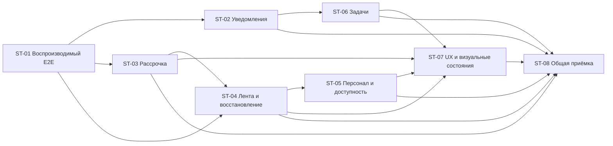

# Последовательный план завершения

[Контекст](00-context.md) · [Требования](01-requirements.md) · [Находки](02-findings.md) · [Проверки](04-verification.md)

Начать с [ST-01 — воспроизводимого пробного](prompts/01-deterministic-trial-e2e.md). Он не требует нового бизнес-решения. Передавать следующий промпт новому агенту после принятия предыдущего результата; не отправлять весь пакет как разрешение выполнить все этапы сразу.

Восемь этапов получились из найденных связных сценариев: тестовая предпосылка; уведомления; покупка и расходование; уроки/актуальность; персонал/доступность; задачи; оставшаяся UX-приёмка; совместный кандидат. ST-06/ST-07 преимущественно подтверждают уже существующее поведение, а не назначают его переписывание.

## Приоритет и результаты

| Этап / готовый промпт | REQ | Исходное доказательство и разрыв | Результат перехода |
|---|---|---|---|
| [ST-01 — Воспроизводимая запись, изменение и отмена пробного](prompts/01-deterministic-trial-e2e.md) | REQ-004, REQ-005, REQ-010, REQ-011 | V-02:валидный serverguard, недопустимое время fixture; F-07 | X-02 PASS и handoff/ST-01 |
| [ST-02 — Тихий ручной лид и проверенная доставка нужных уведомлений](prompts/02-source-aware-notifications.md) | REQ-001, REQ-002, REQ-003 | E-01:manual lead/created попадает в desktoplistener; F-01 | X-01 PASS и handoff/ST-02 |
| [ST-03 — Понятный график рассрочки и полный цикл оплаченных уроков](prompts/03-installment-purchase-and-consumption.md) | REQ-015, REQ-019, REQ-020, REQ-021, REQ-022, REQ-023; финансовая часть REQ-030 | V-03/V-04:покупка/coverage работают; F-02/F-08 в представлении графика/долга | X-04 PASS и handoff/ST-03 |
| [ST-04 — Один актуальный урок и согласованные карточки после переноса](prompts/04-current-timeline-and-recovery.md) | REQ-008, REQ-009, REQ-016, REQ-018, REQ-035 | Leadfilter есть, фильтр ученика и recovery неполны; F-03/F-04 | X-03 PASS и handoff/ST-04 |
| [ST-05 — График преподавателя управляет сеткой и доступным выбором](prompts/05-personnel-and-availability.md) | REQ-006, REQ-007, REQ-017, REQ-024, REQ-025, REQ-026, REQ-027, REQ-028, REQ-038, REQ-039 | V-05:канонический editor работает; F-05/F-06 и непроверенный маршрут в Персонал | X-05, X-06 PASS и handoff/ST-05 |
| [ST-06 — Счётчик оставшихся задач и проверяемые результаты закрытия](prompts/06-today-tasks-and-results.md) | REQ-012, REQ-013, REQ-014, REQ-040, REQ-041 | V-03/V-06:закрытие работает; badge/journal не приняты, F-09 | X-08 PASS и handoff/ST-06 |
| [ST-07 — Приёмка карточки, формы лида, настроек и визуальных состояний](prompts/07-client-ux-and-lesson-visuals.md) | REQ-029, REQ-030, REQ-031, REQ-032, REQ-033, REQ-034, REQ-036, REQ-037 | Активные новые компоненты есть, все viewport/state/поверхности не проверены | X-07, X-09 PASS и handoff/ST-07 |
| [ST-08 — Совместная проверка кандидата и заключение о готовности](prompts/08-integrated-candidate-acceptance.md) | REQ-001…REQ-041 | Предыдущие отдельные PASS не доказывают совместный кандидат | X-10 + X-01…X-09/R-01…R-05 PASS и handoff/ST-08 |

Приоритет P1: F-01…F-08 (F-07 блокирует доказательство, а не доказывает дефект продукта). F-09 — локальный UX P2, входит в приёмку задач. Финансовая модель уже имеет содержательные зелёные интеграционные проверки; план сохраняет её и сначала устраняет неверное представление. Риски прав/данных имеют приоритет над косметикой внутри этапа. Ни один из целых сценариев не признан полностью отсутствующим; отсутствуют конкретные части и доказательства.

## Карта зависимостей

Граф показывает функциональные зависимости, а порядок 01→08 — рекомендуемую последовательность передачи одного рабочего checkout. Например, AMB-01 может остановить только изменение task-created, но не покупку. Backend scope/idempotency/versions, общий client refresh и палитра — уже существующие зависимости; отдельного «построить инфраструктуру заново» этапа нет.

## Контракт каждого этапа

В каждом отдельном промпте есть девять обязательных разделов: цель, входы, проверка наследуемого состояния, подтверждённое/разрыв, область, поведение, реализация, проверки, передача. Ориентиры исходников проверены по текущему HEAD, но не заменяют повторный анализ. Данные и артефакты прежнего агента требуют перепроверки.

Следующий этап принимается при сохранённых работающих сценариях и воспроизводимом функциональном PASS, включая сохранение/повторное чтение, права и нужные ошибки. Если целевая E2E не исполнена, этап не маркируется «полностью работает». Независимые части могут быть переданы с конкретной зависимостью BLOCKED. Недоступность внешнего push не должна незаметно превращаться в PASS stub-доставки.

Отчёты будущих этапов: `handoffs/ST-01.md`…`handoffs/ST-08.md` в этом каталоге. Эти файлы **ещё не существуют** и не являются доказательством; каждый создаётся исполнителем соответствующего промпта. Финальные исходники, test command, fixture/cleanup, source hash, роли/платформы, результаты и ограничения должны быть в отчёте. Не коммитить исходный DOCX, его PII-изображения, env/token/DB dumps и чужой `.claude/CLAUDE.md`.

## Границы изменений по этапам

| Этап | Сохранить | Не включать |
|---|---|---|
| ST-01 | серверное ограничение часов; шесть прошедших customer steps | изменение серверный запрет ради теста |
| ST-02 | существующие outbox/socket/notification, scope и UI-инвалидацию | новую очередь, молчаливое отключение assignment до AMB-01 |
| ST-03 | count−1, фактический платёж, wallet, coverage, transactions | дублирование первый платёж, переписывание legacy/истории |
| ST-04 | фильтр лида, audit, версии, pagination, черновик batching | физическое удаление старых уроков, локальное скрытие вместо корректной выборки |
| ST-05 | Teacher/Staff, availability, guard и правила оплаты | параллельную модель персонала, расширение доступа |
| ST-06 | канонические задачи, текущий область получателя, структурированный результат | новые enum/роль admin-create, пересчёт старой истории |
| ST-07 | D-01/D-04, AppColor, рабочие формы и API | категорию C, новый редизайн, возврат старой темы |
| ST-08 | принятые slices, один candidate hash | самостоятельный deploy, миграции неизвестной БД, глобальный refactor |

## UX/UI и эксплуатация внутри этапов

F-01/F-02/F-04/F-06/F-08 — категория A. F-03/F-05 — A+B. F-07 и F-09 — B. Категория C не включена; после обнаружения следующими агентами выносится отдельно с проблемой и критерием, без автоматической реализации.

Проверки прав/сохранения/retry/concurrency включены в соответствующие X, а не отложены до финала. ST-03 доказывает деньги и consumption, ST-04 — realtime и восстановление, ST-05 — conflicts/version и открытые интервалы, ST-06 — повтор/гонку закрытия, ST-07 — focus/scroll/формы/видимость, ST-08 — взаимодействие. HTTP/controller вызов не заменяет пользовательский путь.

Если этап требует миграции, сначала доказать её необходимость на актуальном контракте: текущие находки не требуют новой модели/массового backfill. Обратная совместимость и rollback проверяются на собственной fixture-копии, исторические факты не переписываются. Ввод логов не должен раскрывать PII/секреты. Производительность — измерить затронутый сценарий до/после на одинаковом объёме; причина задержки не маскируется новым spinner.

## Неоднозначности и готовность

| Вопрос | Что можно делать сейчас | Что отложено |
|---|---|---|
| AMB-01: назначение задачи тоже должно молчать? | Исправить ручной lead и проверить внешние/reminder | Только отключение отдельного task-created требует решения владельца |
| AMB-02: badge мои или все? | Проверить текущий recipient/today20→15 | Изменение бизнес-scope не входит в пакет |
| D-01/D-04 расходятся с DOCX | Следовать поздним документированным правилам | Если владелец их опровергнет, пересмотреть только цвета/layout |
| Внешние сервисы и Release/Android | Локальные slices, собственные данные и sandbox | Доставка наружу/конкретная платформа остаются BLOCKED до среды |
| Выпуск | Принять ST-08 и составить отдельное release-задание | Production только по прямой команде с backup/rollback/reconciliation |

Готовность к следующему этапу есть: **ST-01**. Готовность изменений к merge определяется каждым новым diff и его проверками, не этим аудитом. Готовность к выпуску всего пакета пока не подтверждена; ST-08 не является разрешением на deploy.
