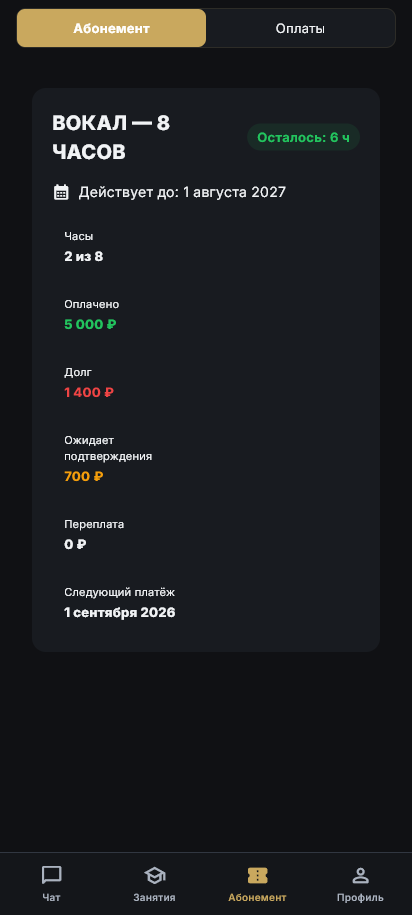
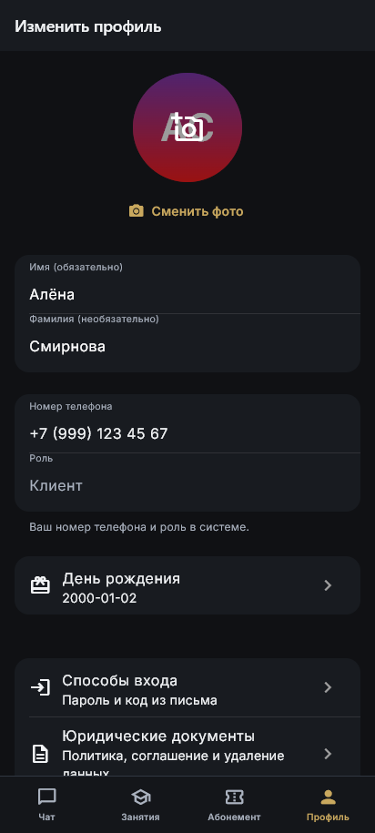
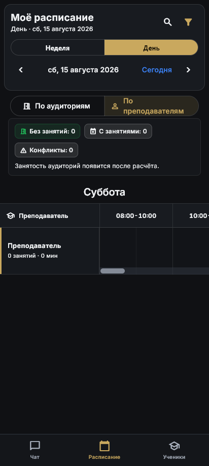
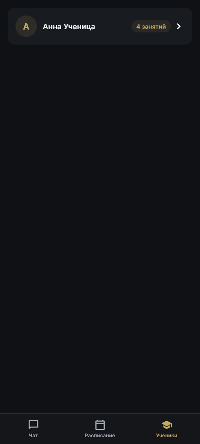
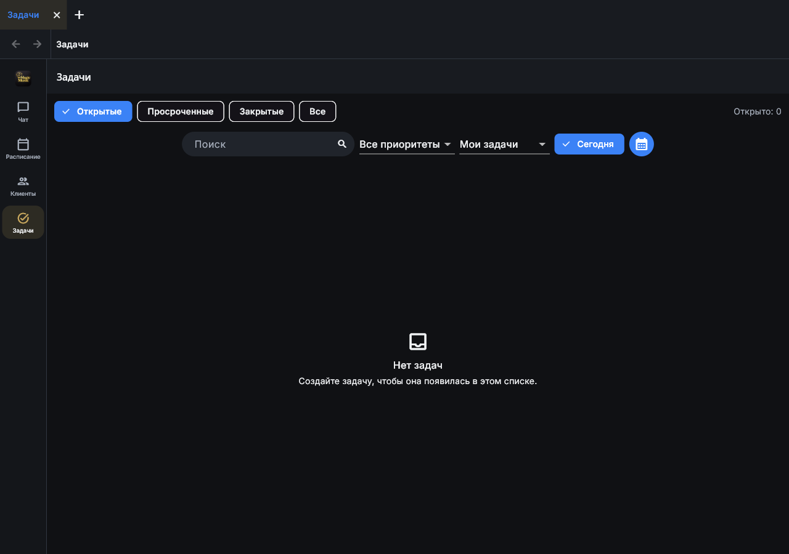
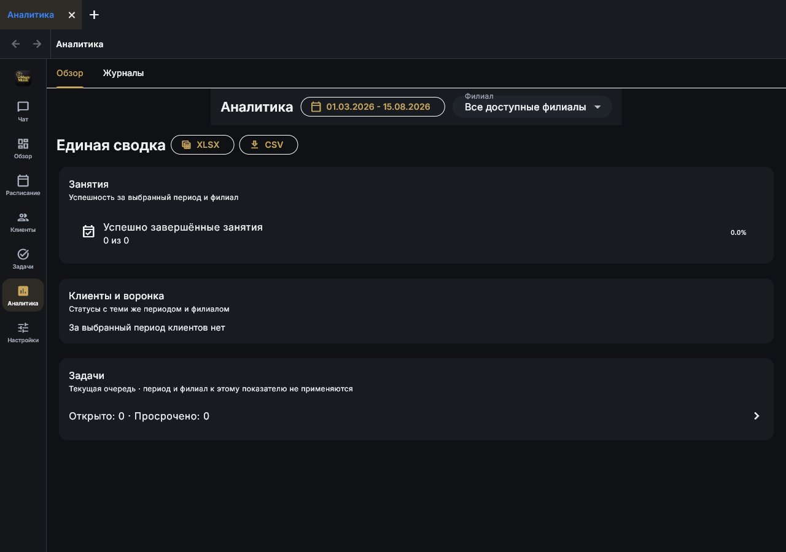
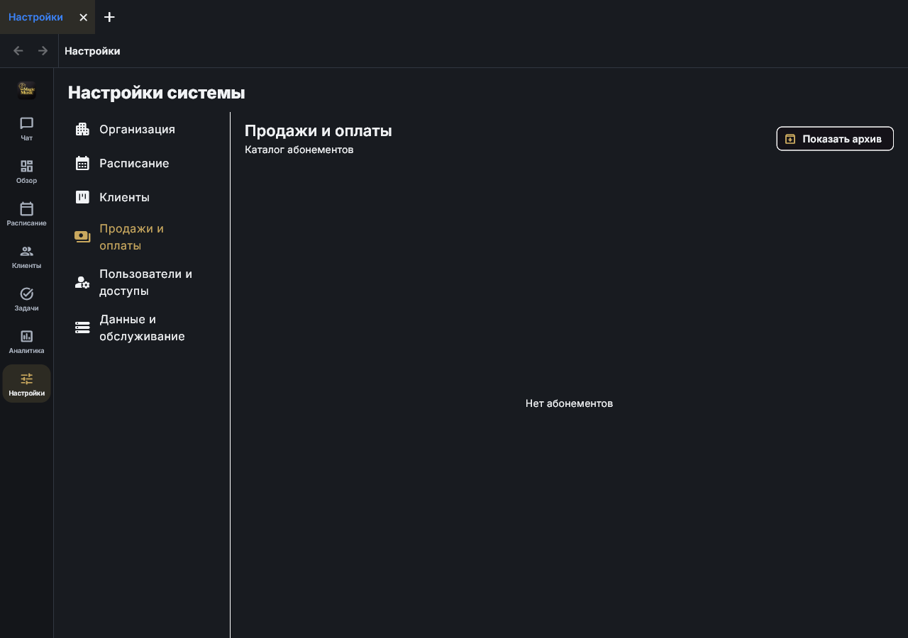
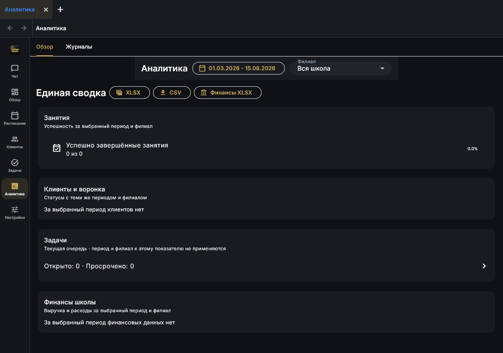
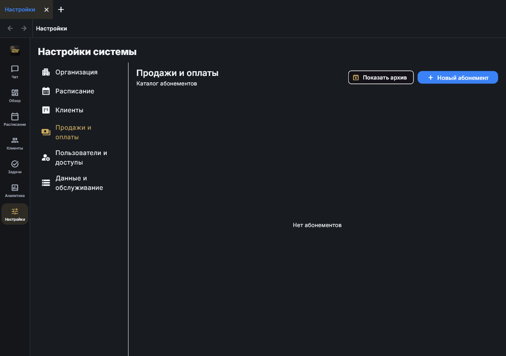

# Исследование светлого редизайна MagicMusicCRM

Дата: 15 августа 2026 года.

Статус: карта текущего интерфейса и направления для обсуждения. Изменений темы или экранов в рабочее приложение не вносилось.

## 1. Что исследовано

Карта построена по актуальному Flutter-коду, маршрутам, ролевой матрице, общим компонентам и новому прогону ролевого интеграционного тура. Тур прошёл 5 из 5 сценариев и создал девять актуальных снимков на стабильных тестовых данных.

Инвентаризация охватывает:

- 22 явных шаблона маршрутов;
- 8 канонических разделов рабочего пространства;
- 5 ролевых вариантов навигации;
- 6 областей системных настроек;
- 8 разделов карточки ученика и 7 разделов карточки лида;
- крупные семейства форм, диалогов и боковых поверхностей.

Важно: приложение устроено не как набор независимых страниц. Основной интерфейс состоит из ролевой оболочки, рабочих вкладок, вложенных разделов, карточек сущностей и модальных процессов. Редизайн должен проверять функциональную полноту на уровне сценариев, а не только на уровне файлов с названием `screen`.

Основные источники:

- маршруты: `lib/core/router/app_router.dart`;
- ролевые разделы: `lib/core/navigation/crm_nav_rbac.dart`;
- рабочая оболочка: `lib/core/workspace/production_workspace_host.dart`;
- тема и токены: `lib/core/theme/app_theme.dart`, `lib/core/theme/design_tokens.dart`;
- состав рабочих разделов: `lib/features/messenger/presentation/screens/messenger_screen_builders_a.dart`;
- карточка клиента: `lib/features/crm/presentation/client_card/`;
- настройки: `lib/features/admin/presentation/widgets/manage_entities_widget.dart`.

## 2. Карта маршрутов

### До входа и обязательные шаги

| Маршрут | Поверхность | Текущее решение |
|---|---|---|
| `/` | Проверка сессии и готовности аккаунта | Полноэкранная загрузка, повтор запроса и автоматический повтор |
| `/login` | Вход | Центрированная форма ограниченной ширины |
| `/register` | Регистрация | Центрированная пошаговая форма |
| `/email-otp` | Код из письма | Отдельная форма подтверждения и повторной отправки |
| `/password-reset` | Сброс пароля | Отдельный сценарий восстановления |
| `/onboarding` | Заполнение профиля | Центрированная форма первого запуска |
| `/legal-consent` | Обязательное согласие | Список документов и подтверждение |
| `/legal-documents` | Просмотр документов | Тот же экран без обязательного подтверждения |
| `/account-deletion-status` | Статус удаления | Блокирующий статус, отзыв запроса или выход |

### Основные оболочки

| Маршрут | Роль | Поверхность |
|---|---|---|
| `/client` | Клиент | Отдельная оболочка с четырьмя разделами |
| `/teacher` | Преподаватель | Общее рабочее пространство с ограниченной матрицей доступа |
| `/admin` | Администратор и системный администратор | Общее рабочее пространство с разделами по возможностям |
| `/manager` | Управляющий и директор | Полное управленческое рабочее пространство |

### Карточки, профиль и служебные переходы

| Маршрут | Назначение |
|---|---|
| `/student/:id`, `/students/:id` | Карточка ученика |
| `/leads/:id` | Карточка лида |
| `/lessons/:id` | Занятие с возвратом в рабочую оболочку |
| `/admin/profiles/:id` | Профиль пользователя, переводится в актуальную оболочку настроек |
| `/crm/configuration` | Настройки CRM, переводятся в актуальную оболочку |
| `/profile` | Собственный профиль |
| `/auth-methods` | Пароль и вход по коду |
| `/delete-account` | Запрос на удаление аккаунта |

## 3. Карта экранов по ролям

| Роль | Основная навигация | Особенности |
|---|---|---|
| Клиент | Чат, Занятия, Абонемент, Профиль | Собственная мобильная и настольная оболочка; только личные данные |
| Преподаватель | Чат, Расписание, Ученики | Только назначенные занятия и ученики; без финансов школы |
| Администратор | Чат, Расписание, Клиенты, Задачи | Операционная работа без управленческого обзора, аналитики и системных настроек |
| Управляющий | Чат, Обзор, Расписание, Клиенты, Задачи, Аналитика, Настройки | Нет общешкольных финансов и управления каталогом абонементов |
| Директор | Чат, Обзор, Расписание, Клиенты, Задачи, Аналитика, Настройки | Общешкольные финансы, экспорт, пользователи, роли и управление каталогами |
| Системный администратор | Полный набор по возможностям | Дополнительные служебные права и настройки |

На компьютере рабочее пространство добавляет верхнюю полосу вкладок, контекстную строку с переходом назад и хлебными крошками, а затем левую ролевую навигацию. Можно открыть до десяти рабочих вкладок. На узких экранах остаётся одна поверхность и нижняя навигация.

## 4. Детальная карта рабочих поверхностей

### Чат

- список личных, административных, групповых и канальных диалогов;
- область переписки, вложения, голосовые сообщения, ответы и пересылка;
- поиск, архив, сведения о чате;
- создание и редактирование групп и каналов;
- управление участниками и правами;
- адаптивная компоновка: список и переписка рядом на компьютере, последовательный переход на телефоне.

Текущее дизайн-решение: отдельный Telegram-подобный визуальный слой с аватарами, градиентами, пузырями сообщений и собственной плотностью компонентов.

### Обзор

- активные ученики, новые лиды, открытые и просроченные задачи;
- пробные занятия и конфликты расписания;
- загрузка аудиторий и действия сотрудников;
- для директора: выручка, ожидаемые платежи и ученики с долгом;
- быстрые переходы из показателя в связанный рабочий раздел.

Текущее дизайн-решение: сетка карточек показателей и состояний, часть показателей скрывается по правам.

### Расписание

- месяц, неделя и день;
- группировка по аудиториям или преподавателям;
- филиал, преподаватель, тип занятия и наличие конфликтов;
- поиск, переход к сегодняшнему дню и часовой пояс филиала;
- матрица занятости, временная шкала преподавателя и месячная сетка;
- создание одиночного занятия;
- просмотр, перенос, отмена и замена занятия;
- анализ конфликтов и предложения по исправлению;
- настройки часов филиалов, доступности преподавателей и учебных групп.

Текущее дизайн-решение: насыщенная командная зона, сегментированные переключатели и плотная таблица времени. На телефоне таблица использует горизонтальную прокрутку.

### Клиенты

- две равноправные поверхности: лиды и ученики;
- доски по этапам, перетаскивание и перевод лида в ученика;
- поиск, фильтры, филиалы, ответственные и статусы;
- создание лида и ученика;
- открытие карточки в текущей или новой рабочей вкладке.

Текущее дизайн-решение: канбан-доски и панели фильтров, функционально близкие к Pipedrive и HubSpot, но с большим количеством локальных вариантов карточек и управляющих элементов.

### Карточка лида

- Обзор;
- Занятия;
- Абонементы;
- Прогресс;
- История и задачи;
- Контакты;
- Документы.

### Карточка ученика

- Обзор;
- Занятия и календарь;
- Оплаты и финансовая история;
- Абонементы;
- Прогресс;
- Задачи, комментарии и история;
- Контакты и семья;
- Документы.

На компьютере карточка использует левый список быстрых переходов шириной 224 пикселя и длинный холст из секционных карточек. На телефоне показывается один выбранный раздел.

Связанные процессы карточки:

- добавление, исправление, подтверждение, возврат и корректировка оплаты;
- выдача, отмена и пересчёт абонемента;
- создание и редактирование постоянного расписания;
- назначение участников группового расписания;
- задача, домашнее задание, комментарий и служебная заметка;
- контактные лица, связывание лида и ученика;
- архивирование и чёрный список.

### Задачи

- открытые, просроченные, закрытые и все задачи;
- поиск, приоритет, область ответственности и дата;
- список и календарная поверхность;
- создание и редактирование;
- получатели: сотрудник, филиал или вся школа;
- напоминание, история изменений и связанная запись.

Текущее дизайн-решение: многострочная панель управления над контентом, синяя активная кнопка и отдельное пустое состояние.

### Аналитика

- вкладки «Обзор» и «Журналы»;
- период и филиал;
- занятия, клиенты и воронка, задачи;
- финансовая сводка только для директора и системного администратора;
- журналы действий, финансовых операций и расчётов преподавателей;
- выгрузки XLSX и CSV, отдельная финансовая выгрузка по правам.

Текущее дизайн-решение: вертикальная лента крупных сводных блоков с отдельной строкой фильтров и экспортов.

### Настройки системы

Вторичная навигация содержит шесть областей:

1. Организация: филиалы, аудитории, дисциплины и причины отказа.
2. Расписание: часы филиалов, графики преподавателей, недоступность и группы.
3. Клиенты: поля, наборы значений, воронки и источники.
4. Продажи и оплаты: каталог абонементов и архив.
5. Пользователи и доступы: аккаунты, роли, персональные права, сотрудники и преподаватели.
6. Данные и обслуживание: качество данных и запросы на удаление.

Текущее дизайн-решение: на компьютере постоянная вторичная колонка шириной 248 пикселей, на узком экране выпадающий список области. Внутри широко используются сегментированные переключатели, таблицы, списки и диалоги.

### Клиентское приложение

- Чат;
- Занятия: предстоящие, история, задания;
- Абонемент: состояние абонемента и переключение на оплаты;
- Профиль: личные данные, фото, день рождения, способы входа, документы и удаление аккаунта.

### Приложение преподавателя

- Чат;
- личное расписание с неделей и днём;
- группировка расписания и индикаторы конфликтов;
- список назначенных учеников и переход в ограниченную карточку.

### Глобальные и служебные поверхности

- центр обновлений и история версий;
- окно доступного обновления и ошибка автоматической установки;
- уведомления и настройки уведомлений;
- обрезка аватара;
- подтверждение выхода с несохранёнными изменениями;
- унифицированные состояния загрузки, пустого результата, запрета и ошибки.

## 5. Текущая дизайн-система

Полный профиль сохранён в `current-design-dna.json`.

Кратко:

- тёмная нейтральная палитра `#101114`, `#181B20`, `#20242B`;
- светлый текст `#F1F3F5`, вторичный `#AAB2BF`;
- золото `#C9A85E` для бренда и выбранных состояний;
- синий `#3B82F6` для многих основных действий и фокуса;
- Inter, Material 3, базовый ритм 4 пикселя;
- радиусы 10, 14 и 18 пикселей, но тема ввода использует 22 пикселя;
- почти плоские основные поверхности, тени только у плавающих элементов;
- минимальная функциональная анимация.

Найденные расхождения:

- 69 файлов содержат локальные цвета, всего 321 строка;
- 41 файл содержит числовые радиусы вне токенов, всего 100 строк;
- 109 файлов содержат локальные размеры шрифта, всего 531 строка;
- 66 файлов содержат локальные числовые отступы;
- основные действия визуально делятся между золотом и синим;
- профиль и Telegram-компоненты имеют наиболее самостоятельный визуальный язык;
- вложенные навигационные уровни иногда занимают больше внимания, чем рабочая задача.

Это не означает, что каждый локальный параметр ошибочен. Это показывает, что простая замена тёмных цветов на светлые не даст цельного результата.

## 6. Актуальный визуальный аудит

### Шаг 1. Клиент, абонемент

Состояние: функционально здоровое, визуально требует уплотнения.

Сильные стороны: статус и деньги читаются, нижняя навигация стабильна. Риски: данные идут одной длинной колонкой, связь между оплатой, долгом и остатком выражена только цветом и расстоянием.

### Шаг 2. Клиент, профиль

Состояние: рабочее, но визуально неоднородное.

Сильные стороны: понятные группы и крупные строки действий. Риски: аватар, инициалы и значок камеры конфликтуют; карточки и строки имеют разные плотности; часть следующего раздела обрезана нижней навигацией на снимке.

### Шаг 3. Преподаватель, расписание

Состояние: функционально богатое, перегруженное для телефона.

Сильные стороны: день, режим и конфликты доступны сразу. Риски: несколько переключателей конкурируют за первый экран; таблица времени требует горизонтальной прокрутки; мелкие подписи и плотные границы снижают читаемость.

### Шаг 4. Преподаватель, ученики

Состояние: ясное, но слишком пустое при малом количестве данных.

Сильные стороны: одна строка хорошо сканируется. Риски: отсутствуют быстрый поиск, группировка или полезное пустое продолжение; почти весь экран не несёт информации.

### Шаг 5. Администратор, задачи

Состояние: рабочее, иерархия управления требует упрощения.

Сильные стороны: роль видит только нужные разделы, состояния задач явные. Риски: верхние рабочие вкладки, контекстная строка, левая навигация, заголовок и две строки фильтров создают много уровней; пустое состояние находится далеко от основного действия.

### Шаг 6. Управляющий, аналитика

Состояние: структурно здоровое, визуально плоское.

Сильные стороны: права корректно скрывают финансы, фильтр действует на сводку. Риски: пустые блоки занимают много высоты; экспорт конкурирует с заголовком; фильтры выглядят отдельной вставкой, а не общей командной панелью.

### Шаг 7. Управляющий, настройки

Состояние: понятная архитектура, слабая работа с пустым состоянием.

Сильные стороны: шесть областей легко различимы. Риски: третья навигационная колонка делает экран тяжёлым; пустой каталог не объясняет следующий шаг; кнопка архива оторвана от содержимого.

### Шаг 8. Директор, аналитика

Состояние: функционально полное, требует более сильной визуальной иерархии.

Сильные стороны: финансовые права видны через дополнительный блок и экспорт. Риски: все секции имеют почти одинаковый визуальный вес; нулевые показатели выглядят как незаполненные карточки, а не как осмысленное состояние.

### Шаг 9. Директор, настройки

Состояние: хорошее различение прав, слабая композиция пустого каталога.

Сильные стороны: основное действие доступно только директору и хорошо заметно. Риски: синий основной акцент конфликтует с золотым брендом; большой пустой холст не помогает понять назначение каталога.

### Доступность

По снимкам можно подтвердить высокую контрастность основного текста и наличие явных текстовых названий у большинства действий. Требуют отдельной проверки и улучшения:

- подписи 11-12 пикселей в навигации и аналитике;
- размеры целей у части сегментов и иконок;
- состояния, где смысл передаётся в основном зелёным, красным или золотым цветом;
- клавиатурный фокус, порядок чтения, масштаб 200 процентов и экранный диктор;
- горизонтальная таблица расписания на телефоне.

Снимки не подтверждают полное соответствие WCAG и не проверяют анимацию, клавиатуру или экранный диктор.

## 7. Что стоит перенять у сильных CRM

### Microsoft Dynamics 365 и Power Apps

Актуальный светлый интерфейс использует единые формы, представления, диалоги и сетки, плавающую командную панель, более яркий фон и отделение основного контента поверхностями. Новая навигация сокращает заголовки и команды. Источник: [Microsoft Learn](https://learn.microsoft.com/en-us/power-apps/user/modern-fluent-design).

Для MagicMusicCRM: единая командная панель для заголовка, фильтров и основных действий; единая таблица; одинаковые правила для формы, диалога и боковой панели.

### Salesforce Lightning

Salesforce поддерживает комфортную и компактную плотность форм, а рабочая консоль использует разделённый вид записи вместо длинной последовательности переходов. Источники: [Record View Form](https://developer.salesforce.com/docs/platform/lightning-component-reference/guide/lightning-record-view-form), [Lightning console layout](https://trailhead.salesforce.com/en/content/learn/modules/lightning-experience-for-salesforce-classic-users/work-with-your-data).

Для MagicMusicCRM: компактная плотность на компьютере, комфортная на телефоне, список слева и инспектор записи справа для клиента, занятия и задачи.

### HubSpot

HubSpot строит работу вокруг сохранённых представлений, настраиваемых колонок, таблицы и доски. Карточка из доски может открываться в правой панели, а полный экран остаётся доступным. Источники: [сохранённые представления](https://knowledge.hubspot.com/records/create-and-manage-saved-views), [доска и правая панель](https://knowledge.hubspot.com/records/manage-records-in-board-view), [колонки](https://knowledge.hubspot.com/records/customize-index-page-columns).

Для MagicMusicCRM: сохранённые представления клиентов и задач, настраиваемая плотность колонок, быстрый инспектор без потери полноценной карточки.

### Pipedrive

Pipedrive удерживает в центре этап процесса и следующее действие: карточки показывают ключевые данные и активность, календарь доступен как отдельный вид, фильтры помогают быстро перейти к своей работе. Источники: [pipeline view](https://support.pipedrive.com/en/article/pipeline-view), [activity calendar](https://www.pipedrive.com/en/features/activity-calendar), [Insights dashboards](https://support.pipedrive.com/en/article/insights-dashboards).

Для MagicMusicCRM: в лидах и учениках показывать не все поля, а этап, ответственного и следующий шаг; на главной объединить сегодняшние занятия, задачи и конфликты.

### Attio

Attio показывает одни и те же записи через таблицы и канбан, позволяет менять группировку, фильтрацию и состав видимых атрибутов, а запись остаётся единым источником истины. Источники: [списки и представления](https://attio.com/help/reference/managing-your-data/lists/create-lists), [канбан](https://attio.com/help/reference/managing-your-data/views/create-and-manage-kanban-views), [страницы записей](https://attio.com/help/reference/managing-your-data/records/create-and-view-records).

Для MagicMusicCRM: не создавать новые параллельные сущности или экраны, а давать разные представления уже существующих клиентов, занятий и задач.

## 8. Три направления светлого редизайна

### Направление A. Светлая операционная консоль

Основа: Dynamics 365 и HubSpot.

- тёплый светло-серый фон и белые рабочие поверхности;
- тёмно-графитовый текст;
- спокойная левая навигация без крупных цветных плашек;
- одна липкая командная панель на раздел;
- таблицы и списки как основной рабочий формат;
- золото только для бренда, выбранного состояния и редких важных акцентов;
- основной рабочий цвет действий: глубокий синий или тёмный бирюзовый.

Подходит как самая безопасная база для постепенной миграции всех экранов.

### Направление B. Контекстная CRM

Основа: Attio, Salesforce и HubSpot.

- список, доска или календарь остаются на месте;
- выбранный клиент, урок или задача открывается в правом инспекторе;
- полная карточка открывается только для длинной работы;
- связанные данные группируются вокруг объекта, а не вокруг отдельных страниц;
- рабочие вкладки сохраняются, но верхняя полоса и контекстная строка объединяются;
- быстрые действия и история располагаются рядом с выбранной записью.

Лучше всего сокращает переходы и сохраняет текущую функциональность карточек.

### Направление C. Центр рабочего дня

Основа: Pipedrive и календарные CRM.

- первый экран строится вокруг сегодняшних занятий, задач и конфликтов;
- расписание становится главным визуальным инструментом школы;
- лиды и ученики показывают следующий шаг и ближайшее занятие;
- уведомления превращаются в понятную очередь действий;
- аналитика остаётся отдельной, но обзор показывает только то, что требует решения сегодня.

Лучше всего отражает специфику музыкальной школы, но требует более глубокого пересмотра композиции обзора.

## 9. Рекомендуемая комбинация

Рекомендуемая основа: направление A как дизайн-система, направление B как модель работы с записями и элементы направления C для обзора директора, администратора и преподавателя.

Это даёт:

- безопасную поэтапную замену визуала;
- сохранение всех прав, маршрутов и команд;
- меньше вложенной навигации;
- более быструю работу со списком и записью;
- отдельную ценность MagicMusicCRM, а не копию чужой CRM.

## 10. Следующий этап после выбора направления

1. Утвердить один общий визуальный курс.
2. Создать светлые семантические токены без привязки к конкретному экрану.
3. Зафиксировать типографику, плотность, сетку, таблицу, форму, командную панель, инспектор и состояния.
4. Сделать три эталонных экрана: расписание, клиенты с карточкой и задачи.
5. Проверить каждый эталон на компьютере и телефоне.
6. Составить матрицу функционального равенства до изменения production-кода.
7. Переносить разделы по одному через общие компоненты и регрессионные тесты.
