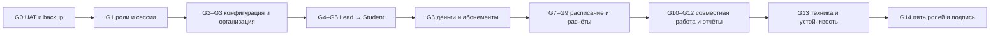

# V7 — production-мегатест MagicMusicCRM 1.5.1

**Статус:** условия подтверждены владельцем 2026-08-08; выполняется  
**Цель:** пройти одним связанным набором данных весь пользовательский путь и
каждую production-функцию приложения от конфигурации школы до финансового
расчёта занятия, подтвердив результат через реальный UI, API и БД.  
**Клиенты:** подписанные Release-сборки `1.5.1`; тёмная тема; без debug UI.  
**Платформы:** Client/Teacher — Android; Admin/Manager/Director — Windows.

## 1. Что считается честным PASS

Шаг получает `PASS`, только если одновременно выполнены все применимые пункты:

1. действие выполнено в подписанной Release-сборке под указанной реальной ролью;
2. результат виден в UI после обновления страницы и после повторного входа;
3. API вернул ожидаемый статус и не создал повтор при повторной отправке;
4. для денег, часов, прав и истории результат совпал с проекцией БД;
5. в логах приложения/API нет нового необъяснённого `Error`;
6. приложен новый скриншот именно этого состояния, без переиспользования чужого
   кадра или кадра другой роли/платформы.

Исходный код, unit-тест или макет не заменяет живое доказательство. Если нужная
роль, устройство, внешний секрет или функция недоступны, результат — `BLOCKED`,
а не формальный `PASS`.

## 2. Подтверждённые владельцем условия запуска

### D1. Production

Владелец выбрал непосредственный production-прогон. Все сущности получают UAT-
префикс и тестовый филиал, но append-only аудит, завершённые расчёты и начисления
останутся в технической истории. Это принято осознанно; перед первой записью
обязательны backup, restore-check и baseline общешкольной аналитики.

### D2. Общая доска задач Администратора

Администратор получает общую branch-scoped доску и право читать/закрывать
доступные ему задачи без права создавать или редактировать их. При первом входе в
раздел автоматически выбраны фильтры `Мои задачи` и `Сегодня`; пользователь может
снять их и выбрать остальные существующие фильтры. Scope остаётся серверным:
Администратор не получает задачи и данные вне разрешённых филиалов.

### D3. Android emulator

Client и Teacher проверяются в Android emulator так же, как в предыдущих прогонах:
подписанный Release APK, отдельные входы, UI-tree, screenshots и logcat.

## 3. Единый набор данных прогона

Каждый объект получает префикс `UAT-<дата>-<номер запуска>`. Все UUID и созданные
версии заносятся в журнал прогона.

| Объект | Набор |
|---|---|
| Филиал | новый филиал по адресу `Оборонная 30`, Europe/Moscow; Пн–Сб 09:00–21:00, Вс закрыто |
| Аудитории | индивидуальная (1 место), парная (2 места), ансамблевая (8 мест) |
| Преподаватели | основной преподаватель, преподаватель для подмены и конфликтный преподаватель |
| Сотрудники | записи Администратора и Управляющего; роли проверяются аккаунтами `magic3` и `magic4` |
| Клиенты | основной Lead→Student, отдельный плательщик, второй ученик для группы, внешний Lead, временный дубль |
| Группа | одна учебная группа из двух учеников |
| Абонементы | 12×60 минут за 30 000 ₽; альтернативный пакет для замены; рассрочный пакет |
| Связи | основной клиент ↔ плательщик/представитель; Student ↔ аккаунт `magic1`; основной преподаватель ↔ `magic2` |

## 4. Полный WBS прогона

### G0 — Безопасность и воспроизводимость · 3 ч · P0

- **UAT-000:** зафиксировать commit, app/server image, migrations, APK/EXE hashes,
  API URL, устройства и время прогона.
- **UAT-001:** сделать backup и пробный restore UAT-БД; снять начальные counts,
  reconciliation digest, worker/outbox/realtime health.
- **UAT-002:** проверить, что Release-клиенты используют UAT API, тёмную тему и
  не показывают debug banner, лишнюю мобильную навигацию на ПК или desktop rail
  на телефоне.
- **UAT-003:** создать журнал ID и каталог evidence; секреты/телефоны в API trace
  редактируются, суммы и бизнес-результаты не скрываются.

**Done When:** backup восстановим, baseline зелёный, все production-записи
однозначно отделимы UAT-префиксом и перечислены в журнале ID.

### G1 — Авторизация, сессия и навигация пяти ролей · 4 ч · P0

- **UAT-010:** `magic1..5@gmail.com / 123456`, проверка ожидаемой роли и доступных
  разделов; запрещённые разделы не вызывают API.
- **UAT-011:** Client→Director→Client и Teacher→Admin relogin; выход, вход в тот
  же и другой аккаунт, update-over-install, рестарт приложения.
- **UAT-012:** на Windows открыть 10 вкладок сущностей, перейти по ФИО/названию,
  проверить breadcrumbs, Back/Forward, сохранение исходной вкладки, restart и
  очистку вкладок после logout.
- **UAT-013:** на Android проверить системный/predictive Back, клавиатуру,
  SafeArea, верхнюю системную панель и нижнюю навигацию.

**Done When:** ни одна старая сессия не открывает чужой аккаунт, логин не очищает
валидные данные формы без объяснения, а каждый переход имеет логичный маршрут.

### G2 — Все варианты конфигурации CRM · 8 ч · P0

От лица Director на уровне школы и затем нового филиала:

- **UAT-020:** создать категории, изменить порядок, архивировать неиспользуемую;
- **UAT-021:** создать и заполнить на Lead и Student все 16 поддерживаемых типов
  поля: text, textarea, number, money, duration, boolean, toggle, date, datetime,
  select, radio, multi-select, checkbox-group, email, phone и URL;
- **UAT-022:** покрыть все варианты ширины `1/3`, `1/2`, `1/1` и размещения
  `создание / редактирование / карточка / таблица`, не создавая логических
  дублей системных полей;
- **UAT-023:** создать одиночный и множественный набор вариантов, использовать
  один набор в нескольких полях, изменить/архивировать вариант и проверить
  сохранность исторического значения;
- **UAT-024:** сделать обязательными источник рекламы и выбранные UAT-поля;
  проверить понятные inline-ошибки в UI и structured `422` в API;
- **UAT-025:** изменить `default_lesson_duration_minutes` и
  `payment_reminder_days` на уровне школы и филиала;
- **UAT-026:** создать этапы и переходы воронки Lead/Student, проверить counts;
- **UAT-027:** настроить 7 типов списания и 5 независимых правил оплаты
  преподавателю, включая осмысленные значения percent/fixed/hourly;
- **UAT-028:** сохранить draft → impact preview → publish → realtime refresh
  другой сессии → rollback; проверить неизменяемую историю версий;
- **UAT-029:** Manager меняет только разрешённый branch override; Admin/Teacher/
  Client не получают редактор и не делают config-запросов.

**Done When:** каждый вариант реально отрисован, заполнен и перечитан из API;
rollback возвращает прежнюю конфигурацию без потери данных.

### G3 — Филиал, аудитории, люди, графики и права · 6 ч · P0

- **UAT-030:** Director создаёт филиал, меняет адрес/timezone и видит его во всех
  branch selectors.
- **UAT-031:** создать 3 аудитории с разной вместимостью; изменить одну и удалить
  только свободную; занятая аудитория защищена.
- **UAT-032:** настроить рабочие часы филиала по дням недели и один закрытый день.
- **UAT-033:** создать 3 преподавателей, дисциплины, ставки, филиальные назначения;
  задать recurring availability, интервал недоступности и подменного педагога.
- **UAT-034:** создать записи сотрудников; Director назначает только более низкие
  роли; Manager не может назначить Director/system_admin.
- **UAT-035:** изменить capability Управляющего, увидеть realtime-инвалидацию во
  второй сессии и вернуть право; проверить branch scope.
- **UAT-036:** создать группу, назначить преподавателя/филиал/аудиторию и добавить
  двух учеников после их появления.

**Done When:** schedule reference показывает только назначенных филиалу педагогов
и доступные аудитории; запреты ролей работают и в UI, и через прямой API.

### G4 — Lead: от входа до конверсии · 5 ч · P0

- **UAT-040:** Admin создаёт Lead с нормализованным телефоном, обязательным
  рекламным источником и всеми UAT-полями.
- **UAT-041:** проверить поиск посимвольно без рестарта/потери focus, все фильтры,
  сортировку, empty/error/retry и открытие карточки по ФИО.
- **UAT-042:** пройти статусы воронки с историей, ответственным и причиной;
  проверить чёрный список и возврат.
- **UAT-043:** создать дубль, увидеть duplicate candidate, выполнить merge и undo
  без потери телефона, источника, комментариев и связей.
- **UAT-044:** создать внешний Lead через подписанный webhook; уведомление должно
  прийти один раз. Ручной Lead такого уведомления не создаёт.
- **UAT-045:** назначить пробное занятие из карточки Lead с обязательными
  преподавателем, аудиторией и расчётным snapshot.
- **UAT-046:** Director/Manager создаёт задачу по Lead; после решения D2 Admin
  видит её в карточке.
- **UAT-047:** конвертировать Lead в Student конкурентным двойным нажатием;
  получается один Student и одна стабильная связь Lead→Student.

**Done When:** источник рекламы, системные и совместимые custom-поля, заметка,
связи и история сохранились после конверсии.

### G5 — Полная карточка ученика · 4 ч · P0

- **UAT-050:** проверить длинную desktop-карточку с постоянным левым rail и
  компактные вкладки на Android.
- **UAT-051:** заполнить основные поля, внутреннюю заметку для staff, обычный и
  shared-with-teacher комментарий; Client не видит служебные данные.
- **UAT-052:** создать представителя/плательщика, family relation, linked app user
  и приглашение; проверить переходы по тексту сущности.
- **UAT-053:** дополнительные поля раскрываются внутри Overview, а не отдельным
  разделом; значения всех типов корректно отображаются.
- **UAT-054:** добавить ученика и плательщика в тестовую группу; проверить
  добавление/удаление участника.

**Done When:** Lead→Student связь видна, рекламный источник не продублирован и не
потерян, staff/client/teacher projections не раскрывают лишних данных.

### G6 — Личный счёт, оплаты и абонементы · 8 ч · P0

- **UAT-060:** создать записи всех трёх статусов: `Не оплачен` → долг,
  `Проведён, ожидает подтверждения` → pending, `Оплачен` → баланс; проверить
  допустимые переходы и запрет невозможных.
- **UAT-061:** проверить наличный и безналичный способы, идентификатор, дату,
  примечание и обновление другой сессии в realtime.
- **UAT-062:** создать каталог 12×60/30 000 ₽ и альтернативный пакет; проверить
  publish, branch override, архив и восстановление.
- **UAT-063:** пополнить личный счёт и купить абонемент с собственного счёта:
  без скидки, с процентной и фиксированной скидкой; сверить immutable snapshot.
- **UAT-064:** купить абонемент основному ученику со счёта другого клиента;
  причина обязательна и видна Admin/Manager/Director в истории.
- **UAT-065:** купить рассрочный пакет: резервируется вся сумма, формируются части,
  наступление срока части создаёт `Проведён, ожидает подтверждения`,
  сотрудник переводит её в `Оплачен`.
- **UAT-066:** проверить долг, pending, оплачено, переплату, остаток часов и
  ближайший платёж в карточке и в Client Android.
- **UAT-067:** заменить активный абонемент через preview/confirm; остаётся один
  активный результат и точная финансовая разница.
- **UAT-068:** отменить абонемент с причиной и проверить возврат/освобождение
  резервов без ложной строки возврата в статистике.
- **UAT-069:** сторнировать/технически удалить unpaid, pending и paid записи с
  обязательной причиной; они исключены из финансовой статистики, но действие
  остаётся в технической истории.
- **UAT-06A:** ручная корректировка/возврат личного счёта и её сторно; повторный
  submit не создаёт дубль.

**Done When:** UI, commerce projection, ledger и analytics сходятся до копейки и
до 0.01 часа; Admin положительно проходит возврат и оплату с чужого счёта.

### G7 — Предпочтительное и постоянное расписание · 6 ч · P0

- **UAT-070:** сохранить предпочтительное расписание и убедиться, что занятия
  видны даже при его отсутствии.
- **UAT-071:** создать индивидуальный Plan на несколько дней с одним педагогом;
  затем строки с разными педагогами и аудиториями.
- **UAT-072:** создать групповой Plan и проверить участников/абонементы каждой
  строки.
- **UAT-073:** обязательные поля и полная матрица teacher/room/client/group/
  branch-hours/closed-day конфликтов проверяются одним canonical engine до
  последних экранов; конфликтный Plan ничего не создаёт, сохраняет строки в
  editor и позволяет изменить только проблемный день/время/ресурс;
  недоступный/непривязанный педагог не предлагается в selector.
- **UAT-074:** проверить active/ended blocks, завершение Plan по последней дате,
  impact preview, отмену только будущих занятий и сохранение истории.
- **UAT-075:** tray листается стрелками/курсором, показывает teacher/day/time/
  period/room и маркеры; finished schedules по умолчанию свёрнуты.
- **UAT-076:** календарь клиента: `Скрывать чужие занятия` включён по умолчанию;
  после выключения видны и чужие занятия, а связь с целевым клиентом отмечается
  отдельным маркером, не меняющим фон `Забронировано`/`Завершено`/`Конфликт`.
  Month отмечает дни,
  Week/Day — только совпавшие записи, с аккуратным glow.

**Done When:** созданные Plan/Series/Lessons перечитываются после рестарта, не
имеют скрытых конфликтов и корректно видны в карточке клиента.

### G8 — Все типы списания и оплаты преподавателю · 8 ч + ожидание worker · P0

Активный каталог считывается перед прогоном. Для начального каталога выполняются
все разрешённые контексты — всего 17 переходов, а не один пример на название.

| Тип списания | Контексты, которые реально выполняются |
|---|---|
| Занятие | завершение |
| Частично оплачиваемое занятие | завершение |
| Бесплатное занятие | завершение, перенос, отмена |
| Оплачиваемый пропуск | завершение, перенос, отмена |
| Частично оплачиваемый пропуск | завершение, перенос, отмена |
| Неоплачиваемый пропуск | завершение, перенос, отмена |
| Занятие со штрафом | завершение, перенос, отмена |

- **UAT-080:** каждое создание требует тип списания, независимое правило оплаты
  преподавателю и источник средств.
- **UAT-081:** покрыть все 5 правил teacher pay: не оплачивать, стандартная
  ставка, процент, фиксированная сумма и почасовая сумма; проверить ручной
  override с обязательной причиной.
- **UAT-082:** источник по умолчанию — абонемент; отдельно проверить личный счёт
  и допустимое `Без списания`.
- **UAT-083:** создать пробное и бесплатное занятие как разные бизнес-сценарии;
  бесплатное не уменьшает деньги/часы.
- **UAT-084:** одно due-занятие дождаться в реальном времени: worker применяет
  заранее сохранённый план ровно один раз, создаёт client fact, teacher fact и
  terminalizes reservation.
- **UAT-085:** воспроизвести безопасную ошибку автоматического расчёта: карточка
  получает состояние `Конфликт`, staff видит безопасную причину и действие
  `Исправить расчёт`; штатной ручной фиксации факта проведения нет.
- **UAT-086:** выполнить post-completion correction и перенос атомарно; prior
  effective client/teacher/reservation facts отменяются append-only, старая
  история не переписывается, создаётся scheduled successor, который повторно
  проходит обычное автоматическое завершение ровно один раз.
- **UAT-087:** групповое занятие использует общий выбор и per-client override;
  количество client facts равно числу участников, teacher fact один.

**Done When:** для каждого кейса зафиксированы до/после: баланс, резерв, часы,
сумма преподавателю, transition, labels/colors и версия конфигурации.

### G9 — Переносы, отмены и конфликты · 5 ч · P0

- **UAT-090:** перенести занятие на другую дату/время через форму, без drag&drop;
  причина, списание и teacher pay обязательны.
- **UAT-091:** подменить преподавателя и аудиторию; selector показывает только
  допустимые варианты и объясняет занятость.
- **UAT-092:** проверить student/group/teacher/room overlap, часы филиала,
  закрытый день, недоступность преподавателя, чужой филиал и пересечение по
  длительности во всех one-time/recurring/dashboard/room-availability entry
  points; ни один commit не создаёт частичного результата.
- **UAT-093:** два Manager-сеанса одновременно бронируют один слот: подтверждён
  один winner, второй получает понятный conflict без потери введённых данных.
- **UAT-094:** отменить занятие всеми применимыми типами, проверить preview,
  reason history, резервы и отсутствие `Bad state`/stale-version тупика.
- **UAT-095:** Month/Week/Day, client card и tray открывают один и тот же
  canonical editor; Back возвращает дату, фильтр и scroll.

**Done When:** ни один защищённый путь не обходит preview/confirm/version/
idempotency, а пользователь понимает причину отказа до сохранения.

### G10 — Заметки, комментарии, задачи, ДЗ и история · 6 ч · P0

- **UAT-100:** внутренняя заметка доступна Admin/Manager/Director, скрыта от
  Teacher/Client.
- **UAT-101:** комментарий hidden/share-with-teacher; Teacher видит только
  опубликованный ему текст, Client — ни один служебный комментарий.
- **UAT-102:** Manager создаёт all-day и interval задачи с reminder для человека,
  филиала и всей школы; preview count совпадает с фактическими получателями.
- **UAT-103:** Admin открывает общую доску с default `Мои задачи + Сегодня`,
  меняет фильтры, находит branch/client task; задача становится overdue и
  продолжает напоминать до явного закрытия, после refresh виден один close fact.
- **UAT-104:** назначить ДЗ из раздела «Прогресс», прикрепить файл; Client Android
  видит и сдаёт, Teacher Android проверяет/обновляет статус.
- **UAT-105:** operational history показывает автора и причины для конверсии,
  оплаты/сторно, переноса, отмены, расчёта, заметки, комментария и задачи.

**Done When:** realtime обновляет участвующие роли, а role projections не
раскрывают внутренние данные Client/Teacher.

### G11 — Чат, уведомления и оставшиеся production-разделы · 6 ч · P1

- **UAT-110:** direct chat Client↔Admin и Teacher↔Manager: text, image, file,
  voice, edit, delete, reaction, pin, read/unread.
- **UAT-111:** group/channel: создать, изменить участников/permissions, выйти,
  archive/unarchive; проверить assigned/unassigned support chat, если он доступен.
- **UAT-112:** notification center: inbound Lead, task reminder, lesson change;
  read state переживает restart.
- **UAT-113:** Teacher rate history, начисление, payout, teacher statistics и CSV;
  Student/Teacher не видят чужие ставки.
- **UAT-114:** Director создаёт/правит/удаляет расход; Manager не получает
  общешкольные финансы; Director видит их в Analytics.
- **UAT-115:** data quality и запрос удаления аккаунта на UAT-client; реальный
  `magic1` не удаляется. Проверить profile, auth methods, legal documents/consent
  и notification preferences без смены владельческого пароля.
- **UAT-116:** все loading/empty/error/forbidden/retry состояния основных
  разделов дают понятное действие, а не белую/серую пустую область.

**Done When:** каждый production-раздел, достижимый ролью, имеет хотя бы один
позитивный живой сценарий и один применимый негативный контроль.

### G12 — Аналитика, поиск и экспорт · 4 ч · P0

- **UAT-120:** общий period/branch filter применён к clients/lessons/finance;
  drilldown counts совпадают с карточками тестовых данных.
- **UAT-121:** Manager видит operational analytics без school finance и не делает
  скрытого finance request; Director видит выручку, долг, расходы и прогноз.
- **UAT-122:** экспорт XLSX открывается как OOXML и совпадает по строкам/суммам;
  CSV открывается в Excel с корректной кириллицей и колонками.
- **UAT-123:** поиск Lead, Student, teacher, room и занятия проверяется набором по
  одному символу; focus, введённая строка и scroll не сбрасываются.

**Done When:** UI count = API count = экспорт = SQL count в одном scope/period.

### G13 — Нагрузочные и аварийные проверки API/server/DB · 5 ч · P0

- **UAT-130:** двойные нажатия и повтор запросов для Lead conversion, payment,
  subscription purchase, task close и lesson transition не дают дублей.
- **UAT-131:** временный обрыв сети во время форм сохраняет ввод и даёт Retry;
  повторный login после `401` не зацикливается.
- **UAT-132:** stale expectedVersion возвращает понятный конфликт, после refresh
  пользователь продолжает без ручной очистки приложения.
- **UAT-133:** полный actor matrix всех private routes; unknown capability/scope
  fail-closed, PII/finance leak для Client/Teacher = 0.
- **UAT-134:** API typecheck/build/full tests, Flutter analyze/full tests, migration
  up/down/up на clone, route/wire/inventory stale checks.
- **UAT-135:** до и после прогона: health/readiness, PostgreSQL constraints,
  reconciliation twice, queue/poison/outbox, server/app error logs и latency.

**Done When:** необъяснённые 4xx/5xx, дубли, drift, poison, failed queue и data
leak равны нулю. Ожидаемые негативные 403/409/422 помечены как test outcome.

### G14 — Пять персон и итоговое доказательство · 5 ч · P0

- **UAT-140 Client / Android:** свой chat, занятия/история/ДЗ, абонемент, оплаты и
  профиль; чужих клиентов, служебных заметок и staff finance нет.
- **UAT-141 Teacher / Android:** chat, Day/Week, только назначенные ученики и
  занятия, shared comment и ДЗ; client finance/contacts и mutation controls нет.
- **UAT-142 Admin / Windows:** chat, schedule, Leads/Students, общая доска задач
  с default `Мои + Сегодня`, client finance, refund/third-party payer; management
  analytics/config отсутствуют.
- **UAT-143 Manager / Windows:** operational overview, schedule, clients, tasks,
  analytics, allowed settings; school finance и protected commerce config нет.
- **UAT-144 Director / Windows:** все settings/access/config, operational и school
  finance, archive impact и exports.
- **UAT-145:** архивировать тестового клиента только после impact preview и
  проверки запрета для non-Director; активные повторяющиеся планы завершаются,
  их будущие scheduled lessons отменяются canonical transitions, а conversion/
  finance/history links сохраняются.
- **UAT-146:** владелец получает итоговый DOCX и подписывает каждый пункт
  `PASS / FAIL / BLOCKED`.

## 5. Матрица доказательств

Для каждого шага создаётся строка:

| Поле | Содержимое |
|---|---|
| ID | `UAT-085` |
| Роль / scope | `Director · UAT branch` |
| Клиент | `Windows Release 1.5.1` или `Android Release 1.5.1` |
| Preconditions | ID клиента, занятия, версии, баланс/часы до действия |
| Action | точные клики и введённые значения |
| Expected | видимый бизнес-результат |
| UI evidence | уникальный screenshot; для перехода можно добавить видео |
| API evidence | method/path/status/request-id, payload без секретов |
| DB evidence | ID/version/fact/count/balance, только нужные поля |
| Result | `PASS / FAIL / BLOCKED` + defect ID |

Имена файлов: `docs/audits/v7-mega-uat-evidence/<run>/<role>/<step>-<state>.png`.
Скриншоты не нужны для чисто серверного assert; вместо бессмысленного кадра
прикладываются trace, SQL reconciliation или валидированный экспорт.

## 6. Порядок исполнения и остановки

Стоп-критерии: потеря/утечка production-данных, необъяснённая финансовая разница,
повторное списание, доступ роли выше её scope, невосстановимый login, migration
drift или новый Critical/High. После стопа сначала исправление корня и полный
повтор затронутого домена, затем продолжение.

## 7. Очистка и артефакты

До подписи владельца UAT-данные не удаляются. После подписи:

1. сохранить evidence, redacted trace, exports и reconciliation;
2. архивировать тестовые сущности через штатный UI с причинами;
3. отменить только будущие Plan/Lesson и освободить резервы;
4. выполнить поддерживаемое сторно тестовых платежей;
5. не удалять immutable audit/settlement facts вручную;
6. повторить общешкольную аналитику и явно перечислить оставшийся immutable
   UAT-след; физически удалять audit/settlement/payroll facts запрещено.

Итоговые артефакты:

- `docs/audits/v7-owner-production-mega-uat-result.md` — полная матрица;
- `docs/audits/v7-mega-uat-evidence/<run>/` — уникальные скриншоты/trace;
- `outputs/MagicMusicCRM_Mega-UAT_1.5.1_<run>.docx` — понятный владельцу отчёт;
- список дефектов с severity, воспроизведением, исправлением и повторным proof.

## 8. Оценка

Около **83 инженерных часов** плюс ожидание due-занятия, внешнего webhook и
владелецкой подписи. Сокращать объём за счёт переиспользования скриншотов,
моковых данных или проверки только happy path нельзя; можно выполнять блоки
последовательно несколькими сессиями на одном неизменном run-ID.
