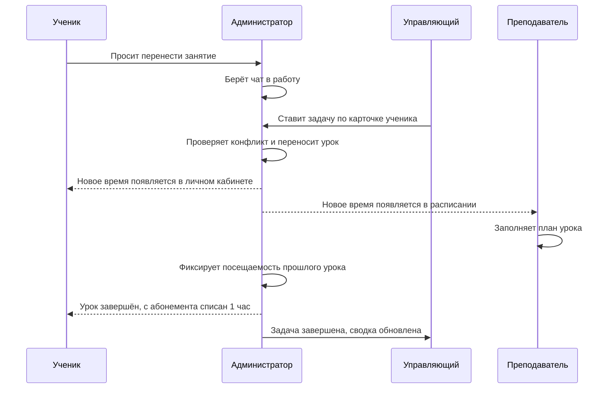

# Демо MagicMusicCRM: единый workflow четырёх ролей

> Версия сценария: `demo-4role-v1`
>
> Целевой формат: четыре телефонных экрана одновременно
>
> Основной хронометраж: 16 минут
>
> Роли: Ученик (`client`) · Преподаватель · Администратор · Управляющий

## 1. Что должно понять демо

Один запрос ученика проходит через всю операционную цепочку:

Финальная мысль для аудитории:

> «Каждая роль видит только свой участок процесса, но все работают с одним серверным состоянием: чат превращается в задачу, задача — в изменение расписания, а посещаемость — в корректное списание абонемента».

## 2. Расстановка четырёх экранов

Рекомендуемая сетка 2×2:

| Позиция | Роль | Демо-пользователь | Цвет внешней рамки |
|---|---|---|---|
| Слева сверху | Ученик | Анна Демо | Синий |
| Справа сверху | Преподаватель | Павел Демо | Зелёный |
| Слева снизу | Администратор | Ольга Демо | Золотой |
| Справа снизу | Управляющий | Марина Демо | Фиолетовый |

На видеомикшере закрепить постоянные подписи ролей. Активный экран подсвечивать рамкой, но остальные три не скрывать: зритель должен видеть последствия действия на соседних устройствах.

### Реальная мобильная навигация ролей

| Роль | Доступные вкладки |
|---|---|
| Ученик | Чат · Занятия · Абонемент · Профиль |
| Преподаватель | Чат · Расписание · Ученики |
| Администратор | Чат · Задачи · Расписание · Клиенты |
| Управляющий | Чат · Обзор · Расписание · Клиенты · Пользователи |

Управляющий выше Администратора: он контролирует процесс и назначает роли строго ниже своей. Администратор ведёт ежедневную операционную работу. Общешкольные финансы недоступны обеим этим ролям — это зона Директора и Администратора системы. Финансовые данные внутри карточки конкретного ученика доступны в рамках операционной работы.

## 3. Сюжет

Анна занимается вокалом у Павла. У неё есть активный абонемент и урок завтра в 18:00. Анна понимает, что не успевает, и просит перенести занятие на 19:00. Ольга берёт обращение в работу. Марина ставит Ольге связанную с карточкой ученика задачу. При переносе система обнаруживает, что в 19:00 заняты и преподаватель, и аудитория. После согласования с Анной урок переносится на 20:00. Павел получает новое время и заполняет план. Затем на заранее подготовленном прошлом уроке Ольга фиксирует посещаемость: урок завершается, а остаток абонемента Анны уменьшается с 6 до 5 часов. Марина видит закрытую задачу и результат в управленческой сводке.

## 4. Демо-данные

Все сущности пометить стабильным ключом `demo-4role-v1`. Их UUID хранить в отдельном операторском manifest без паролей.

### Пользователи

| Имя | Backend-роль | Обязательная связь |
|---|---|---|
| Анна Демо | `client` | активная карточка ученика и доступ к администрационному чату |
| Павел Демо | `teacher` | `teacher`-record, привязанный к его профилю |
| Ольга Демо | `admin` | активная запись сотрудника |
| Марина Демо | `manager` | активная запись сотрудника |
| Илья Стажёр | `client` | только для безопасного показа списка назначаемых ролей |

### CRM и расписание

- Филиал: `[DEMO] Сокол`, timezone `Europe/Moscow`.
- Направление: `[DEMO] Вокал`.
- Аудитория: `[DEMO] Вокал 1`.
- Ответственный в карточке Анны до начала — пустой.
- Администрационный чат Анны — не в архиве и не взят в работу.
- Общий обычный group-chat: `[DEMO] Вокал — Анна`, участники — все четыре роли.
- Открытых задач с префиксом `[DEMO]` до начала нет.
- Абонемент Анны: 8 часов, использовано 2, остаток 6, срок действия не менее 90 дней.
- Будущий урок Анны: завтра, 18:00–19:00, Павел, `[DEMO] Вокал 1`, статус `scheduled`.
- Техническая бронь-конфликт: завтра, 19:00–20:00, тот же Павел и та же аудитория.
- Целевой свободный слот: завтра, 20:00–21:00.
- Прошлый урок Анны: вчера, 17:00–18:00, статус `scheduled`, без attendance/participation и без списания.

Не ставить демонстрационный будущий урок слишком близко к текущей минуте: клиент делит занятия на «Предстоящие» и «История» по фактическому времени устройства.

## 5. Preflight за 30–40 минут до показа

- [ ] Все четыре эмулятора используют одну и ту же release-сборку и московское время.
- [ ] Каждый эмулятор уже авторизован под своей ролью; вход не входит в основной сценарий.
- [ ] У Анны в «Абонементе» показано `Осталось: 6 ч`.
- [ ] У Анны и Павла виден будущий урок завтра в 18:00.
- [ ] У Ольги и Марины виден администрационный чат Анны.
- [ ] У Павла `listTeachers` находит именно его teacher-record.
- [ ] В карточке Анны нет ответственного и открытой `[DEMO]`-задачи.
- [ ] Прошлый урок ещё не завершён и не имеет participation.
- [ ] Read-only проверка `/crm/schedule/conflicts` для 19:00 возвращает занятость преподавателя или аудитории.
- [ ] Слот 20:00 свободен.
- [ ] На каждом эмуляторе в буфере обмена лежат его реплики.
- [ ] Отключены системные всплывающие уведомления, способные перекрыть интерфейс; push не является критерием успеха.
- [ ] Сделан пробный reset и повторный прогон полного сценария.

Стартовые экраны:

- Анна — чат «Администрация».
- Павел — расписание на завтра.
- Ольга — список входящих чатов, папка «Ученики».
- Марина — «Обзор», фильтр `[DEMO] Сокол`.

## 6. Покадровый сценарий — 16 минут

| Время | Ученик — Анна | Преподаватель — Павел | Администратор — Ольга | Управляющий — Марина | Что доказываем |
|---|---|---|---|---|---|
| 00:00–00:50 | Коротко показать четыре вкладки; открыть «Абонемент» и зафиксировать `6 ч`, вернуться в чат | Показать три вкладки и своё расписание | Показать «Чат / Задачи / Расписание / Клиенты» | Показать «Чат / Обзор / Расписание / Клиенты / Пользователи» | RBAC и исходное состояние |
| 00:50–01:30 | В «Администрации» отправить: «Добрый день! Завтра в 18:00 не успеваю. Можно перенести занятие с Павлом на 19:00?» | Оставить расписание открытым | Держать входящие открытыми | Держать «Обзор» открытым | Ученик инициирует бизнес-процесс |
| 01:30–02:30 | Видит ответ администратора | — | Сообщение появляется realtime. Открыть чат → меню действий → «Взять в работу». Ответить: «Анна, проверяю расписание» | Открыть тот же чат и показать, что обращение закреплено за Ольгой | Взятие в работу и автопростановка ответственного |
| 02:30–03:40 | — | — | Перейти во вкладку «Задачи» и оставить список открытым | В чате нажать иконку карточки → «Задачи» → «Добавить». Создать `[DEMO] Перенести занятие Анны`, срок через 15 минут, исполнитель Ольга | Управляющий делегирует задачу, связанную с карточкой |
| 03:40–04:20 | — | — | Новая задача появляется realtime. Открыть её меню → «В работу» | Вернуться в «Обзор», обновить и зафиксировать рост открытых задач на 1 | Сквозная связь карточки, задачи, исполнителя и сводки |
| 04:20–05:50 | — | Держать завтра в расписании | «Расписание» → завтра → урок Анны 18:00 → «Изменить» → поставить 19:00 → «Сохранить». В окне «Время занято» показать детали конфликта и нажать «Отмена» | — | Предсейв- и серверная валидация преподавателя/аудитории |
| 05:50–06:40 | Ответить: «Да, 20:00 подходит» | — | В чате написать: «В 19:00 Павел и аудитория заняты. Подойдёт 20:00?» | — | Решение принимается человеком на основании бизнес-валидации |
| 06:40–07:30 | — | — | Повторно открыть урок → «Изменить» → 20:00 → «Сохранить» | — | Безопасный перенос в свободный слот |
| 07:30–08:30 | «Занятия» → «Предстоящие»: показать 20:00; если нужно — pull-to-refresh | Нажать «Обновить», показать тот же урок в 20:00 | Оставить расписание с уроком 20:00 | — | Одно серверное изменение видно ученику и преподавателю |
| 08:30–09:50 | Открыть group-chat `[DEMO] Вокал — Анна` | Открыть урок → «Изменить план» → записать «Разминка, дыхание, работа над новой песней» → сохранить. В group-chat отправить: «Перенос подтверждён на 20:00. Возьмите тетрадь» | Открыть тот же group-chat | Открыть тот же group-chat | Педагог меняет только свой учебный контекст; сообщение приходит всем realtime |
| 09:50–10:20 | Ответить в group-chat: «Хорошо, спасибо!» | Видит ответ realtime | Видит ответ realtime | Видит ответ realtime | Единая коммуникация без доступа к чужим CRM-разделам |
| 10:20–12:20 | Открыть «Занятия → История» и держать прошлый урок на экране | Держать расписание вчерашнего дня либо список учеников | «Клиенты» → Анна → «Инфо» → блок расписания → квадрат вчерашней даты → «Посещаемость». Выбрать вид «Занятие», включить «Уведомить об изменениях», сохранить | — | Только admin+ фиксирует посещаемость, потому что операция влияет на деньги |
| 12:20–13:20 | Выполнить гарантированный refresh: «Чат» → иконка «Моя школа» → кнопка «Обновить». В портале показать «История»: урок стал «Завершено», затем остаток абонемента `6 → 5 ч` | Нажать «Обновить»: прошлый урок завершён | Показать тост «Посещаемость сохранена» | — | Одна идемпотентная операция завершает урок и списывает ровно 1 час |
| 13:20–13:50 | — | — | «Задачи» → `[DEMO] Перенести занятие Анны` → «Завершить» | — | Операционный цикл закрыт |
| 13:50–15:10 | — | — | — | Pull-to-refresh «Обзора»: показать актуальные открытые задачи и рост «Действий сотрудников» | Управляющий контролирует результат, не дублируя работу администратора |
| 15:10–16:00 | Показать итоговую навигацию роли | Показать итоговую навигацию роли | Показать итоговую навигацию роли | «Пользователи» → Илья Стажёр → открыть picker ролей, ничего не сохранять: доступны только роли ниже Управляющего | Иерархия прав и финальная фиксация четырёх ролей |

### Реплики ведущего в ключевых точках

1. После «Взять в работу»: «Это не локальная отметка: ответственный закреплён и за чатом, и за карточкой клиента».
2. На конфликте: «Система не даёт администратору случайно создать двойную бронь. У роли есть осознанное override-действие, но в нормальном процессе мы его не используем».
3. После переноса: «Ученик видит своё новое время, преподаватель — только назначенный ему урок, администратор — полную операционную сетку».
4. На посещаемости: «Посещаемость — финансово значимое действие, поэтому преподаватель видит её read-only, а сохраняет Администратор или более высокая роль».
5. На абонементе: «Повторное сохранение того же статуса не спишет час второй раз: сервер сверяет фактически списанное значение по дельте».

## 7. Опциональный модуль: домашнее задание (+2 минуты)

Добавлять только если основной прогон стабильно укладывается во время.

1. Ольга: «Клиенты» → Анна → «Действия» → «Задать ДЗ».
2. Создать `[DEMO] Выучить первый куплет`, срок — завтра.
3. Анна: «Занятия» → «Задания» → при необходимости обновить → «Сдать».
4. Ольга: карточка Анны → «Прогресс» → обновить → показать статус «Сдано».

Не связывать этот модуль с проверкой ДЗ преподавателем: в текущем мобильном teacher UI отдельного review-действия нет.

## 8. Отдельный sales-funnel модуль: лид → ученик

Этот модуль не включать в основной публичный прогон без отдельной репетиции.

### Что можно показать

1. Отдельный `client`-аккаунт без активной связи с лидом/учеником впервые пишет в «Администрацию».
2. Сервер автоматически и без дублей создаёт лид со статусом «Новый» и связывает его с аккаунтом.
3. Ольга открывает папку «Лиды», берёт чат в работу, заполняет филиал и направление.
4. В карточке/lead-board выбрать «Открыть в расписании»: единый диалог создаёт пробное занятие с `isTrial=true`.
5. После пробного выбрать «Сделать учеником», затем выдать абонемент.

### Почему это отдельный модуль

После live-конверсии текущий клиентский экран не получает адресное событие о новой student-связи и может сохранить старый `myStudents` cache. Для честного показа заложить перезапуск/повторный вход клиентского эмулятора и ручное обновление staff-chat после конверсии. До исправления адресной invalidation не обещать мгновенный бесшовный переход «Лиды → Ученики» на уже открытых экранах.

## 9. Что не нажимать в основном демо

- У Преподавателя — «Завершить занятие»: это не выполняет полный attendance/subscription workflow.
- У Преподавателя — сохранение посещаемости: режим намеренно read-only.
- У Преподавателя — комментарий в attendance sheet: текущий UI и серверный контракт для этой операции расходятся.
- У Управляющего — вкладки «Задачи», «Отчёты» и «Финансы» на телефоне: они не входят в его мобильную навигацию; общешкольные финансы ему запрещены по RBAC.
- KPI Управляющего, ведущие в скрытые мобильные вкладки.
- «Всё равно назначить» в окне конфликта.
- Реальное сохранение новой роли demo-пользователю.
- Системный чат «Объявления» как центральную сцену: основной сценарий использует обычный group-chat.
- Push как единственное доказательство операции.

## 10. Fallback-карта

| Сбой на сцене | Быстрое действие | Что сказать |
|---|---|---|
| Realtime-событие задержалось | Pull-to-refresh или переоткрыть вкладку | «Состояние уже сохранено на сервере; сейчас перечитываем его» |
| Задача не появилась у Ольги | Фильтр «К выполнению», текущий день, исполнитель Ольга; открыть standby-задачу | «Задачи фильтруются по сроку и исполнителю» |
| Павел не видит новое время | Кнопка «Обновить», перейти на завтра | «Расписание преподавателя перечитывает его персональный scope» |
| Анна не видит перенос | Pull-to-refresh «Предстоящих» | «Личный кабинет получает только собственные занятия» |
| Не пришёл push о посещаемости или остался старый остаток | «Чат» → «Моя школа» → кнопка «Обновить»; если не помогло — перезапустить клиентский эмулятор | «Push — канал доставки, а не источник истины; сейчас принудительно перечитываем сервер» |
| Конфликт 19:00 не появился | Не сохранять; открыть заранее проверенный конфликтный слот/скриншот | «Не создаём двойную бронь ради демонстрации» |
| Списание уже было выполнено | Переключиться на резервную пару данных «Анна До / Анна После» | «Показываем сохранённый результат той же серверной операции» |

## 11. Reset после каждого прогона

Reset выполнять одной транзакцией и только по UUID из demo-manifest.

1. Soft-delete задачу текущего прогона.
2. Вернуть будущий урок Анны на завтра 18:00, статус `scheduled`, очистить demo-plan/notes.
3. Удалить participation прошлого урока и вернуть ему статус `scheduled`.
4. Вернуть абонемент к `lessons_used = 2`.
5. Очистить `responsible` / `responsibleUserId` в карточке Анны.
6. Снять назначение Ольги с администрационного чата.
7. Удалить только сообщения с маркером конкретного demo-run.
8. Вернуть чат из архива, если он был архивирован.
9. Убедиться, что техническая бронь 19:00 существует, а слот 20:00 свободен.
10. Убедиться, что роль Ильи осталась `client`.

Запрещены широкие удаления по имени, филиалу или префиксу без точного списка UUID.

## 12. Критерии успешного прогона

- Сообщение Анны появляется у Ольги без повторной отправки.
- После «Взять в работу» Ольга показана ответственной.
- Задача Марины появляется в рабочем списке Ольги.
- Попытка 19:00 показывает конфликт, а 20:00 сохраняется.
- Анна и Павел видят одно и то же новое время в своих ролевых представлениях.
- Павел может изменить план только назначенного ему урока.
- Ольга фиксирует прошлый урок как «Занятие».
- После явного refresh в «Моей школе» у Анны прошлый урок становится завершённым, остаток меняется `6 → 5 ч`.
- Задача закрывается, а Марина видит обновлённую управленческую сводку.
- Ни одна роль не получает недоступный ей раздел или данные другой роли.

## 13. Технические опоры сценария

- Матрица мобильной навигации: `lib/features/messenger/presentation/screens/crm_nav_rbac.dart`.
- Клиентские «Занятия / История / Задания»: `lib/features/client/presentation/widgets/upcoming_lessons_list.dart`.
- Остаток абонемента: `lib/features/client/presentation/widgets/subscription_status_card.dart`.
- Расписание и план преподавателя: `lib/features/teacher/presentation/widgets/teacher_schedule_widget.dart`.
- Задачи и realtime: `lib/features/manager/presentation/widgets/tasks_widget.dart`.
- Единая карточка клиента: `lib/features/crm/presentation/client_card/`.
- Проверка конфликтов: `lib/features/admin/presentation/widgets/create_lesson_dialog.dart`, `server/src/crm/schedule.service.ts`.
- Посещаемость и списание по дельте: `server/src/crm/attendance.service.ts`.
- Чат и назначение ответственного: `server/src/messenger/`, `server/src/crm/responsible.ts`.
