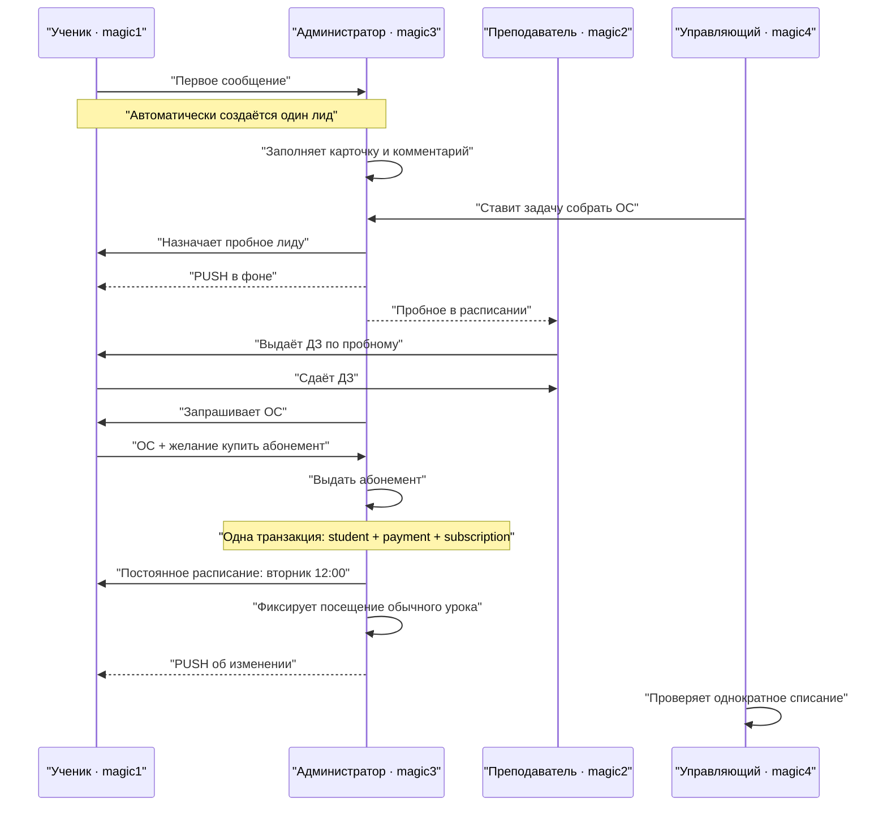

# Демо MagicMusicCRM: путь лида от первого сообщения до регулярных занятий

> Версия: `demo-4role-v3`
>
> Формат: четыре Android-эмулятора одновременно, OBS управляется вручную
>
> Пауза доказательства после каждого шага: 5 секунд

## Главная бизнес-логика

Во время пробного занятия клиент остаётся лидом. Пробное, домашнее задание,
сдача ДЗ и обратная связь принадлежат лиду. Лид становится учеником только в
момент выдачи абонемента.



Запрещённый обход: отдельная кнопка «Создать ученика» до абонемента, ручная
предварительная конверсия или отдельная повторная оплата. Кнопка
«Выдать абонемент» в карточке лида выполняет всю конверсию атомарно и
идемпотентно.

## Точное соответствие устройств и ролей

| AVD | Serial | Аккаунт | Роль |
|---|---|---|---|
| `Client` | `emulator-5554` | `magic1@gmail.com` | Ученик / клиент |
| `Teacher` | `emulator-5558` | `magic2@gmail.com` | Преподаватель |
| `Admin` | `emulator-5556` | `magic3@gmail.com` | Администратор |
| `Manager` | `emulator-5560` | `magic4@gmail.com` | Управляющий |

Пароль передаётся runner только во время запуска через runtime-переменные или
интерактивный ввод. Он не хранится в репозитории, checkpoint или артефактах.
Роли аккаунтов уже заданы и во время подготовки не изменяются.

Подписи экранов в OBS должны повторять названия AVD. Нельзя переставлять роли
по serial: runner прерывается, если имя AVD, serial, версия APK или разрешение
уведомлений не совпадают.

## Демо-данные

- Клиент: `Ученик Тестов` (`magic1`).
- Преподаватель: `Учитель Тестов` (`magic2`).
- Администратор: `Администратор Тестов` (`magic3`).
- Управляющий: `Управляющий Тестов` (`magic4`).
- Филиал: `Сокол`.
- Направление: `Фортепиано`.
- Аудитория: `Piano room 7`.
- Пакет: `Демо — Фортепиано, 8 часов`, 24 000 ₽, 60 дней.
- Постоянный слот: каждый вторник, 12:00 по Москве, 60 минут.
- Маркер сущностей текущего прогона: `[DEMO]`.

Для показа конфликта можно сначала выбрать занятый слот/аудиторию, но нельзя
нажимать override «Всё равно назначить». Финальное пробное и серия создаются
только в свободном слоте `Piano room 7`.

## Подготовка перед записью

1. Убедиться, что API healthy и четыре аккаунта имеют ожидаемые роли.
2. Выполнить защищённый reset только `magic1`: он создаёт полный `pg_dump`,
   удаляет его CRM-граф и сообщения личного админ-чата, но сохраняет auth,
   профиль, legal consent, FCM, audit, чат, memberships и «Объявления».
3. Убедиться, что teacher/staff CRM-связи и активный пакет существуют.
4. Удалить старый `magic.crm` с четырёх AVD и установить один и тот же новый
   release APK.
5. Разрешить уведомления и войти под аккаунтом, соответствующим имени AVD.
6. Открыть четыре окна эмуляторов в неизменном порядке OBS.

```powershell
./scripts/demo/demo-reset.ps1 -Action Preflight

./scripts/demo/demo-reset.ps1 `
  -Action Reset `
  -Apply `
  -Confirm "RESET DEMO magic1@gmail.com"

Set-Location tools/demo-runner
npm ci
npm test
npm run dry-run:full
```

Секреты задаются только в текущем процессе перед `npm run demo:full` и после
запуска удаляются из окружения. Значения не записывать в `.env`.

## Покадровый сценарий

Каждая строка завершается видимой паузой 5 секунд. Во время паузы активный
экран остаётся неподвижным, остальные три не скрываются.

| № | Активная роль | Действие | Что оставить на экране на 5 секунд |
|---:|---|---|---|
| 1 | Все | Показать нижнюю навигацию четырёх ролей | Разные разделы согласно RBAC |
| 2 | Ученик | В «Администрации» отправить первое сообщение: просьба о пробном фортепиано в «Соколе» | Отправленное сообщение |
| 3 | Администратор | Открыть «Чат → Лиды», выбрать `Ученик Тестов`, взять в работу | Чат находится в «Лидах», ответственный — magic3 |
| 4 | Администратор | Проверить фильтр «Сокол» и отсутствие клиента во вкладке «Ученики» | Один свежий лид без дубля |
| 5 | Администратор | Заполнить доступные до конверсии поля: статус «В процессе», филиал «Сокол», цель обучения, желаемое расписание, Фортепиано и ответственного magic3; сохранить | Повторно открытая карточка с сохранёнными данными и без ошибки status UUID |
| 6 | Администратор | Добавить комментарий о цели клиента и отсутствии прошлого опыта | Комментарий во вкладке «Комментарии» |
| 7 | Управляющий | Открыть «Задачи» → создать `[DEMO] Собрать ОС после пробного`, связать с лидом и назначить magic3 | Задача, автор и исполнитель |
| 8 | Администратор | Открыть «Задачи» и найти задачу по всем срокам | Та же связанная задача с автором, исполнителем и сроком |
| 9 | Ученик | Свернуть приложение кнопкой Home | Домашний экран Client |
| 10 | Администратор | «Расписание» → создать пробное именно для лида: magic2, «Сокол», `Piano room 7`, 60 минут | Тост успешного создания и пробное в расписании |
| 11 | Ученик | Развернуть системную шторку после PUSH «Пробное занятие назначено» | PUSH крупно виден 5 секунд |
| 12 | Ученик | Открыть приложение → «Занятия → Предстоящие» | Карточка с меткой «Пробный урок» |
| 13 | Преподаватель | «Расписание» → открыть пробное | `Пробное · Ученик Тестов`, время и аудитория |
| 14 | Преподаватель | Добавить план урока | Сохранённый план пробного |
| 15 | Преподаватель | «Домашнее задание» → создать `[DEMO] Ритмический рисунок` | ДЗ, срок и статус «Задано» |
| 16 | Администратор | Карточка всё ещё в «Лидах» → «Прогресс» | То же ДЗ у лида; ученика ещё нет |
| 17 | Ученик | «Занятия → Задания» → открыть ДЗ → «Сдать» | Статус «Сдано» |
| 18 | Преподаватель | Повторно открыть ДЗ пробного | Статус отправленной работы |
| 19 | Администратор | Карточка лида → «Прогресс» | Статус «Сдано» совпадает |
| 20 | Преподаватель | Завершить своё пробное без списания платного часа | Пробное завершено; платного абонемента ещё нет |
| 21 | Администратор | В чате запросить впечатления и готовность продолжать | Сообщение администратора |
| 22 | Ученик | Ответить: положительная ОС и «Хочу купить абонемент» | Ответ клиента realtime |
| 23 | Администратор | Добавить положительную ОС и предпочтение «вторник 12:00» комментарием в карточку | Сохранённый комментарий во временной шкале |
| 24 | Администратор → Управляющий | Администратор завершает задачу; управляющий открывает «Завершены» | Выполненная задача с автором, исполнителем и сроком |
| 25 | Администратор | В карточке всё ещё активного лида нажать «Выдать абонемент», выбрать демо-пакет | Тост «Абонемент выдан — лид стал учеником» |
| 26 | Администратор | Переключить «Лиды / Ученики» | Лид исчез, ровно один `Ученик Тестов` появился в учениках |
| 27 | Ученик | «Абонемент» | Активен, 8 часов, использовано 0 |
| 28 | Администратор | В карточке ученика заполнить школу, класс и индивидуальную цену обычного часа 3 000 ₽; сохранить | Поля сохранены; пакет оплачен на 24 000 ₽, остаток 8/8 |
| 29 | Управляющий | Та же карточка → абонемент и личный счёт | Пакет 8/8, приход 24 000 ₽, исходный баланс 24 000 ₽ |
| 30 | Администратор | Карточка ученика → «Занятия → Постоянное расписание» | Форма новой серии |
| 31 | Администратор | Выбрать вторник, 12:00, 60 минут, magic2, `Piano room 7`, старт со следующего вторника | Сохранённая активная серия |
| 32 | Ученик | «Занятия → Предстоящие» | Обычные вторничные занятия без метки пробного |
| 33 | Преподаватель | Обновить «Расписание» | Те же вторничные занятия |
| 34 | Администратор | «Расписание» и карточка ученика | Та же серия, филиал и аудитория |
| 35 | Ученик | Свернуть приложение перед фиксацией посещения | Домашний экран Client |
| 36 | Администратор | Первое обычное занятие → «Посещаемость» → «Присутствовал», уведомить клиента, сохранить | «Завершено» и успешный тост |
| 37 | Ученик | Открыть шторку PUSH «Изменение по занятию» | PUSH крупно виден 5 секунд |
| 38 | Управляющий | Карточка ученика → личный счёт/абонемент | Ровно одно списание 3 000 ₽; использовано 1 из 8 |
| 39 | Ученик | «Занятия → История», затем «Абонемент» | Обычный урок завершён; осталось 7 часов |
| 40 | Администратор | Открыть обработанный чат ученика перед закрытием обращения | История сообщений и вход в карточку сохранены |
| 41 | Администратор | Архивировать завершённый личный чат | Чат находится в «Архиве» |
| 42 | Управляющий | «Обзор», затем карточка ученика | Финальный операционный результат |

## Реплики ведущего

1. «Первое сообщение уже создало лид — отдельная кнопка “сохранить как лид” не
   нужна и не создаёт дубль».
2. «Пробное, ДЗ и ОС ещё принадлежат лиду. Продажи не подменяют этап воронки».
3. «Выдача абонемента — единственная точка конверсии. Сервер одной транзакцией
   создаёт ученика, оплату и абонемент и переносит связи».
4. «Пробный урок не списывает часы. Первое обычное посещение списывает ровно
   один час, а повторное сохранение идемпотентно».
5. «Управляющий контролирует процесс и финансы карточки клиента, но не выполняет
   ежедневную работу администратора».

## Автоматизация и восстановление

Runner находится в `tools/demo-runner`:

```text
npm run demo:full -- [--resume] [--from step.id] [--to step.id] [--hold-ms 5000]
```

- один локальный Appium обслуживает четыре UiAutomator2-сессии;
- порты ролей: `8211`–`8214`;
- checkpoint позволяет продолжить с последнего проверенного шага;
- мутация не повторяется после сбоя без `reconcile`;
- `--from` / `--to` позволяют репетировать отдельный фрагмент;
- `pushShadeTap` сворачивает только выбранное устройство, ждёт уникальный PUSH,
  раскрывает шторку и держит её 5 секунд;
- OBS runner не трогает.

В `full-demo.json` включено 44 шага: 43 полностью автоматизированы штатными
семантическими локаторами, проверками и межролевыми переходами. Единственный
операторский checkpoint — защищённый внешний reset `magic1`; он намеренно не
автоматизируется через UI. Каждая бизнес-мутация имеет `reconcile`, поэтому
runner не подменяет восстановление слепым повтором или координатным тапом.

После записи повторный guarded reset возвращает `magic1` в чистое состояние.
Восстановление полного backup — отдельная разрушительная операция и не входит
в автоматический сценарий.

## Критерии успешного демо

- На устройствах вошли ровно четыре заданных аккаунта, роли не изменены.
- Первое сообщение создаёт один лид; фильтры «Лиды / Ученики / Сокол» верны.
- Пробное назначено лиду и видно клиенту и назначенному преподавателю.
- PUSH виден при свёрнутом клиентском приложении.
- Преподаватель выдаёт ДЗ только по своему пробному; клиент сдаёт его; один
  статус видят три роли.
- До выдачи абонемента записи ученика нет.
- «Выдать абонемент» создаёт ровно одного ученика, один платёж и один абонемент.
- Вторничная серия 12:00 видна клиенту, преподавателю и администратору.
- Пробное не списывает часы; обычное посещение списывает один час ровно один раз.
- Управляющий видит завершённую задачу, абонемент и изменение личного счёта.
- Чат архивируется, «Объявления» остаются read-only для клиента.
